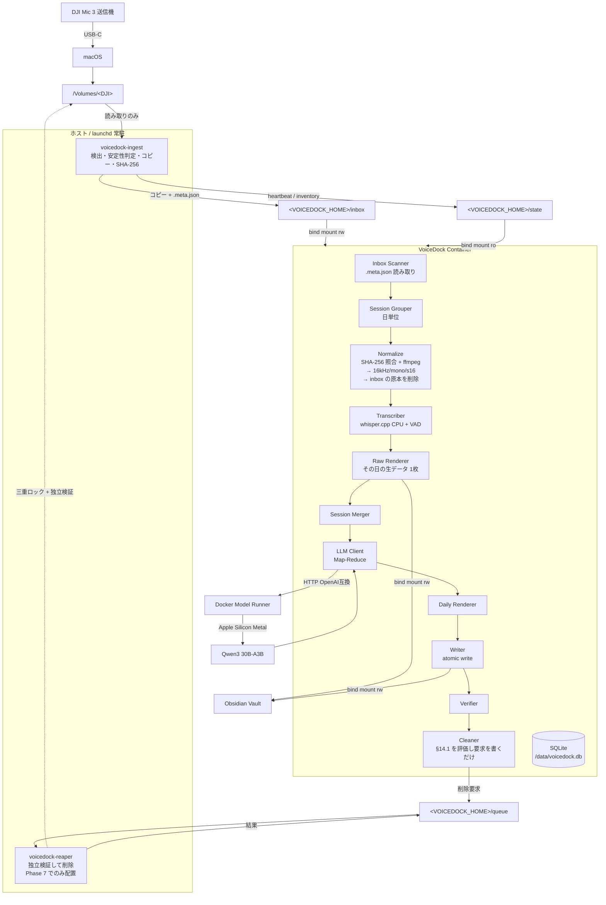
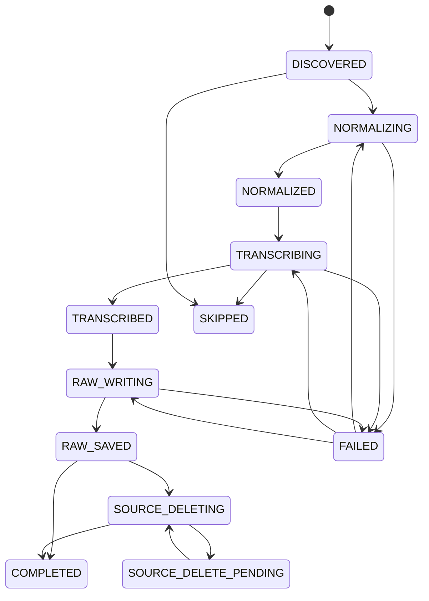
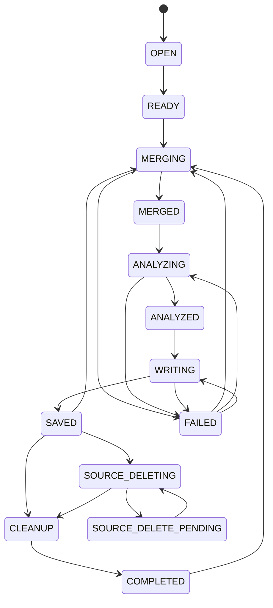

# VoiceDock 詳細仕様書 v4.5

**DJI Mic 3 × ローカル文字起こし × ローカルLLM × Obsidian**

| 項目 | 内容 |
|---|---|
| 文書版 | **v4.5（スキーマ v1 の確定）** |
| 前身文書 | v4.4 / v4.3 / v4.2 / v4.1 / v4.0 / v3.4 / v3.3 / v3.2 / v3.1 / v3.0（git 履歴）、`docs/archive/VoiceDock_Docker_Implementation_Spec_v2.0.md`（方針書） |
| 作成日 | 2026-09-11 |
| 改訂日 | 2026-09-12 |
| 実測記録 | `docs/POC.md`（Phase 0 の実測値と判断。本書と食い違う場合は POC.md を正とする） |
| 対象環境 | macOS / Apple Silicon |
| 位置づけ | 本書が実装時の唯一の規範。v4.0 / v3.x / v2.0 と矛盾する場合は本書を優先する |

> **v4.0 は構成の変更を含む。**v3.x は「`/Volumes` をコンテナへ bind mount する」前提だったが、
> #2 の実機検証で **Docker Desktop の VirtioFS が物理 USB を読めない**ことが確定した（`docs/POC.md` §2）。
> v4.0 では**デバイスの読み書きをホスト側の Helper に移し、コンテナは `/Volumes` をマウントしない。**
> 根拠と否定した選択肢は §5.6、失うものは §5.6.3 にある。
> **§14.1 の削除条件（本書の中核）は 1 文字も変えていない。**

---

## 目次

| 章 | 表題 |
|---|---|
| 1 | 目的・スコープ・非目標 |
| 2 | 用語定義 |
| 3 | 前提環境とホスト設定 |
| 4 | アーキテクチャ |
| 5 | DJI Mic 3 仕様 |
| 6 | リポジトリ構成 |
| 7 | 設定仕様 |
| 8 | データモデル |
| 9 | 状態機械 |
| 10 | 処理パイプライン詳細 |
| 11 | モジュール・インタフェース仕様 |
| 12 | LLM 仕様 |
| 13 | Obsidian 出力仕様 |
| 14 | 安全設計 |
| 15 | エラーコードとリトライ方針 |
| 16 | ログ仕様 |
| 17 | CLI 仕様 |
| 18 | Docker 構成 |
| 19 | Health Check と doctor |
| 20 | テスト仕様 |
| 21 | 開発フェーズと受け入れ条件 |
| 22 | 既知のリスクと未確定事項 |
| 23 | 将来拡張 |

---

## 1. 目的・スコープ・非目標

### 1.1 目的

DJI Mic 3 で録音した音声を Mac へ USB 接続するだけで、以下をバックグラウンドで全自動実行する。

```text
DJI Mic 3 で録音 → 帰宅 → Mac へ USB 接続 → （以降すべて自動）
```

ユーザーの操作は「録音する」「USB を挿す」「Obsidian を開く」の3つだけとする。

### 1.2 利用者から見た流れ

| # | 起きること | 実行主体 | 目安 |
|---|---|---|---|
| 1 | USB 接続を検出する（launchd の `StartOnMount` + 定期実行） | **Helper**（ホスト） | 〜5 秒 |
| 2 | 未処理の録音を特定する（既処理はファイル名で即スキップ） | **Helper** | 即時 |
| 3 | 書き込み中でないことを確認する（安定性判定） | **Helper** | 通常 0 秒 |
| 4 | 未取り込みの録音を inbox へコピーする | **Helper** | 1 日分で 2〜3 分 |
| 5 | 同じ日の録音を 1 セッションにまとめる | コンテナ | 即時 |
| 5b | inbox から 16 kHz へ変換し、**変換後に inbox の原本を消す** | コンテナ | 1 日分で 5〜10 分 |
| 6 | ローカル Whisper で日本語に文字起こしする（無音は VAD で飛ばす） | コンテナ | 発話量に比例 |
| 7 | **その日の Raw ノート（文字起こし生データ）を Vault へ書く** | コンテナ | 即時 |
| 8 | ローカル LLM が 1 日分を要約・分類する | コンテナ | 20〜30 分 |
| 9 | その日の Daily ノート（整理済み 1 枚）を Vault へ書く | コンテナ | 即時 |
| 10 | 保存内容を機械的に検証する | コンテナ | 即時 |
| 11 | 検証に成功した録音の削除を要求する（既定は無効） | コンテナ | — |
| 12 | 要求を独立に再検証して DJI 本体から削除する（既定は無効） | **Helper**（reaper） | — |

**ユーザーの操作は「録音・USB 接続・Obsidian を見る」の 3 つだけである。**Helper はホスト上で
launchd により常駐し、ユーザーが意識することはない（§4.1）。

出力は 1 日あたり 2 枚のノートに集約される。

```text
Vault/Daily/Voice/Raw/20260829/2026-08-29 raw.md      ← 文字起こし生データ
Vault/Daily/Voice/Wiki/20260829/2026-08-29 Voice.md   ← 要約・タスク・Timeline
```

### 1.3 最優先方針

本システムは **AI 精度よりも記録を失わないこと** を優先する。

| 順位 | 項目 |
|---|---|
| 1 | 記録の保護（文字起こしが Vault に残らない限り音声を削除しない） |
| 2 | 毎日の継続性（1 件の失敗で全体を止めない） |
| 3 | 処理の再実行性（途中から再開できる） |
| 4 | 二重処理防止 |
| 5 | 自動化 |
| 6 | 文字起こし精度 |
| 7 | 要約精度 |

この優先順位は実装上の判断が割れたときの決定規則として用いる。

**「AI 精度より継続性」は本システムの運用規模に由来する。**利用者は毎日、起きている時間のほぼ全てを録音する（1 日 16 時間規模）。雑でもよいので毎日の記録が途切れずに残り、後から振り返れることを目的とする。

### 1.4 受容したリスク: 原本音声の完全削除

本仕様では、Obsidian への保存検証に成功した後、**DJI 側の WAV を削除する**。Mac 側にも音声のアーカイブを保持しない。処理後に残るのは文字起こしテキストと要約のみであり、**元の音声は復元できない**。

これは設計判断として受容する。代償として、以下の緩和策を必須とする。

- **文字起こし本文は、削除より前に必ず Vault へ保存され検証される**（§13.3 / §13.7 / §14.1）。LLM が恒久的に失敗しても、テキストは Docker の外に残る
- 削除は **第14章の論理式が真になった場合のみ** 実行する。例外経路を設けない
- 削除は **設定とファイルシステム権限の二重ロック** で守る（§14.2）。既定値は双方とも「削除不可」
- 削除対象のファイルは、削除直前にパス・サイズ・更新時刻で同定する（§14.1）
- 削除機能の有効化は Phase 7 まで行わない（§21）
- 「削除されないこと」を検証するテストを最重要テストとして独立させる（§20.4）

> 将来、Mac 側へのアーカイブ保管を追加する場合は §23 の拡張として Core Pipeline と分離して実装する。MVP には含めない。

### 1.5 スコープ

- DJI Mic 3 の送信機内蔵ストレージからの取り込み
- 日本語音声の文字起こし
- 要約・タスク・決定事項・アイデア・タグの抽出（項目は設定で変更可能）
- Obsidian Vault への Markdown 出力（Raw / Daily の 2 層）
- SQLite による状態管理・再開・二重処理防止
- 安全な自動削除
- CLI による運用

### 1.6 非目標（MVP では実装しない）

| 非目標 | 理由 |
|---|---|
| GUI / Menu Bar UI / Web UI | CLI と Obsidian で足りる |
| 話者識別 | Core Pipeline 安定後に分離実装（§23） |
| クラウド AI API | ローカル完結が要件 |
| リアルタイム文字起こし | 接続時バッチで足りる |
| 複数 Worker 並列処理 | 削除事故と CPU 競合の回避（§10.0） |
| 音声アーカイブ保管 | §1.4 の決定により対象外 |
| DJI Mic 3 以外の機器対応 | インタフェースは用意するが実装しない（§11.1） |
| 受信機（RX）側ストレージの取り込み | 未検証（§22） |

---

## 2. 用語定義

本書では以下の用語を厳密に使い分ける。

| 用語 | 定義 |
|---|---|
| **Device（デバイス）** | macOS にマウントされた DJI Mic 3 のストレージ 1 個。ホストの `/Volumes/<volume名>` に対応する。**コンテナからは到達できない**（§5.6） |
| **Part（パート）** | DJI Mic 3 が 30 分ごとに分割生成した録音 1 本の論理単位。`recordings` テーブルの 1 行に対応する |
| **Variant（バリアント）** | 同一パートのファイル実体。`orig`（原音）と `denoised`（ノイズ除去済み）の最大 2 個。1 パートは 1 個以上のバリアントを持つ |
| **Session（セッション）** | **同一デバイス・同一日付（`config.timezone`）の Part の集合。**Obsidian の Daily ノート 1 枚に 1 対 1 対応する。`sessions` テーブルの 1 行 |
| **Block（ブロック）** | セッション内で、`session.block_gap_seconds` を超える無録音区間で区切られた連続録音の塊。Timeline の見出し単位。DB には持たず、レンダリング時に算出する |
| **Transmitter（送信機）** | DJI Mic 3 の送信機。ファイル名の `TX01` などに対応。**ペアリングし直すと番号が変わるため恒久 ID として使用しない** |
| **Source（ソース）** | DJI デバイス上の元ファイル。読み取り専用が既定 |
| **Staging（ステージング）** | Docker named volume `/data/staging` 配下の作業領域。**16 kHz へ変換した音声のみを置く**（原本は置かない） |
| **Transcript（トランスクリプト）** | 文字起こし結果。永続化するのは Part 単位のみ（§10.8） |
| **Analysis（アナリシス）** | LLM が生成した構造化 JSON。Session 単位でのみ生成する |
| **Raw ノート** | その日の文字起こし生データ。LLM を通さない。Vault の `Daily/Voice/Raw/<YYYYMMDD>/` |
| **Daily ノート** | その日の整理済みノート。Vault の `Daily/Voice/Wiki/<YYYYMMDD>/` |

> **v3.0 からの重要な変更**: v3.0 の Session は「時間的に連続する Part の集合」だった。終日録音では 30 分分割が途切れず続くため 24 時間が 1 ノートに収まってしまい、振り返りに使えない。v3.1 では Session を「1 日分」と定義し直し、時間的な区切りは Block として表示にのみ使う。

---

## 3. 前提環境とホスト設定

### 3.1 検証済み実機環境

| 項目 | 実測値 | 要件 | 判定 |
|---|---|---|---|
| 機種 | Mac16,11 / Apple M4 Pro 14 core | Apple Silicon | ✅ |
| メモリ | 64 GB | 16 GB 以上（LLM 30B 級を使う場合 32 GB 以上） | ✅ |
| macOS | 26.6.2 (25G83) | — | ✅ |
| Docker Engine | 29.7.2 | — | ✅ |
| Docker Compose | 5.5.1（**メジャー 5 系**） | **2.38 以上**（`models` 対応） | ✅ |
| Docker VM 割当 | 7 CPU / 24 GB / aarch64 | 4 CPU / 8 GB 以上 | ✅ |
| 仮想化バックエンド | **Apple Virtualization Framework**（`UseVirtualizationFramework = True`） | **AVF 必須**（§3.2） | ✅ |
| Docker Model Runner | `not running` | 有効必須 | ⚠️ 要設定（§3.4(1)） |
| Docker Desktop AutoStart | `False` | 有効必須 | ⚠️ 要設定（§3.4(2)） |
| Obsidian Vault | `/Users/terada/Documents/Obsidian Vault` | 任意 | ⚠️ パスに空白を含む |
| 起動ディスク空き | 63 GB | 10 GB 以上（§7.3 の上限設計により常駐使用量は 200 MB 未満） | ✅ |

実測日 2026-09-12。取得手順は §3.5。

- **Compose がメジャー 5 系である。**要件「2.38 以上」は満たすが、§18.2 の `models` 長構文が
  5 系で実際に環境変数を注入するかは未検証であり、**#13（T-13）で確認する**（§22 R-21）。
- Model Runner の有効化と AutoStart は **ホスト側の一度きりの作業**として §3.4 に残る。
  `doctor.sh` の DH-2 / DH-4 が実施状況を検査する。

### 3.2 仮想化バックエンドの制約（必須）

**Docker Desktop の仮想化バックエンドは Apple Virtualization Framework でなければならない。Docker VMM へ切り替えてはならない。**

Docker VMM は `/Volumes` 配下の外付け USB ボリュームへの bind mount が次のエラーで失敗する既知の不具合を持つ（docker/for-mac#7480、本書作成時点で未解決）。

```text
bind source path does not exist: /host_mnt/<volume名>/<path>
```

ローカルディスク（`/Users/...`）の bind mount は Docker VMM でも動作するため、**Obsidian Vault は読み書きできるのに DJI Mic だけ見えない** という切り分けの難しい症状になる。

確認方法:

```bash
python3 -c "import json;print(json.load(open('$HOME/Library/Group Containers/group.com.docker/settings-store.json')).get('UseVirtualizationFramework'))"
# => True であること
```

実機実測（2026-09-12）: `True`。**§22 R-2 はクローズ。**設定変更による再発を検知するため DH-1 は残す。

GUI では **Settings → General → Virtual Machine Options → Apple Virtualization framework**。

`doctor` はこの値を検査し、`False` の場合は致命的エラーとして報告する（§19.2）。

### 3.3 ホストへインストールするもの

| インストールする | インストールしない |
|---|---|
| Docker Desktop | Python / pip / venv |
| Obsidian | FFmpeg |
| **VoiceDock Helper**（bash スクリプト + LaunchAgent） | whisper.cpp / llama.cpp |
| Git（任意） | SQLite ツール類 |
| | AI 用 Python パッケージ |

右列はすべて Docker コンテナ内に閉じ込める。

> **Helper がホスト側に必要な理由**: Docker Desktop のファイル共有層（VirtioFS）は**物理 USB
> マスストレージを読めない**（`docs/POC.md` §2）。したがってデバイスの読み取りだけはホスト側で
> 行うほかない。詳細と、この結論に至るまでに否定した選択肢は §5.6 にある。
>
> **Helper は macOS の base system だけで動く。**`/bin/bash` / `/bin/realpath` / `stat` /
> `diskutil` / `launchctl` / `shasum` のみを使い、**Python も Homebrew も要求しない。**
> 配布物はテキストのスクリプト 2 本と `plist` 1 本だけで、中身をユーザーが読んで確認できる。

### 3.4 ホスト設定手順

初回のみ、以下をユーザーが実施する。`scripts/doctor.sh` は実施状況を検査するが、ホスト設定の変更自体は行わない。

**(1) Docker Model Runner を有効化する**

```bash
docker desktop enable model-runner
docker model status   # => "Docker Model Runner is running" になること
```

GUI では **Settings → AI → Enable Docker Model Runner**。

**(2) Docker Desktop のログイン時自動起動を有効化する**

VoiceDock は `launchd` を使わず、Docker Desktop の起動に相乗りして常駐する（§18.4）。

GUI で **Settings → General → Start Docker Desktop when you sign in to your computer** を有効化する。

```bash
python3 -c "import json;print(json.load(open('$HOME/Library/Group Containers/group.com.docker/settings-store.json')).get('AutoStart'))"
# => True であること
```

**(3) ファイル共有設定を確認する**

Docker Desktop for Mac は既定で `/Users` `/Volumes` `/private` `/tmp` `/var/folders` を共有する。既定のままでよい。`Mounts denied` が出た場合のみ **Settings → Resources → File sharing** を確認する。

**(4) Obsidian Vault のパスを確認する**

```bash
cat "$HOME/Library/Application Support/obsidian/obsidian.json"
```

得られたパスを `.env` の `OBSIDIAN_VAULT` に設定する。**パスに空白が含まれる場合でも `.env` では引用符を付けない**（Compose が値をそのまま解釈するため、引用符は文字列の一部になる）。

```dotenv
# 正しい
OBSIDIAN_VAULT=/Users/terada/Documents/Obsidian Vault

# 誤り（引用符がパスの一部になる）
OBSIDIAN_VAULT="/Users/terada/Documents/Obsidian Vault"
```

**(5) DJI Mic 3 のボリューム名を変更する**

出荷時のボリューム名は `NO NAME` で、これは名前を設定していない USB メモリ一般の既定名でもある。このままだと §10.4 の `session_key` が他の無名 USB と衝突する（§5.4）。

送信機を接続し、Finder のサイドバーで右クリック →「名前を変更」、または:

```bash
diskutil rename "/Volumes/NO NAME" DJIMIC3
```

**FAT32 のボリュームラベルは 11 文字以内の英数字にすること。**改名は初回の一度だけでよい。

**(6) VoiceDock Helper をインストールする**

Helper はデバイスの読み取りを担うホスト側の常駐プロセスである（§4.1）。これが無いと録音は
1 本も取り込まれない。

```bash
./helper/install.sh
```

`install.sh` が行うのは次の 3 つだけで、いずれも**ユーザーのホームディレクトリ配下**に閉じている。

| 処理 | 内容 |
|---|---|
| 1 | `<VOICEDOCK_HOME>`（既定 `~/VoiceDock`）に `inbox/` `queue/` `state/` と `helper.conf` を作る |
| 2 | `helper/voicedock-ingest` を `<VOICEDOCK_HOME>/bin/` へコピーする |
| 3 | `~/Library/LaunchAgents/com.voicedock.ingest.plist` を配置し `launchctl bootstrap` する |

**`voicedock-reaper`（削除を実行する唯一のプログラム）はインストールしない。**
これが安全ロック 2-A である（§14.2）。Phase 7 で初めて `./helper/install.sh --with-reaper` を実行する。

```bash
./helper/install.sh --status     # 稼働確認
./helper/install.sh --uninstall  # LaunchAgent の撤去
```

### 3.5 バージョン値の実測記録

§3.1 の実測は次のコマンドで取得した（2026-09-12）。

```bash
docker version --format '{{.Server.Version}}'   # => 29.7.2
docker compose version --short                  # => 5.5.1
```

**Compose は 5 系である。**DH-3（§19.2）の「2.38 以上」の判定は、`5.5.1` を `2.38` より新しいと
正しく扱えること。文字列の辞書順比較は将来のメジャー 10 系で誤判定するため使わない。

---

## 4. アーキテクチャ

### 4.1 全体構成

**コンテナは `/Volumes` を一切マウントしない。**デバイスに触れるのはホスト上の Helper だけである。
この構成に至った理由は §5.6。



**`<VOICEDOCK_HOME>` の構成**（既定 `~/VoiceDock`。`.env` の `VOICEDOCK_HOME` で変更する）:

```text
<VOICEDOCK_HOME>/
├── helper.conf              # Helper の設定（shell が source する KEY=VALUE）
├── bin/
│   ├── voicedock-ingest     # 取り込み。install.sh が常に置く
│   └── voicedock-reaper     # 削除。Phase 7 でのみ置く（安全ロック 2-A）
├── inbox/                   # Helper が書く / コンテナが読み、変換後に消す
│   └── <device_id>/<source_folder>/<name>.wav + <name>.wav.meta.json
├── queue/
│   ├── delete/              # コンテナが書く / reaper が読む
│   └── result/              # reaper が書く / コンテナが読む
└── state/
    ├── heartbeat.json       # Helper の生存・mount_readonly・版
    ├── inventory.json       # デバイス上の現在のファイル一覧
    └── processed.log        # 処理済み request_id（リプレイ防止）
```

**なぜ `<VOICEDOCK_HOME>` を `/Users` 配下に置くのか**: VirtioFS が正常に扱えるのは
ローカルディスク上のパスだけであり、`/Users` 配下の bind mount は問題なく動作する
（`docs/POC.md` §2.4 の対照実験）。

### 4.2 コンポーネント責務

| コンポーネント | 配置 | 責務 |
|---|---|---|
| macOS | ホスト | DJI ストレージのマウント、Vault の提供、Docker Desktop と launchd の起動 |
| **`voicedock-ingest`** | **ホスト / launchd** | デバイス検出・安定性判定・inbox へのコピー・SHA-256 算出・readOnly 再マウント（ロック 2-B）・heartbeat と inventory の更新。**デバイスへ書き込まない。削除しない** |
| **`voicedock-reaper`** | **ホスト / launchd**（Phase 7 でのみ配置） | 削除要求の**独立検証**と実行。**デバイス上のファイルを削除する唯一のプログラム**（§14.4 N-16）。コンテナの判断を信用しない |
| VoiceDock Container | Docker | 変換・文字起こし・解析要求・Markdown 生成・検証・**削除の判断**・状態管理。**デバイスには一切到達できない** |
| Docker Model Runner | Docker Desktop | 要約 LLM のダウンロード・起動・推論。Apple Silicon では llama.cpp バックエンドで Metal を使用 |
| SQLite | named volume | 全状態の単一の真実。`/data/voicedock.db` |
| Obsidian | ホスト | Vault の閲覧のみ。VoiceDock は Obsidian の API / Plugin に一切依存しない |

### 4.3 計算資源の配分

macOS の Docker Desktop は Linux VM 上でコンテナを動かすため、**通常の Linux コンテナから Apple Metal GPU を直接利用しない**。したがって処理を次のように分担する。

| 処理 | 実行場所 | アクセラレーション |
|---|---|---|
| 文字起こし（whisper.cpp） | VoiceDock コンテナ内 | **CPU のみ**（ARM NEON / dotprod） |
| 要約（LLM） | Docker Model Runner | **Apple Silicon Metal**（ホスト側で動作） |

メモリ試算: LLM 約 18 GB（ホスト側）+ Docker VM 24 GB = 42 GB < 64 GB。

文字起こし速度が実用に満たない場合に限り、将来 Whisper 部分を Mac ネイティブ実行へ差し替える（§11.1 の `TranscriptionService` インタフェースで吸収する）。

### 4.4 データフロー（1 日分）

```text
[Device]  TX_MIC001_.../TX01_MIC002_20260829_071204.wav      ← Part 1 (denoised)
          TX_MIC001_.../TX01_MIC002_20260829_071204_orig.wav ← Part 1 (orig)
          TX_MIC001_.../TX01_MIC003_20260829_074210.wav      ← Part 2 (denoised)
          …（1 日 32 Part）
             │ ★Helper: 安定性判定 → コピー（読みながら SHA-256）→ .meta.json
             ▼
[Inbox]   <VOICEDOCK_HOME>/inbox/DJIMIC3/TX_MIC001_.../TX01_MIC002_20260829_071204.wav
                                                    + 同名 .meta.json（relpath/size/mtime/sha256）
             │ scan（.meta.json 読み取り・ffprobe で duration 取得）
             ▼
[DB]      recordings 行 × N（Part 単位） + sessions 行 × 1（その日）
             │ inbox からストリーム読み（SHA-256 を再計算し .meta.json と照合）→ ffmpeg
             │ NORMALIZED 到達後に inbox の原本を削除する
             ▼
[Staging] /data/staging/<recording_id>/audio16k.wav        ← 30 分で約 58 MB
             │ whisper-cli（VAD 有効）
             ▼
[Data]    /data/transcripts/parts/<recording_id>.json
             │ その日の Raw ノートを再生成 → atomic write → verify
             ▼
[Vault]   Daily/Voice/Raw/20260829/2026-08-29 raw.md       ← ここでテキストが保全される
             │ 全 Part 終端到達 → 統合（メモリ上）→ LLM（Map-Reduce）
             ▼
[Data]    /data/analysis/<session_id>.json
             │ render → atomic write → verify
             ▼
[Vault]   Daily/Voice/Wiki/20260829/2026-08-29 Voice.md
             │ 検証成功 かつ 三重ロック解除のときのみ、削除要求を書く（§14.1 の判断はここ）
             ▼
[Queue]   <VOICEDOCK_HOME>/queue/delete/<request_id>.json   ← relpath のみ。絶対パスを持たない
             │ ★reaper: コンテナの判断を信用せず 11 項目を独立検証（§14.1.1）
             ▼
[Device]  Part 全 Variant を削除 → 不在を確認
             │ 結果を書く
             ▼
[Queue]   <VOICEDOCK_HOME>/queue/result/<request_id>.json
             │ コンテナが読む。inventory.json でも独立に不在を確認できる
             ▼
[DB]      COMPLETED
```

---

## 5. DJI Mic 3 仕様

### 5.1 ストレージ構造

DJI Mic 3 の送信機は公称 32 GB（**実使用可能 30.0 GB ＝ 30,048,256,000 B**）の内蔵ストレージを持ち、外部ストレージには非対応。**ファイルシステムは FAT32**（パーティションマップを持たない superfloppy 構成）。USB-C（送信機用マグネット充電ケーブル、または充電ケースのデータケーブル）で Mac へ接続する。

```text
/Volumes/<VOLUME_NAME>/
└── TX_MIC001_20260829_071201/                       ← 録音フォルダ
    ├── TX01_MIC002_20260829_071204.wav              ← ノイズ除去済み
    ├── TX01_MIC002_20260829_071204_orig.wav         ← 原音
    ├── TX01_MIC003_20260829_074210.wav
    └── ...
```

| 要素 | 規則 |
|---|---|
| フォルダ名 | `TX_MIC<NNN>_<YYYYMMDD>_<HHMMSS>`。`TX` は送信機内蔵録音であることを示す。**50 ファイルごとに新しいフォルダが作られる**。日時はフォルダ作成時刻 |
| ファイル名 | `TX<NN>_MIC<NNN>_<YYYYMMDD>_<HHMMSS>[_orig].wav` |
| `TX<NN>` | 送信機番号。受信機がペアリング順に付与する。**再ペアリングで変わる** |
| `MIC<NNN>` | 録音インデックス |
| `<YYYYMMDD>_<HHMMSS>` | **録音開始**日時（ローカル時刻） |
| `_orig` | 付いていれば原音。付いていなければノイズ除去済み |
| 分割 | **30 分ごとに自動で新しいファイルへ分割される** |
| 形式 | WAV（48 kHz / 24 bit または 32 bit float / モノラル）。**本書の検証機の実測は 24 bit ＝ 144,000 B/秒**（`docs/POC.md` §6.2）。32 bit float 設定なら 192,000 B/秒。設定で変わるため、容量計算は下表の両方を見ること |
| ファイル構造 | **Broadcast Wave**。`fmt ` / `bext` / `iXML` / `cue ` / `PAD ` / `data` のチャンクを持ち、**ヘッダが約 32 KB ある**。`iXML` に機材情報が入る。ffmpeg の変換には影響しない |

> **ヘッダが約 32 KB あるため、短いファイルではファイルサイズからバイトレートを逆算できない。**
> 1 秒の 24 bit ファイルで `ffprobe` の `format.bit_rate` は 1,414,208 bps（真の音声は
> 1,152,000 bps）＝ **23% の誤差**になる。バイトレートは `fmt` チャンクの値、または
> `sample_rate × channels × bits/8` で求めること。§19.2 の残り録音時間の推定は 30 分の実ファイルを
> 対象にするため誤差 0.02% 未満で影響しないが、**テストの fixture では必ず `fmt` を見る**（§20.2）。

**容量の見積り（終日録音の前提）**

| 形式 | 1 Variant | 両 Variant | 使用可能 30.0 GB での録音可能時間 |
|---|---|---|---|
| **24 bit**（検証機の実測・既定）144,000 B/秒 | 約 518 MB/時 | 約 1.04 GB/時 | 両 Variant 約 29 時間 / 片方のみ約 58 時間 |
| 32 bit float 192,000 B/秒 | 約 691 MB/時 | 約 1.38 GB/時 | 両 Variant 約 22 時間 / 片方のみ約 43 時間 |

**1 日 16 時間録音した場合の消費と、本体が満杯になるまでの日数:**

| 設定 | 1 日の消費 | 30.0 GB で何日分 |
|---|---|---|
| 24 bit・`_orig` のみ（**検証機の現設定**） | 約 8.3 GB | 約 3.6 日 |
| 24 bit・両 Variant | 約 16.6 GB | 約 1.8 日 |
| 32 bit float・両 Variant（最悪ケース） | 約 22.1 GB | 約 1.4 日 |

**必要な接続頻度は設定によって 1.4 日〜3.6 日と幅がある。**最悪ケースでは毎日接続が要るが、検証機の現設定（24 bit・`_orig` のみ）では 3 日分の余裕がある（§22 R-14）。ただし §10.4 のセッションは日単位で確定するため、接続が遅れた日の分は翌日以降にまとめて処理される。

### 5.2 ファイル名パーサ

```python
RECORDING_FILENAME_RE = re.compile(
    r"^(?P<tx>TX\d{2})"
    r"_(?P<mic>MIC\d{3})"
    r"_(?P<date>\d{8})"
    r"_(?P<time>\d{6})"
    r"(?P<orig>_orig)?"
    r"\.(?P<ext>wav|WAV)$"
)

RECORDING_FOLDER_RE = re.compile(
    r"^TX_(?P<mic>MIC\d{3})_(?P<date>\d{8})_(?P<time>\d{6})$"
)
```

| フィールド | 型 | 説明 |
|---|---|---|
| `transmitter_id` | `str` | `TX01` など。**弱い識別子**。恒久 ID として使わない |
| `mic_index` | `int` | `MIC002` → `2` |
| `started_at` | `datetime` | 録音開始時刻。タイムゾーンは `config.timezone`（既定 `Asia/Tokyo`）を付与 |
| `variant` | `Literal["orig", "denoised"]` | `_orig` の有無 |

パースに失敗したファイルは **無視する**（`WARN unparsable_filename` をログ出力し、DB へ登録しない）。DJI 以外のファイルを誤って処理しないための防御である。**このパターンは削除時の同定にも使う**（§14.1）。

### 5.3 Part キーと Variant のペアリング

同一 Part の 2 バリアントは、`_orig` を除いたファイル名が一致することで対応づける。

```python
part_key = (transmitter_id, mic_index, started_at)
```

| 状態 | 扱い |
|---|---|
| `denoised` と `orig` の両方が存在 | 1 Part・2 Variant。**文字起こしには `denoised` を使う**（§7.2 `audio.transcribe_variant`） |
| `denoised` のみ | 1 Part・1 Variant。`denoised` を使う |
| `orig` のみ | 1 Part・1 Variant。`orig` を使う |

> **実機での観測**: 本書の検証機では、録音 2 本とも **`_orig` のみが生成され、denoised は作られなかった**
> （`docs/POC.md` §6.2）。したがって「`orig` のみ」の分岐が実運用の既定経路になる。
> 両方が生成される設定も存在しうるため、**上表の分岐設計は変更しない**（P0-13 / #3 で確認する）。

**読み込むのは `primary_variant` だけである。**もう一方の Variant は一度も読まない（§10.5）。ただし **削除は Part 単位で全 Variant をまとめて行う**（§10.12）。

### 5.4 デバイス判定

**この判定は `voicedock-ingest`（ホスト）が行う**（§4.2）。コンテナはデバイスを見ない。

Volume 名を固定しない。ホストの `/Volumes` 直下の各エントリについて以下を**この順に**評価し、**すべて**を満たす場合に DJI デバイスと判定する。

1. **`INCLUDE_VOLUMES` が空でなければ、そのいずれかに一致する**（空なら制限なし ＝ 既定）
2. `EXCLUDE_VOLUMES` のいずれのパターンにも一致しない
3. **エントリ自身がシンボリックリンクでない**。macOS には
   `/Volumes/Macintosh HD -> /` が実在し、辿ると起動ディスク全体が走査対象になる（§22 R-19）
4. ディレクトリであり、読み取り可能である
5. `RECORDING_FOLDER_RE` に一致するサブディレクトリが 1 個以上存在する、**または** `RECORDING_FILENAME_RE` に一致する `.wav` が 1 個以上存在する
6. 再帰探索の深さを `MAX_SCAN_DEPTH`（既定 `3`）に制限する

> **1 と 2 を先に評価する理由**: この 2 つは `readdir` が返した**名前だけ**で判定でき、
> **`stat` を 1 回も呼ばずに落とせる。**#2 では 1 個のボリュームへ触れただけで
> Docker Desktop 全体が固まった（`docs/POC.md` §2.3）。**触れないことが最大の防壁**であり、
> 許可リストの価値はここにある。
>
> **`INCLUDE_VOLUMES` の既定を空にする理由**: 本節は「Volume 名を固定しない」と規定している。
> 既定で許可リストを有効にすると、**ユーザーがボリュームを改名した瞬間に無言で検出されなくなる。**
> 使いたい人が明示的に有効にする防壁とする。

**パターンは `fnmatch` による glob として評価する（正規表現ではない）。**
値は **`<VOICEDOCK_HOME>/helper.conf` にのみ置く**（§7.4）。

```sh
# helper/voicedock-ingest の規範実装（bash 3.2）
matches_any() {                      # $1=名前, $2...=パターン
  local name="$1"; shift
  local pat
  for pat in "$@"; do
    case "$name" in ($pat) return 0 ;; esac
  done
  return 1
}

# 1. 許可リスト（空なら素通り）
if [ ${#INCLUDE_VOLUMES[@]} -gt 0 ] && ! matches_any "$name" "${INCLUDE_VOLUMES[@]}"; then
  skip "$name" "not in INCLUDE_VOLUMES"; continue
fi
# 2. 拒否リスト
if [ ${#EXCLUDE_VOLUMES[@]} -gt 0 ] && matches_any "$name" "${EXCLUDE_VOLUMES[@]}"; then
  skip "$name" "in EXCLUDE_VOLUMES"; continue
fi
```

> **配列でなければならない。**ボリューム名には空白が入る（`Macintosh HD` / 出荷時の `NO NAME`）。
> 空白区切りの文字列にすると `"Macintosh HD"` が 2 つのパターンへ分解され、**除外が働かない。**

> **規則の二重実装について**: §5.4 と §10.3 の規則は、コンテナ（Python）ではなく
> **Helper（bash）が実行する**。両者で食い違うと検出漏れが無言で起きるため、
> **本節の規則が唯一の規範であり、Helper の実装はこれに従う。**
> `doctor` の D-18 は Helper が報告した `inventory.json` とコンテナ側の期待を突き合わせ、
> 食い違いを検出する（§19.2）。

> `.*` を正規表現として解釈すると全 Volume 名に一致し、DJI が 1 台も検出されないまま無言で停止する。この症状は P0-6（ホットプラグ伝播の失敗）と区別がつかない。**`INCLUDE_VOLUMES` を設定した場合も同じ症状になりうる**（綴りを間違えると 1 台も通らない）。そのため `doctor` は **`INCLUDE` で対象外にした名前と `EXCLUDE` で除外した名前を、理由ごとに分けて必ず列挙する**（§19.2 D-5）。

デバイス識別子 `device_id` は Volume 名とする。Volume 名は変わりうるため、**二重処理防止にも削除対象の同定にも単独では使わない**（§14.1）。

> **出荷時のボリューム名は `NO NAME` である**（`docs/POC.md` §6.1）。これは**名前を設定していない
> USB メモリ一般の既定名**でもある。§10.4 の `session_key` は `"<device_id>:<YYYYMMDD>"` であるため、
> `NO NAME` のままだと**同じ日に別の無名 USB を接続したとき `session_key` が衝突し、
> 別デバイスの録音が 1 枚の Daily ノートに混ざる。**
> §3.4(5) で識別できる名前へ改名することを必須の初期設定とする。
>
> 改名しても過去の記録は壊れない。`idx_recordings_partkey`（§8.2）は
> `(transmitter_id, mic_index, started_at, source_folder)` であり **`device_id` を含まない**ため、
> 二重処理防止は維持される。影響を受けるのは `session_key` だけで、改名日をまたぐと
> その日のセッションが別行になる。

### 5.5 Phase 0 PoC チェックリスト（ハードゲート）

**以下がすべて確認されるまで、削除機能を有効化してはならない。**

| # | 確認項目 | 判定 | 失敗時の影響 |
|---|---|---|---|
| P0-1 | 送信機を USB 接続すると `/Volumes/<名前>` に現れる | 必須 | §5.6 の代替アーキテクチャへ切替 |
| P0-2 | Volume 名を記録する（複数送信機なら全部） | 必須 | — |
| P0-3 | フォルダ・ファイル名が §5.1 の規則と一致する | 必須 | パーサ修正 |
| P0-4 | `_orig` と非 `_orig` の両方が実際に生成されるか | 必須 | §5.3 の分岐調整 |
| P0-5 | ホストから WAV を読み取れる | 必須 | — |
| P0-6 | **Helper 起動後にデバイスを接続して検出される**（ホットプラグ伝播）。v3.x では「コンテナの `/host-volumes` に現れるか」だった | **最重要** | §5.6 案 A（本版で移行済み） |
| P0-7 | コンテナから WAV を読み取れる | 必須 | File sharing 設定 |
| P0-8 | コンテナから WAV を削除できる（`rw` マウント時、使い捨てファイルで検証） | Phase 7 前に必須 | 自動削除を諦める |
| P0-9 | コンテナ内でのファイル所有者・パーミッション（non-root で読めるか） | 必須 | §18.3 の uid 調整 |
| P0-10 | 送信機 2 台の場合の見え方（Volume 2 個か、1 個に統合か） | 必須 | Scanner の走査範囲調整 |
| P0-11 | 録音中／書き込み中ファイルの見え方（§10.3 の安定性判定が機能するか） | 必須 | 待機時間調整 |
| P0-12 | 受信機（RX）側にもストレージが見えるか | 任意 | §22 へ記録 |
| P0-13 | **DJI 側で原音（`_orig`）保存をオフにできるか** | 必須 | オフにできれば録音可能時間が倍になり、1 日 1 回の接続で回せる（§22 R-14） |
| P0-14 | **バッテリー交換・充電で録音が中断したときのファイルの分かれ方** | 必須 | Block 判定（§13.4）の実挙動確認 |
| P0-15 | **1 日分（64 ファイル）を置いた状態での走査時間の実測** | 必須 | §10.2 / §10.3 のパラメータ調整 |

> **v4.0 での読み替え**: P0-6（ホットプラグ伝播）と P0-7 / P0-8 / P0-9（コンテナからの
> 読み取り・削除・権限）は、**「コンテナから」ではなく「Helper から」**に読み替える。
> §5.6 の通りコンテナはデバイスに到達しない。
> #2 の実測（`docs/POC.md` §3）では、**ホストからの読み取り・ホットプラグ検知とも PASS** している。

**測定値と PASS / FAIL の判断は `docs/POC.md` に記録する。**SPEC には設計を書き、実測は POC.md に残す。
両者が食い違う場合は **POC.md の実測値を正とし、SPEC を直すチケットを起票する。**

P0-6 の検証手順:

```bash
# v4.0 の検証手順（Helper 経由）
# 1. デバイス未接続の状態で Helper と コンテナを起動
./helper/install.sh && make up
cat "$VOICEDOCK_HOME/state/inventory.json"

# 2. この状態で DJI Mic 3 を USB 接続する
#    launchd の StartOnMount が voicedock-ingest を起動する

# 3. 何も再起動せずに再確認
cat "$VOICEDOCK_HOME/state/inventory.json"
ls -la "$VOICEDOCK_HOME/inbox"
# => 新しい Volume と取り込まれたファイルが現れれば PASS
```

> v3.x の手順（`docker compose exec voicedock ls -la /host-volumes`）は **v4.0 では意味を持たない。**
> コンテナは `/Volumes` をマウントしないため（§18.2）。#2 での実測経過は `docs/POC.md` §3.1。

### 5.6 なぜホスト側 Helper なのか（採用した設計の根拠）

**v3.x までは「`/Volumes` をコンテナへ bind mount する」構成だった。#2 の実機検証でこれが
成立しないことが確定し、v4.0 でホスト側 Helper へ移行した。**測定の全経過は `docs/POC.md` §2。

#### 5.6.1 何が成立しなかったか

**Docker Desktop 4.90.0 の VirtioFS（既定のファイル共有実装）は、物理 USB マスストレージを
bind mount 越しに読めない。**

```text
ls -ld /x        : drwx------ 1 root root 0 /x        ← ディレクトリだと主張する
stat -c '%F' /x  : directory                           ← statx も成功する
ls -la /x        : cannot open directory '/x': Not a directory   ← opendir が ENOTDIR
cat /x/<既知のファイル> | wc -c : 0
```

`--user 0:0`（root）でも同じ。**さらに悪いことに、最初の試行は Docker Desktop の実行基盤ごと
固めた。**コンテナ内の `timeout(1)` でも中断できず、bind mount を使わないコンテナすら起動
しなくなり、Docker Desktop の再起動でしか回復しなかった（`docs/POC.md` §2.3）。
**無人常駐を前提とするアプリにとって、検出も復旧もできない失敗モードである。**

#### 5.6.2 否定した選択肢

| 案 | 判定 | 根拠 |
|---|---|---|
| **案 B: 個別パスを bind mount する** | ❌ **不可** | サブディレクトリの bind mount は**コンテナ起動前に**失敗する（`failed to fulfil mount request: ... not a directory`） |
| **案 C: 共有実装を gRPC FUSE にする** | ❌ 採らない | 読めるようになるが、**Docker Desktop 全体のグローバル設定**であり、同じ Mac の他プロジェクトの bind mount が **2〜6 倍遅くなる**（`docs/POC.md` §7 に実測表）。常駐アプリのために恒久的にその代償を課すことになる |
| 案 D: 仮想化バックエンドを Docker VMM にする | ❌ 不可 | §3.2 の通り、Docker VMM は `/Volumes` 配下の bind mount が別の理由で失敗する（docker/for-mac#7480） |
| **案 A: ホスト側 Helper**（採用） | ✅ | Docker の共有設定に一切依存しない。デバイスを読むのはホストのプロセスだけになる |

原因は消去法で 1 点に絞った。**FSKit でも FAT32 でもパーティション構造でも権限でもなく、
「物理 USB デバイスであること」**が引き金である。ディスクイメージ（exFAT / FAT32 /
superfloppy のいずれも）は VirtioFS でも完全に動作した。

> **この事実は、ディスクイメージによる代替検証では絶対に見つからなかった。**#2 は当初
> 「実機を待たずに DMG で検証する」計画だったが、実機と同時に測ったことで発覚した。
> **DMG の成功は USB マスストレージの成功をまったく保証しない**（`docs/POC.md` §2.5）。

#### 5.6.3 この設計で失うもの（受け入れる）

| # | 失うもの | 埋め合わせ |
|---|---|---|
| 1 | **原本コピー工程が復活する。**v3.1 が意図して廃止した（v3.1→v3.2 の変更 A-4） | inbox の原本は `NORMALIZED` の検証後に即削除する。常駐使用量は数 GB に収まる（§10.5） |
| 2 | ホストの書き込みが 1 日 1.8 GB → **約 10 GB** へ増える | 同上。SSD 寿命より「工程と状態が 1 つ増える」ことのほうが本質的なコスト |
| 3 | **削除の実行がコンテナの外へ出る。**§20.4 のテスト境界をまたぐ | §14.2 を三重ロックへ。reaper に**独立検証**を持たせ、§20.4 を 2 層に分けて ND-24〜ND-28 を追加する |
| 4 | 「Mac へインストールするのは Docker Desktop と Obsidian だけ」が崩れる（§3.3） | Helper は base system だけで動く bash スクリプト 2 本。中身をユーザーが読める |

#### 5.6.4 将来この設計を畳む条件

Docker Desktop が物理 USB マスストレージを既定の共有実装で扱えるようになれば、**Helper を
廃止して v3.x の構成へ戻せる。**その判断材料として、`docs/POC.md` §2 の再測定手順を残してある（§23）。

---

## 6. リポジトリ構成

**サブパッケージを作らない。**モジュールは `src/voicedock/` 直下にフラットに置き、**章（§）とモジュールがほぼ 1 対 1 に対応する**粒度を保つ。

```text
voicedock/
├── compose.yaml
├── Dockerfile                      # multi-stage（§18.3）
├── Makefile                        # up / down / logs / status / test / doctor（§17.4）
├── pyproject.toml
├── uv.lock                         # 依存の lock（§18.5）
├── requirements.lock               # uv export で生成。Docker build が使う（§18.3）
├── requirements-dev.lock           # dev 依存込み。dev ステージと make test が使う（§17.4, §18.3）
├── .dockerignore                   # ビルドコンテキストの除外（§18.3）
├── .env.example
├── .gitignore
├── README.md
│
├── docs/
│   ├── SPEC.md                     # 本書
│   ├── POC.md                      # Phase 0 の実測値と判断（#2 / #3 / #13 / #22 が追記）
│   └── archive/
│       └── VoiceDock_Docker_Implementation_Spec_v2.0.md
│
├── src/
│   └── voicedock/
│       ├── __init__.py
│       ├── main.py                 # エントリポイント / CLI ディスパッチ / worker ループ（§10.0）
│       ├── config.py               # 設定読み込み・検証（§7）
│       ├── log.py                  # 構造化ログ（§16）
│       ├── errors.py               # エラーコード定義（§15）
│       ├── db.py                   # 接続・行データクラス・クエリ・マイグレーション（§8）
│       ├── paths.py                # DevicePath / InboxPath / StagingPath / VaultPath
│       │                           #   + safe_unlink_inbox / _staging / _tmp（§11.2, §14.4 N-10）
│       ├── device.py               # inbox の走査・.meta.json 読み取り・ファイル名パース
│       │                           #   + inventory.json の読み取り（§10.2, §11.1）
│       │                           #   デバイスには到達しない
│       ├── audio.py                # ffprobe + ffmpeg 変換 + SHA-256（§10.5）
│       ├── transcribe.py           # whisper-cli 実行（VAD 含む）（§10.6）
│       ├── llm.py                  # クライアント・動的スキーマ生成・Map-Reduce 分割
│       │                           #   ・プロンプト生成（§12）
│       ├── notes.py                # Raw / Daily レンダリング・WikiLink・sanitize
│       │                           #   ・atomic write・保存検証（§13）
│       ├── session.py              # セッション分組（日単位）・統合・Block 算出（§10.4, §10.8）
│       ├── states.py               # 状態定義・遷移表（§9）
│       ├── pipeline.py             # ensure_* の直列実行・backoff / 自動再試行（§10, §15.2）
│       ├── cleaner.py              # §14.1 の評価と削除要求の書き込み（§10.12, §14）
│       │                           #   削除そのものは行わない。reaper が実行する（N-16）
│       ├── cli.py                  # status / history / show / retry / pending
│       │                           #   / cleanup / scan / health / version（§17.1）
│       └── doctor.py               # 環境診断（§19.2）
│
├── config/
│   └── config.example.yaml
│
├── prompts/
│   ├── analyze_ja.txt              # 単一パス解析プロンプト（テンプレート）
│   ├── map_ja.txt                  # Map 段階プロンプト（テンプレート）
│   ├── reduce_ja.txt               # Reduce 段階プロンプト（テンプレート）
│   └── repair_json.txt             # JSON 修復プロンプト
│
├── helper/                         # ホスト側で動く。Docker に依存しない（§4.1, §5.6）
│   ├── voicedock-ingest            # 検出・安定性判定・inbox へのコピー・SHA-256（§10.1-10.3）
│   ├── voicedock-reaper            # 削除。**Phase 7 でのみインストールする**（§14.2 ロック 2-A）
│   ├── install.sh                  # LaunchAgent の配置・状態表示・撤去（§3.4(6)）
│   └── com.voicedock.ingest.plist  # LaunchAgent 定義（StartOnMount + StartInterval）
│
├── poc/                            # Phase 0 PoC の使い捨てスクリプト。src/ から import しない
│   ├── mkimg.sh                    # DJI のストレージを模したディスクイメージの作成・attach・detach
│   └── tmo                         # ホスト側の有界タイムアウト（§19.2 / docs/POC.md §2.3）
│
├── scripts/
│   ├── doctor.sh                   # 初回セットアップ検査と環境診断を兼ねる（§17.4, §19.2, §21.1）
│   └── fetch-models.sh             # Whisper モデル + Silero VAD モデル（§18.6）
│
└── tests/
    ├── conftest.py                 # pytest fixture とマーカーの自動 skip（§20.2）
    ├── helpers.py                  # 素の共有ヘルパ（collection 時にも使う）
    ├── spec_sync.py                # docs/SPEC.md を parse して実装と突き合わせる（§17.4）
    ├── unit/
    ├── integration/
    └── fixtures/
        ├── __init__.py
        ├── make_wav.py             # 48 kHz WAV 生成（標準ライブラリのみ。§20.2）
        ├── fake_tree.py            # 偽 inbox / 偽ボリュームを tmp_path へ組み立てる
        ├── config/                 # V-* の違反パッチ（§7.3）
        ├── transcripts/            # ← #20 が中身と一緒に作る
        └── llm_responses/          # ← #25 が中身と一緒に作る
```

| 判断 | 理由 |
|---|---|
| サブパッケージを作らない | 各モジュールが 30〜80 行では、ディレクトリ階層が読解コストにしかならない |
| `config/` はディレクトリのまま | compose が `./config:/app/config:ro` で**ディレクトリを** bind mount する。単一ファイルの bind mount はエディタの保存（inode 差し替え）でコンテナ側が追随しなくなる |
| `cleaner.py` を独立させる | §14.4 N-10 が「デバイス上の削除はこのモジュールのみ」と規定している。ファイルとして分かれていること自体が規約の実体 |
| `states.py` を独立させる | §9 の状態定義と遷移表はデータであり、`pipeline.py` の制御フローとは変更理由が異なる |
| `notes.py` / `llm.py` が大きくなる | 400〜600 行を見込む。**実装中に 500 行を超えたら、そのとき初めて分割する**（先に分けない） |
| `.dockerignore` を置く | 無いと生成 fixture WAV・`tmp/`・`data/`・`.git` が毎ビルドで転送される。除外内容は §18.3 |
| `poc/` を `tests/` と分ける | PoC は「一度測って判断したら捨てる」もので、CI で回し続ける `tests/` とは寿命が違う。macOS ホストの `hdiutil` / `diskutil` に依存するため CI では実行できない。`src/` から import しないことをディレクトリで表す |
| `helper/` を `scripts/` と分ける | `scripts/` は `docker compose` のラッパであり、**コンテナが動いている前提**に立つ。`helper/` は **Docker に一切依存せず、Docker が止まっていても動く**常駐プロセスである。寿命も配布経路も違う（`helper/` は `<VOICEDOCK_HOME>/bin/` へコピーして使う） |
| `voicedock-reaper` を `voicedock-ingest` と分ける | **安全ロック 2-A の実体**（§14.2）。「削除を実行できるコードがホスト上に存在しない」という状態を、ファイルが 1 本無いことで表す。1 本にまとめると、この状態を作れない |

---

## 7. 設定仕様

設定は 2 系統に分ける。**この境界を越えない。**

| 系統 | ファイル | 内容 | 読む主体 | Git 管理 |
|---|---|---|---|---|
| ホスト固有・環境依存 | `.env` | Vault の絶対パス、`VOICEDOCK_HOME`、タイムゾーン | Compose | **しない** |
| **Helper の挙動** | **`<VOICEDOCK_HOME>/helper.conf`** | **マウントモード、除外ボリューム、削除の可否** | **Helper（bash）** | **しない**（`helper/helper.example.conf` のみ管理） |
| アプリ挙動のすべて | `config/config.yaml` | 保存先、ファイル名、要約項目、しきい値、モデル | コンテナ | **しない**（`config.example.yaml` のみ管理） |

- `config/config.yaml` は `./config:/app/config:ro` で bind mount されるため、**ホスト側でテキスト編集してコンテナを再起動するだけで反映される**
- **環境変数による個別キーの上書き機構は提供しない。**設定の出所が二重になり、どちらが効いているか追えなくなるため

### 7.1 `.env`

`.env.example`:

```dotenv
# Obsidian Vault の絶対パス。引用符を付けないこと（§3.4）
OBSIDIAN_VAULT=/Users/USERNAME/Documents/Obsidian Vault

# Helper とコンテナが共有する作業領域（§4.1）。/Users 配下であること
VOICEDOCK_HOME=/Users/USERNAME/VoiceDock

# タイムゾーン
TZ=Asia/Tokyo
```

> **v3.x の `DJI_MOUNT_MODE` は廃止した。**コンテナは `/Volumes` をマウントしなくなったため、
> bind mount のモードという概念そのものが無い。相当する安全ロックは
> **`helper.conf` の `mount_mode`**（§7.4、§14.2 ロック 2-B）へ移った。
>
> `VOICEDOCK_HOME` は **`/Users` 配下でなければならない**（V-28）。VirtioFS が正常に扱えるのは
> ローカルディスク上のパスだけである（§5.6）。

### 7.2 `config/config.yaml` 全キー

```yaml
# ============================================================
# VoiceDock 設定
# ============================================================

timezone: Asia/Tokyo

# --- デバイス検出 -------------------------------------------
# 検出・走査・安定性判定は Helper が行う（§4.2, §10.1）。
# 関連する設定はすべて <VOICEDOCK_HOME>/helper.conf にある（§7.4）。
device:
  root: /inbox                   # コンテナが監視するルート（Helper が原本を置く場所。§4.1）
  # コンテナのワーカーループが /inbox を走査する間隔（§10.0）。
  # v3.x では「デバイスの増減を見る間隔」だったが、v4.0 で検出が Helper へ移ったため
  # 「ローカルディレクトリを 1 階層 scandir する間隔」の意味に狭まった。
  poll_interval_seconds: 5

# --- 音声 ---------------------------------------------------
audio:
  # 読み込む Variant。denoised | orig（もう一方は一度も読まない）
  transcribe_variant: denoised
  ffmpeg: /usr/bin/ffmpeg
  ffprobe: /usr/bin/ffprobe
  # whisper.cpp の入力要件。変更不可（§10.5）
  target_sample_rate: 16000
  target_channels: 1
  target_codec: pcm_s16le
  ffprobe_timeout_seconds: 30
  ffmpeg_timeout_factor: 0.5     # duration × この値
  ffmpeg_min_timeout_seconds: 180
  duration_tolerance_seconds: 1.0  # 変換結果の長さの許容誤差（§10.5）

# --- 取り込み -----------------------------------------------
import:
  inbox_root: /inbox                       # Helper が原本を置く場所（§4.1）
  staging_root: /data/staging
  # 空き容量の必要量: 変換後の見込みサイズ × multiplier + margin（§10.5）
  free_space_multiplier: 2.0
  free_space_margin_bytes: 2147483648      # 2 GiB
  # staging 全体の上限。原本を置かないため異常時の歯止めとしてのみ機能する
  staging_max_bytes: 5368709120            # 5 GiB
  hash_chunk_bytes: 1048576                # 1 MiB
  # inbox の原本をいつ消すか（§10.5）。normalized | raw_saved
  #   normalized: 16 kHz 変換の検証後に即削除（既定。inbox の常駐使用量を数 GB に抑える）
  #   raw_saved : Raw ノートの保存検証まで保持（変換やり直しに強いが 1 日 8〜22 GB 滞留する）
  inbox_retain: normalized
  # Helper のハートビートがこの秒数より古ければ HELPER_UNAVAILABLE（§19.1 H-8）
  helper_heartbeat_max_age_seconds: 300

# --- セッション分組（§10.4） ---------------------------------
session:
  group_by: day                  # MVP は day のみ（同一デバイス・同一日付）
  # Timeline の見出しを区切る無録音区間（分組には使わない）
  block_gap_seconds: 3600
  # 当日の OPEN セッションを READY にするまでの無追加時間
  idle_close_seconds: 1800
  # SAVED 後に同じ日の Part が現れたら再生成する
  allow_reopen: true
  # 暴走防止の上限（日境界で切れるため通常は到達しない）
  max_parts: 64
  max_duration_seconds: 86400

# --- 文字起こし ---------------------------------------------
transcription:
  engine: whisper_cpp
  executable: /usr/local/bin/whisper-cli
  model: /models/whisper/ggml-large-v3-turbo-q5_0.bin
  language: ja
  threads: 6                     # 0 で自動（nproc と 8 の小さい方）
  # タイムアウト = clamp(duration × factor, min, max)
  timeout_factor: 3.0
  min_timeout_seconds: 600
  max_timeout_seconds: 21600
  # 文字起こし結果がこの文字数未満なら NO_SPEECH_DETECTED とする
  min_chars: 1
  # 無音区間の自動スキップ（§10.6）
  vad:
    enabled: true
    model: /models/whisper/ggml-silero-v5.1.2.bin
    threshold: 0.5
    min_speech_duration_ms: 250
    min_silence_duration_ms: 1000
    speech_pad_ms: 200

# --- LLM ----------------------------------------------------
llm:
  # URL とモデル名は Compose の models 機能が環境変数で注入する（§18.2）
  endpoint_env: VOICEDOCK_LLM_URL
  model_env: VOICEDOCK_LLM_MODEL
  temperature: 0.1
  top_p: 0.9
  max_output_tokens: 4096
  request_timeout_seconds: 1800
  # Map-Reduce しきい値（§12.4）
  max_chars_per_request: 20000
  max_seconds_per_request: 3600  # 1 チャンクが覆う実時間の上限
  chunk_overlap_chars: 500
  # JSON 検証失敗時の修復試行回数
  repair_attempts: 1
  prompts:
    analyze: /app/prompts/analyze_ja.txt
    map: /app/prompts/map_ja.txt
    reduce: /app/prompts/reduce_ja.txt
    repair: /app/prompts/repair_json.txt
  # 抽出する項目。プロンプトと出力スキーマはここから自動生成する（§12.2）
  analysis:
    sections:
      summary:    {enabled: true, heading: "## Summary"}
      timeline:   {enabled: true, heading: "## Timeline"}
      key_points: {enabled: true, heading: "## Key Points", max_items: 20}
      tasks:      {enabled: true, heading: "## Tasks",      max_items: 50}
      decisions:  {enabled: true, heading: "## Decisions",  max_items: 30}
      ideas:      {enabled: true, heading: "## Ideas",      max_items: 30}
      tags:       {enabled: true, max_items: 15}
    order: [summary, timeline, key_points, tasks, decisions, ideas]
    # プロンプト末尾へ追記する自由記述（例: 特定の話題を要約しない指示）
    custom_instructions: ""

# --- Obsidian -----------------------------------------------
obsidian:
  root: /obsidian
  max_title_bytes: 180           # UTF-8 バイト数（§13.5）
  default_tags:
    - voice
    - voicedock
  # 文字起こし生データ
  raw:
    folder_template: "Daily/Voice/Raw/{yyyymmdd}"
    granularity: day             # day | part
    filename_template: "{date} raw"
    timestamp_interval_seconds: 300   # 0 で見出しを入れない
    part_boundary_heading: true
  # 整理済みノート
  wiki:
    folder_template: "Daily/Voice/Wiki/{yyyymmdd}"
    filename_template: "{date} Voice"   # {title} を入れてはならない（§13.5）
    include_transcript: false    # true にすると全文も埋め込む
    timeline: true
    link_raw: true
    link_daily_note: true
    link_adjacent_days: true
    link_tags: true              # false なら Vault インデックスを作らない
    link_only_existing: true     # Vault に実在するノートだけ [[]] 化
    vault_index_cache_seconds: 300
    max_links: 20

# --- 削除（§14） --------------------------------------------
cleanup:
  # 【安全ロック 1】DJI 側の元音声を削除するか。既定 false
  delete_source_audio: false
  # 【安全ロック 2-A / 2-B は helper.conf 側にある（§7.4, §14.2）】
  # 文字起こし後に 16 kHz 音声を削除するか（容量節約）
  delete_normalized_after_transcribe: true
  # Part transcript JSON の保持日数。再生成に必要なため 0（無期限）固定
  retain_transcript_days: 0
  # 削除条件が偽だったときの再評価間隔（§9.3）
  delete_evaluation_backoff_seconds: [60, 300, 900, 3600]
  # 削除キューの配置（§14.3）
  queue_root: /queue
  # reaper の結果がこの秒数以内に来なければ SOURCE_DELETE_PENDING へ落とす（§10.12）
  delete_result_timeout_seconds: 3600

# --- リトライ（§15.2） ---------------------------------------
retry:
  max_attempts: 3
  backoff_seconds: [3, 10, 30]
  # FAILED を自動で再投入するまでの時間。0 で無効（手動 retry のみ）
  auto_retry_failed_after_hours: 24
  auto_retry_max_rounds: 3

# --- ログ（§16） --------------------------------------------
logging:
  level: INFO                    # DEBUG | INFO | WARNING | ERROR
  format: text                   # text | json
  # true にすると transcript 本文を DEBUG ログへ出す。本番では必ず false
  unsafe_log_content: false

# --- データベース -------------------------------------------
database:
  path: /data/voicedock.db
  busy_timeout_ms: 10000
```

### 7.3 設定バリデーション規則

`config.py` は起動時に以下を検証し、1 つでも違反があれば **起動を中止**して終了コード `2` を返す。

| # | 規則 | 違反時のエラー |
|---|---|---|
| V-1 | 未知のキーが存在しない（タイポ検出のため strict に扱う） | `CONFIG_UNKNOWN_KEY` |
| V-2 | `audio.transcribe_variant` が `denoised` / `orig` のいずれか | `CONFIG_INVALID_VALUE` |
| V-3 | `audio.target_sample_rate == 16000` かつ `target_channels == 1` かつ `target_codec == pcm_s16le` | `CONFIG_INVALID_VALUE`（whisper.cpp の入力要件、変更不可） |
| V-4 | `device.poll_interval_seconds >= 1`（§10.0 のワーカーループが `/inbox` を走査する間隔） | `CONFIG_INVALID_VALUE` |
| V-5 | ~~`device.stability_checks >= 1`~~ **v4.1 で廃止**（安定性判定は Helper が行う。§7.4 の起動時検証と DH-13 が担う） | — |
| V-6 | ~~`device.deep_scan_interval_seconds >= device.poll_interval_seconds`~~ **v4.1 で廃止**（2 段走査は Helper へ移り、コンテナの `/inbox` 走査は 1 段で足りる） | — |
| V-7 | `session.group_by == "day"` | `CONFIG_INVALID_VALUE`（MVP は day のみ） |
| V-8 | `session.block_gap_seconds >= 0` | `CONFIG_INVALID_VALUE` |
| V-9 | `retry.backoff_seconds` の要素数 >= `retry.max_attempts` | `CONFIG_INVALID_VALUE` |
| V-10 | `llm.max_chars_per_request > llm.chunk_overlap_chars * 2` | `CONFIG_INVALID_VALUE` |
| V-11 | `obsidian.raw.folder_template` と `obsidian.wiki.folder_template` が相対パスで `..` を含まない | `CONFIG_INVALID_VALUE` |
| V-12 | 上記 2 つの `folder_template` が同一でない | `CONFIG_INVALID_VALUE` |
| V-13 | テンプレートの未知プレースホルダが無い（許可: `{yyyymmdd}` `{date}` `{time}` `{part}`） | `CONFIG_INVALID_VALUE` |
| V-14 | `obsidian.wiki.filename_template` に `{title}` を含まない（再生成のたびに増殖するため） | `CONFIG_INVALID_VALUE` |
| V-15 | `obsidian.raw.granularity` が `day` / `part` のいずれか | `CONFIG_INVALID_VALUE` |
| V-16 | `obsidian.max_title_bytes` が 1〜255 | `CONFIG_INVALID_VALUE` |
| V-17 | `llm.analysis.order` の要素が `sections` のキー集合の部分集合であり、重複が無い | `CONFIG_INVALID_VALUE` |
| V-18 | `llm.analysis.sections.summary.enabled == true` | `CONFIG_INVALID_VALUE`（要約の中核。無効化不可） |
| V-19 | 各 `heading` が `#` で始まる 1 行 | `CONFIG_INVALID_VALUE` |
| V-20 | `llm.prompts.*` の 4 ファイルがすべて存在する | `CONFIG_INVALID_VALUE` |
| V-21 | `cleanup.retain_transcript_days == 0` | `CONFIG_INVALID_VALUE`（Raw / Daily の再生成に Part transcript が必要） |
| V-22 | `import.staging_max_bytes > import.free_space_margin_bytes` | `CONFIG_INVALID_VALUE` |
| V-23 | `transcription.model` のファイルが存在する | `WHISPER_MODEL_MISSING` |
| V-24 | `transcription.executable` が存在し実行可能 | `WHISPER_EXEC_MISSING` |
| V-25 | `transcription.vad.enabled == true` なら `vad.model` が存在する | `WHISPER_MODEL_MISSING` |
| V-26 | `cleanup.delete_source_audio == true` の場合、起動ログに警告を出す | 警告のみ（§14.3） |
| V-27 | `obsidian.raw.granularity == "part"` なら `obsidian.raw.filename_template` に `{part}` を含む | `CONFIG_INVALID_VALUE`（含まないと Part ごとのファイルが同名衝突する） |
| V-28 | ~~`.env` の `VOICEDOCK_HOME` が設定され、実在し、**`/Users` 配下である**~~ **v4.2 で廃止**（ホスト側の検査。コンテナはホストのパスを見ないため構造的に検証できない。**DH-13 が同内容を含む**） | — |
| V-29 | `import.inbox_retain` が `normalized` / `raw_saved` のいずれか | `CONFIG_INVALID_VALUE` |
| V-30 | `cleanup.delete_source_audio == true` のとき、**`state/heartbeat.json` の `delete_source_audio` も `true`**（§7.5）。**`false` と確定した場合のみ違反**とする。heartbeat が無い / 古い / 当該フィールドを持たない場合は**警告のみで起動は続ける** | `CONFIG_LOCK_MISMATCH`（片方だけの解除は事故。§14.2） |
| V-31 | `import.helper_heartbeat_max_age_seconds >= 60` | `CONFIG_INVALID_VALUE` |
| V-32 | `timezone` が `zoneinfo.ZoneInfo` で解決できる | `CONFIG_INVALID_VALUE`（§8.2 / §10.4 / §16 が使う中核の値。タイポは実行時の未処理例外になる） |

> **廃止した規則の番号は詰めない。**V-7 以降を繰り上げると本文中の参照がすべてずれる。
> **`INCLUDE_VOLUMES` / `EXCLUDE_VOLUMES` に対する V 規則は作らない。**V-* は `config.py` が
> `config.yaml` を検証する規則であり、`helper.conf` は対象外である（検証は §7.4 と DH-13 が担う）。

> **コンテナは `helper.conf` を読まない。**V-30 が参照するのは Helper が `state/heartbeat.json` へ
> 写した値である（§7.5）。**`helper.conf` を直読みしてはならない**（§7 の系統境界）。
> なお §14.1.1 の reaper 検証 1 が `helper.conf` を独立に読むため、**ロック 1 の安全性は V-30 が
> 無くても成立している。**V-30 は「片方だけ解除して、削除されないまま黙って運用が続く」ことを
> ユーザへ知らせるための規則である。だから**起動を止めるのは食い違いが確定したときだけ**でよい。

### 7.4 `<VOICEDOCK_HOME>/helper.conf`

Helper（bash）が `source` する KEY=VALUE 形式。**コンテナはこのファイルを読まない**が、
Helper が `state/heartbeat.json` へ写した値をコンテナが参照する（§19.1 H-8）。

`helper/helper.example.conf`:

```sh
# 取り込み対象の探索ルート。通常は変更しない
VOLUMES_ROOT=/Volumes

# 【許可リスト】走査対象をボリューム名で限定する（fnmatch の glob）。
#   空（既定）なら制限なし。指定した場合、一致しないボリュームには stat すら行わない（§5.4）。
#   既定を空にする理由: ボリュームを改名した瞬間に無言で検出されなくなるのを避けるため。
#   使う場合の例: INCLUDE_VOLUMES=("DJIMIC3" "DJIMIC*")
INCLUDE_VOLUMES=()

# 【拒否リスト】INCLUDE を通ったものからさらに除外する（fnmatch の glob）。
#   ★空白を含むボリューム名があるため、必ず配列で書くこと（§5.4）
EXCLUDE_VOLUMES=(
  "Macintosh HD"
  "com.apple.TimeMachine.*"
  ".*"
)

# 【安全ロック 2-B】デバイスのマウントモード。ro | rw
#   ro: 接続を検知したら diskutil mount readOnly で再マウントし直す（既定）
#       mount(8) の rdonly は "even the super-user may not write it"
#   rw: 再マウントしない。Phase 7 以降のみ（§14.2）
MOUNT_MODE=ro

# 【安全ロック 1】デバイス上の原本を削除してよいか。既定 false
#   config.yaml の cleanup.delete_source_audio と両方 true でなければ削除しない（V-30）
DELETE_SOURCE_AUDIO=false

# 取り込み先。.env の VOICEDOCK_HOME と一致させること
VOICEDOCK_HOME="$HOME/VoiceDock"

# ファイル安定性判定（§10.3）
STABILITY_FAST_PATH_SECONDS=60
STABILITY_INTERVAL_SECONDS=3
STABILITY_CHECKS=2

# 走査の深さ上限（§5.4）
MAX_SCAN_DEPTH=3
```

**検出・走査・安定性判定の設定は `helper.conf` にしか無い。**v4.0 では `config.yaml` の `device:` にも
同じキーが残っていたが、**検出を行うのは Helper だけ**であり、`config.yaml` 側は誰も読まない
死んだ設定だった（実際に両者の既定値は食い違っていた）。v4.1 で `helper.conf` へ一本化し、
**値の二重定義を無くした**（§22 R-26）。

残る二重実装は**規則（ロジック）だけ**である。**§5.4 / §10.3 の記述が唯一の規範**であり、
`voicedock-ingest`（bash）はこれに従う。実効値は `doctor` の D-18 が表示する（§19.2）。

削除の可否（`DELETE_SOURCE_AUDIO`）だけは**意図的に両方へ置く。**片方だけの解除を事故と見なし、
起動時に弾くためである（V-30 / 安全ロック 1。§14.2）。

**起動時の検証**:

`voicedock-ingest` は起動時に `helper.conf` を検証し、違反があれば**取り込みを行わずに終了**して
`state/heartbeat.json` へ `config_error` を記録する（コンテナの H-8 / D-18 が拾う）。
**設定ミスで無言のまま 1 本も取り込まれない状態を作らない**（§22 R-23）。

| # | 検査 |
|---|---|
| 1 | `VOLUMES_ROOT` が存在するディレクトリである |
| 2 | `VOICEDOCK_HOME` が存在し、`/Users` 配下である（§7.1 V-28 と同じ条件） |
| 3 | `INCLUDE_VOLUMES` / `EXCLUDE_VOLUMES` が**配列として宣言されている**（文字列なら拒否） |
| 4 | 両配列の各要素が空文字列でない（空文字は何にも一致せず、全ボリュームが落ちる罠になる） |
| 5 | `MOUNT_MODE` が `ro` / `rw` のいずれか |
| 6 | `DELETE_SOURCE_AUDIO` が `true` / `false` のいずれか |
| 7 | `STABILITY_CHECKS >= 1` かつ `STABILITY_INTERVAL_SECONDS >= 1` かつ `MAX_SCAN_DEPTH >= 1` |

検査 3 は次で判定する。

```sh
declare -p INCLUDE_VOLUMES 2>/dev/null | grep -q '^declare -a'
```

> **検査 3 が必要な理由**: v4.0 の例は `EXCLUDE_VOLUMES="Macintosh HD Time Machine*"` という
> 空白区切りの文字列だった。bash はこれを 4 つのパターンへ分解するため、**除外がまったく働かない。**
> 配列へ直し忘れた設定を、無言で通さずに検出する。

> **なぜ 1 つの設定ファイルにまとめないのか**: `config.yaml` は
> `./config:/app/config:ro` でコンテナへ bind mount されるが、**Helper は Docker が止まっていても
> 動く**必要がある（Docker Desktop の起動前にデバイスが挿されうる）。YAML を bash で読むのも
> 現実的でない。**取り込みが Docker の状態に依存しないこと**を設計として優先した。

### 7.5 `<VOICEDOCK_HOME>/state/` — Helper からコンテナへの一方向報告

`state/` は **`/state:ro`** でマウントする（§18.2）。**コンテナは書き込めない。**
コンテナが自分に都合よく書き換えて削除判断を通す経路を作らないためである（§14.4）。

`state/heartbeat.json`:

```json
{
  "schema": 1,
  "updated_at": "2026-08-30T07:00:12+09:00",
  "helper_version": "4.2.0",
  "mount_mode": "ro",
  "mount_readonly": true,
  "delete_source_audio": false,
  "reaper_installed": false,
  "include_volumes": [],
  "exclude_volumes": ["Macintosh HD", "com.apple.TimeMachine.*", ".*"],
  "config_error": null
}
```

| キー | 型 | 読む主体 | 用途 |
|---|---|---|---|
| `schema` | int | — | 形式の版。増えたときに古いコンテナが黙って誤読しないようにする |
| `updated_at` | ISO8601（オフセット付き） | H-8 / D-18 | Helper の生存。**ファイルの mtime は使わない**（bind mount 越しの mtime を信用しない） |
| `helper_version` | str | D-18 | 版の表示 |
| `mount_mode` | `"ro"` \| `"rw"` | D-17 | 安全ロック 2-B の**設定値**（`helper.conf` の `MOUNT_MODE`） |
| `mount_readonly` | bool | D-18 / reaper 検証 2 | 安全ロック 2-B が**実際にかかったか**（§14.2。再マウント失敗時は `false`） |
| `delete_source_audio` | bool | **V-30** / D-17 | 安全ロック 1 の Helper 側の値（`helper.conf` の `DELETE_SOURCE_AUDIO`） |
| `reaper_installed` | bool | D-17 | 安全ロック 2-A。**コンテナはホストの `bin/` を見られない**ため Helper が報告する |
| `include_volumes` | list[str] | D-18 | 実効値の表示（§7.4） |
| `exclude_volumes` | list[str] | D-18 | 同上 |
| `config_error` | str \| null | H-8 / D-18 | `helper.conf` の起動時検証（§7.4）の違反内容。正常なら `null` |

**コンテナ側は未知のキーを無視して読む。**`config.yaml` が未知キーを拒否する（V-1）のと非対称だが、
`config.yaml` は**人が書く**のでタイポが問題になり、`heartbeat.json` は**Helper が書く**ので
フィールドが増えてもコンテナが壊れないことが優先される。

**壊れた JSON・欠落したキーは「不明」として扱い、例外にしてはならない。**Helper の書き込み途中を
読む可能性があるためである。**不明は常に安全側へ倒す**（＝削除しない / 警告する）。

`state/inventory.json`（D-5 が使う Volume 一覧）の形式は**まだ規定していない。**Helper 実装の
チケットで定める。

---

## 8. データモデル

### 8.1 方針

- SQLite（Python 標準ライブラリ `sqlite3`）を使用する
- 保存先は Docker named volume 上の `/data/voicedock.db`
- **SQLite が全状態の単一の真実**。ファイルの有無は補助的な確認材料に過ぎない
- 接続時に必ず以下を設定する

```sql
PRAGMA journal_mode = WAL;
PRAGMA foreign_keys = ON;
PRAGMA busy_timeout = 10000;
PRAGMA synchronous = FULL;   -- 削除判断の根拠になるため耐久性を優先する
```

`synchronous = FULL` は性能を犠牲にするが、1 日数百トランザクションの規模では体感差が無く、電源断で状態を失って「保存済みなのに未保存と誤認」あるいは逆の事故を起こすほうが高くつく。

### 8.2 `recordings`（Part）

```sql
CREATE TABLE recordings (
    id                    INTEGER PRIMARY KEY AUTOINCREMENT,

    -- 由来
    device_id             TEXT    NOT NULL,   -- Volume 名（不安定。参考情報）
    source_folder         TEXT    NOT NULL,   -- TX_MIC001_20260829_071201
    transmitter_id        TEXT    NOT NULL,   -- TX01（不安定。恒久 ID にしない）
    mic_index             INTEGER NOT NULL,   -- MIC002 -> 2
    started_at            TEXT    NOT NULL,   -- ISO8601 +09:00。ファイル名由来
    duration_seconds      REAL,               -- ffprobe 由来。失敗時は NULL のまま続行
    ended_at              TEXT,               -- started_at + duration_seconds

    -- Variant（最大 2）。削除時の同定に使う（§14.1）
    -- ★v4.0: ボリュームルートからの相対パスを格納する。絶対パスを持たない（§14.1.1）
    source_path_denoised  TEXT,               -- 'TX_MIC001_.../TX01_..._.wav'
    source_path_orig      TEXT,
    source_size_denoised  INTEGER,
    source_size_orig      INTEGER,
    source_mtime_denoised REAL,
    source_mtime_orig     REAL,
    -- 読み込むのは primary_variant のみ。もう一方の sha256 は NULL のまま
    sha256_denoised       TEXT,
    sha256_orig           TEXT,
    -- Helper がコピー時に算出した値。コンテナが再計算して照合する（§10.5）
    sha256_helper         TEXT,

    primary_variant       TEXT,               -- 'denoised' | 'orig'

    -- 作業成果物
    inbox_path            TEXT,               -- /inbox/<device_id>/<folder>/<name>.wav
    staging_dir           TEXT,
    normalized_path       TEXT,               -- /data/staging/<id>/audio16k.wav
    transcript_path       TEXT,               -- /data/transcripts/parts/<id>.json

    -- 所属
    session_id            INTEGER REFERENCES sessions(id) ON DELETE SET NULL,

    -- 状態（§9.1）
    status                TEXT    NOT NULL,
    retry_count           INTEGER NOT NULL DEFAULT 0,   -- 現在の工程での連続失敗回数
    auto_retry_rounds     INTEGER NOT NULL DEFAULT 0,   -- 自動再試行の実施回数
    error_code            TEXT,
    error_message         TEXT,

    -- タイムスタンプ
    source_deleted_at     TEXT,               -- 不可逆操作の記録（§14）
    updated_at            TEXT    NOT NULL    -- 状態が変わるたびに更新する
);

-- 論理的な同一 Part の二重登録を防ぐ（ファイル名由来の自然キー）
CREATE UNIQUE INDEX idx_recordings_partkey
    ON recordings (transmitter_id, mic_index, started_at, source_folder);

-- 内容同一性による二重処理防止。NULL は重複可なので未ハッシュ行は衝突しない
CREATE UNIQUE INDEX idx_recordings_sha_denoised
    ON recordings (sha256_denoised) WHERE sha256_denoised IS NOT NULL;
CREATE UNIQUE INDEX idx_recordings_sha_orig
    ON recordings (sha256_orig)     WHERE sha256_orig     IS NOT NULL;

CREATE INDEX idx_recordings_status   ON recordings (status);
CREATE INDEX idx_recordings_session  ON recordings (session_id);
CREATE INDEX idx_recordings_started  ON recordings (started_at);
```

**設計意図:**

- `idx_recordings_partkey` が高速な事前判定。走査のたびに SHA-256 を計算しない（USB 越しの全読み込みを避ける）
- `sha256_*` の部分 UNIQUE インデックスが二重処理の最終防壁。ハッシュは §10.5 の変換時にストリームで算出するため、追加の読み込みコストはゼロ
- `source_size_*` と `source_mtime_*` は削除直前の同定に使う（§14.1）。**記録した値と一致しないファイルは削除しない**
- **`source_path_*` は絶対パスではなく、ボリュームルートからの相対パスである。**削除要求（§14.1.1）に
  絶対パスを載せないための設計であり、**要求がボリューム外を指名すること自体を構造的に不可能にする**
- `sha256_helper` は Helper がコピーしながら算出した値。コンテナは inbox から読み直して再計算し、
  一致しなければ `SOURCE_HASH_MISMATCH` → `FAILED` とする（§10.5）。**コピー破損を検出する唯一の経路**
- `inbox_path` は `NORMALIZED` 到達後に削除される（`import.inbox_retain`）。削除後も列は残す（監査用）
- **工程ごとの監査タイムスタンプ列は持たない。**§14.1 の削除条件（ノートの実体と ID で判定）も §9.4 の再開規則（パスと sha256 で判定）もこれらを 1 つも参照しない。工程別の所要時間は §16.2 のログ（`elapsed_s` / `rtf` / `speech_ratio`）で追える。**`FAILED` からの経過時間（§15.2 の自動再試行）は `updated_at` を基準にする**

### 8.3 `sessions`（1 デバイス・1 日）

```sql
CREATE TABLE sessions (
    id                  INTEGER PRIMARY KEY AUTOINCREMENT,
    session_key         TEXT    NOT NULL UNIQUE,   -- "<device_id>:<YYYYMMDD>"
    day_date            TEXT    NOT NULL,          -- 'YYYY-MM-DD'（config.timezone）
    device_id           TEXT    NOT NULL,

    started_at          TEXT,           -- その日の最初の Part の開始時刻
    ended_at            TEXT,
    recorded_seconds    REAL,           -- 実録音時間の合計
    part_count          INTEGER NOT NULL DEFAULT 0,
    failed_part_count   INTEGER NOT NULL DEFAULT 0,

    title               TEXT,           -- LLM 生成。ファイル名には使わない
    analysis_path       TEXT,           -- /data/analysis/<session_id>.json

    -- Raw ノート（文字起こし生データ）
    raw_output_path     TEXT,           -- Vault 内の相対パス
    raw_output_sha256   TEXT,

    -- Daily ノート（整理済み）
    output_path         TEXT,           -- Vault 内の相対パス
    output_sha256       TEXT,

    status              TEXT    NOT NULL,
    retry_count         INTEGER NOT NULL DEFAULT 0,
    auto_retry_rounds   INTEGER NOT NULL DEFAULT 0,
    regenerated_count   INTEGER NOT NULL DEFAULT 0,
    delete_attempts     INTEGER NOT NULL DEFAULT 0,   -- 削除評価のバックオフ段数
    error_code          TEXT,
    error_message       TEXT,

    source_deleted_at   TEXT,                 -- 不可逆操作の記録（§14）
    updated_at          TEXT    NOT NULL      -- 状態が変わるたびに更新する
);

CREATE INDEX idx_sessions_status ON sessions (status);
CREATE INDEX idx_sessions_day    ON sessions (day_date);
```

`session_key` の生成規則:

```python
session_key = f"{device_id}:{started_at.astimezone(cfg.tz):%Y%m%d}"
```

UNIQUE 制約が「1 デバイス・1 日 = 1 行」を保証し、再接続時に同じ日のノートが二重生成されることを構造的に防ぐ。

> セッション統合済み transcript は永続化しない（§10.8）。必要なときに Part transcript から組み立て直す。

### 8.4 `events`（監査ログ）

削除という不可逆操作を行うため、状態遷移の履歴を DB にも残す。

```sql
CREATE TABLE events (
    id            INTEGER PRIMARY KEY AUTOINCREMENT,
    entity_type   TEXT NOT NULL,      -- 'recording' | 'session'
    entity_id     INTEGER NOT NULL,
    from_status   TEXT,
    to_status     TEXT NOT NULL,
    error_code    TEXT,
    detail        TEXT,               -- 音声内容・本文は決して入れない（§16.3）
    created_at    TEXT NOT NULL
);

CREATE INDEX idx_events_entity ON events (entity_type, entity_id, id);
```

- すべての状態遷移は `events` への INSERT と **同一トランザクション** で行う
- **`events` は削除も圧縮もしない。**1 日約 260 行、年間約 9.5 万行で SQLite には十分小さい
- 工程ごとの累積失敗回数は `events` から復元できるため、`recordings` 側に列を増やさない
- **`detail` と `recordings.error_message` / `sessions.error_message` は 200 文字で切り詰める**
  （§16.3 の `MAX_VALUE_CHARS` と同じ値。`db.py` が強制する）。`events` は削除も圧縮もしない
  ため、**ログより漏洩の影響が長く残る**。ffmpeg / whisper の `stderr` がそのまま入る経路を塞ぐ。
  **切り詰めであって拒否ではない** — ここはエラー経路であり、長い `stderr` で状態遷移そのものが
  記録できなくなるのが最悪である（§1.3）

### 8.5 マイグレーション

```sql
CREATE TABLE schema_version (
    version    INTEGER PRIMARY KEY,   -- rowid の別名。二重適用を構造的に防ぐ
    applied_at TEXT    NOT NULL
);
```

- `db.py` のマイグレーション関数が `version` 昇順の SQL を順次適用する
- 起動時に自動適用する
- **`version` を PRIMARY KEY にするのは、二重適用を構造的に防ぐためである。**コードの冪等
  チェックと二重の防壁になる。**後から UNIQUE を張るのは既存データで失敗しやすく、定番の
  回避策「新テーブル → INSERT SELECT → RENAME」を選ばせてしまう** — それは下の注記が禁じて
  いる AUTOINCREMENT の振り直しそのものである。**v1 が唯一の安全な機会である**
- **破壊的変更（列削除・テーブル削除）は禁止**。追加のみとし、**スキーマ変更は `ALTER TABLE ADD COLUMN` に限る**

> §14.1 の削除条件は `part.id in frontmatter_ids(session.raw_output_path)` で **`recordings.id` の同一性に削除可否を賭けている**。SQLite 定番の「新テーブル作成 → INSERT SELECT → RENAME」形式でスキーマを変えると AUTOINCREMENT が振り直され、**ノートに載っている ID 42 と DB の ID 42 が別の Part を指しうる**。これは §20.4 の ND-01〜ND-23 がどれも検出できない削除事故経路であるため、テーブルの作り直しを伴う変更を禁止する。
- 適用前に DB をバックアップする。**WAL モードのため単純なファイルコピーは禁止する**（`-wal` の未チェックポイント分が失われ、「保存済みなのに未保存」と誤認する事故をバックアップ手順自体が作る）

```python
with sqlite3.connect(backup_path) as dst:
    src.backup(dst)          # または VACUUM INTO
```

---

## 9. 状態機械

**Part と Session の 2 階層**に分離する。

- **Part**: 検出 → 変換 → 文字起こし → Raw ノート保存 まで
- **Session（= その日）**: 統合 → LLM → Daily ノート生成 → 検証 → 削除 まで

### 9.1 Part 状態



| 状態 | 意味 | 元音声削除可否 | 終端 |
|---|---|---|---|
| `DISCOVERED` | **Helper が inbox へ原本を届け終え**、DB 登録済み。安定性判定は Helper が通過させている（§10.3） | 不可 | — |
| `NORMALIZING` | **inbox から**読みながら 16 kHz へ変換中 | 不可 | — |
| `NORMALIZED` | 16kHz/mono/s16 の音声を生成し検証済み。**inbox の原本はここで削除される**（`import.inbox_retain`） | 不可 | — |
| `TRANSCRIBING` | whisper.cpp 実行中 | 不可 | — |
| `TRANSCRIBED` | Part transcript が確定 | 不可 | — |
| `RAW_WRITING` | その日の Raw ノートを生成・検証中 | 不可 | — |
| `RAW_SAVED` | **文字起こし本文が Vault に保存され検証された。ここで元音声への依存が切れる** | Session が SAVED なら可 | ✅ |
| `SOURCE_DELETING` | **削除要求をキューへ投入済み。reaper の結果を待っている**（§10.12） | — | ✅ |
| `SOURCE_DELETE_PENDING` | 削除すべきだがデバイス未接続 / 同定失敗 / 削除失敗 / **結果がタイムアウト**。次回接続時に再試行 | — | ✅ |
| `COMPLETED` | 当該 Part の処理をすべて終えた | 可（§14.1 が真なら） | ✅ |
| `FAILED` | 失敗。自動再試行（§15.2）または手動 `retry` で復帰可能 | 不可 | ✅ |
| `SKIPPED` | 既知の重複、発話が検出されなかった、または取り込み対象の実体が失われた | 不可 | ✅ |

**終端状態**（Session の進行判定に使う）: `RAW_SAVED` / `SOURCE_DELETING` / `SOURCE_DELETE_PENDING` / `COMPLETED` / `FAILED` / `SKIPPED`

> `FAILED` を終端に含めるのは、1 本の失敗でその日の記録全体を止めないため（§1.3 の優先順位 2）。失敗した Part は統合から除外され、Daily ノートにその旨が明記される（§13.4）。後で復帰したらセッションを再オープンして作り直す。

### 9.2 Session 状態



| 状態 | 意味 |
|---|---|
| `OPEN` | その日の Part を受け入れ中 |
| `READY` | 当日分の受け入れを終えた。全 Part が終端状態になるのを待つ |
| `MERGING` | Part transcript を統合中（メモリ上） |
| `MERGED` | セッション transcript が確定 |
| `ANALYZING` | LLM 解析中 |
| `ANALYZED` | LLM 解析が完了し `analysis_path` が有効 |
| `WRITING` | Daily ノートを書き込み中 |
| `SAVED` | **Daily ノートの保存検証（§13.7）に成功した。削除の必要条件が揃った** |
| `SOURCE_DELETING` | 配下 Part の元音声を削除中 |
| `SOURCE_DELETE_PENDING` | 削除保留（デバイス未接続、同定失敗など） |
| `CLEANUP` | staging の残骸を削除中 |
| `COMPLETED` | 完了 |
| `FAILED` | 失敗。自動再試行または手動 `retry` で復帰可能 |

**再オープン**: `SAVED` / `COMPLETED` に達したセッションへ、同じ日の新しい Part が `RAW_SAVED` に到達したら `MERGING` へ戻して作り直す（`session.allow_reopen`、既定 true）。Daily ノートは同一ファイル名へ atomic write で上書きされるため増殖しない。

### 9.3 遷移表（ガード条件と副作用）

**Part:**

| 現状態 | イベント | ガード条件 | 次状態 | 副作用 |
|---|---|---|---|---|
| — | **inbox の走査で新規検出** | `.meta.json` が揃っている ∧ ファイル名パース成功 ∧ partkey 未登録 | `DISCOVERED` | 行 INSERT、ffprobe で duration 取得（**inbox のファイルから**） |
| — | 走査で検出 | partkey 登録済み | （遷移なし） | `DEBUG already_known` のみ |
| `DISCOVERED` | 取り込み | 空き容量 OK ∧ staging 上限内 | `NORMALIZING` | staging ディレクトリ作成 |
| `DISCOVERED` | 取り込み直前の再確認 | `primary_variant` のファイルが存在しない、または `size == 0` | `SKIPPED` | `SOURCE_MISSING` を記録し `part_skipped` を出力。**デバイス上のファイルには触れない。**自動再試行の対象外 |
| `NORMALIZING` | 変換成功 | 出力が 16kHz/1ch/s16 ∧ `size > 0` ∧ 長さが入力と ±`duration_tolerance_seconds` ∧ **再計算した SHA-256 が `sha256_helper` と一致** | `NORMALIZED` | `sha256_<primary>`・`normalized_path` 更新。**`inbox_retain == normalized` なら inbox の原本を削除** |
| `NORMALIZING` | **ハッシュ不一致** | 再計算値 ≠ `sha256_helper` | `FAILED` | `SOURCE_HASH_MISMATCH`。出力削除。**inbox の原本も残す**（再コピーの判断材料） |
| `NORMALIZING` | SHA-256 衝突 | 同一 sha256 の別行が存在 | `SKIPPED` | 出力削除、`DUPLICATE_CONTENT` 記録 |
| `NORMALIZING` | 失敗 / USB 切断 | — | `FAILED` | **部分出力を削除**。元ファイルは触らない |
| `NORMALIZED` | 文字起こし | — | `TRANSCRIBING` | — |
| `TRANSCRIBING` | whisper 成功 | JSON パース成功 ∧ 文字数 >= `min_chars` | `TRANSCRIBED` | `transcript_path` 更新、`delete_normalized_after_transcribe` なら 16 kHz 音声を削除 |
| `TRANSCRIBING` | 発話なし | 文字数 < `min_chars` | `SKIPPED` | `NO_SPEECH_DETECTED`。**失敗ではない**（§10.6） |
| `TRANSCRIBING` | タイムアウト | — | `FAILED` | `WHISPER_TIMEOUT`、プロセスグループごと kill |
| `TRANSCRIBED` | Raw ノート生成 | Vault 到達可 | `RAW_WRITING` | — |
| `RAW_WRITING` | 保存検証成功 | §13.7 の R-1〜R-6 | `RAW_SAVED` | `raw_output_path`・`raw_output_sha256`（Session 側）を更新 |
| `RAW_WRITING` | 検証失敗 | — | `FAILED` | 一時ファイル削除。**最終ファイルは差し替えない。`FAILED` にするのは今回の再生成を起動した Part（トリガ Part）1 件のみ**とし、同じ Raw ノートに含まれる他の Part は `TRANSCRIBED` のまま据え置いて次回の再生成で再試行する |
| `RAW_SAVED` | 削除要求 | §14.1 が真 | `SOURCE_DELETING` | **`queue/delete/<request_id>.json` を書く**（§14.1.1）。デバイスには触れない |
| `RAW_SAVED` | 削除要求 | `delete_source_audio == false` | `COMPLETED` | 元音声を残したまま完了 |
| `SOURCE_DELETING` | **reaper の結果が成功** | `queue/result/` の結果が全 Variant 削除済み ∧ `state/inventory.json` でも不在 | `COMPLETED` | `source_deleted_at` 更新 |
| `SOURCE_DELETING` | デバイス未接続 / 同定失敗 / 失敗 / **`delete_result_timeout_seconds` 超過** | — | `SOURCE_DELETE_PENDING` | ノートは残す。要求はキューに残したままにしない（`request_id` を変えて再投入する） |
| `SOURCE_DELETE_PENDING` | デバイス再接続 | §14.1 が真 | `SOURCE_DELETING` | — |
| `COMPLETED` | 削除の後追い | §14.1 が真（Phase 7 移行・§17.1 `cleanup --backlog`） | `SOURCE_DELETING` | — |
| `FAILED` | `retry` / 自動再試行 | `retry_count < max_attempts` または `--force` | 直前の進行中状態 | `retry_count += 1` |
| 各工程通過 | — | — | — | **`retry_count = 0` にリセットする**（§15.2） |

**Session:**

| 現状態 | イベント | ガード条件 | 次状態 | 副作用 |
|---|---|---|---|---|
| — | その日の最初の Part | — | `OPEN` | 行 INSERT（`session_key` = device:YYYYMMDD） |
| `OPEN` | Part 追加 | 同一デバイス ∧ 同一日付 | `OPEN` | `part_count` 更新 |
| `OPEN` | 日付が変わった | — | `READY` | デバイスの接続有無に関わらず確定させる |
| `OPEN` | 無追加時間が `idle_close_seconds` 超過 | 当日 | `READY` | — |
| `READY` | 定期評価 | **全 Part が終端状態**（§9.1） | `MERGING` | `FAILED` / `SKIPPED` の Part は統合から除外 |
| `READY` | 定期評価 | 進行中の Part が残っている | `READY` のまま | 待機 |
| `MERGING` | 統合成功 | 統合結果の文字数 > 0 | `MERGED` | — |
| `MERGING` | 有効な Part が 0 件 | 全 Part が `SKIPPED` / `FAILED` | `COMPLETED` | ノートを作らず完了（`session_empty`） |
| `MERGED` | LLM 要求 | LLM エンドポイント到達可 | `ANALYZING` | — |
| `ANALYZING` | JSON 検証成功 | Pydantic 検証通過 | `ANALYZED` | `analysis_path` 更新 |
| `ANALYZING` | JSON 不正 | repair も失敗 | `FAILED` | `LLM_INVALID_JSON`。**元音声は削除しない** |
| `ANALYZED` | 書き込み | Vault 到達可 ∧ 書き込み可 | `WRITING` | — |
| `WRITING` | 保存検証成功 | §13.7 の W-1〜W-9 | `SAVED` | `output_path`・`output_sha256` 更新 |
| `WRITING` | 検証失敗 | — | `FAILED` | 一時ファイル削除。**最終ファイルは差し替えない** |
| `SAVED` | 削除要求 | §14.1 が真 | `SOURCE_DELETING` | — |
| `SAVED` | 削除要求 | `delete_source_audio == false` | `CLEANUP` | — |
| `SAVED` | 削除要求 | `delete_source_audio == true` ∧ §14.1 が偽 | `SAVED` のまま | **`delete_attempts += 1`。`cleanup.delete_evaluation_backoff_seconds` に従って次回評価まで待つ**（ビジーループ防止） |
| `SAVED` / `COMPLETED` | 同日の新 Part が `RAW_SAVED` | `allow_reopen == true` | `MERGING` | `regenerated_count += 1` |
| `SOURCE_DELETING` | 全 Part 削除完了 | — | `CLEANUP` | — |
| `SOURCE_DELETING` | 一部失敗 | — | `SOURCE_DELETE_PENDING` | ノートは残す |
| `CLEANUP` | staging 削除完了 | — | `COMPLETED` | — |

### 9.4 再開規則

**`FAILED` は「最初からやり直す」ことを意味しない。**

再開時は DB の状態と生成物の実在を突き合わせ、完了済みステップを飛ばす。

| 確認 | 真なら飛ばす工程 |
|---|---|
| `normalized_path` が存在し `size > 0` ∧ 形式が正しい | 取り込み・変換 |
| `transcript_path` が存在し **正規化スキーマ（§10.6）としてパース可** ∧ 文字数 OK | 文字起こし |
| Session の `raw_output_path` が存在し `raw_output_sha256` と一致 | Raw ノート生成 |
| `analysis_path` が存在しスキーマ検証通過 | LLM 解析 |
| `output_path` が存在し `output_sha256` と一致 | Daily ノート生成・書き込み |
| DJI 側の全 Variant が存在しない | 元音声削除（成功扱い） |

セッション統合（§10.8）は永続化しないため、毎回安価に再実行する。

起動時に、進行中状態（`*ING`）で残っている行を検出したら、**その工程の直前の完了状態へ巻き戻す**（クラッシュリカバリ）。

```text
NORMALIZING     -> DISCOVERED   （部分出力を削除してから）
TRANSCRIBING    -> NORMALIZED   （部分 transcript を削除してから）
RAW_WRITING     -> TRANSCRIBED  （*.tmp を削除してから）
MERGING         -> READY
ANALYZING       -> MERGED
WRITING         -> ANALYZED     （*.tmp を削除してから）
SOURCE_DELETING -> SOURCE_DELETE_PENDING
CLEANUP         -> SAVED
```

加えて起動時に、**日付が過去の `OPEN` セッションをすべて `READY` へ遷移させる**（走査中に USB が外れて取り残された行の救済）。

---

## 10. 処理パイプライン詳細

### 10.0 Worker モデル

初期版は **単一 Worker・並列処理なし**。

```python
def worker_loop() -> None:
    recover_interrupted()                   # §9.4 クラッシュリカバリ
    close_stale_open_sessions()             # §9.4 過去日の OPEN を READY へ
    while not stop_requested:
        inventory = device.read_inventory()  # §11.1 Helper の報告（/state:ro）
        if inventory.is_stale(cfg):          # §19.1 H-8
            log_warn("helper_heartbeat_stale"); sleep(...); continue
        discover_parts(cfg.device.root)      # §10.2 /inbox を走査（.meta.json 付きのみ）
        close_idle_sessions()                # §10.4
        process_pending_parts()              # §10.5 - 10.7（1 件ずつ直列・古い順）
        process_ready_sessions()             # §10.8 - 10.11
        collect_delete_results(inventory)    # §10.12 queue/result/ を回収
        retry_pending_deletions(inventory)   # §10.12
        requeue_auto_retry()                 # §15.2
        sleep(cfg.device.poll_interval_seconds)
```

**v4.0 以降、このループはデバイスを一切見ない。**見るのは `/inbox`（Helper が原本を置く場所）と
`/state`（Helper の報告）だけである。デバイスの検出・走査・安定性判定は Helper が行う（§10.1）。

**Helper のハートビートが古ければ取り込みを進めない。**Helper が止まっているのに
「新しい録音が無い」と解釈して静かに待ち続ける状態を作らないため（§22 R-23）。

並列化しない理由: CPU 負荷管理、whisper 同時実行の回避、状態管理の単純化、**削除事故の回避**、LLM 競合の回避。

処理順は `recordings.started_at` 昇順（古い録音から）。

### 10.1 Device Monitor（ホスト側 Helper）

**v4.0 ではこの工程はコンテナではなく `voicedock-ingest`（ホスト）が担う**（§4.2, §5.6）。

**起動契機は launchd の 2 つだけで、ポーリングループは持たない。**

| 契機 | plist キー | 内容 |
|---|---|---|
| ボリュームのマウント | `StartOnMount` | macOS が任意のボリュームをマウントするたびに起動される |
| 定期実行 | `StartInterval`（既定 300 秒） | 取りこぼしの回収、`heartbeat.json` の更新、`SOURCE_DELETE_PENDING` の再試行契機 |

v3.x の「5 秒ポーリング」は不要になった。**launchd がマウントを通知するため、常駐ループを
持たずに済み、未接続時の CPU は文字通り 0% になる**（§21.2 Phase 1 の要件を自動的に満たす）。

1 回の起動で行うこと:

```text
1. helper.conf を読む
2. VOLUMES_ROOT 直下を 1 階層走査し、§5.4 の規則で DJI デバイスを判定する
3. MOUNT_MODE=ro なら diskutil unmount → diskutil mount readOnly（§14.2 ロック 2-B）
4. §10.2 の規則で Part 候補を列挙する（深さ上限 MAX_SCAN_DEPTH）
5. §10.3 の安定性判定を通ったファイルを inbox へコピーする
6. state/heartbeat.json と state/inventory.json を更新する
7. 多重起動を避けるため flock 相当の排他を取る（同名ディレクトリの mkdir で代用）
```

読み取りエラーは当該ボリュームをスキップして続行する（1 個の不良ボリュームで全体を止めない）。
**エラーは `state/heartbeat.json` に記録し、コンテナの `doctor` D-18 が拾う**（§19.2）。

### 10.2 走査と Part 列挙

**走査は Helper（ホスト）が行い、パースと Part 化はコンテナが `.meta.json` から行う。**
下表の規則は両者に共通の規範である（§5.4 の注記）。

```text
device
  └─ RECORDING_FOLDER_RE に一致するサブディレクトリ（および device 直下）
       └─ *.wav / *.WAV
            └─ RECORDING_FILENAME_RE でパース
                 └─ part_key = (transmitter_id, mic_index, started_at)
                      └─ variant を orig / denoised に振り分け
```

**Helper が inbox へ書くもの**（1 ファイルにつき 2 つ。`.meta.json` を**後に** rename することで、
コンテナが中途半端な状態を拾わないようにする）:

```text
<VOICEDOCK_HOME>/inbox/<device_id>/<source_folder>/<name>.wav
<VOICEDOCK_HOME>/inbox/<device_id>/<source_folder>/<name>.wav.meta.json
```

```json
{
  "schema": 1,
  "device_id": "DJIMIC3",
  "relpath": "TX_MIC001_20260829_071201/TX01_MIC002_20260829_071204_orig.wav",
  "size": 345600000,
  "mtime": 1787000000.0,
  "sha256": "90e3d77f...",
  "copied_at": "2026-09-12T18:00:00+09:00",
  "helper_version": "4.0.0"
}
```

- **`relpath` はボリュームルートからの相対パス。**絶対パスを一切書かない（§14.1.1）
- **コンテナは `.meta.json` が存在する `.wav` だけを Part 候補とする。**`.wav` だけがある状態は
  「コピー中」または「Helper が途中で落ちた」ことを意味するので無視し、次回の走査に委ねる
- `sha256` は Helper がコピーしながら算出した値。コンテナが再計算して照合する（§10.5）

| 判定 | 処理 |
|---|---|
| **`.` で始まるエントリ**（ファイル・ディレクトリとも） | **黙って無視する。ログを出さない** |
| **`.Trashes` 配下** | **走査しない**（上の規則で落ちるが、意味が違うので明示する） |
| パース失敗 | `WARN unparsable_filename`。DB 登録しない |
| `part_key` が DB に既存 | `DEBUG already_known`。**ハッシュを計算しない**（USB 越しの全読み込みを避ける） |
| `part_key` が新規 | 安定性判定（§10.3）→ ffprobe（§10.5）→ `DISCOVERED` で INSERT |

> **`.` 始まりを黙って無視する理由**: macOS は FAT32 / exFAT のボリュームへ書き込むたびに
> `._<元の名前>`（AppleDouble、拡張属性の受け皿）を作る。さらに `.Spotlight-V100` / `.fseventsd` /
> `.Trashes` も作られる（`docs/POC.md` §6.3）。これらは `RECORDING_FILENAME_RE` に一致しないため、
> 素直に実装すると **Part ごとに `WARN unparsable_filename` が鳴ってログが埋まる。**
> `.` 始まりは「DJI 以外のファイル」ではなく「OS の管理ファイル」なので、警告の対象にしない。
>
> **`.Trashes` を走査してはならない理由**: ユーザーが Finder で意図的に削除した録音がそこにある。
> 拾い直すのはユーザーの意図に反する。加えて macOS が読み取りを拒否するため、処理しても必ず失敗する
> （`docs/POC.md` §3.2）。

### 10.3 ファイル安定性判定

**この判定は Helper（ホスト）が行う。**コンテナが見る inbox のファイルは、すべてこの判定を
通過済みである。

録音中・書き込み中の WAV を処理しないための判定。**ファイル単位で直列に待つと 1 走査パスで数分止まるため、バッチで行う。**

```text
1. 候補ファイル全件の (size, mtime) を一括取得
2. mtime が現在時刻から STABILITY_FAST_PATH_SECONDS（既定 60 秒）以上前のものは
   → その場で「安定」と確定する（録音中のファイルだけが新しい mtime を持つ）
3. 残りについてのみ STABILITY_INTERVAL_SECONDS（既定 3 秒）待機し、一括で再取得
4. 一致すれば 1 回成立。STABILITY_CHECKS（既定 2）回成立するまで 3 を繰り返す
```

**設定キーは `helper.conf` にある**（§7.4）。`config.yaml` には存在しない。

- 待機時間は合計 `STABILITY_INTERVAL_SECONDS × STABILITY_CHECKS` であり、ファイル数に比例しない
- 不一致が出たファイルは成立回数を 0 に戻す
- 成立しなかったファイルは当該走査パスでは登録せず、次回に再評価する（`FILE_NOT_STABLE` は失敗ではなく「保留」）
- 全 Variant について判定し、**すべてが安定した場合のみ** inbox へコピーする
- **コピー自体もアトミックに行う。**`<name>.wav.partial` へ書いてから `mv`（同一ファイルシステム内の
  `rename(2)`）で確定し、その後に `.meta.json` を同じ手順で置く。
  **コンテナが中途半端なファイルを読む経路を無くす**

### 10.4 セッション分組（1 日 = 1 セッション）

```python
def session_key_for(part: Part, cfg) -> str:
    day = part.started_at.astimezone(cfg.tz).strftime("%Y%m%d")
    return f"{part.device_id}:{day}"
```

- 対象は **`session_id IS NULL` の Part のみ**（再接続時に処理済み Part を再分組しない）
- 送信機が変わっても、DJI が 50 ファイルごとにフォルダを変えても、**同じ日なら同じセッション**にする
- 日付が変われば必ず別セッション（`started_at` の日付が基準。日をまたぐ 30 分 Part は開始日に属する）
- `session_key` は UNIQUE。存在すればその行へ追加し、無ければ `OPEN` で作成する
- `status == OPEN` でないセッションへ Part を追加する場合は、`allow_reopen` に従ってセッションを `MERGING` へ戻す（§9.2）

**`OPEN` を閉じる条件**（いずれか）:

1. 走査パス完了時点で、当該セッションの日付が「今日」でない
2. 当日であっても、最後の Part 追加から `session.idle_close_seconds`（既定 1800 秒）が経過した
3. 起動時のリカバリで、日付が過去の `OPEN` を検出した

**Block（Timeline の見出し単位）** は分組には使わず、レンダリング時に算出する。

```python
# 前 Part の ended_at から次 Part の started_at までが block_gap_seconds を超えたら別 Block
```

`duration_seconds` が NULL の Part は、Block 境界の判定で「境界あり」として扱う（確信が持てない場合は分ける）。

### 10.5 取り込みと正規化（inbox から変換）

**コンテナはデバイスに到達できない**（§5.6）。Helper が inbox へ置いた原本を読みながらハッシュを
計算し、そのまま ffmpeg へ流して 16 kHz WAV を生成する。**staging へ原本をコピーしない**点は
v3.x と同じである。

> whisper.cpp の WAV リーダは 16 kHz / モノラル / 16 bit PCM しか受け付けない。DJI Mic 3 は 48 kHz / 24 bit または 32 bit float で記録するため、この変換なしでは必ず失敗する。

**(1) ffprobe による形式取得**（inbox の走査時に実行）

```bash
ffprobe -v error -select_streams a:0 \
        -show_entries format=duration:stream=sample_rate,channels,sample_fmt,codec_name \
        -of json <inbox のファイル>
```

**v4.0 では inbox（ローカルディスク）を読むため、USB 越しの往復が無くなった。**
取得した `duration` を `recordings.duration_seconds` に保存し、`ended_at = started_at + duration` を計算する。

**失敗時の扱い（§15.1 と統一）**: `max_attempts` 回リトライし、それでも失敗したら **`duration_seconds = NULL` のまま処理を続行する**（`WARN audio_probe_failed`）。記録を残すことを優先する。duration が NULL の Part は、Timeline の時刻範囲を whisper のセグメント終端で代用し、Block 境界では「境界あり」として扱う。

**(2) ストリーム読み込み + 変換**

```python
proc = subprocess.Popen(
    [cfg.audio.ffmpeg, "-hide_banner", "-loglevel", "error", "-y",
     "-f", "wav", "-i", "pipe:0",
     "-map", "0:a:0", "-ac", "1", "-ar", "16000", "-c:a", "pcm_s16le",
     "-f", "wav", str(out_path)],
    stdin=subprocess.PIPE,
)
h = hashlib.sha256()
with open(src_path, "rb") as f:
    while chunk := f.read(cfg.import_.hash_chunk_bytes):
        h.update(chunk)
        proc.stdin.write(chunk)
proc.stdin.close()
```

| 項目 | 規定 |
|---|---|
| 入力 | `primary_variant` に対応する **inbox 上の**ファイル。もう一方の Variant は読まない |
| 出力 | `/data/staging/<recording_id>/audio16k.wav`（30 分で約 58 MB） |
| ハッシュ | 読みながら SHA-256 を算出し `sha256_<primary_variant>` に保存する |
| **コピー検証** | 算出した SHA-256 が **`.meta.json` の `sha256`（`sha256_helper`）と一致すること。**不一致は `SOURCE_HASH_MISMATCH` → `FAILED`。**Helper のコピーが壊れていないことを確認する唯一の経路** |
| タイムアウト | `max(ffmpeg_min_timeout_seconds, duration_seconds × ffmpeg_timeout_factor)` |
| 検証 | 出力が存在し `size > 0`、ffprobe で 16000 Hz / 1 ch / `s16`、かつ **出力の duration が入力の duration と ±`duration_tolerance_seconds` 以内** |
| 失敗時 | 部分出力を削除し `IMPORT_FAILED` → `FAILED`。**inbox の原本にもデバイス上の原本にも一切触らない** |
| 冪等性 | 出力が存在し検証を通れば再実行しない |
| **成功後** | `import.inbox_retain == "normalized"`（既定）なら **inbox の原本を `safe_unlink_inbox()` で削除する**（§11.2） |

> **`-nostdin` を付けてはならない。**標準入力から WAV を受け取るため、`-nostdin`（stdin を `/dev/null` にする）と両立しない。サブプロセスが端末の標準入力を奪う問題は、こちらからパイプを与えることで回避されている。

**inbox の寿命**（`import.inbox_retain`）:

| 値 | 削除する時点 | inbox の常駐使用量 |
|---|---|---|
| `normalized`（既定） | `NORMALIZED` の検証成功直後 | **数 GB**（処理中の数 Part のみ） |
| `raw_saved` | その Part が `RAW_SAVED` に到達した時点 | 1 日 8〜22 GB（§5.1） |

既定を `normalized` とする理由: 文字起こしの再試行には 16 kHz ファイルがあれば足りる（§9.4）。
原本が再び必要になるのは変換自体をやり直すときだけで、そのときはデバイスが接続されていれば
Helper が再コピーできる。**inbox に 1 日分を溜める必要はない。**

**inbox の原本を削除しても §14.1 の削除条件には影響しない。**削除の根拠は
「テキストが Vault に残っていること」であり、原本のコピーの有無ではない（§14.1）。

**空き容量の必要量:**

```python
expected = (duration_seconds or 1800) * 32000        # 16 kHz / 1 ch / s16 = 32,000 B/秒
required = expected * import.free_space_multiplier + import.free_space_margin_bytes
if shutil.disk_usage(import.staging_root).free < required:  -> DISK_SPACE_LOW
if du(staging_root) + expected > import.staging_max_bytes:  -> DISK_SPACE_LOW
```

`DISK_SPACE_LOW` のときは処理を止めて待つ。**元音声は削除しない。**

**USB が途中で切断された場合:**

- `OSError` / `FileNotFoundError` を捕捉して `IMPORT_FAILED`
- **部分出力を必ず削除する**（次回の再開時に「変換済み」と誤認しないため）
- 元データには触らない。次回デバイス接続時に自動リトライ対象となる

**二重処理防止**: 算出した SHA-256 が既存行と衝突した場合、それは内容が同一の既処理ファイルを意味するため `SKIPPED`（`DUPLICATE_CONTENT`）とし、生成した 16 kHz 音声を削除する。

### 10.6 文字起こし

```bash
/usr/local/bin/whisper-cli \
    -m /models/whisper/ggml-large-v3-turbo-q5_0.bin \
    -f /data/staging/<id>/audio16k.wav \
    -l ja \
    -t 6 \
    --vad \
    --vad-model /models/whisper/ggml-silero-v5.1.2.bin \
    --vad-threshold 0.5 \
    --vad-min-speech-duration-ms 250 \
    --vad-min-silence-duration-ms 1000 \
    --vad-speech-pad-ms 200 \
    -oj \
    -of /data/transcripts/parts/<recording_id> \
    -np
```

**VAD（無音区間の自動スキップ）を標準とする。**終日録音では次の 2 つの理由で必須になる。

1. **処理時間**: 16 時間の録音でも実際の発話は数時間。無音を飛ばすことで所要時間が発話量に比例する
2. **品質**: 無音区間で whisper が定型文（「ご視聴ありがとうございました」など）を繰り返し生成する既知の幻覚を抑制する

VAD はタイムスタンプを元の時刻のまま維持するため、Raw ノートの時刻表示に影響しない。

> **VAD オプションは確認済み。**whisper.cpp `v1.9.4`（commit `7d75b14994ae7f59623e2471445e2355fe506ed2`）の
> `examples/cli/cli.cpp` に上記 6 フラグが逐語一致で存在する（2026-09-12 確認。§22 R-5 クローズ）。
> 加えて `--vad-max-speech-duration-s` と `--vad-samples-overlap` も存在し、**必要になった時点で
> `transcription.vad.max_speech_duration_s` / `samples_overlap` として §7.2 へ追加できる**（現時点では追加しない）。
> `WHISPER_CPP_REF` を上げる際は、このフラグ群が残っていることを `doctor` の D-7 で確認する。
> 万一使えなくなった場合は `transcription.vad.enabled: false` で動作するが、§21.2 Phase 2 の
> 所要時間要件を満たせるか再評価が必要になる。

| 項目 | 規定 |
|---|---|
| 出力 | `/data/transcripts/parts/<recording_id>.json`。**whisper の生 JSON ではなく、下記の正規化形式で保存する** |
| 実行方式 | `subprocess.run(argv_list, ...)`。**`shell=True` および文字列連結は禁止**（§14.4） |
| スレッド数 | `transcription.threads`。`0` なら `min(os.cpu_count(), 8)` |
| タイムアウト | `clamp(duration_seconds × timeout_factor, min_timeout_seconds, max_timeout_seconds)` |
| タイムアウト時 | プロセスグループごと kill → 部分出力削除 → `WHISPER_TIMEOUT` → `FAILED` |
| 終了コード != 0 | stderr の末尾 1000 文字を `error_message` に記録 → `WHISPER_FAILED` → `FAILED` |
| 発話なし | 全 segment の text 合計が `min_chars` 未満なら `NO_SPEECH_DETECTED` → **`SKIPPED`**（失敗ではない） |
| 冪等性 | 出力 JSON が存在し、**正規化スキーマとしてパースでき `text` が `min_chars` 以上**なら再実行しない |

**成功後**、`cleanup.delete_normalized_after_transcribe` が `true` なら `audio16k.wav` を削除する。

Part transcript の正規化形式:

```json
{
  "recording_id": 42,
  "language": "ja",
  "duration_seconds": 1800.0,
  "started_at": "2026-08-29T07:12:04+09:00",
  "text": "...",
  "segments": [
    {"start": 0.0, "end": 3.2, "text": "..."}
  ]
}
```

`segments[].start` / `end` は **Part の先頭からの相対秒**。絶対時刻は `started_at + start` で求める。

**この正規化形式が唯一の永続スキーマである。**whisper-cli が `-oj` で出力した生 JSON は読み込み後に
この形へ変換し、**生 JSON は残さない**（同じディレクトリへ 2 種類のスキーマが混在すると §9.4 の
冪等判定がどちらを読むか決まらなくなる）。§9.4 の再開規則もこの正規化スキーマで判定する。

### 10.7 Raw ノート出力

Part の文字起こしが 1 本終わるたびに、**その日の Raw ノート全体を再生成する**。

```text
その日の全 Part の transcript JSON を読む（TRANSCRIBED 以降のもの）
    ↓
started_at 昇順に並べ、絶対時刻でレンダリング（§13.3）
    ↓
atomic write（§13.6）→ 保存検証 R-1〜R-6（§13.7）
    ↓
含まれる全 Part を RAW_SAVED へ、Session の raw_output_* を更新
```

- 1 日 32 回の書き直しになるが、1 回あたり数百 KB であり負荷にならない
- **この工程が完了して初めて、その Part の音声を削除してよい状態になる**（§14.1）
- `obsidian.raw.granularity: part` を選んだ場合は Part ごとに 1 ファイルを生成する（挙動は同じ）
- **失敗の帰属**: Raw ノートはセッション単位で再生成されるが、`RAW_WRITING → FAILED` は Part 状態である。
  **`FAILED` にするのは再生成を起動したトリガ Part のみ。**同じノートに含まれる他の Part を巻き添えで
  `FAILED` にすると、1 回の書き込み失敗でその日の全 Part が再試行上限を消費する（§9.3）

### 10.8 セッション統合

全 Part が終端状態（§9.1）になったら、`started_at` 昇順に Part transcript を連結する。

**音声自体は結合しない。統合結果は永続化せず、メモリ上で組み立てて LLM へ渡す。**

```python
segments = []
for part in sorted(valid_parts, key=lambda p: p.started_at):
    t = load_part_transcript(part)
    for seg in t.segments:
        segments.append(Segment(
            at=part.started_at + timedelta(seconds=seg.start),   # 絶対時刻
            end_at=part.started_at + timedelta(seconds=seg.end),
            text=seg.text,
        ))
```

- **時刻は相対オフセットの加算ではなく、各 Part の `started_at` を起点とした絶対時刻で持つ。**Part 間に無録音区間があっても実時間が保たれ、誤差も累積しない
- `valid_parts` は `FAILED` / `SKIPPED` を除いた Part。除外した件数は `sessions.failed_part_count` に記録し、Daily ノートに明記する（§13.4）
- 有効な Part が 0 件なら、ノートを作らずセッションを `COMPLETED` にする（`session_empty`）

### 10.9 LLM 解析

§12 を参照。要点のみ:

- `analysis_path` が存在しスキーマ検証を通れば再実行しない
- LLM エンドポイントへ到達できなければ `LLM_UNAVAILABLE`。これは**一時的失敗**としてリトライ対象
- JSON 検証に 2 回（初回 + repair 1 回）失敗したら `LLM_INVALID_JSON` で `FAILED`。**元音声は削除しない**（Raw ノートは既に保存済みなのでテキストは失われない）

### 10.10 Daily ノート出力

§13.4 を参照。要点のみ:

- 一時ファイル `.<name>.md.tmp` へ書く → flush → fsync → close → 読み直して検証 → `os.replace()` で最終名へ
- `os.replace()` は同一ファイルシステム内で atomic。一時ファイルは**必ず出力先と同じディレクトリ**に作る
- ファイル名は日付で固定されるため、再生成しても増殖しない

### 10.11 保存検証

§13.7 の全条件を満たした場合のみ `SAVED` へ遷移する。1 つでも欠ければ `FAILED`。

### 10.12 削除

**v4.0 では削除は非同期になる。**コンテナは判断して要求を書くだけで、実行はホストの
`voicedock-reaper` が行う（§4.2, §5.6）。

```text
[コンテナ]  §14.1 の論理式を評価
              ↓ 真
            state/inventory.json でデバイスの接続を確認
              ↓ 接続されている
            queue/delete/<request_id>.json を書く（一時名 → rename）
              ↓
            Part を SOURCE_DELETING へ（＝ 結果待ち）
              ↓
- - - - - - - - - - - - - - - - - - - - - - - - - - - - - - - - - -
[reaper]    queue/delete/ を読む
              ↓
            §14.1.1 の 11 項目を独立検証（コンテナの判断を信用しない）
              ↓ すべて真
            Part の全 Variant を unlink
              ↓
            不在を確認（stat が ENOENT）
              ↓
            queue/result/<request_id>.json を書く
- - - - - - - - - - - - - - - - - - - - - - - - - - - - - - - - - -
              ↓
[コンテナ]  result を読む ∧ inventory.json でも不在を確認
              ↓
            Part を COMPLETED、Session を CLEANUP へ
              ↓
            staging の残骸を削除 → Session を COMPLETED へ
```

| 失敗 | 扱い |
|---|---|
| デバイス未接続（`inventory.json` に無い） | 要求を書かない。`SOURCE_DELETE_PENDING`。ノートは残す |
| **reaper の結果がタイムアウト**（`cleanup.delete_result_timeout_seconds` 超過） | `SOURCE_DELETE_PENDING`。**古い要求はキューから取り下げ、再試行時は新しい `request_id` で投入する**（リプレイ防止と両立させるため） |
| **reaper が同定に失敗** | 結果に `SOURCE_IDENTITY_MISMATCH` が入る → `SOURCE_DELETE_PENDING`。**削除しない**。`WARN source_identity_mismatch` |
| **reaper が存在しない**（ロック 2-A） | 結果が来ない → タイムアウト → `SOURCE_DELETE_PENDING`。**これは正常な状態である**（Phase 7 前） |
| 削除は成功したが `inventory.json` にまだ在る | `SOURCE_DELETE_FAILED` → `SOURCE_DELETE_PENDING` |
| 一部 Variant のみ削除成功 | `SOURCE_DELETE_PENDING`。残りを次回処理する |
| staging 削除失敗 | `LOCAL_DELETE_FAILED`。Session は `CLEANUP` に留める。次回リトライ |
| キューへ書けない（権限・容量） | `DELETE_QUEUE_FAILED` → `SOURCE_DELETE_PENDING` |

> **なぜ結果を 2 系統で確認するのか**: `queue/result/` は reaper の自己申告である。
> `state/inventory.json` は ingest が**独立に**走査した結果なので、
> **コンテナは reaper の申告を信用せずに不在を確認できる。**両方が一致して初めて `COMPLETED` にする。
> これは §14.4 N-12（DB の状態だけを根拠にしない）と同じ考え方である。

**再試行時にノートを二重生成してはならない。**`SOURCE_DELETE_PENDING` からの再開は削除処理のみを実行し、§10.8〜10.11 は `output_sha256` の一致確認によって飛ばされる（§9.4）。

---

## 11. モジュール・インタフェース仕様

### 11.1 モジュール境界の規約

将来の交換に備えた Protocol / 抽象基底クラスは設けない。対応機器は DJI Mic 3 のみであり（§1.6 で「インタフェースは用意するが実装しない」としていた）、実装が 1 つしかない抽象化は回収されないコストになる。差し替えが必要になった時点で該当モジュールの中身を書き換える。**過剰な抽象化はしない。**

そのうえで、**安全性と差し替え性に直結する 2 つの境界だけは関数の形で守る。**

**(1) 削除経路の一本化（§14.4 N-10）**

```python
# device.py — inbox を走査し .meta.json を読む。デバイスには到達しない
def list_inbox_parts(inbox_root: Path) -> list[PartCandidate]:
    """inbox の Part 候補を列挙する。.meta.json が揃ったものだけを返す（§10.2）。"""

def read_inventory(state_root: Path) -> DeviceInventory:
    """Helper が書いた state/inventory.json を読む。接続状況と現存ファイルを得る。"""

def resolve_delete_targets(part: PartCandidate) -> list[DevicePath]:
    """削除対象の relpath を返す。DevicePath は PurePosixPath であり開けない。"""

# cleaner.py — 削除要求を書く唯一のモジュール
def request_part_deletion(part, session, cfg, inventory) -> DeleteRequest:
    """§14.1 が真のときだけ queue/delete/<request_id>.json を書く（§10.12, §14.3）。

    この関数はデバイス上のファイルを削除しない。削除できない。
    実行するのはホストの voicedock-reaper のみである（§14.4 N-16）。
    """
```

- **`device.py` も `cleaner.py` も `os.remove` / `Path.unlink` / `shutil.rmtree` を持たない。**
  v4.0 では**コンテナのどのモジュールもデバイス上のファイルを削除できない**
- `DevicePath` を組み立てて要求へ載せる関数は **`cleaner.py` の 1 本だけ**とする
- inbox・staging・一時ファイルの削除は `paths.py` の `safe_unlink_inbox()` /
  `safe_unlink_staging()` / `safe_unlink_tmp()` に限定する。§11.2 の型分離により、
  誤った引数は型検査と実行時の双方で弾かれる
- 削除の直前には必ず `paths.require_under()` を通す（§14.4 N-14）。判定だけが要るときは
  `paths.is_under()` を使う。**`assert_` で始まる名前の bool 返し関数は作らない** —
  戻り値を捨てた呼び出しが黙って何もしないため
- この規約は §20.1 の「パス型」テストで検証する

**(1b) デバイス上の削除の一本化（§14.4 N-16）**

```sh
# helper/voicedock-reaper — デバイス上のファイルを削除する唯一のプログラム
#   引数なし。<VOICEDOCK_HOME>/queue/delete/*.json を処理する
#   §14.1.1 の 11 項目を独立に検証し、1 つでも偽なら削除しない
```

- **`voicedock-ingest` は `rm` / `unlink` / `mv` をデバイス上のパスに対して実行しない**（N-18）
- reaper は `diskutil` を呼ばない。マウント操作は ingest の責務に閉じる。
  **これにより reaper は POSIX 互換の bash となり、Linux のテストコンテナから直接実行できる**（§20.4）

**(2) 文字起こしエンジンの差し替え**

```python
# transcribe.py
def transcribe(audio_path: StagingPath, *, language: str, timeout_s: float) -> Transcript:
    """16kHz/mono/s16 の WAV を文字起こしする。"""

def is_available() -> tuple[bool, str]:
    """実行可能性を返す。doctor / health が使用する。"""
```

- whisper.cpp の呼び出しは **この 2 関数の内側だけ**に閉じる。`pipeline.py` は `whisper-cli` の引数もモデルのパスも知らない
- §4.3 と §22 R-4 の通り、CPU 実行の速度が実用に満たない場合は Whisper を Mac ネイティブ実行（Metal / MLX）へ差し替える。そのとき変更するのは **`transcribe.py` の中身のみ**とする

LLM も同様に `llm.py` の `analyze()` / `is_available()` に閉じる。ただし §14.4 N-7 の通り、**外部 LLM API へのフォールバックを実装してはならない。**

### 11.2 主要データ構造

```python
# paths.py — 削除経路を型で守る（§14.4 N-10）
#
# ★v4.0 の要点: DevicePath を PurePosixPath にする。
#   PurePosixPath は open() も stat() も exists() も持たない。
#   したがって「コンテナがデバイス上のパスを開く」コードは書こうとしても書けない。
#   v3.x の「規約で禁止する」から「型で不可能にする」へ強化された。
DevicePath  = NewType("DevicePath", PurePosixPath)  # デバイス上の relpath。I/O 不可
InboxPath   = NewType("InboxPath", Path)            # /inbox 配下。読み、変換後に消す
StagingPath = NewType("StagingPath", Path)          # /data 配下
VaultPath   = NewType("VaultPath", Path)            # /obsidian 配下

# コンテナのマウント点（§18.2）。設定ではない。config.yaml から取らない
INBOX_ROOT = Path("/inbox"); DATA_ROOT = Path("/data")
VAULT_ROOT = Path("/obsidian"); QUEUE_ROOT = Path("/queue")

# 封じ込め（§14.1.1 検証 4・5・9 / §14.4 N-14）
def is_under(root: Path, target: Path) -> bool:
    """realpath 解決後に target が root の真の配下かを返す。字句判定はしない"""

def require_under(root: Path, target: Path) -> None:
    """is_under が偽なら ValueError。削除の直前に必ず通す"""

def is_safe_relpath(rel: PurePosixPath) -> bool:
    """絶対パス・空・'.' 始まり・'..'・制御文字を含まない relpath か（N-17）"""

# デバイス以外を削除できるのはこの 3 本だけ（§14.4 N-10）
#   型違反は TypeError、場所違反は ValueError。symlink とディレクトリは拒否する
def safe_unlink_inbox(path: InboxPath, *, missing_ok: bool = False) -> None: ...
def safe_unlink_staging(path: StagingPath, *, missing_ok: bool = False) -> None: ...
def safe_unlink_tmp(path: Path, *, missing_ok: bool = True) -> None: ...

# device.py
@dataclass(frozen=True)
class DeviceInventory:
    """Helper が書いた state/inventory.json（§4.1）。コンテナの唯一のデバイス視界。"""
    generated_at: datetime
    mount_readonly: bool           # ロック 2-B が効いているか（§14.2）
    devices: dict[str, frozenset[DevicePath]]   # device_id -> 現存する relpath の集合

    def is_connected(self, device_id: str) -> bool: ...
    def contains(self, device_id: str, rel: DevicePath) -> bool: ...

@dataclass(frozen=True)
class VariantFile:
    variant: Literal["orig", "denoised"]
    relpath: DevicePath     # ボリュームルートからの相対パス。絶対パスを持たない
    inbox_path: InboxPath | None    # 変換後に削除されると None になる
    size: int
    mtime: float
    sha256_helper: str

@dataclass(frozen=True)
class PartCandidate:
    device_id: str
    transmitter_id: str
    mic_index: int
    started_at: datetime
    source_folder: str
    variants: dict[str, VariantFile]    # "orig" / "denoised"

# cleaner.py
@dataclass(frozen=True)
class DeleteRequest:
    """queue/delete/<request_id>.json の内容（§14.1.1）。絶対パスを持たない。"""
    request_id: str
    created_at: datetime
    device_id: str
    recording_id: int
    session_key: str
    targets: list[VariantFile]

# transcribe.py
@dataclass(frozen=True)
class TranscriptSegment:
    start: float            # Part 先頭からの相対秒
    end: float
    text: str

@dataclass(frozen=True)
class Transcript:
    text: str
    language: str
    duration_seconds: float | None
    segments: list[TranscriptSegment]

# session.py
@dataclass(frozen=True)
class AbsoluteSegment:
    at: datetime            # 絶対時刻（§10.8）
    end_at: datetime
    text: str

@dataclass(frozen=True)
class SessionTranscript:
    day_date: date
    segments: list[AbsoluteSegment]
    blocks: list[tuple[datetime, datetime]]
    excluded_part_ids: list[int]
```

**`is_under()` は「realpath 解決後に配下か」だけを判定する。**§14.1.1 の規範実装が併せて課す
`resolved == target`（経路上に symlink が 1 つも無い）は**デバイス上の判定（reaper）の規則**であり、
コンテナ側には持ち込まない。Vault 内に symlink を張っている利用者の一時ファイルを片付けられなく
なるためである。代わりに `safe_unlink_*` が**対象自身が通常ファイルであること**を個別に要求する。

### 11.3 パイプライン

```python
# pipeline.py
def process_part(recording_id: int) -> PartOutcome:
    rec = repo.get_recording(recording_id)
    if not ensure_normalized_audio(rec):    # §10.5
        return PartOutcome.STOPPED
    if not ensure_part_transcript(rec):     # §10.6
        return PartOutcome.STOPPED
    if not ensure_raw_note(rec.session_id): # §10.7
        return PartOutcome.STOPPED
    return PartOutcome.READY_FOR_SESSION

def process_session(session_id: int) -> SessionOutcome:
    ses = repo.get_session(session_id)
    transcript = build_session_transcript(ses)   # §10.8（永続化しない）
    if transcript is None:
        return mark_completed_empty(ses)
    if not ensure_analysis(ses, transcript):     # §10.9
        return SessionOutcome.STOPPED
    if not ensure_daily_note(ses, transcript):   # §10.10 + §10.11
        return SessionOutcome.STOPPED

    deleted = delete_sources_if_safe(ses)        # §10.12 / §14.1
    if deleted is DeleteResult.PENDING:
        return SessionOutcome.DELETE_PENDING     # staging も Session 状態も進めない
    cleanup_staging(ses)                         # §10.12
    return mark_completed(ses)
```

**すべての `ensure_*` は冪等でなければならない。**各関数は先頭で §9.4 の表に従って「既に完了しているか」を確認し、完了していれば即座に真を返す。

**各工程が偽を返したら、以降の工程を実行してはならない。**特に `delete_sources_if_safe()` が保留を返した場合、`cleanup_staging()` と `mark_completed()` を呼んではならない（§14.3）。

### 11.4 Python 依存関係

```toml
dependencies = [
    "PyYAML>=6,<7",
    "httpx>=0.28,<0.29",
    "pydantic>=2.9,<3",
]
```

| 判断 | 理由 |
|---|---|
| SQLite は標準ライブラリ `sqlite3` | 追加依存を避ける |
| ファイル監視ライブラリを使わない | §10.1 の通り polling で十分 |
| CLI フレームワークを使わない | `argparse` で足りる |
| 書記素クラスタ分割ライブラリを使わない | §13.5 の切り詰めは UTF-8 バイト数基準とし、標準ライブラリで完結させる |
| 依存は lock file で固定する | §18.5 |

---

## 12. LLM 仕様

### 12.1 接続

Compose の `models` 機能が VoiceDock コンテナへ以下の環境変数を注入する（§18.2）。

| 環境変数 | 内容 |
|---|---|
| `VOICEDOCK_LLM_URL` | OpenAI 互換エンドポイントのベース URL |
| `VOICEDOCK_LLM_MODEL` | モデル名 |

- HTTP クライアントは `httpx`
- **API キーは不要**
- 通信先は**ローカルの Docker Model Runner のみ**
- **外部 LLM API へのフォールバックを実装してはならない**（§14.4 N-7）

リクエスト:

```python
POST {VOICEDOCK_LLM_URL}/chat/completions
{
  "model": os.environ["VOICEDOCK_LLM_MODEL"],
  "messages": [
    {"role": "system", "content": <prompt>},
    {"role": "user",   "content": <transcript or partials>}
  ],
  "temperature": 0.1,
  "top_p": 0.9,
  "max_tokens": 4096,
  "response_format": {"type": "json_object"}
}
```

`response_format` に非対応のバックエンドでも動くよう、**JSON 抽出は応答本文から独自に行う**（§12.3）。`response_format` はあくまで補助。

### 12.2 出力スキーマ（設定から生成する）

**スキーマとプロンプトは `llm.analysis.sections`（§7.2）から自動生成する。**設定とプロンプトが食い違う事故を構造的に防ぐため、真実の出所を config に一本化する。

```python
# 既定の sections がすべて有効な場合に生成される形
class Task(BaseModel):
    text: str = Field(min_length=1, max_length=500)
    due: str | None = None          # ISO8601 日付または null

class AnalysisResult(BaseModel):
    model_config = ConfigDict(extra="forbid")
    title: str            = Field(min_length=1, max_length=120)
    summary: str          = Field(min_length=1, max_length=4000)
    key_points: list[str] = Field(default_factory=list, max_length=20)
    tasks: list[Task]     = Field(default_factory=list, max_length=50)
    decisions: list[str]  = Field(default_factory=list, max_length=30)
    ideas: list[str]      = Field(default_factory=list, max_length=30)
    tags: list[str]       = Field(default_factory=list, max_length=15)

class PartialAnalysis(BaseModel):
    """Map 段階の中間結果。title / tags は持たない。"""
    model_config = ConfigDict(extra="forbid")
    summary: str
    key_points: list[str] = Field(default_factory=list)
    tasks: list[Task]     = Field(default_factory=list)
    decisions: list[str]  = Field(default_factory=list)
    ideas: list[str]      = Field(default_factory=list)
```

生成規則:

| 設定 | 生成物への反映 |
|---|---|
| `sections.<key>.enabled: false` | **プロンプトにも載せず、スキーマにも入れず、ノートにも出さない** |
| `sections.<key>.max_items` | 対応フィールドの `max_length` |
| `sections.timeline` | LLM の出力項目ではない（Map 中間結果からレンダラが組み立てる）。スキーマ生成の対象外 |
| `title` | `summary` が有効なら常に生成する（Daily ノートの H1 に使う。ファイル名には使わない） |

期待する出力例:

```json
{
  "title": "開発と打ち合わせの一日",
  "summary": "VoiceDock の削除条件を整理し、午後の打ち合わせで MVP の範囲を確定した。",
  "key_points": ["削除条件を論理式に落とした", "GUI は作らないと決めた"],
  "tasks": [{"text": "DJI Mic のマウント形式を確認する", "due": null}],
  "decisions": ["初期版は GUI を作らない"],
  "ideas": ["将来的に話者識別を追加する"],
  "tags": ["VoiceDock", "DJI"]
}
```

### 12.3 検証と修復

```text
1. 応答本文から JSON を抽出
     - <think>...</think> を含む場合は除去する（thinking 系モデル対策）
     - まず全体を json.loads
     - 失敗したら ```json ... ``` フェンス内を抽出して再試行
     - 失敗したら最初の { から対応する } までを括弧の釣り合いで抽出して再試行
2. Pydantic で検証
3. 不正なら repair プロンプトで 1 回だけ再試行（llm.repair_attempts）
     - repair には「不正だった出力」と「検証エラーの内容」を渡す
     - transcript 本文は再送しない（トークン節約と情報漏洩面の縮小）
4. 2 回目も失敗 → LLM_INVALID_JSON → Session FAILED
```

**`LLM_INVALID_JSON` でも文字起こしは失われない。**Raw ノートは既に Vault へ保存済みであり、元音声も削除されない（§14.1 が `analysis_path` の妥当性を要求するため自動的に保証される）。

### 12.4 長文対策（Map-Reduce）

1 日 16 時間の録音は約 350,000 文字になるため、**通常は必ず Map-Reduce が走る**。

```text
Session Transcript（1 日分）
   ├─ Chunk 1 ──> PartialAnalysis 1 ──┐
   ├─ Chunk 2 ──> PartialAnalysis 2 ──┤
   └─ Chunk N ──> PartialAnalysis N ──┘
                                       │  Reduce（reduce_ja.txt）
                                       ▼
                          AnalysisResult（title / tags を含む最終形）
                                       │
                                       └─> Timeline（Map 中間結果を時刻順に並べる）
```

**分割規則:**

- 分割は **segment 境界でのみ** 行う。文の途中で切らない
- 1 チャンクの上限は **`max_chars_per_request`（20,000 文字）かつ `max_seconds_per_request`（実時間 3,600 秒）**。後者は Timeline の粒度を時間的に揃えるために必要
- 直近 `chunk_overlap_chars`（500 文字）を次チャンクの先頭に重ねて文脈を維持する
- 各チャンクの時刻範囲（先頭 segment の `at` と末尾 segment の `end_at`）を保持する。**Timeline はこの情報から生成し、LLM には時刻を出力させない**

**Reduce 段階:**

- 入力は各 `PartialAnalysis` を JSON 配列にしたもの（原文 transcript は再送しない）
- プロンプトは `prompts/reduce_ja.txt`
- `tasks` / `decisions` / `ideas` / `key_points` は **中間段階で保持し、最後に重複除去する**
- 重複除去は正規化文字列（前後空白除去・全角半角統一・小文字化）の完全一致で行う。曖昧一致はしない（取りこぼしより重複のほうが安全）
- Reduce の入力が `max_chars_per_request` を超える場合は、`PartialAnalysis` をさらに束ねて 2 段階 Reduce する

チャンクが 1 個しかない場合は Map-Reduce を使わず `analyze_ja.txt` で単一パス処理する。
**この場合 Map 中間結果が存在しないため、Timeline は Part / Block の時刻範囲から組み立てる**（§13.4）。
E2E-01（1 分録音）では必ずこの経路を通る。

### 12.5 プロンプト

プロンプトは**テンプレート**であり、`{schema_block}` と `{custom_instructions}` を設定から差し込む（§12.2）。

`prompts/analyze_ja.txt`:

```text
あなたは音声記録整理アシスタントです。

入力は自動文字起こしされた文章です。誤認識が含まれる可能性があります。
終日録音のため、雑談・独り言・環境音の誤認識が混ざります。

制約:
- 発言に存在しない事実を追加しないでください。
- 明確ではない内容を勝手にタスク化しないでください。
- 期限が明示されていない場合、due は null にしてください。
- 推測や補完を行わないでください。判断できない項目は空配列にしてください。
- title は内容を表す簡潔な日本語（40文字以内）にしてください。
- 本文に [[ ]] 形式のリンクを書かないでください。
{custom_instructions}

以下の JSON のみを返してください。前後に説明文やコードフェンスを付けないでください。

{schema_block}
```

`prompts/map_ja.txt`: 上記から `title` / `tags` を除き、「これは 1 日の記録の一部である」旨を加えたもの。

`prompts/reduce_ja.txt`:

```text
あなたは音声記録整理アシスタントです。

入力は、1 日分の記録を時間順に分割して要約した中間結果の JSON 配列です。
原文ではありません。

制約:
- 中間結果に書かれていない事実を追加しないでください。
- 重複する項目はまとめてください。
- 時系列の流れが分かるように summary を書いてください。
- title はその日を表す簡潔な日本語（40文字以内）にしてください。
- 本文に [[ ]] 形式のリンクを書かないでください。
{custom_instructions}

以下の JSON のみを返してください。

{schema_block}
```

`prompts/repair_json.txt`:

```text
前回の出力は JSON として不正でした。

エラー内容:
{errors}

前回の出力:
{previous_output}

同じ内容を、指定されたスキーマに厳密に従う有効な JSON のみで出力し直してください。
説明文やコードフェンスを付けないでください。
```

温度は `0.0〜0.2` を推奨（既定 `0.1`）。目的は創作ではなく整理である。

---

## 13. Obsidian 出力仕様

### 13.1 方針

Obsidian の API / Plugin API へ一切依存しない。**Vault に Markdown ファイルを書くだけ**とする。

出力先ディレクトリが存在しない場合は作成する（`mkdir -p` 相当）。作成できなければ `OBSIDIAN_NOT_FOUND`。

### 13.2 出力レイアウト

```text
Vault/
├── Daily/Voice/Raw/20260829/
│   └── 2026-08-29 raw.md           ← 文字起こし生データ（LLM 未加工）
└── Daily/Voice/Wiki/20260829/
    └── 2026-08-29 Voice.md         ← 整理済み 1 枚
```

| 項目 | 値 |
|---|---|
| コンテナ内のマウント先 | `/obsidian` |
| Raw の出力先 | `obsidian.raw.folder_template`（既定 `Daily/Voice/Raw/{yyyymmdd}`） |
| Daily の出力先 | `obsidian.wiki.folder_template`（既定 `Daily/Voice/Wiki/{yyyymmdd}`） |
| 出力単位 | **1 日 = Raw 1 枚 + Daily 1 枚** |

- 日付は Session の `day_date`（`config.timezone`）
- **Daily ノートのファイル名は `{YYYY-MM-DD} Voice.md` で固定する**
  - LLM のタイトルをファイル名に入れない。1 日の途中で再生成するたびにタイトルが変わり、ファイルが増殖するため（V-14 で禁止）
  - `2026-08-29.md` にしない。Obsidian の Daily Note と basename が衝突し `[[2026-08-29]]` のリンク先が曖昧になるため
  - ファイル名に会話内容を含めないことは、ログ方針（§16.3）とも整合する
- 1 年で増えるファイルは 730 枚。Part ごとに分けると 11,680 枚となり、Obsidian の検索・起動・同期と §13.8 の Vault インデックス構築が重くなる

### 13.3 Raw ノート

```markdown
---
type: voice-raw
voicedock_session_key: "DJI_MIC:20260829"
voicedock_session_id: 12
voicedock_recording_ids: [41, 42, 43]
date: 2026-08-29
parts: 3
source: DJI Mic 3
---

# 2026-08-29 の文字起こし（生データ）

> 自動文字起こしの生データ。未編集。

## 07:12–07:42

### 07:12:04

おはようございます。今日はまず VoiceDock の削除条件を整理します。

### 07:17:04

...

## 07:42–08:12

...
```

| 項目 | 規則 |
|---|---|
| 内容 | whisper の出力そのまま。**LLM を一切通さない** |
| `##` 見出し | Part の境界（時刻範囲）。`raw.part_boundary_heading` が true のとき |
| `###` 見出し | `raw.timestamp_interval_seconds`（既定 300 秒）ごとの**絶対時刻**。`0` で無効 |
| frontmatter | 検証・冪等性に必要な最小限のみ |
| `voicedock_recording_ids` | この Raw ノートに本文が含まれている Part の ID。**削除判定に使う**（§14.1） |
| 更新 | Part の文字起こしが 1 本終わるたびに全体を再生成（§10.7） |

終日録音では「録音開始からの経過秒」より実時刻のほうが振り返りに使えるため、タイムスタンプは絶対時刻とする。

### 13.4 Daily ノート

```markdown
---
type: voice-daily
voicedock_session_key: "DJI_MIC:20260829"
voicedock_session_id: 12
voicedock_recording_ids: [41, 42, 43]
voicedock_failed_parts: []
date: 2026-08-29
recorded: 09:41:20
parts: 3
blocks: 2
status: processed
tags:
  - voice
  - voicedock
---

# 開発と打ち合わせの一日

## Summary

VoiceDock の削除条件を整理し、午後の打ち合わせで MVP の範囲を確定した。

## Timeline

### 07:12–11:30

- 朝の移動中に削除条件を論理式へ落とした
- Whisper の速度が課題という結論

### 13:04–19:20

- MVP の範囲を確定した

## Key Points

- 削除の根拠をテキストの保全に置く

## Tasks

- [ ] DJI Mic 3 のマウント構造を確認する
- [ ] Whisper の速度を実測する 📅 2026-09-05

## Decisions

- MVP では GUI を作らない

## Ideas

- 将来的に話者識別を追加する

## Sources

- [[2026-08-29 raw|文字起こし全文]]

## Links

- [[2026-08-29]]
- [[VoiceDock]]
```

**レンダリング規則:**

| 項目 | 規則 |
|---|---|
| セクションの有無と順序 | `llm.analysis.order` と `sections.<key>.enabled` に従う（§7.2） |
| 見出し文字列 | `sections.<key>.heading` |
| `## Summary` | Reduce 段階の出力 |
| `## Timeline` | **Map 段階の中間結果を時刻順に並べたもの。追加の LLM 呼び出しは不要。**見出しは Block 境界（`session.block_gap_seconds` 超の無録音区間）で区切る。**単一パス処理（§12.4）で Map 中間結果が無い場合は、セッション全体を Block ごとに 1 ブロックとして扱い、見出しはその Block の時刻範囲、本文は `summary` の各文を箇条書きにしたものとする**（Timeline のためだけに LLM を再度呼ばない） |
| `## Tasks` | `- [ ] {text}`。`due` があれば ` 📅 {due}` を付加 |
| 空セクション | 対応する配列が空なら**見出しごと省略する** |
| 全文 | **載せない**（`wiki.include_transcript` 既定 false）。`## Sources` から Raw ノートへ辿る |
| `recorded` | 実録音時間の合計（`HH:MM:SS`） |
| `tags` | `obsidian.default_tags` + LLM の `tags` を結合し重複除去。空白を `-` へ置換 |
| frontmatter | YAML。`voicedock_session_key` と `voicedock_recording_ids` は**必須**（保存検証と削除判定に使う） |
| YAML エスケープ | frontmatter の文字列値は必ず二重引用符で囲み、`"` と `\` をエスケープする |
| 本文エスケープ | Markdown 本文はエスケープしない。ただし行頭の `---` は `\---` へ退避し、frontmatter 境界との誤認を防ぐ |

**処理できなかった Part がある場合**（`FAILED` / `SKIPPED` により統合から除外された Part）:

- frontmatter の `voicedock_failed_parts` に ID を列挙する
- 本文の `# タイトル` 直後に次の 1 行を挿入する

```markdown
> ⚠ この日の録音のうち 2 本が処理できませんでした（合計 60 分）。`voicedock retry` で再試行できます。
```

**欠落を隠さないこと。**除外された Part の音声は削除されない（§14.1 が `voicedock_recording_ids` への収録を要求するため自動的に保証される）。

### 13.5 ファイル名と sanitize

ファイル名は日付から生成されるため、通常は sanitize の対象になる文字が現れない。以下の規則は、タグ名・`[[]]` のリンク先・`raw.granularity: part` のカスタムテンプレートに適用する。

| # | 処理 |
|---|---|
| S-1 | Unicode 正規化 NFC |
| S-2 | 制御文字（U+0000–U+001F, U+007F）を除去 |
| S-3 | `/ \ : * ? " < > \|` を `-` へ置換 |
| S-4 | `#` `^` `[` `]` を除去（Obsidian のリンク・ブロック参照記法と衝突するため） |
| S-5 | 連続する空白を 1 個へ、前後の空白を除去 |
| S-6 | 前後の `.` を除去（macOS の隠しファイル化と拡張子誤認を防ぐ） |
| S-7 | **UTF-8 バイト数が `obsidian.max_title_bytes`（既定 180）以下になるまで末尾のコードポイントを削る。**結合文字が先頭に残る場合はさらに 1 つ削る |
| S-8 | 結果が空文字なら `Untitled` とする |
| S-9 | Windows 予約名（`CON` `PRN` `AUX` `NUL` `COM1`–`COM9` `LPT1`–`LPT9`）に一致したら末尾に `_` を付ける |

> S-7 を文字数ではなくバイト数で規定するのは、日本語 80 文字が 240 バイトとなりファイル名長の上限を超えるため。書記素クラスタ単位の分割は標準ライブラリでは実装できないため採用しない（§11.4）。

**重複時**: 同名ファイルが既に存在し、その frontmatter の `voicedock_session_key` が当該 Session と一致する場合は**上書き対象**とする（再生成の正常動作）。一致しない場合のみ ` (2)` `(3)` … を拡張子の前に付ける。

### 13.6 Atomic Write（Raw / Daily 共通）

```text
1. 出力内容を UTF-8 bytes にレンダリングし、SHA-256 を計算（expected_sha）
2. 同一ディレクトリに一時ファイル .{basename}.tmp を作成
3. write → flush → os.fsync(fd) → close
4. 一時ファイルを読み直し、SHA-256 が expected_sha と一致することを確認
5. os.replace(tmp, final)     ← 同一 FS 内で atomic
6. 親ディレクトリを fsync（可能な場合。失敗しても致命的としない）
7. 最終ファイルを読み直して §13.7 の検証を実行
```

- 一時ファイルは**必ず最終ファイルと同じディレクトリ**に作る
- 一時ファイル名を `.` で始めるのは、検証途中のファイルを Obsidian が拾わないようにするため
- 途中で失敗した場合は一時ファイルを削除し、**最終ファイルは差し替えない**（再生成の失敗で既存ノートを壊さない）

### 13.7 保存検証

**Raw ノート（R-1〜R-6）**: すべて満たした場合のみ、含まれる Part を `RAW_SAVED` にする。

| # | 条件 |
|---|---|
| R-1 | 最終ファイルが存在し、通常ファイルである |
| R-2 | ファイルサイズ > 0 |
| R-3 | UTF-8 としてデコードできる |
| R-4 | 読み直した内容の SHA-256 が、書き込み前に計算した値と一致する |
| R-5 | frontmatter が YAML としてパースでき、`voicedock_session_key` が当該 Session の値と一致する |
| R-6 | `voicedock_recording_ids` が、本文を含めた Part の ID をすべて含む |

**Daily ノート（W-1〜W-9）**: すべて満たした場合のみ `SAVED` へ遷移する。1 つでも欠ければ `OBSIDIAN_VERIFY_FAILED` → `FAILED`。

| # | 条件 |
|---|---|
| W-1 | 最終ファイルが存在し、通常ファイルである |
| W-2 | ファイルサイズ > 0 |
| W-3 | UTF-8 としてデコードできる |
| W-4 | 読み直した内容の SHA-256 が、書き込み前に計算した値と一致する |
| W-5 | 先頭が `---\n` で始まり、対応する終端 `---` が存在する |
| W-6 | frontmatter が YAML としてパースでき、`voicedock_session_key` が当該 Session の値と一致する |
| W-7 | `voicedock_recording_ids` が、統合対象とした Part の集合と完全一致する |
| W-8 | `sections.summary.heading`（既定 `## Summary`）が存在し、その直下の本文が 1 文字以上ある |
| W-9 | `wiki.include_transcript` が false のとき、Raw ノートへのリンクが 1 個以上存在する |

検証成功後、`output_path` と `output_sha256`（Raw なら `raw_output_*`）を DB へ記録してから状態を進める。**この DB 更新が成功するまで `SAVED` / `RAW_SAVED` とみなさない。**

### 13.8 WikiLink 生成規則

**LLM に `[[]]` を生成させてはならない**（存在しないノートへのリンクを幻覚するため。§12.5 のプロンプトで明示的に禁止している）。リンクはレンダラが機械的に付与する。

| 種別 | 規則 | 設定キー |
|---|---|---|
| Raw ノート | 必ず付ける（`## Sources`、および Timeline の各 Block） | `wiki.link_raw`（既定 true） |
| 日付ノート | `[[YYYY-MM-DD]]` を 1 個 | `wiki.link_daily_note`（既定 true） |
| 前後の日 | 前日・翌日の Daily ノートへリンク | `wiki.link_adjacent_days`（既定 true） |
| タグ・固有名詞 | LLM の `tags` のうち **Vault 内に同名 `.md` が既に存在するものだけ** `[[]]` 化。存在しないものは `#タグ` のまま | `wiki.link_tags` / `wiki.link_only_existing`（既定 true） |

- **Vault インデックス**: Vault 全体を `os.scandir` し `.md` の basename 集合を作る。`vault_index_cache_seconds`（既定 300）でキャッシュする。除外は `.obsidian/` `.trash/` と Raw フォルダ
- `wiki.link_tags: false` の場合は**インデックスを構築しない**（日付リンクと Raw リンクだけならファイル一覧は不要）
- 突き合わせは NFC 正規化 + 大小無視の**完全一致のみ**。部分一致・曖昧一致はしない
- 自己参照リンクは除外。`[` `]` `|` `#` `^` を含む候補は除外。総数上限は `wiki.max_links`（既定 20。Raw リンクは対象外）
- **リンクの生成失敗は保存検証の合否に影響させない**（`WARN wikilink_skipped` のみ。削除判断に持ち込まない）

「既存ノートだけリンクする」のは、未解決リンクを毎日大量に作るとグラフが空ノードで埋まり実用性が落ちるため。

---

## 14. 安全設計

### 14.1 削除の必要十分条件

**絶対ルール: 文字起こし本文が Obsidian に保存・検証される前に元音声を削除してはならない。**

Part の元音声を削除してよいのは、以下の論理式が真のときだけである。

> **v4.0 でもこの論理式は 1 文字も変えていない。**変わったのは**評価の結果として何が起きるか**だけで、
> 真になったときコンテナは削除ではなく**削除要求の書き込み**を行う（§10.12）。
> `device` は `state/inventory.json` から得た `DeviceInventory` であり、
> **`device.writable` は「`helper.conf` の `MOUNT_MODE` が `rw`」を意味する**（§14.2 ロック 2-B）。
> `target_is_identical()` はコンテナ側の**事前**確認であり、**同じ検証を reaper が独立にやり直す**
> （§14.1.1）。二重に検証することが v4.0 の設計である。

```python
TERMINAL = ("RAW_SAVED", "SOURCE_DELETING", "SOURCE_DELETE_PENDING", "COMPLETED")

def can_delete_source(part, session, cfg, device) -> bool:
    return (
        # --- 安全ロック（§14.2） ---
        cfg.cleanup.delete_source_audio is True
        and device.writable is True

        # --- Raw ノート（文字起こし本文）が保存検証済みで、この Part を含む ---
        and session.raw_output_path is not None
        and verify_raw_note(session) is True          # §13.7 R-1〜R-6 を実ファイルで再実行
        and part.id in frontmatter_ids(session.raw_output_path)

        # --- Daily ノートが保存検証済みで、この Part を含む ---
        and session.status in ("SAVED", "SOURCE_DELETING", "SOURCE_DELETE_PENDING",
                               "CLEANUP", "COMPLETED")
        and session.output_path is not None
        and verify_daily_note(session) is True        # §13.7 W-1〜W-9 を実ファイルで再実行
        and part.id in frontmatter_ids(session.output_path)

        # --- 解析結果が有効 ---
        and session.analysis_path is not None
        and analysis_is_schema_valid(session)

        # --- Part 自身の処理が完了 ---
        and part.session_id == session.id
        and part.status in TERMINAL
        and part.transcript_path is not None
        and part_transcript_is_valid(part)

        # --- 同一 Session の全 Part が終端状態（空集合を真にしない） ---
        and len(session.parts) >= 1
        and all(p.status in TERMINAL or p.status in ("FAILED", "SKIPPED")
                for p in session.parts)

        # --- 削除対象ファイルの同定（§14.1.1）。空集合を真にしない ---
        and len(part.variant_paths) >= 1
        and all(target_is_identical(part, variant, device)
                for variant in part.variant_paths)
    )
```

重要な点:

- `verify_raw_note()` / `verify_daily_note()` は **DB の `status` を信用せず、実ファイルを読み直して §13.7 を再実行する**
- **コンテナはデバイスを読めない。**`target_is_identical()` がコンテナ側で参照するサイズ・更新時刻は
  Helper が `.meta.json` に記録した値であり、**実ファイルとの突き合わせは reaper が行う**（§14.1.1）
- **削除の根拠は「音声のコピーが正しかったこと」ではなく「テキストが Vault に確実に残っていること」である。**原音のコピーを保持しない設計（§10.5）に合わせて、v3.0 の「staging 上のファイルからハッシュを再計算する」条件は廃止した
- 処理できなかった Part（`FAILED` / `SKIPPED`）はノートの `voicedock_recording_ids` に載らないため、**自動的に削除対象から外れる**
- `all()` / `any()` を安全条件に使う場合は、**対象集合が空でないことを別条件として必ず明示する**（空集合の `all()` は真になるため）

#### 14.1.1 削除対象ファイルの同定（reaper の独立検証）

パスだけを信じて削除してはならない。**v4.0 では検証を 2 か所で行う。**

| 層 | いつ | 何を見るか |
|---|---|---|
| コンテナ | 要求を書く前 | DB と `.meta.json` に記録された値、`state/inventory.json` の現存一覧 |
| **reaper** | **unlink の直前** | **デバイス上の実ファイル。コンテナの判断を一切信用しない** |

**削除要求の形式**（`queue/delete/<request_id>.json`）:

```json
{
  "schema": 1,
  "request_id": "20260912T180000Z-42-a1b2c3",
  "created_at": "2026-09-12T18:00:00+09:00",
  "device_id": "DJIMIC3",
  "recording_id": 42,
  "session_key": "DJIMIC3:20260829",
  "targets": [
    {
      "variant": "orig",
      "relpath": "TX_MIC001_20260829_071201/TX01_MIC002_20260829_071204_orig.wav",
      "size": 345600000,
      "mtime": 1787000000.0
    }
  ]
}
```

> **要求は絶対パスを持たない。**`relpath`（ボリュームルートからの相対パス）だけを載せる。
> reaper は `device_id` と名前が一致する**現在マウント中のボリューム**に対してのみ解決する。
> これにより **「要求がボリューム外のパスを指名すること」自体が構造的に不可能**になる。
> v3.x は DB に絶対パスを持ち、それを信じて削除していた（v3.1→v3.2 の変更 A-13）。v4.0 はその余地を消した。

**reaper の検証（11 項目）。1 つでも偽なら削除せず、結果に `SOURCE_IDENTITY_MISMATCH` を書く。**

| # | 検証 | 何を防ぐか |
|---|---|---|
| 1 | `helper.conf` の `DELETE_SOURCE_AUDIO=true` | 安全ロック 1（§14.2） |
| 2 | `helper.conf` の `MOUNT_MODE=rw` かつ `state/heartbeat.json` の `mount_readonly` が偽 | 安全ロック 2-B。readOnly なら OS が拒否するが、**試みる前に落とす** |
| 3 | `device_id` と同名のボリュームが現在マウントされている | 別のデバイスや未接続時の誤爆 |
| 4 | `relpath` に `..` / 先頭 `/` / 空要素 / 制御文字が無い | パストラバーサル |
| 5 | `realpath(<volume>/<relpath>)` が `realpath(<volume>)` 配下 | **symlink 経由の脱出**（§22 R-19。`docs/POC.md` §5.1 で実証済み） |
| 6 | 対象が symlink でなく、通常ファイルである | 同上 |
| 7 | ファイル名が `RECORDING_FILENAME_RE` に一致 | DJI 以外のファイルの削除 |
| 8 | 親ディレクトリ名が `RECORDING_FOLDER_RE` に一致 | 同上。v3.x に無かった追加の防壁 |
| 9 | `relpath` の各要素が `.` で始まらない | `.Trashes` / `.Spotlight-V100` 等の削除（§22 R-22） |
| 10 | `size` が一致し、更新時刻の差が 2.0 秒未満 | 別の内容に差し替わったファイルの削除 |
| 11 | `request_id` が `state/processed.log` に無い | **リプレイ**（同じ要求の二重実行） |

**規範実装**（コンテナ側の事前確認も同じ規則に従う）:

```python
import os
import stat
from pathlib import Path, PurePosixPath

def target_is_identical(volume_root: Path, rel: PurePosixPath,
                        expected_size: int, expected_mtime: float) -> bool:
    # (4) relpath 自体の健全性。絶対パス・.. ・空要素・. 始まりを拒否する
    parts = rel.parts
    if rel.is_absolute() or not parts:
        return False
    if any(p in ("", ".", "..") or p.startswith(".") for p in parts):
        return False

    target = volume_root / Path(*parts)

    # (6) 対象自身が symlink でないこと
    if target.is_symlink():
        return False

    # (5) 経路上の symlink をすべて解決してから封じ込めを判定する（§22 R-19）
    #     Path.parents は字句的判定であり symlink を解決しない。
    #     macOS には /Volumes/Macintosh HD -> / が実在し、コンテナ内でも
    #     symlink のまま見えて無限に再帰できる（docs/POC.md §5.1）。
    resolved = Path(os.path.realpath(target))
    root = Path(os.path.realpath(volume_root))
    if resolved != target or root not in resolved.parents:
        return False

    # (7)(8) 名前の規則。ファイルと親フォルダの両方を見る
    if RECORDING_FILENAME_RE.match(target.name) is None:
        return False
    if RECORDING_FOLDER_RE.match(target.parent.name) is None:
        return False

    # (6)(10) 通常ファイルであり、サイズと更新時刻が記録と一致すること
    st = target.lstat()
    return (
        stat.S_ISREG(st.st_mode)
        and st.st_size == expected_size
        and abs(st.st_mtime - expected_mtime) < 2.0
    )
```

- SHA-256 の再計算はしない（USB 越しに 1 日分を読み直すことになるため）。パス・サイズ・更新時刻・
  ファイル名規則の一致で同定する
- **`realpath` 解決は必須。**`Path.parents` は字句的な比較しか行わない。`/Volumes/Macintosh HD` が
  `/` への symlink として実在する以上、字句判定だけでは「デバイス配下」と偽装されたパスを拒否できない
  （§22 R-19）。§5.4 でボリュームルートの symlink を弾き、ここで経路全体を再確認する二重防壁とする
- **コンテナ側が事前確認に使えるのは検証 4・9（relpath の健全性）だけである。**
  `paths.is_safe_relpath()` がそれを担う。検証 5・6・7・8・10 はデバイス上の `stat` を必要とし、
  `DevicePath` は `PurePosixPath`（I/O 不可）なので**コンテナには書けない**。reaper が独立に行う
- **reaper は要求に書かれたものしか削除しない。**ディレクトリの再帰削除を一切行わない（N-16）

### 14.2 三重ロック

削除は **設定・コードの不在・OS レベルの 3 段**で守る。
v3.x の二重ロックのうち「マウント権限」は、コンテナが `/Volumes` をマウントしなくなったことで
そのままでは成立しない。**同等の強度を保つために 2 つに分けて再設計した。**

| ロック | 場所 | 既定値 | 強度 | 解除するタイミング |
|---|---|---|---|---|
| **ロック 1: 設定** | `config.yaml` の `cleanup.delete_source_audio` **と** `helper.conf` の `DELETE_SOURCE_AUDIO`（**両方**） | `false` | 設定 | Phase 7 |
| **ロック 2-A: コードの不在** | `<VOICEDOCK_HOME>/bin/voicedock-reaper` が**存在しない** | 未配置 | **実行不能** | Phase 7 に `install.sh --with-reaper` |
| **ロック 2-B: OS レベル** | `helper.conf` の `MOUNT_MODE=ro` → ingest が `diskutil mount readOnly` で再マウント | `ro` | **OS レベル** | Phase 7 に `MOUNT_MODE=rw` |

#### ロック 2-A: 削除できるコードがホスト上に存在しない

**デバイス上のファイルを削除できるプログラムは `voicedock-reaper` 1 本だけである**（§14.4 N-16）。
`install.sh` は既定でこれを配置しない。**存在しないプログラムは実行できない。**

この状態ではコンテナが要求を書いても、それを読む者がいない。要求はキューに溜まり、
`cleanup.delete_result_timeout_seconds` 後に `SOURCE_DELETE_PENDING` になる。
**これは Phase 7 前の正常な状態である**（§10.12）。

#### ロック 2-B: OS レベルの読み取り専用マウント

`MOUNT_MODE=ro`（既定）のとき、ingest はデバイスを検出するたびに読み取り専用へ再マウントする。

```sh
diskutil unmount "/Volumes/$VOL"
diskutil mount readOnly "$NODE"
```

`mount(8)` の `rdonly` は **「even the super-user may not write it」**と規定されている。
**プログラムにバグがあっても、root であっても、デバイス上のファイルを消せない。**
v3.x の `DJI_MOUNT_MODE=ro` と同じ強度である。

再マウントの扱い:

| 状況 | ingest の挙動 |
|---|---|
| 再マウント成功 | `heartbeat.json` に `mount_readonly: true` を書く。取り込みを続行 |
| **再マウント失敗**（他プロセスが使用中など） | **取り込みは続行する**（記録を優先。§1.3）。`WARN remount_readonly_failed` を出し、`heartbeat.json` に `mount_readonly: false` を書く |

**失敗は安全側へ倒れる。**`mount_readonly: false` を見た reaper は検証 2 で削除を拒否する
（§14.1.1）。つまり **「ロック 2-B をかけられなかった」ことが「削除しない」理由になる。**

> **v3.x からの改善点**: 旧ロック 2 は `/Volumes` ツリー全体の bind mount モードだったため、
> `rw` にした瞬間 **DJI 以外のマウント中ボリューム（Time Machine、外付け SSD）もコンテナから
> 書き込み可能**になっていた。v4.0 のロック 2-B は**当該デバイス 1 台だけ**に効く。
> 被害範囲が原理的に狭くなった。

#### Phase 7 の解除手順

```sh
# 1. helper.conf
MOUNT_MODE=rw
DELETE_SOURCE_AUDIO=true

# 2. config.yaml
cleanup:
  delete_source_audio: true

# 3. reaper を初めて配置する
./helper/install.sh --with-reaper

# 4. 状態を確認（3 つすべてが解除されていること）
./scripts/doctor.sh
```

**片方だけの解除は起動時に弾く**（V-30）。`config.yaml` だけを `true` にしても、
`helper.conf` が `false` なら reaper が検証 1 で拒否する。

削除モードが有効な場合、サービス起動時と `doctor` 実行時に必ず警告を出す（§14.3）。

### 14.3 削除順序

```text
[コンテナ]  Raw ノート保存検証 成功
              ↓
            Daily ノート保存検証 成功
              ↓
            §14.1 の論理式を評価 → 真
              ↓
            コンテナ側の事前同定（§14.1.1）→ 一致
              ↓
            削除要求を書く（relpath のみ。絶対パスを持たない）
              ↓
[reaper]    三重ロックを確認（§14.2）→ すべて解除済み
              ↓
            独立検証 11 項目（§14.1.1）→ すべて真
              ↓
            DJI 側 Part の全 Variant を unlink
              ↓
            削除検証（ファイルが存在しないことを確認）
              ↓
            結果を書く
              ↓
[コンテナ]  結果を読み、inventory.json でも不在を確認
              ↓
            staging の残骸を削除
              ↓
            COMPLETED
```

Source 削除に失敗した場合:

- **Obsidian のノートは残す**
- **staging もすぐには削除しない**（`process_session` は `cleanup_staging()` を呼ばずに戻る。§11.3）
- DB を `SOURCE_DELETE_PENDING` にする
- 次回同デバイス接続時に再試行する
- **ノートを二重生成しない**

削除モードが有効な場合、サービス起動時と `doctor` 実行時に必ず警告を出す。

```text
WARNING: Source deletion is ENABLED
         lock 1  : config.yaml=true, helper.conf=true
         lock 2-A: voicedock-reaper is INSTALLED
         lock 2-B: MOUNT_MODE=rw (device is mounted read-write)
```

### 14.4 実装上の禁止事項

| # | 禁止 | 理由 |
|---|---|---|
| N-1 | `--privileged` の使用 | 不要な権限昇格 |
| N-2 | `/var/run/docker.sock` のマウント | コンテナからホストを制御できてしまう |
| N-3 | `<VOICEDOCK_HOME>` と Vault 以外のホスト領域のマウント。**`/Volumes` は一切マウントしない** | 被害範囲の限定（§18.2） |
| N-4 | `/Users` 全体のマウント | 同上。Vault と `<VOICEDOCK_HOME>` の配下のみをマウントする |
| N-5 | `subprocess` での `shell=True` | コマンドインジェクション。ファイル名は外部入力である |
| N-6 | コマンド文字列の連結（`os.system("whisper " + filename)` など） | 同上 |
| N-7 | 外部 LLM API へのフォールバック実装 | 音声内容の外部送信 |
| N-8 | transcript / summary 本文のログ出力（`unsafe_log_content` が `false` のとき） | 情報漏洩 |
| N-9 | 削除処理を `ensure_*` 以外の場所から呼ぶこと | 安全条件の迂回 |
| N-10 | **コンテナからデバイス上のファイルを削除しようとすること。**v4.0 ではコンテナはデバイスに到達できない。inbox・staging・一時ファイルの削除は `paths.py` の `safe_unlink_inbox()` / `safe_unlink_staging()` / `safe_unlink_tmp()` に限定する | 削除経路の一本化。`DevicePath` を `PurePosixPath` にすることで、**開く・消すコードが書けない**（§11.2） |
| N-11 | 元デバイス上のファイルへの書き込み・改名・移動 | 読み取りと削除のみを許す。Helper にも同じく適用する（N-18） |
| N-12 | DB の状態だけを根拠にした削除判断 | §14.1 の通り実ファイルを再検証する |
| N-13 | `compose.yaml` の `ports:` によるホストポート公開 | 他プロジェクトとのポート衝突回避、攻撃面の最小化。CLI は `docker compose exec`、health は CLI 実行で足りる |
| N-14 | 削除対象パスがボリュームルート配下であることを `realpath` 解決後に検証せずに削除すること | 他ボリュームへ到達する経路を作らない（§14.1.1 検証 4・5） |
| N-15 | LLM に `[[ ]]` リンクを生成させること | 存在しないノートへのリンクを幻覚する（§13.8） |
| **N-16** | **`voicedock-reaper` 以外がデバイス上のファイルを削除すること。**reaper はディレクトリの再帰削除を一切行わず、要求に書かれたファイルだけを `unlink` する | デバイス上の削除経路を 1 本に保つ。ロック 2-A（§14.2）の前提 |
| **N-17** | **削除要求に絶対パス・`..`・`.` 始まりの要素を書くこと** | 要求がボリューム外を指名する経路を作らない（§14.1.1 検証 4・9） |
| **N-18** | **Helper がデバイスへ書き込む・改名する・移動すること**（`voicedock-ingest` は読み取りと `diskutil` のマウント操作のみ） | 取り込みが原本を壊さない。N-11 のホスト側版 |
| **N-19** | **reaper が `diskutil` を呼ぶこと** | マウント操作を ingest に閉じる。reaper を POSIX 互換に保ち、§20.4 を CI で実行可能にする |

> v3.0 の N-10 は「`os.remove` の直接呼び出し禁止（`cleaner.py` 以外）」だったが、部分出力の削除・一時ファイルの削除など仕様内の他の削除と矛盾し、ルールとして守れなかった。削除対象で分離することで実行可能な規則にした。

### 14.5 ネットワーク

通常処理の通信は次の 1 経路のみ。

```text
VoiceDock Container ──HTTP──> Docker Model Runner（ローカル）
```

- 音声・transcript・summary を外部 API へ送信しない
- ホストへ公開するポートは 0（N-13）
- インターネット通信が発生するのは **モデル初回取得・Docker image 取得・ソフトウェア更新時のみ**

---

## 15. エラーコードとリトライ方針

### 15.1 エラーコード一覧

| コード | 分類 | 発生箇所 | リトライ | 遷移先 |
|---|---|---|---|---|
| `CONFIG_UNKNOWN_KEY` | 設定 | 起動 | 不可 | 起動中止（終了コード 2） |
| `CONFIG_INVALID_VALUE` | 設定 | 起動 | 不可 | 起動中止（終了コード 2） |
| `CONFIG_LOCK_MISMATCH` | 設定 | 起動 | 不可 | 起動中止（終了コード 2）。`config.yaml` と `helper.conf` の削除ロックが食い違っている（V-30） |
| `DEVICE_NOT_READABLE` | デバイス | 走査 | 可（次回 polling） | スキップ |
| `DEVICE_UNSUPPORTED` | デバイス | 走査 | 不可 | スキップ |
| `FILE_NOT_STABLE` | デバイス | 安定性判定 | 可（次回 polling） | 登録保留（失敗ではない） |
| `DUPLICATE_CONTENT` | 取り込み | SHA-256 衝突 | 不可 | Part `SKIPPED` |
| `SOURCE_MISSING` | 取り込み | 取り込み直前の再確認 | 不可 | Part `SKIPPED`（失敗ではない）。**デバイス上のファイルには触れない** |
| `SOURCE_HASH_MISMATCH` | 取り込み | SHA-256 の照合（§10.5） | 可（3 回） | Part `FAILED`。出力削除。**inbox の原本は残す**（再コピー判断のため） |
| `HELPER_UNAVAILABLE` | Helper | ハートビート確認 | 可（次回評価時） | 取り込みを停止して待機。**元音声は削除しない** |
| `DELETE_QUEUE_FAILED` | 削除 | キューへの書き込み | 可（次回接続時） | `SOURCE_DELETE_PENDING`。**削除しない** |
| `DELETE_TIMEOUT` | 削除 | reaper の結果待ち | 可（次回接続時） | `SOURCE_DELETE_PENDING`。**Phase 7 前は正常な状態**（ロック 2-A） |
| `DISK_SPACE_LOW` | 取り込み | 空き容量確認 | 可（次回 polling） | 処理停止。**元音声は削除しない** |
| `AUDIO_PROBE_FAILED` | 音声 | ffprobe | 可（3 回） | **続行**（`duration_seconds = NULL`、警告のみ） |
| `IMPORT_FAILED` | 音声 | 読み込み / 変換 / USB 切断 | 可（3 回） | Part `FAILED`。部分出力削除 |
| `NORMALIZE_VERIFY_FAILED` | 音声 | 変換結果の検証 | 可（3 回） | Part `FAILED`。出力削除 |
| `WHISPER_EXEC_MISSING` | 文字起こし | 起動 / doctor | 不可 | 起動中止（終了コード 2） |
| `WHISPER_MODEL_MISSING` | 文字起こし | 起動 / doctor | 不可 | 起動中止（終了コード 2） |
| `WHISPER_FAILED` | 文字起こし | whisper-cli | 可（3 回） | Part `FAILED` |
| `WHISPER_TIMEOUT` | 文字起こし | whisper-cli | 可（3 回） | Part `FAILED`。プロセス kill |
| `NO_SPEECH_DETECTED` | 文字起こし | 結果検証 | 不可 | **Part `SKIPPED`**（失敗ではない） |
| `OBSIDIAN_RAW_WRITE_FAILED` | 出力 | Raw 書き込み | 可（3 回） | Part `FAILED`。一時ファイル削除 |
| `OBSIDIAN_RAW_VERIFY_FAILED` | 出力 | Raw 保存検証 | 可（3 回） | Part `FAILED`。**元音声は削除しない** |
| `SESSION_MERGE_FAILED` | セッション | 統合 | 可（3 回） | Session `FAILED` |
| `LLM_UNAVAILABLE` | LLM | 接続 | 可（3 回） | Session `FAILED` |
| `LLM_FAILED` | LLM | 推論 | 可（3 回） | Session `FAILED` |
| `LLM_INVALID_JSON` | LLM | JSON 検証 | 不可（repair 1 回後） | Session `FAILED`。**元音声は削除しない** |
| `OBSIDIAN_NOT_FOUND` | 出力 | 書き込み前 | 可（3 回） | Session `FAILED` |
| `OBSIDIAN_WRITE_FAILED` | 出力 | Daily 書き込み | 可（3 回） | Session `FAILED`。一時ファイル削除 |
| `OBSIDIAN_VERIFY_FAILED` | 出力 | Daily 保存検証 | 可（3 回） | Session `FAILED`。**元音声は削除しない** |
| `SOURCE_IDENTITY_MISMATCH` | 削除 | 削除前の同定 | 可（次回接続時） | `SOURCE_DELETE_PENDING`。**削除しない** |
| `SOURCE_DELETE_FAILED` | 削除 | 元音声削除 | 可（次回接続時） | `SOURCE_DELETE_PENDING` |
| `LOCAL_DELETE_FAILED` | 削除 | staging 削除 | 可（3 回） | Session は `CLEANUP` に留まる |
| `DB_ERROR` | DB | 全般 | 可（3 回） | 現状態を維持 |

### 15.2 リトライ方針

```yaml
retry:
  max_attempts: 3
  backoff_seconds: [3, 10, 30]
  auto_retry_failed_after_hours: 24
  auto_retry_max_rounds: 3
```

- 自動リトライの対象は上表で「可」のもののみ
- **`retry_count` は「現在の工程での連続失敗回数」を意味する。工程を通過したら 0 にリセットする**（`NORMALIZED` / `TRANSCRIBED` / `RAW_SAVED` / `MERGED` / `ANALYZED` / `SAVED` への遷移時）。工程をまたいで累積させると、前段で 2 回失敗した行が後段の 1 回の失敗で打ち切られてしまうため
- 累積の失敗回数は `events` テーブルから復元する
- `retry_count` が `max_attempts` に達したら `FAILED` として残す
- **`FAILED` は `auto_retry_failed_after_hours`（既定 24 時間）経過後に自動で再投入する。**1 日 32 Part の運用で、失敗のたびに人が `retry` を打つのは現実的でないため。`auto_retry_max_rounds`（既定 3）を超えたら以降は自動で触らず、`status` / `doctor` の警告に出し続ける（`retry_exhausted`）
- **自動再試行の対象外**: 設定エラー系、`DUPLICATE_CONTENT`、`NO_SPEECH_DETECTED`、`SOURCE_MISSING`
- `HELPER_UNAVAILABLE` と `DELETE_TIMEOUT` は `max_attempts` の対象外。**Helper の復帰／デバイスの再接続のたびに無期限に再評価する**（`SOURCE_DELETE_PENDING` と同じ扱い）
- `FAILED` からの即時復帰は CLI の `voicedock retry <id>`（`--force` 付きで上限無視）
- **リトライは最初からやり直さない。**§9.4 の再開規則に従って完了済みステップを飛ばす
- `SOURCE_DELETE_PENDING` は `max_attempts` の対象外。デバイスが接続されるたびに無期限に再試行する
- **`SAVED` で削除条件が偽の場合**は `cleanup.delete_evaluation_backoff_seconds`（`[60, 300, 900, 3600]`）に従って再評価する。5 秒ごとに実ファイル検証を繰り返すビジーループを避けるため

---

## 16. ログ仕様

### 16.1 出力先

Docker 標準ログ（stdout / stderr）へ出す。ファイルへは書かない。ローテーションは Compose 側で設定する（§18.2）。

```bash
docker compose logs -f voicedock
make logs
```

### 16.2 形式

`logging.format` で切り替える。

**text（既定）:**

```text
2026-08-30T07:00:12+09:00 INFO  service_started version=3.2.0
2026-08-30T07:00:17+09:00 INFO  device_detected device_id=DJIMIC3 source=helper_inventory writable=false
2026-08-30T07:00:18+09:00 INFO  deep_scan_completed device_id=DJI_MIC files=64 new_parts=32 elapsed_s=1.4
2026-08-30T07:00:18+09:00 INFO  part_discovered recording_id=42 tx=TX01 mic=2 started_at=2026-08-29T07:12:04+09:00 duration=1800.0 variants=2
2026-08-30T07:00:18+09:00 INFO  session_opened session_id=12 session_key=DJI_MIC:20260829
2026-08-30T07:01:02+09:00 INFO  normalize_completed recording_id=42 in_bytes=345600044 out_bytes=57600044 elapsed_s=43.1
2026-08-30T07:06:33+09:00 INFO  transcription_completed recording_id=42 elapsed_s=331.4 chars=8421 rtf=0.18 speech_ratio=0.31
2026-08-30T07:06:34+09:00 INFO  raw_note_saved session_id=12 parts=1 bytes=18402
2026-08-30T09:41:05+09:00 INFO  session_merged session_id=12 parts=32 excluded=1 chars=348210
2026-08-30T10:03:22+09:00 INFO  llm_completed session_id=12 chunks=18 elapsed_s=1337.0
2026-08-30T10:03:23+09:00 INFO  obsidian_saved session_id=12 path="Daily/Voice/Wiki/20260829/2026-08-29 Voice.md" bytes=12844
2026-08-30T10:03:23+09:00 INFO  source_delete_skipped session_id=12 reason=delete_source_audio_disabled
2026-08-30T10:03:24+09:00 INFO  session_completed session_id=12 total_elapsed_s=11592.0
```

**json:**

```json
{"ts":"2026-08-30T07:06:33+09:00","level":"INFO","event":"transcription_completed","recording_id":42,"elapsed_s":331.4,"chars":8421,"rtf":0.18}
```

### 16.3 ログへ出してはならない情報

| 禁止 | 代替 |
|---|---|
| 音声の内容 | — |
| transcript 全文 | 文字数のみ（`chars=8421`） |
| summary / key_points / tasks の本文 | 件数のみ（`tasks=3`） |
| 会話に含まれる個人名 | — |
| LLM への送信プロンプト本文 | チャンク数・文字数のみ |
| Obsidian ノートの本文 | ファイル名とバイト数のみ |

**ファイル名も内容を含み得る。**v3.0 はノートのファイル名に LLM 生成タイトル（＝会話内容）を含めており、それをログへ出していた。v3.1 では Daily ノートのファイル名を日付で固定し（§13.2）、タイトルはファイル名に入れない。**ログに出すパスは日付ベースの固定名のみとする。**

`logging.unsafe_log_content: true` のときのみ、`DEBUG` レベルで本文の出力を許す。**本番設定では必ず `false`。**`doctor` は `true` を検出したら警告する。

### 16.4 イベント名一覧

```text
service_started / service_stopping / recovery_completed / config_warning
device_detected / device_lost / device_unreadable / device_excluded
helper_heartbeat_stale / helper_recovered / remount_readonly_failed
inbox_part_found / inbox_meta_missing / inbox_source_deleted / source_hash_mismatch
delete_requested / delete_result_received / delete_timeout / delete_queue_failed
deep_scan_started / deep_scan_completed / deep_scan_skipped
part_discovered / part_skipped / unparsable_filename / file_not_stable
normalize_started / normalize_completed / normalize_failed / duplicate_content
transcription_started / transcription_completed / transcription_failed
transcription_timeout / no_speech_detected
raw_note_saved / raw_note_write_failed / raw_note_verify_failed
session_opened / session_ready / session_reopened / session_merged
session_merge_failed / session_empty
llm_started / llm_completed / llm_invalid_json / llm_repair_attempted / llm_unavailable
wikilink_index_built / wikilink_skipped
obsidian_saved / obsidian_write_failed / obsidian_verify_failed
source_delete_started / source_deleted / source_delete_failed
source_identity_mismatch / source_delete_pending / source_delete_skipped
staging_deleted / staging_delete_failed
session_completed / part_completed
disk_space_low / retry_scheduled / auto_retry_queued / retry_exhausted
```

---

## 17. CLI 仕様

GUI は作らず、Docker Compose 経由の管理 CLI を用意する。

```bash
docker compose exec voicedock voicedock <subcommand> [options]
```

### 17.1 サブコマンド

| コマンド | 引数 | 説明 |
|---|---|---|
| `service` | — | 常駐サービスを起動する（コンテナの既定 CMD） |
| `scan` | — | 走査を 1 回だけ実行して結果を表示する |
| `status` | — | 現在の処理状況サマリを表示する |
| `history` | `[--limit N] [--status S]` | 処理履歴を新しい順に表示する（既定 20 件） |
| `show` | `<session_id>` | セッション 1 件の詳細（Part 一覧・各状態・出力先）を表示する |
| `retry` | `<id> [--session] [--force]` | `FAILED` からの即時再開。既定は Part ID。`--session` で Session ID |
| `pending` | — | `SOURCE_DELETE_PENDING` と自動再試行待ちの一覧を表示する |
| `cleanup` | `[--backlog] [--dry-run]` | `--backlog` で、既に `COMPLETED` になった Part のうち §14.1 が真のものを一括削除する（Phase 7 への移行手順。§21.2） |
| `doctor` | — | 環境診断（§19.2） |
| `health` | — | health check（§19.1）。コンテナの healthcheck が使用する |
| `version` | — | バージョンを表示する |

> `cleanup --backlog` が必要な理由: 削除 OFF の期間（Phase 1〜6）に処理した Part は `COMPLETED` で終わるため、Phase 7 で削除を有効化しても通常フローでは削除対象にならない。1 日で本体が満杯になる運用では、この後追い経路が無いと溜まった録音を消せない。`--dry-run` で対象を確認してから実行する。

### 17.2 出力例

```text
$ voicedock status

VoiceDock v0.1.0
────────────────────────────────────────────────────────
Helper                : running   (last seen 42s ago, v4.0.0, mount=readOnly)
Devices connected     : 1  (DJIMIC3, readOnly)
Device free space     : 4.2 GiB  (残り約 4.3 時間)
Inbox                 : 3 parts pending, 1.1 GiB
Delete queue          : 0 requested, 0 awaiting result
Source deletion       : DISABLED  (lock1=false, lock2A=reaper absent, lock2B=readOnly)

Parts
  DISCOVERED          : 6
  NORMALIZED          : 0
  TRANSCRIBED         : 1
  RAW_SAVED           : 3
  COMPLETED           : 214
  SKIPPED             : 18   (無音)
  FAILED              : 2    (自動再試行待ち: 2)
  SOURCE_DELETE_PENDING: 0

Sessions
  OPEN                : 1
  READY               : 1
  SAVED               : 0
  COMPLETED           : 7
  FAILED              : 0

Backlog               : 未処理 3.2 時間ぶん
Staging usage         : 0.1 GiB / 5.0 GiB
Free disk (/data)     : 58.1 GiB
Last deep scan        : 2026-08-30T10:03:24+09:00
```

```text
$ voicedock history --limit 3

ID   DATE         PARTS  RECORDED  STATUS      TITLE
12   2026-08-29   32(-1) 09:41:20  COMPLETED   開発と打ち合わせの一日
11   2026-08-28   28     08:12:04  COMPLETED   移動と読書の日
10   2026-08-27   30     09:02:11  FAILED      —
     └ error: LLM_INVALID_JSON (retry 3/3, 自動再試行 2026-08-31 10:00)
```

### 17.3 終了コード

| コード | 意味 |
|---|---|
| `0` | 正常 |
| `1` | 一般的なエラー |
| `2` | 設定エラー（起動不可） |
| `3` | health check 失敗（unhealthy） |
| `4` | 診断で致命的な問題を検出（`doctor` のみ） |

### 17.4 ラッパースクリプトと Makefile

シェルスクリプトは **2 本だけ**とする。`docker compose` の 1 行ラッパにすぎないものは `Makefile` に置く。

| スクリプト | 内容 |
|---|---|
| `scripts/doctor.sh` | **初回セットアップ検査（§21.1）と環境診断を兼ねる。**ホスト側検査 DH-1〜DH-13（§19.2）を実行し、コンテナが起動していれば続けて `docker compose exec voicedock voicedock doctor` を実行する |
| `scripts/fetch-models.sh` | Whisper モデルと Silero VAD モデルを named volume へ取得（§18.6） |

`helper/` の 3 本（`voicedock-ingest` / `voicedock-reaper` / `install.sh`）は**この 2 本とは別枠**である。
`scripts/` は `docker compose` のラッパで**コンテナが動いている前提**に立つが、`helper/` は
**Docker が止まっていても動く**（§6 の判断表）。

```makefile
UV_IMAGE ?= ghcr.io/astral-sh/uv:0.12.13-python3.12-trixie-slim

.PHONY: up down logs status doctor models test lint fmt lock helper-install helper-status

up:      ; docker compose up -d --build
down:    ; docker compose down
logs:    ; docker compose logs -f voicedock
status:  ; docker compose exec voicedock voicedock status
doctor:  ; ./scripts/doctor.sh
models:  ; ./scripts/fetch-models.sh

# ホスト側 Helper（§3.4(6), §4.1）。Docker には依存しない
helper-install: ; ./helper/install.sh
helper-status:  ; ./helper/install.sh --status

# テストはコンテナ内で実行する。ホストに Python / pytest を入れない（§3.3）
test:
	docker build --target dev -t voicedock:dev .
	docker run --rm \
	  -v "$(CURDIR)/tests:/app/tests:ro" \
	  -v "$(CURDIR)/docs:/app/docs:ro" \
	  -v "$(CURDIR)/config:/app/config:ro" \
	  -v "$(CURDIR)/compose.yaml:/app/compose.yaml:ro" \
	  voicedock:dev pytest -q

# Lint と型検査も使い捨てコンテナで行う。ホストに ruff / mypy を入れない（§3.3）
UV_RUN = docker run --rm -v "$(CURDIR)":/w -w /w \
           -e UV_PROJECT_ENVIRONMENT=/tmp/.venv $(UV_IMAGE) sh -c

lint:
	$(UV_RUN) 'uv sync --frozen && uv run ruff check . && uv run ruff format --check . && uv run mypy'

fmt:
	$(UV_RUN) 'uv sync --frozen && uv run ruff check --fix . && uv run ruff format .'

# lock の生成も使い捨てコンテナで行う。ホストに uv を入れない（§3.3, §18.5）
lock:
	docker run --rm -v "$(CURDIR)":/w -w /w $(UV_IMAGE) sh -c '\
	  uv lock && \
	  uv export --frozen --no-dev --no-emit-project -o requirements.lock && \
	  uv export --frozen          --no-emit-project -o requirements-dev.lock'
```

**`make test` がホストに Python を要求しないこと。**§3.3 は「ホストへ Python / pip / venv を入れない」と
規定しており、`test: ; pytest` はこれと両立しない。テストは `Dockerfile` の `dev` ステージ（§18.3）で
実行する。`tests/` を bind mount するのは、テストを 1 行直すたびにイメージを焼き直さないため。

**`docs/` を読み取り専用でマウントするのは、SPEC と実装の整合をテストで固定するためである。**
§15.1 のエラーコード表と `errors.py` の `ErrorCode`、§16.4 のイベント名一覧と `log.py` の
`EVENTS`、§16.2 の出力例と `log.py` の整形、§17.3 の終了コード表と `errors.py` の定数は、
**`docs/SPEC.md` を parse して突き合わせる**（`tests/spec_sync.py`）。SPEC に 1 行足して実装を
忘れる、あるいは実装だけ増やして SPEC に書き忘れる、という事故が即座に落ちる。
**SPEC が見つからない場合は skip せず fail する。**黙って通すと整合テストが無いのと同じになる。
`config/` を渡すのは、`config/config.example.yaml` が §7.2 の YAML ブロックの完全な写しで
あることを突き合わせるためである（§7.2 に既定値を足して写し忘れる事故を落とす）。
`compose.yaml` を渡すのは、`paths.py` のマウント点定数（`/inbox` `/data` `/obsidian` `/queue`）が
実際のマウント先と一致していることを突き合わせるためである。**ここがずれると封じ込めが常に偽に
なり、削除が一切できなくなる**（または逆に意図しない場所を許す）。

**`make lock` も同様に使い捨てコンテナで行う。**`uv.lock` と `requirements.lock` /
`requirements-dev.lock` は生成後にコミットする（§18.5）。`UV_IMAGE` はタグを固定する（§18.1）。
`UV_PROJECT_ENVIRONMENT=/tmp/.venv` を渡し、コンテナの root が作った `.venv` を
リポジトリへ残さない。

**`mypy --strict` は CI の必須チェックである。**§11.2 の `DevicePath` / `InboxPath` /
`StagingPath` は `NewType` であり、**型検査器が回らない限り一切機能しない飾り**になる。
v4.0 で `DevicePath` を `PurePosixPath` にして「コンテナがデバイスを開くコードは書けない」と
規定した（N-10）が、その保証は mypy が成立させている。

**CI（GitHub Actions）は ubuntu ランナー上で `uv` を使いネイティブに実行する。**
§3.3 の「ホストへ Python を入れない」は**ユーザーの Mac** についての規定であり、CI ランナーには
適用されない。**CI はプロジェクトイメージをビルドしない**（§18.3 の `Dockerfile` は whisper.cpp を
ソースからビルドするため、PR ごとに回すには重すぎる）。§20.2 の統合テストが実 `ffmpeg` を
要求するようになったら、CI では `apt-get install ffmpeg` で足す。

**`ruff` の設定で `docs/` を除外する。**ruff は Markdown 内の Python コードブロックも整形対象に
するため、除外しないと本書と保管済みの方針書の例示コードを機械的に書き換えてしまう。
あわせて **RUF001 / RUF002 / RUF003（全角記号の「曖昧な文字」検出）を無効化する。**
本書もコメントも日本語で書く方針であり、全角括弧は正しい表記である。

スクリプトはすべて `set -euo pipefail` で始め、パスは `"$VAR"` で引用する（Vault パスに空白を含むため）。

---

## 18. Docker 構成

### 18.1 方針

| 項目 | 方針 |
|---|---|
| ベースイメージ | digest または明示バージョンで固定。`latest` 禁止 |
| whisper.cpp | release tag を `ARG` で固定。`master` 禁止 |
| LLM | 具体的なタグで固定。`latest` 禁止 |
| Python 依存 | lock file で固定し、**ビルドで実際にその lock を使う**（§18.3） |
| ビルド | multi-stage。whisper.cpp は build stage でコンパイルし、バイナリのみ runtime へコピー |
| 実行ユーザ | non-root |
| ホストポート | **公開しない**（§14.4 N-13） |
| 更新 | 手動 PR としてのみ行う |

### 18.2 `compose.yaml`

```yaml
name: voicedock

services:
  voicedock:
    build:
      context: .
      target: runtime          # dev ステージ（§18.3）を本番イメージに含めないため必須
      args:
        WHISPER_CPP_REF: v1.9.4

    restart: unless-stopped

    environment:
      TZ: ${TZ:-Asia/Tokyo}
      VOICEDOCK_CONFIG: /app/config/config.yaml

    volumes:
      # ★v4.0: /Volumes はマウントしない（§5.6, §14.4 N-3）
      #   VirtioFS は物理 USB を読めず、読もうとすると Docker 全体が固まりうる。
      #   デバイスへ到達できるのはホストの Helper だけである。

      # Helper と共有する作業領域（§4.1）。/Users 配下なので VirtioFS で動く
      - ${VOICEDOCK_HOME:?VOICEDOCK_HOME is required}/inbox:/inbox:rw
      - ${VOICEDOCK_HOME:?VOICEDOCK_HOME is required}/queue:/queue:rw
      - ${VOICEDOCK_HOME:?VOICEDOCK_HOME is required}/state:/state:ro

      # Obsidian Vault
      - ${OBSIDIAN_VAULT:?OBSIDIAN_VAULT is required}:/obsidian:rw

      # SQLite / staging / transcript / analysis
      - voicedock-data:/data

      # Whisper モデル・VAD モデル
      - voicedock-models:/models/whisper

      # 設定とプロンプト
      - ./config:/app/config:ro
      - ./prompts:/app/prompts:ro

    models:
      summarizer:
        endpoint_var: VOICEDOCK_LLM_URL
        model_var: VOICEDOCK_LLM_MODEL

    healthcheck:
      test: ["CMD", "python", "-m", "voicedock.main", "health"]
      interval: 120s
      timeout: 10s
      retries: 3
      start_period: 60s

    logging:
      driver: json-file
      options:
        max-size: "10m"
        max-file: "3"

    security_opt:
      - no-new-privileges:true

    cap_drop:
      - ALL

models:
  summarizer:
    # 要約用。2026-09-12 に Docker Hub のタグ一覧で実在を確認（約 18.6 GB）
    model: ai/qwen3:30b-a3b-instruct-2507-q4_K_M
    context_size: 32768

volumes:
  voicedock-data:
  voicedock-models:
```

| 記述 | 意図 |
|---|---|
| **`/Volumes` が無い** | §5.6。コンテナは物理デバイスに到達できない。マウントしようとすると Docker 全体が固まりうる（`docs/POC.md` §2.3） |
| `/state:ro` | Helper の報告（heartbeat / inventory）は**コンテナから改変できない**。コンテナが自分に都合よく書き換えて削除判断を通す経路を作らない |
| `/queue:rw` | コンテナが要求を書き、reaper の結果を読む。**双方向なので rw** |
| `${VOICEDOCK_HOME:?...}` | 未設定なら起動を失敗させる。**`/Users` 配下であることは V-28 が検査する** |
| `${OBSIDIAN_VAULT:?...}` | 未設定なら起動を失敗させる。誤ったパスへ書かない |
| `models` 長構文 | 環境変数名を明示し、モデル名変更の影響をアプリへ波及させない |
| `security_opt` / `cap_drop` | §14.4 N-1 に沿った最小権限 |
| `logging` | 既定のログドライバは無制限に増えるため上限を設ける |
| `healthcheck` の 120s | 30s だと 1 日 2,880 回 Python を起動することになる。検知の遅れは実用上問題にならない |
| **`ports:` が無い** | §14.4 N-13。公開ポート 0。他プロジェクトとポートが衝突しない |
| `target: runtime` | §18.3 の最終ステージは `dev` である。明示しないと `docker compose up --build` が dev 依存入りのイメージを作る |

**LLM への接続**はコンテナ内部 DNS（`model-runner.docker.internal`）経由で行う。Docker Desktop がホスト側に開ける TCP ポート（12434）は使用しない。

**LLM モデル**: 1 日 35 万文字を 18 チャンク程度で処理する。MoE（Mixture-of-Experts）の 30B クラスは、30B 相当の品質を保ちながら推論時の実効パラメータが小さく、Apple Silicon の Metal で実用的な速度が出る。

- メモリ試算: LLM 約 18 GB（ホスト側）+ Docker VM 24 GB = 42 GB < 64 GB
- フォールバック段（いずれも 2026-09-12 に Docker Hub で実在を確認したタグ）:

  | 段 | タグ | 概算サイズ | 切り替える条件 |
  |---|---|---|---|
  | 既定 | `ai/qwen3:30b-a3b-instruct-2507-q4_K_M` | 18.6 GB | — |
  | 速度不足 1 | `ai/qwen3:14b-q4_K_M` | 9.0 GB | Phase 3 の「18 チャンクを 30 分以内」に届かない |
  | 速度不足 2 | `ai/qwen3:4b-instruct-2507-q4_K_M` | 2.5 GB | 上記でも届かない |
  | 品質不足 | `ai/qwen3:32b-q4_K_M` | 19.8 GB | 速度は足りるが要約品質が不足する |

- **thinking 系のタグ（`30b-a3b-thinking-2507-*` など）を選ばない。**選ぶと §12.3 の JSON 抽出が `<think>…</think>` の除去に依存する
- **Compose がメジャー 5 系である**ため、`models` 長構文が実際に `VOICEDOCK_LLM_URL` / `VOICEDOCK_LLM_MODEL` を注入するかは **#13（T-13）で確認する**（§22 R-21）
- タグの実在確認は `docker model pull` でも再確認する（カタログのタグは変動する。§22 R-12）

### 18.3 `Dockerfile`

```dockerfile
# ============================================================
# Stage 1: whisper.cpp のビルド
# ============================================================
FROM debian:bookworm-slim AS whisper-builder

ARG WHISPER_CPP_REF=v1.9.4

RUN apt-get update && apt-get install -y --no-install-recommends \
        git cmake build-essential ca-certificates \
    && rm -rf /var/lib/apt/lists/*

RUN git clone --depth 1 --branch "${WHISPER_CPP_REF}" \
        https://github.com/ggml-org/whisper.cpp.git /src/whisper.cpp

WORKDIR /src/whisper.cpp
RUN cmake -B build \
        -DCMAKE_BUILD_TYPE=Release \
        -DBUILD_SHARED_LIBS=OFF \
        -DWHISPER_BUILD_TESTS=OFF \
        -DWHISPER_BUILD_SERVER=OFF \
        -DGGML_NATIVE=OFF \
        -DGGML_CPU_ARM_ARCH=armv8.2-a+dotprod+fp16 \
    && cmake --build build --config Release -j "$(nproc)"

# ============================================================
# Stage 2: runtime
# ============================================================
FROM python:3.12-slim-bookworm AS runtime

RUN apt-get update && apt-get install -y --no-install-recommends \
        ffmpeg ca-certificates tini \
    && rm -rf /var/lib/apt/lists/*

COPY --from=whisper-builder /src/whisper.cpp/build/bin/whisper-cli \
     /usr/local/bin/whisper-cli

# 静的リンクのため追加の共有ライブラリは不要。念のため検証する
RUN ldd /usr/local/bin/whisper-cli || true \
    && /usr/local/bin/whisper-cli --help > /dev/null

RUN useradd --create-home --uid 1000 --shell /usr/sbin/nologin voicedock \
    && mkdir -p /data /models/whisper /obsidian /inbox /queue /state \
    && chown -R voicedock:voicedock /data /models

WORKDIR /app

# 依存は lock から入れる。pyproject の範囲指定で解決させない（§18.5）
COPY requirements.lock ./
RUN pip install --no-cache-dir -r requirements.lock

COPY pyproject.toml ./
COPY src/ ./src/
RUN pip install --no-cache-dir --no-deps . \
    && rm -rf /root/.cache

USER voicedock

ENV PYTHONUNBUFFERED=1 \
    PYTHONDONTWRITEBYTECODE=1 \
    VOICEDOCK_CONFIG=/app/config/config.yaml

ENTRYPOINT ["/usr/bin/tini", "--"]
CMD ["python", "-m", "voicedock.main", "service"]

# ============================================================
# Stage 3: dev（テスト実行専用。本番イメージには含めない）
# ============================================================
FROM runtime AS dev

USER root
COPY requirements-dev.lock ./
RUN pip install --no-cache-dir -r requirements-dev.lock \
    && rm -rf /root/.cache
USER voicedock

CMD ["pytest", "-q"]
```

**ビルド上の注意:**

| 項目 | 内容 |
|---|---|
| `requirements.lock` | `uv export --frozen --no-dev --no-emit-project -o requirements.lock` で生成し、リポジトリへコミットする。`pip install .` だけでは `uv.lock` が参照されず、lock による固定が実際には効かない |
| `BUILD_SHARED_LIBS=OFF` | `libwhisper.so` / `libggml*.so` を runtime へコピーする手間をなくし、単一バイナリで完結させる |
| `GGML_NATIVE=OFF` + `GGML_CPU_ARM_ARCH` | ビルドホストの CPU に固有の最適化を避けつつ、Apple Silicon（M1 以降）で必ず使える `dotprod` / `fp16` を有効にする。量子化モデルの推論速度に大きく効く |
| `tini` | `whisper-cli` のゾンビプロセス回収と、シグナルの正しい伝播のため |
| `ldd` チェック | 静的リンクが崩れた場合にビルド時点で気づけるようにする |
| non-root | uid 1000。bind mount のパーミッションは P0-9 で検証する（§5.5） |
| `requirements-dev.lock` | `uv export --frozen --no-emit-project -o requirements-dev.lock` で生成しコミットする。`dev` ステージと `make test` が使う |
| ステージ名 `runtime` | `dev` が最終ステージになるため、`compose.yaml` の `build.target` で `runtime` を明示する（§18.2）。明示を忘れると本番イメージに pytest が入る |
| `dev` の `CMD` | `ENTRYPOINT` は `runtime` から継承される（`tini`）。`tests/` はイメージへ COPY せず bind mount する（§17.4） |

**`.dockerignore`**（§6）:

```gitignore
.git
.github
docs/
tmp/
data/
models/
tests/
poc/
.env
config/config.yaml
**/__pycache__/
*.py[cod]
*.db
*.db-wal
*.db-shm
.venv/
.mypy_cache/
.pytest_cache/
.ruff_cache/
htmlcov/
.coverage
.DS_Store
```

`tests/` を除外するのは、`dev` ステージがテストを bind mount で受け取るためである（§17.4）。
生成 fixture WAV（§20.2）をビルドコンテキストへ乗せない効果もある。

### 18.4 常駐方式

VoiceDock 用に `launchd` は使用しない。

**v4.0 の常駐は 2 本立てになる。**取り込み（Helper）と処理（コンテナ）が独立に動く。

```text
macOS ログイン
    │
    ├── launchd が com.voicedock.ingest.plist を読む
    │       ↓
    │   StartOnMount / StartInterval で voicedock-ingest が起動される
    │       ↓
    │   デバイスを検出 → readOnly 再マウント → inbox へコピー
    │   （Docker が止まっていても動く）
    │
    └── Docker Desktop 起動（AutoStart 有効が前提 §3.4）
            ↓
        Docker Engine Ready
            ↓
        restart: unless-stopped により VoiceDock コンテナ起動
            ↓
        inbox の走査開始
```

> **取り込みが Docker の状態に依存しないことは設計上の利点である。**Docker Desktop が
> 起動途中でも、更新中でも、落ちていても、**デバイスを挿せば録音は inbox へ確保される。**
> 処理はコンテナが起きてから追いつけばよい。v3.x では Docker が落ちていると取り込み自体ができなかった。

### 18.5 バージョン固定

| 対象 | 固定方法 |
|---|---|
| `debian:bookworm-slim` / `python:3.12-slim-bookworm` | 本番運用時は digest（`@sha256:...`）へ置換する |
| whisper.cpp | `ARG WHISPER_CPP_REF=v1.9.4`（tag 固定） |
| LLM | Compose の `models.summarizer.model`（tag 固定。実在確認必須） |
| Python 依存 | `uv.lock` と、そこから生成した `requirements.lock` / `requirements-dev.lock` をコミットする |
| lock 生成環境 | `UV_IMAGE`（§17.4）。既定 `ghcr.io/astral-sh/uv:0.12.13-python3.12-trixie-slim`。**タグを固定する** |

**`latest` / `master` / `main` への無条件依存を禁止する。**更新は手動 PR としてのみ行う。

### 18.6 モデルの取得

モデルは **Docker image へ埋め込まない**。named volume `/models/whisper` へ置く。

`scripts/fetch-models.sh` が一度だけ実行する。**新規 named volume は root 所有で作成されるため、ダウンロードは root で行い、取得後に uid 1000 へ所有権を移す。**

```bash
#!/usr/bin/env bash
set -euo pipefail

MODEL="${1:-large-v3-turbo-q5_0}"
VAD_MODEL="silero-v5.1.2"

# whisper.cpp v1.9.4 の models/download-vad-model.sh が参照する先。
# 2026-09-12 に HTTP 200 を確認済み（§22 R-5 クローズ）
VAD_URL="${VAD_URL:-https://huggingface.co/ggml-org/whisper-vad/resolve/main/ggml-${VAD_MODEL}.bin}"

docker run --rm --user 0:0 \
  -v voicedock-models:/models/whisper \
  -e MODEL="$MODEL" -e VAD_MODEL="$VAD_MODEL" -e VAD_URL="$VAD_URL" \
  debian:bookworm-slim bash -c '
    set -euo pipefail
    apt-get update && apt-get install -y --no-install-recommends curl ca-certificates
    curl -fL --retry 3 -o "/models/whisper/ggml-${MODEL}.bin" \
      "https://huggingface.co/ggerganov/whisper.cpp/resolve/main/ggml-${MODEL}.bin"
    curl -fL --retry 3 -o "/models/whisper/ggml-${VAD_MODEL}.bin" \
      "${VAD_URL}"
    chown -R 1000:1000 /models/whisper
    sha256sum /models/whisper/*.bin
  '
```

**取得元（2026-09-12 にいずれも HTTP 200 を確認）:**

| 種別 | 既定 | URL |
|---|---|---|
| Whisper 本体 | `large-v3-turbo-q5_0` | `https://huggingface.co/ggerganov/whisper.cpp/resolve/main/ggml-large-v3-turbo-q5_0.bin` |
| VAD | `silero-v5.1.2` | `https://huggingface.co/ggml-org/whisper-vad/resolve/main/ggml-silero-v5.1.2.bin` |
| VAD（代替） | `silero-v6.2.0` | `https://huggingface.co/ggml-org/whisper-vad/resolve/main/ggml-silero-v6.2.0.bin` |

VAD モデルは whisper.cpp `v1.9.4` の `models/download-vad-model.sh` が参照する
`https://huggingface.co/ggml-org/whisper-vad` と同一である（同スクリプトの
`models="silero-v5.1.2 silero-v6.2.0"`）。代替へ切り替える場合は `VAD_MODEL=silero-v6.2.0` を渡し、
`config.transcription.vad.model` のパスも合わせる。

| Whisper モデル | 概算サイズ | 用途 |
|---|---|---|
| `large-v3-turbo-q5_0` | 約 574 MB | **既定**。精度と速度のバランス |
| `medium-q5_0` | 約 539 MB | 速度が足りない場合の第 1 フォールバック |
| `small-q5_1` | 約 190 MB | 第 2 フォールバック。開発・テスト用 |

速度が足りなければ `config.transcription.model` を書き換えるだけで切り替えられる（再ビルド不要）。

**性能要件（Phase 2 の受け入れ条件）**: VAD 有効時に、**1 日分（16 時間）の録音を 8 時間以内に処理しきること。**`transcription_completed` ログの `rtf` と `speech_ratio` で実測する。

---

## 19. Health Check と doctor

### 19.1 `health`（コンテナ healthcheck 用）

軽量・高速であること。

| # | 検査 | 失敗時 |
|---|---|---|
| H-1 | Python プロセスが生存している | — |
| H-2 | SQLite へ接続でき、`schema_version` を読める | unhealthy |
| H-3 | `/data` が書き込み可能 | unhealthy |
| H-4 | `/obsidian` が読み書き可能 | unhealthy |
| H-5 | `transcription.executable` が存在し実行可能 | unhealthy |
| H-6 | `transcription.model` が存在する | unhealthy |
| H-7 | `VOICEDOCK_LLM_URL` / `VOICEDOCK_LLM_MODEL` が設定されている | unhealthy |
| **H-8** | **`/state/heartbeat.json` が存在し、`import.helper_heartbeat_max_age_seconds` より新しい** | unhealthy |
| **H-9** | `/inbox` が読み書き可能、`/queue` が読み書き可能 | unhealthy |

**DJI Mic が未接続であることを unhealthy の条件にしてはならない。**通常はデバイスが接続されていない状態が正常である。

**H-8 は逆に unhealthy にする。**Helper が止まると**録音は 1 本も取り込まれないのに、
コンテナは正常に見え続ける**（§22 R-23）。無人稼働が前提である以上、この沈黙は検出しなければ
ならない。`docker ps` の `unhealthy` として見えることに価値がある。

LLM への実リクエストは `health` では行わない（`doctor` で行う）。

### 19.2 `doctor`（診断）

時間をかけてよい。実際に疎通を試す。

```text
$ voicedock doctor

VoiceDock doctor
────────────────────────────────────────────────────────
[✓] Config file          /app/config/config.yaml
[✓] Config validation    68 keys, 0 errors
[✓] Database             /data/voicedock.db (schema v1, 261 recordings, 8 sessions, 2104 events, 4.1 MiB)
[✓] Data volume          /data writable, 58.1 GiB free
[✓] Staging usage        0.1 GiB / 5.0 GiB
[✓] Helper               running (last seen 42s ago, v4.0.0)
[✓] Helper mount mode    readOnly (lock 2-B engaged)
[✓] Inbox                /inbox  3 parts pending, 1.1 GiB
[✓] Delete queue         /queue  0 requested, 0 awaiting result
[✓] Host volumes         3 entries  (reported by Helper)
                           included : "DJIMIC3"
                           skipped by INCLUDE_VOLUMES : (none — list is empty)
                           skipped by EXCLUDE_VOLUMES : "Macintosh HD", "Backup SSD"
[✓] DJI device           DJIMIC3  readOnly  parts=3  free=4.2 GiB (≈4.3h)
[✓] Whisper executable   /usr/local/bin/whisper-cli (v1.9.4, VAD: supported)
[✓] Whisper model        ggml-large-v3-turbo-q5_0.bin (574.0 MiB)
[✓] VAD model            ggml-silero-v5.1.2.bin (2.2 MiB)
[✓] ffmpeg / ffprobe     7.1
[✓] Published ports      none
[✓] LLM endpoint         http://model-runner.docker.internal/engines/v1
[✓] LLM response         qwen3-30b-a3b  (4.1s, 12 tokens)
[✓] Obsidian vault       /obsidian (readable, writable)
[✓] Obsidian folders     Daily/Voice/Raw, Daily/Voice/Wiki (exist)
[!] Failed / pending     2 failed (auto-retry queued), 0 delete-pending
[!] Source deletion      DISABLED (config=false, mount=ro)
────────────────────────────────────────────────────────
16 checks passed, 0 failed, 2 notices
```

**行の書式**: `[<記号>] <ラベル（21 桁左詰め）><詳細>`。記号は **`[✓]` 合格 / `[!]` 注意 /
`[✗]` 失敗 / `[-]` 前提が崩れて実行できなかった（skip）** の 4 種。詳細の続き行は **27 桁**
インデントする。区切り線は `─` を **56 個**。末尾のサマリは表示した行を状態別に数える
（`[-]` は数えない。既に数えた失敗の結果だから）。

**コンテナが設定エラーで起動できないとき**（終了コード 2）は `restart: unless-stopped` により
再起動を繰り返すため `docker compose exec` が使えない。この場合は
**`docker compose run --rm voicedock voicedock doctor`** で単発起動して診断する。

| # | 検査 | 失敗時の扱い |
|---|---|---|
| D-1 | 設定ファイルが存在し、全バリデーション規則（§7.3）を通る | 致命的 |
| D-2 | DB へ接続でき、スキーマバージョンが最新。`events` 行数と DB サイズを表示 | 致命的 |
| D-3 | `/data` が書き込み可能、空き容量が `free_space_margin_bytes` 以上 | 致命的 |
| D-4 | staging 使用量が上限内 | 警告 |
| D-5 | Helper が報告した Volume 一覧（`state/inventory.json`）。**`INCLUDE_VOLUMES` で対象外にした Volume 名と、`EXCLUDE_VOLUMES` で除外した Volume 名を、理由ごとに分けて必ず列挙する** | 致命的 |
| D-6 | DJI デバイスの検出状況と**本体の残容量・推定残り録音時間**（未接続は正常）。推定残り録音時間は下記の基準で算出する | 情報 |
| D-7 | `whisper-cli` が存在し `--help` が成功する。**VAD オプションの有無を表示** | 致命的 |
| D-8 | Whisper モデルが存在し、サイズが 0 でない | 致命的 |
| D-9 | VAD モデルが存在する（`vad.enabled` が true のとき） | 致命的 |
| D-10 | `ffmpeg` / `ffprobe` が存在しバージョンを取得できる | 致命的 |
| D-11 | `VOICEDOCK_LLM_URL` / `VOICEDOCK_LLM_MODEL` が設定済み | 致命的 |
| D-12 | **LLM へ実際に短いリクエストを投げて応答を得る**（所要時間を表示） | 致命的 |
| D-13 | `/obsidian` が読み書き可能（一時ファイルの作成・削除で検証） | 致命的 |
| D-14 | Raw / Daily の出力フォルダが存在するか作成できる | 致命的 |
| D-15 | `FAILED` / `SOURCE_DELETE_PENDING` / 自動再試行待ちの件数 | 警告 |
| D-16 | **自コンテナに公開ポートが無いこと、LLM エンドポイントが `*.docker.internal` であること** | 致命的 |
| D-17 | **削除モードの状態を必ず表示する。三重ロックの 3 つすべてを個別に表示する**（§14.2） | 有効なら警告表示 |
| **D-18** | **Helper が稼働している**（`heartbeat.json` が `helper_heartbeat_max_age_seconds` 以内）。`mount_readonly`・Helper のバージョン・`config_error` の有無を表示する。**Helper が報告した `INCLUDE_VOLUMES` / `EXCLUDE_VOLUMES` の実効値を表示する**（設定が意図どおり読めているかの確認。v4.1 で値の二重定義が無くなったため突き合わせは不要になった） | 致命的 |
| **D-19** | `/inbox` と `/queue` が読み書き可能。**inbox の滞留件数・容量、削除キューの未処理件数と最古の経過時間**を表示する | 警告（滞留が閾値超のとき） |

**推定残り録音時間の算出基準**:

```text
残り時間 = 本体の空き容量 ÷ (バイトレート × 生成 Variant 数)
```

- **バイトレートと Variant 数は、直近に取り込んだ Part の実測から求める。**
  バイトレートは `source_size_<variant> ÷ duration_seconds`、Variant 数は
  `source_path_denoised` / `source_path_orig` のうち非 NULL の本数（§8.2）
- 取り込み実績が 1 件も無い場合は、**安全側に 192,000 B/秒 × 2 Variant（＝ 384,000 B/秒）を仮定する**
- 形式は設定で変わるため（§5.1）、固定値をハードコードしてはならない

削除モードが有効な場合の表示:

```text
[!] Source deletion      ENABLED
      lock 1  : config.yaml=true, helper.conf=true
      lock 2-A: voicedock-reaper is INSTALLED
      lock 2-B: MOUNT_MODE=rw (device mounted read-write)
    WARNING: Source deletion is ENABLED. Verified recordings will be
             permanently removed from the DJI Mic 3 after saving.
    NOTE: Deletion is executed by the host-side reaper, not by this container.
          The reaper re-verifies every request independently (§14.1.1).
```

いずれか 1 つでも解除されていなければ、そのロックを明示して `DISABLED` と表示する。

```text
[!] Source deletion      DISABLED
      lock 1  : config.yaml=false, helper.conf=false
      lock 2-A: voicedock-reaper is NOT installed  <- deletion is impossible
      lock 2-B: MOUNT_MODE=ro (device mounted read-only)
```

ホスト側の検査（`scripts/doctor.sh` が追加で実施。コンテナ内からは確認できないため）。**§21.1 の初回セットアップ検査もこの表に一本化する**（v3.1 では `setup.sh` と `doctor.sh` に同じ検査が二重に書かれていた）。

| # | 検査 | 失敗時の扱い |
|---|---|---|
| DH-1 | `UseVirtualizationFramework == true`（§3.2） | **致命的**（中止） |
| DH-2 | `docker model status` が running | 致命的（有効化手順を表示して中止） |
| DH-3 | `docker compose version --short` が 2.38 以上。**バージョンを数値タプルとして比較する**（実機は 5.5.1。文字列の辞書順比較は将来のメジャー 10 系で誤判定する） | 致命的 |
| DH-4 | Docker Desktop `AutoStart == true` | 警告 |
| DH-5 | `.env` が存在し `OBSIDIAN_VAULT` が実在するディレクトリ | 致命的 |
| DH-6 | `docker` コマンドが利用可能で、エンジンが起動している | 致命的 |
| DH-7 | `helper.conf` の `MOUNT_MODE` が `ro`（安全ロック 2-B） | `rw` なら警告して確認を求める（§14.2） |
| DH-8 | `config/config.yaml` が存在する（内容の検証はコンテナ内の D-1 が行う） | 致命的 |
| DH-9 | Whisper モデルと VAD モデルが named volume に存在する | 無ければ `fetch-models.sh` の実行を案内 |
| DH-10 | `docker compose config` が成功する（変数解決・構文の検証） | 致命的 |
| DH-11 | `docker compose config` の出力に `ports:` が含まれない（§14.4 N-13） | 致命的 |
| **DH-12** | **`com.voicedock.ingest` の LaunchAgent が load されている**（`launchctl print gui/$UID/com.voicedock.ingest`） | 致命的（Helper が動かなければ録音は 1 本も取り込まれない） |
| **DH-13** | `<VOICEDOCK_HOME>` が存在し `/Users` 配下である。`helper.conf` が存在し、**§7.4 の起動時検証 1〜7 を実行する**。`MOUNT_MODE` / `DELETE_SOURCE_AUDIO` / `INCLUDE_VOLUMES` / `EXCLUDE_VOLUMES` の値を表示する | 致命的 |
| **DH-14** | **`<VOICEDOCK_HOME>/bin/voicedock-reaper` の有無を表示する**（ロック 2-A の状態） | 存在すれば警告表示 |
| **DH-15** | `docker compose config` の出力に **`/Volumes` が含まれない**（§14.4 N-3） | 致命的 |

実行順は `doctor.sh` に委ねる（DH-6 → DH-3 → DH-1 → DH-13 → DH-12 の順に前提が積み上がる）。**`doctor.sh` は検査のみを行い、ホスト設定の変更はしない。**

---

## 20. テスト仕様

### 20.1 Unit Test

| 対象 | 検証内容 |
|---|---|
| ファイル名パーサ | 正常形・`_orig` 付き・大文字拡張子・不正形・境界値（`MIC000` / `MIC999` / `TX00`） |
| フォルダ名パーサ | 同上 |
| Variant ペアリング | 両方あり / denoised のみ / orig のみ / 同名衝突 |
| デバイス判定 | **Helper 層で検証する**（§20.4 と同じ枠組みで `bash helper/voicedock-ingest` を `tmp_path` の偽 `/Volumes` に対して実行）。DJI 形式あり / なし / **`INCLUDE_VOLUMES` が空なら素通り・非空なら一致のみ通す** / **glob として評価されること**（`.*` が全件に一致しない） / **空白を含むボリューム名が 1 パターンとして扱われること** / 深さ制限 |
| 安定性判定 | **Helper 層で検証する。**バッチ判定 / `STABILITY_FAST_PATH_SECONDS` による即断 / size 変化 / mtime 変化 / 途中で変化して再カウント |
| セッション分組 | 同一日で結合 / 日境界で分割（23:50 開始 30 分の Part） / デバイス違い / `session_id IS NULL` のみ対象 / 再オープン |
| Block 算出 | ギャップ超過で分割 / duration NULL のとき境界扱い |
| SHA-256 ストリーム | チャンク境界・空ファイル・大容量 |
| 空き容量計算 | 境界値 |
| 状態遷移 | 全遷移の可否、不正遷移の拒否、ガード条件、終端状態の判定 |
| クラッシュリカバリ | 各 `*ING` 状態からの巻き戻し / 過去日の `OPEN` の確定 |
| リトライ | backoff の回数と待機秒 / **工程通過で `retry_count` がリセットされること** / 自動再試行の対象外コード |
| JSON 抽出 | 素の JSON / コードフェンス付き / 前後に説明文 / `<think>` 付き / 壊れた JSON |
| スキーマ生成 | `sections` の on/off がプロンプト・Pydantic スキーマ・レンダリングに一貫して反映される |
| Pydantic 検証 | 必須欠落 / 型不一致 / `extra` 混入 / 長さ超過 |
| Map-Reduce 分割 | 文字数上限・**実時間上限**・segment 境界の遵守・overlap・重複除去 |
| Raw レンダリング | 絶対時刻 / 間隔 0 と 300 / Part 境界見出し / 再生成の冪等性 |
| Daily レンダリング | 全項目あり / 空配列でのセクション省略 / `order` の反映 / tasks の `due` / **失敗 Part の警告行** / YAML エスケープ / 行頭 `---` の退避 |
| Timeline 生成 | Block 境界での見出し分割 / チャンク時刻範囲の対応 |
| WikiLink | 既存ノートのみリンク / 除外文字 / 上限 / 自己参照除外 / インデックスのキャッシュ失効 / `link_tags: false` でインデックスを作らない |
| ファイル名 sanitize | S-1〜S-9、**UTF-8 バイト数での切り詰め**、日本語、絵文字、予約名 |
| 保存検証 | R-1〜R-6 / W-1〜W-9 を個別に落とす |
| 削除条件 | §14.1 の各条件を個別に偽にする / **空集合で真にならないこと** |
| 削除対象の同定 | サイズ不一致 / mtime 不一致 / パスがデバイス外 / シンボリックリンク / ファイル名規則不一致 |
| パス型 | `safe_unlink_staging()` に `DevicePath` を渡すと型・実行時ともに拒否される |

### 20.2 Integration Test

**pytest で完結させる。専用の Compose スタックは用意しない。**

| 対象 | 方法 |
|---|---|
| **Helper（inbox）** | `tests/fixtures/fake_tree.py` の `build_fake_inbox()` で `tmp_path` へ**組み立て**、`import.inbox_root` に与える。`.meta.json` も生成する。**git 管理下に fixture の実ファイルを置かない**（WAV は生成物であり、`.meta.json` は**その WAV の sha256 を含む**ため、コミットすると必ず整合が壊れる） |
| **Helper（state）** | `heartbeat.json` / `inventory.json` を `tmp_path` に生成して `/state` 相当に与える（§7.5）。Helper 本体は動かさない |
| **reaper** | `build_fake_volumes()` で `tmp_path` へ偽ボリュームを組み立て、`bash helper/voicedock-reaper` を `subprocess` で直接実行する（§20.4） |
| Whisper | `transcription.executable` をテスト用スクリプトへ差し替え、固定の JSON を出力する |
| LLM | `llm.py` の HTTP 呼び出しを monkeypatch し、`tests/fixtures/llm_responses/` の JSON を返す。**ネットワークを一切使わない** |
| Obsidian | `tmp_path` 配下のディレクトリを Vault として与える |
| SQLite | `tmp_path` 配下に DB を作る |

検証フロー:

```text
偽 inbox（.meta.json 付き）→ SHA-256 照合 → 変換 → inbox 原本の削除
    → Whisper mock → Raw ノート → Session merge
    → LLM mock → Daily ノート → Atomic write → 保存検証
    → 削除要求の書き込み → reaper 実行 → 結果の読み取り（詳細は §20.4）
```

fixture の WAV は **実機と同じ 48 kHz / 24 bit PCM / モノラル**（144,000 B/秒）を既定として
生成する。`docs/POC.md` §6.2 の実測がこの形式である。**32 bit float（192,000 B/秒）も生成でき、
変換テストは両形式で通す** — §5.1 のとおり形式は DJI 側の設定で変わるため、片方だけでは足りない。
**16 kHz の WAV を置いてはならない**（§10.5 の変換バグを見逃す）。

**Broadcast Wave のチャンク構成も実測どおり再現する**（`fmt ` / `bext` / `iXML` / `cue ` /
`PAD ` / `data`、`data` は offset 32,776 B から）。最小の 44 B ヘッダも生成でき、両方をテストする。
**「`data` は offset 44 から始まる」と決め打ちした実装をここで落とす。**

> §20.4 の削除禁止テストはすべてファイルシステムレベルの検証であり、`tmp_path` 上で完全に再現できる。**コンテナを立てないことによって失われるテストは無い。**コンテナ内で実際に動くことの確認は §20.3 の E2E-01 が担う。

### 20.3 E2E テスト（実機）

| # | シナリオ | 期待 |
|---|---|---|
| E2E-01 | 1 分程度の録音を 1 本。削除 OFF | 検出 → 変換 → transcript → Raw → LLM → Daily 保存。元音声が残る |
| E2E-02 | 変換中に USB を抜く | クラッシュしない。部分出力が削除される。DJI 側の音声が残る。次回接続で再試行される |
| E2E-03 | Whisper 実行中に USB を抜く | Whisper 以降が継続する。Raw / Daily が保存される。`SOURCE_DELETE_PENDING` になる |
| E2E-04 | Obsidian Vault を一時的に利用不可にする | source 削除されない。retry で復帰できる |
| E2E-05 | 同じ Mic を再接続 | 既処理ファイルを再度ノート化しない。delete pending のみ処理される |
| E2E-06 | **1 日分（16 時間・32 Part 相当）を投入** | Daily 1 枚 + Raw 1 枚に集約される。Timeline から時間帯を辿れる。8 時間以内に処理が終わる |
| E2E-07 | **無音だけの Part を混ぜる** | `SKIPPED` になり、セッション全体は停止しない。Daily ノートが生成される |
| E2E-08 | **1 本だけ Whisper を失敗させる** | 他の Part で Daily ノートが生成され、警告行と `voicedock_failed_parts` に記録される。**失敗 Part の音声は削除されない** |
| E2E-09 | Daily ノート保存後に同じ日の Part を追加投入 | セッションが再オープンされ、同じファイルが更新される（増殖しない） |
| E2E-10 | 十分な試験後に削除を ON | 保存確認後にのみ DJI 側 WAV が削除される。`_orig` と denoised の両方が消える |
| E2E-11 | Phase 7 移行時に `cleanup --backlog --dry-run` → 実行 | 既に `COMPLETED` の Part も §14.1 が真なら削除される |
| E2E-12 | Docker Desktop を再起動 | 途中状態から再開する。二重処理しない |

### 20.4 最重要テスト: 削除禁止

**以下の各状態で、DJI 側の元音声が必ず残ることを検証する。**すべて**三重ロックをすべて解除した状態**
（`config.yaml` と `helper.conf` の `delete_source_audio` が `true`、reaper が配置済み、`MOUNT_MODE=rw`）
で実行し、それでも削除されないことを確認する。

**v4.0 では削除がコンテナと reaper にまたがるため、テストを 2 層に分ける。**

| 層 | 何を assert するか | 実行方法 |
|---|---|---|
| **コンテナ層**（ND-01〜ND-17） | §14.1 が偽のとき **`queue/delete/` に要求が 1 件も書かれない**こと | pytest。偽 inbox と偽 state を与える |
| **reaper 層**（ND-18〜ND-21、ND-24〜ND-28） | 偽装・改竄した要求を置いても **偽ボリューム上のファイルが消えない**こと | pytest から `subprocess.run(["bash", "helper/voicedock-reaper"], env=...)` |
| **両層**（ND-22 / ND-23） | ロックが 1 つでも掛かっていれば削除されないこと | 両方 |

> **なぜ reaper 層を pytest から実行できるのか**: reaper は `diskutil` を呼ばず（§14.4 N-19）、
> POSIX 互換の bash で書かれる。`stat` の BSD / GNU 差だけを内部の薄いラッパ
> （`_stat_size` / `_stat_mtime`）で吸収するため、**Linux のテストコンテナでもそのまま動く。**
> これにより `make test`（§17.4）1 コマンドで ND 群が全部回り、CI の必須ゲートに載せられる。

| # | 故障注入 | §14.1 で偽になる条件 | 期待 |
|---|---|---|---|
| ND-01 | 変換中に I/O エラー | `part.status != RAW_SAVED` | 元音声が残る。部分出力が消える |
| ND-02 | 変換結果の長さが入力と 1 秒以上ずれる | `NORMALIZE_VERIFY_FAILED` | 元音声が残る |
| ND-03 | 内容が同一の重複ファイル | `SKIPPED`。ノートの ID 集合に載らない | 元音声が残る |
| ND-04 | Whisper 失敗（終了コード != 0） | `part.status != RAW_SAVED` | 元音声が残る |
| ND-05 | Whisper タイムアウト | 同上 | 元音声が残る。プロセスが残らない |
| ND-06 | 発話が検出されない | `SKIPPED`。Raw ノートに含まれない | 元音声が残る |
| ND-07 | Raw ノート書き込み失敗 | `session.raw_output_path is None` | 元音声が残る |
| ND-08 | Raw ノートを保存後に外部から削除 | `verify_raw_note` が偽 | 元音声が残る |
| ND-09 | Raw ノートの `voicedock_recording_ids` に当該 Part が無い | ID 包含が偽 | 元音声が残る |
| ND-10 | LLM 到達不可 | `session.analysis_path is None` | 元音声が残る |
| ND-11 | LLM が不正 JSON を返す（repair も失敗） | `analysis_is_schema_valid` が偽 | 元音声が残る |
| ND-12 | Obsidian Vault が存在しない | `session.output_path is None` | 元音声が残る |
| ND-13 | Daily ノート書き込み失敗（権限なし） | 同上 | 元音声が残る。一時ファイルも残らない |
| ND-14 | 保存検証失敗（frontmatter 欠落を注入） | `verify_daily_note` が偽 | 元音声が残る。最終ファイルが差し替わらない |
| ND-15 | 保存後に Daily ノートを外部から削除 | `verify_daily_note` が偽 | 元音声が残る |
| ND-16 | 保存後に Daily ノートを改竄 | `output_sha256` 不一致 | 元音声が残る |
| ND-17 | セッション内に進行中の Part が残っている | 全 Part 終端条件が偽 | **セッション内のどの Part も削除されない** |
| ND-18 | 削除直前にファイルサイズが変わる | `target_is_identical` が偽 | 元音声が残る。`SOURCE_IDENTITY_MISMATCH` |
| ND-19 | 削除直前に mtime が変わる | 同上 | 元音声が残る |
| ND-20 | 対象パスがデバイスのルート外（対象自身が symlink / **経路の途中に symlink（`/Volumes/Macintosh HD` 経由など）**） | パス封じ込めが偽 | 元音声が残る。**他ボリュームのファイルに触れない** |
| ND-21 | Part を 0 件持つ Session / Variant パスが空 | 空集合を真にしない条件が偽 | 削除が起きない |
| ND-22 | `delete_source_audio: false`（`config.yaml` / `helper.conf` のどちらか一方だけでも） | ロック 1 が偽 | 元音声が残る。要求が書かれない、または reaper の検証 1 で拒否 |
| ND-23 | `MOUNT_MODE=ro`（`heartbeat.json` の `mount_readonly` が真） | ロック 2-B が偽 | 元音声が残る。reaper の検証 2 で拒否。**実機では OS レベルでも不可**（`docs/POC.md` §4.1 で実証済み） |
| **ND-24** | 要求の `relpath` に `../` を仕込む | 検証 4 が偽 | 元音声が残る。**ボリューム外のファイルに触れない** |
| **ND-25** | 要求の `relpath` が symlink 経由でボリューム外を指す | 検証 5 が偽 | 同上 |
| **ND-26** | `voicedock-reaper` が存在しない（ロック 2-A） | — | 何も起きない。要求はキューに残り、タイムアウトで `SOURCE_DELETE_PENDING` |
| **ND-27** | 同じ `request_id` を 2 回投入（リプレイ） | 検証 11 が偽 | 2 回目は拒否される。**既に削除済みの ID で別のファイルを消せない** |
| **ND-28** | 要求の `relpath` が `.Trashes/...` を指す | 検証 9 が偽 | 元音声が残る。**ユーザーが意図的に捨てた録音に触れない**（§22 R-22） |
| **ND-29** | 親ディレクトリ名が `RECORDING_FOLDER_RE` に一致しない | 検証 8 が偽 | 元音声が残る |
| **ND-30** | `state/` をコンテナから書き換えて `mount_readonly` を偽装しようとする | `/state` は `ro` マウント（§18.2） | 書き込み自体が失敗する |

このテスト群は CI で必ず実行し、**1 件でも失敗したらリリースしない。**

> **v4.0 で失ったものと埋め合わせ**: v3.x では「コンテナがデバイスを消す」1 経路だけを見ればよかった。
> v4.0 では判断（コンテナ）と実行（reaper）に分かれ、**その間にキューという新しい信頼境界ができた。**
> ND-24〜ND-30 はすべてこの境界を狙った故障注入である。**境界が増えた分だけテストを増やす**のが
> §5.6.3 で受け入れたコストの支払い方である。

---

## 21. 開発フェーズと受け入れ条件

### 21.1 初回セットアップ

```bash
git clone <repository>
cd voicedock

cp .env.example .env
cp config/config.example.yaml config/config.yaml

# .env の OBSIDIAN_VAULT と VOICEDOCK_HOME を自分の環境に合わせる

./helper/install.sh          # ★ホスト側 Helper の導入（§3.4(6)）。reaper は入らない
./scripts/doctor.sh          # ホスト設定の検査（§19.2 DH-1〜DH-15）
./scripts/fetch-models.sh
make up                      # = docker compose up -d --build
```

`doctor.sh` は **初回セットアップ検査と環境診断を兼ねる。検査のみを行い、ホスト設定の変更はしない。**検査項目は §19.2 の DH-1〜DH-11 に一本化した。

起動後に再度 `./scripts/doctor.sh` を実行すると、DH-1〜DH-15 に続けてコンテナ内の D-1〜D-19 が実行される。

> **`helper/install.sh` を飛ばすと録音は 1 本も取り込まれない。**コンテナは正常に起動して
> 正常に見え続けるため、この失敗は気づきにくい。DH-12 と H-8 がこれを検出する（§22 R-23）。

### 21.2 フェーズ

| Phase | 内容 | 受け入れ条件 |
|---|---|---|
| **Phase 0** | DJI Mic 3 PoC | §5.5 の P0-1〜P0-7, P0-9〜P0-15 がすべて PASS。**削除は一切行わない**。**#2 で VirtioFS が使えないことが判明し、§5.6 案 A（ホスト Helper）へ移行済み**（`docs/POC.md` §8） |
| **Phase 1** | 取り込みと変換 | **Helper がデバイス検出 → inbox へコピー**、コンテナが **inbox から 16 kHz 変換** → SHA-256 照合まで動作。二重検出しない。USB 切断で部分出力が残らない。**Helper は常駐ループを持たないため未接続時のアイドル CPU は 0%**、接続時の定常 < 2% |
| **Phase 2** | 文字起こし | whisper.cpp で日本語 transcript 生成。VAD が機能する。**1 日分（16 時間）を 8 時間以内に処理しきることを実測で確認**（未達なら `medium-q5_0` → `small-q5_1` と落とす） |
| **Phase 3** | LLM | Docker Model Runner へ疎通。JSON スキーマ検証が通る。repair が機能する。**1 日分（約 350,000 文字 / 約 18 チャンク）を 30 分以内に Map-Reduce 処理できる** |
| **Phase 4** | Obsidian 出力 | Raw / Daily の 2 層が生成される。atomic write と §13.7 の保存検証。Obsidian で正しく表示され、`[[]]` が既存ノートにのみ張られる。**再生成でファイルが増殖しない** |
| **Phase 5** | 状態管理 | SQLite による再開・リトライ・二重処理防止。§9.4 のクラッシュリカバリ。Docker 再起動で途中から再開する。**工程通過で `retry_count` がリセットされる。`FAILED` が 24 時間後に自動再試行される** |
| **Phase 6** | 終日運用 | 16 時間連続録音が日境界で 1 セッションにまとまり、Daily 1 枚 + Raw 1 枚になる。Timeline から時間帯を辿れる。**無音 Part と失敗 Part があってもセッションが止まらない**（E2E-06〜E2E-09 が PASS） |
| **Phase 7** | 自動削除 | **§20.4 の ND-01〜ND-30 が全件 PASS** かつ **E2E-01〜E2E-12 が全件 PASS** した後にのみ、三重ロック（§14.2）を解除する |
| **Phase 8** | 運用 | health / doctor / logs / recovery / 更新手順が揃う |

**Phase 7 へ進む前に、Phase 0〜6 の受け入れ条件が全件 PASS していること。**

**Phase 7 の移行手順**:

```bash
# 1. 削除禁止テストと E2E がすべて通っていることを確認
make test

# 2. 三重ロックを解除する（§14.2）
#    (a) helper.conf : MOUNT_MODE=rw / DELETE_SOURCE_AUDIO=true
#    (b) config.yaml : cleanup.delete_source_audio: true
#    (c) reaper を初めて配置する
./helper/install.sh --with-reaper
docker compose up -d        # config.yaml の再読み込み

# 3. 状態を確認（3 つのロックすべてが解除と表示されること）
./scripts/doctor.sh

# 4. Phase 1〜6 で処理済みの録音を後追いで削除する
docker compose exec voicedock voicedock cleanup --backlog --dry-run
docker compose exec voicedock voicedock cleanup --backlog
```

> **(a) と (b) は両方必要である**（V-30）。片方だけでは reaper が検証 1 で拒否する。
> **(c) を忘れると要求はキューに溜まるだけで何も起きない。**これは事故ではなく設計どおりの挙動で、
> `doctor` の DH-14 が `voicedock-reaper is NOT installed` と表示する。

手順 4 が必要な理由: 削除 OFF の期間に処理した Part は `COMPLETED` で終わっており、通常フローでは削除対象にならない。1 日で本体が満杯になる運用では、この後追い経路が無いと溜まった録音を消せない（§17.1）。

### 21.3 MVP 完成条件と対応箇所

| # | MVP 完成条件 | 担保する章 |
|---|---|---|
| 1 | Mac へ Python をインストールしなくてよい | §3.3, §18.3 |
| 2 | Mac へ FFmpeg をインストールしなくてよい | §3.3, §18.3 |
| 3 | VoiceDock は Docker コンテナとして動く | §18.2, §18.3 |
| 4 | Docker Desktop 起動後に自動起動する | §3.4(2), §18.2 `restart: unless-stopped`, §18.4 |
| 5 | 他プロジェクトとポートが衝突しない | §14.4 N-13, §18.2, §19.2 D-16 |
| 6 | DJI Mic 3 を自動検出できる | §5.4, §10.1, §10.2 |
| 7 | 新規 WAV のみ処理できる | §8.2 の UNIQUE インデックス, §10.2, §10.5 |
| 8 | 取り込みの整合性を検証する | §10.5（変換結果の形式・長さ検証）, §14.1 |
| 9 | ローカル Whisper で日本語文字起こしできる | §10.5, §10.6, §18.6 |
| 10 | 無音区間で破綻しない | §10.6（VAD）, §15.1 `NO_SPEECH_DETECTED` |
| 11 | 外部 AI API を使わない | §12.1, §14.4 N-7, §14.5 |
| 12 | Docker Model Runner でローカル要約できる | §12.1, §18.2 |
| 13 | Task / Decision / Idea を JSON で取得できる | §12.2, §12.3 |
| 14 | 要約項目と保存先を設定で変更できる | §7, §12.2, §13.2 |
| 15 | 文字起こし生データが Obsidian に残る | §10.7, §13.3 |
| 16 | 1 日 1 枚の整理済みノートで振り返れる | §10.4, §13.4（Timeline） |
| 17 | 終日録音（1 日 16 時間）を扱える | §5.1, §10.1, §10.5, §12.4, §21.2 Phase 2/3 |
| 18 | 二重処理しない | §8.2, §8.3 `session_key` UNIQUE, §9.4, §10.2, §13.5 |
| 19 | 1 本の失敗で 1 日分が止まらない | §9.1 終端状態, §9.3, §13.4 の警告行 |
| 20 | Docker 再起動後に途中から再開できる | §9.4, §11.3 |
| 21 | USB 切断で録音を失わない | §10.5, §10.12, §14.1, E2E-02/03 |
| 22 | 保存失敗時に元音声を削除しない | §13.7, §14.1, ND-07〜ND-16 |
| 23 | 保存検証成功後のみ元音声を削除する | §14.1, §14.3, §20.4 |
| 24 | 誤ったファイルを削除しない | §14.1.1, §14.4 N-14, ND-18〜ND-20 |
| 25 | 通常利用時にクラウドへ音声を送信しない | §14.5, §12.1 |

---

## 22. 既知のリスクと未確定事項

| # | 項目 | 影響 | 対応 |
|---|---|---|---|
| R-1 | **Docker Desktop の共有層が物理 USB を読めない**（VirtioFS）。しかも失敗は「現れない」ではなく**ハングし、Docker Desktop が新規コンテナを起動できなくなる**。`timeout(1)` でも中断できず、再起動でしか回復しない | v3.x のアーキテクチャが成立しない。無人常駐アプリにとって検出も復旧もできない | **クローズ**（2026-09-12、#2 で確定。`docs/POC.md` §2）。**v4.0 で §5.6 案 A（ホスト側 Helper）へ移行し、コンテナは `/Volumes` をマウントしなくなった**（§18.2, N-3）。Docker の共有設定に一切依存しない |
| R-2 | **仮想化バックエンドの取り違え** | Docker VMM では外付けボリュームの bind mount が失敗する（docker/for-mac#7480） | **クローズ**（2026-09-12 実測で `UseVirtualizationFramework = True`）。設定変更による再発を検知するため `doctor.sh` DH-1 は残す |
| R-3 | **bind mount のパーミッション**（non-root uid 1000 で exFAT/FAT32 のファイルを読めるか、削除できるか） | 読めない / 消せない | **読み取りは #2 でクローズ**（実機 FAT32 を uid 1000 で全バイト読了し、SHA-256 がホストと一致。`docs/POC.md` §3.2）。削除はディスクイメージ上で PASS、**実機での確認は #38**。uid 1000 の方針は変更不要 |
| R-4 | **whisper.cpp の CPU 実行速度** | 1 日分の処理が 8 時間を超えると翌日分に追いつけず遅延が累積する | Phase 2 で実測。VAD が最大の対策。未達なら `medium-q5_0` → `small-q5_1`。恒久対策は §23 の Mac ネイティブ化 |
| R-5 | **whisper.cpp の VAD サポート**（オプション名・VAD モデルの取得元） | VAD が使えないと処理時間が数倍になり、無音区間の幻覚も残る | **クローズ**（2026-09-12。v1.9.4 に §10.6 の 6 フラグが逐語一致で存在。VAD モデル URL は HTTP 200）。`WHISPER_CPP_REF` を上げる際は D-7 で再確認する |
| R-6 | **送信機 2 台使用時の見え方** | Volume が 2 個か 1 個かで走査範囲が変わる | P0-10 で検証。Session は device_id + 日付で分かれるため、Volume が 2 個なら Daily ノートも 2 枚になる |
| R-7 | **受信機（RX）側ストレージ** | 取り込み対象に含めるべきか未確定 | P0-12 で調査のみ。MVP のスコープ外（§1.6） |
| R-8 | **`_orig` / denoised の実際の生成有無** | 設定によっては片方しか生成されない | §5.3 でどちらのケースも扱えるよう設計済み。P0-4 / P0-13 で確認 |
| R-9 | **ディスク使用量** | inbox / staging が溢れると処理が止まる | v4.0 で原本コピーが復活した（§5.6.3）。1 日に流れる量は約 10 GB だが、**inbox の原本は `NORMALIZED` 後に即削除する**ため常駐使用量は数 GB（`import.inbox_retain: normalized`）。`staging_max_bytes: 5 GiB` は異常時の歯止め。滞留は D-19 が検出する |
| R-10 | **原本音声の完全削除**（§1.4 で受容） | 文字起こしに誤りがあっても聞き直せない | §14.1 の厳格な条件、§14.2 の二重ロック、§20.4 の削除禁止テスト群で補う。**Raw ノートにより文字起こし本文は必ず残る** |
| R-11 | **whisper.cpp のバージョン固定** | 未知の回帰の可能性 | `ARG WHISPER_CPP_REF` で固定。問題があれば 1 つ前の tag へ戻す |
| R-12 | **Docker Model Runner の API 仕様変更 / モデルタグの変動** | LLM 呼び出しが壊れる | OpenAI 互換部分のみに依存する。タグは 2026-09-12 に Docker Hub で実在を確認済み（`ai/qwen3:30b-a3b-instruct-2507-q4_K_M`）。Model Runner 自体の疎通は #13 と `doctor` の D-12 で検証する |
| R-13 | **Obsidian の同期中（iCloud / Obsidian Sync）にファイルを書く競合** | 部分的なファイルが同期される | atomic write（§13.6）と `.` 始まりの一時ファイル名で緩和。完全な回避は不可 |
| R-14 | **DJI 本体の容量**（使用可能 30.0 GB。設定により 22〜58 時間） | 設定によっては 1.4 日で満杯になり録音が止まる | `status` / `doctor` に残容量と推定残り録音時間を表示（§17.2, D-6）。**検証機の現設定（24 bit・`_orig` のみ）では 3.6 日分の余裕がある**が、32 bit float・両 Variant では 1.4 日しか持たない（§5.1）。P0-13 で `_orig` 保存をオフにできるかを確認する |
| R-15 | **無音区間の幻覚**（whisper が定型文を生成する既知の挙動） | 要約に実在しない内容が混ざる | VAD で緩和するが完全には消えない。Raw ノートに原文が残るため検証は可能。プロンプトでも「存在しない事実を追加しない」を指示（§12.5） |
| R-16 | **処理の遅延蓄積** | 1 日 32 Part の直列処理が追いつかないと未処理が溜まる | `status` に「未処理 Part の合計時間」を表示して可視化（§17.2）。閾値超過時は Whisper モデルを下げる |
| R-17 | **失敗 Part を除外して進む設計** | 1 日のノートが一部欠けたまま確定する | 欠落を隠さず frontmatter（`voicedock_failed_parts`）と本文の警告行に明記する（§13.4）。欠落分の音声は削除されない。復旧後は再オープンで作り直される |
| R-18 | **Daily ノートの手動編集との競合** | ユーザーがノートを編集すると `output_sha256` が不一致になり、削除が止まる（安全側）。再オープン時には編集内容が上書きされる | 削除は止まるだけで害はない。編集を保持したい場合は別ノートへ切り出す運用とする。§23 で追記マージを検討 |
| R-19 | **`/Volumes/Macintosh HD` が `/` への symlink**（実機で実在を確認） | `Path.parents` は字句的判定のため、パス封じ込めを擦り抜ける経路が理論上残る | §14.1.1 を `realpath` 解決後の判定へ改訂（**本版で対応済**）。§5.4 でボリュームルートが symlink なら走査対象から外す。ND-20 で検証 |
| R-20 | **DJI 以外のマウント済みボリューム**（実機の `/Volumes` には `Macintosh HD` のほか、時期によって `PATLABOR`・`NO NAME` などが現れる） | 走査対象に混ざる。名前が回によって変わるため固定の除外リストでは守れない | §5.4 の判定（DJI 形式のフォルダ／ファイルの実在を要求）で除外されるはず。`device.exclude_volumes` の既定へ追加すべきかは **#2 で判断する** |
| R-21 | **Compose がメジャー 5 系**（5.5.1）であり、`models` 長構文による環境変数注入の実挙動が未確認 | LLM 接続が立ち上がらない | **#13 で検証**し、`VOICEDOCK_LLM_URL` の実際の形（`/engines/v1` の有無など）を `docs/POC.md` へ記録する |
| R-22 | **macOS がデバイス上にファイルを作る**（`._*` の AppleDouble / `.Spotlight-V100` / `.fseventsd` / `.Trashes`） | 走査規則で除外しないと Part ごとに `unparsable_filename` が鳴ってログが埋まる。`.Trashes` 配下は読み取りも macOS に拒否される | §10.2 で **`.` 始まりを黙って無視**し、`.Trashes` を走査対象から外す（v3.4 で対応済）。reaper も検証 9 で拒否する（§14.1.1）。ND-28 |
| R-23 | **Helper が停止しても、コンテナは正常に見え続ける** | 録音が 1 本も取り込まれないまま何日も気づかない。**無人稼働では最も起きやすい沈黙** | `heartbeat.json` を **H-8 で unhealthy 条件にする**（§19.1）。`doctor` D-18 と DH-12 でも検査。`status` に Helper の状態を常時表示（§17.2） |
| R-24 | **削除の判断（コンテナ）と実行（reaper）がテスト境界をまたぐ** | 境界のどちらかだけをテストしても安全性を保証できない | §20.4 を 2 層に分け、境界そのものを狙う ND-24〜ND-30 を追加。reaper を POSIX bash に限定して **CI で実行可能**にした（§14.4 N-19） |
| R-25 | **`diskutil mount readOnly` による再マウントが失敗する**（他プロセスが使用中など） | ロック 2-B が掛からないまま運用が続く | **失敗は安全側へ倒す。**ingest は取り込みを続行しつつ `heartbeat.json` に `mount_readonly: false` を書き、**reaper が検証 2 で削除を拒否する**（§14.2）。`doctor` D-18 が表示 |
| R-26 | **Helper（bash）とコンテナ（Python）で §5.4 / §10.3 の規則が二重実装になる** | 食い違うと検出漏れが無言で起きる | **値の二重定義は v4.1 で解消した**（検出系の設定は `helper.conf` にのみ存在する。§7.4）。残るのは**規則の二重実装**だけで、**§5.4 / §10.3 の記述が唯一の規範**。`doctor` D-18 が Helper の実効値を表示し、D-5 が除外理由を列挙する |

---

## 23. 将来拡張

MVP 完成後に検討する。**すべて Core Pipeline とは分離して実装する。**

| 分類 | 項目 |
|---|---|
| 音声 | 話者識別、Mac ネイティブ Whisper（Metal / MLX）への差し替え、音声アーカイブ保管（§1.4 の再検討） |
| 入力 | Generic USB recorder 対応、iPhone 音声メモ対応、DJI Mic 4 対応、受信機側ストレージ |
| Obsidian | 手動編集を保持する追記マージ、Daily Note への自動追記、プロジェクト自動分類、内容による自動フォルダ振り分け、週次・月次のロールアップノート |
| 連携 | Calendar との時刻照合による予定名の推定 |
| UI | Mac 通知、Menu Bar UI、Web UI |
| 処理 | 複数 Worker 並列化、増分要約（その日の途中経過を随時更新する） |
| 構成 | **Helper の廃止。**Docker Desktop が既定の共有実装で物理 USB マスストレージを扱えるようになれば、v3.x の「`/Volumes` を bind mount する」構成へ戻せる。判定手順は `docs/POC.md` §2 に残してある（§5.6.4） |

---

## 付録 A. v4.4 から v4.5 への主な変更点

v4.5 は、**スキーマ v1 を確定させる**改訂である。§8.5 が破壊的変更を禁じているため、
**v1 に入れ損ねた制約は後から安全に足せない。**§14 の削除設計には触れていない。

| # | 変更 | 理由 |
|---|---|---|
| J-1 | **`schema_version.version` を PRIMARY KEY へ**（§8.5） | 制約が無く、二重適用で同じ version の行が 2 行入り得た。**後から UNIQUE を張ると「新テーブル → INSERT SELECT → RENAME」を選ばせる** — §8.5 自身が禁じている AUTOINCREMENT の振り直しに直結し、**ノートの ID 42 と DB の ID 42 が別の Part を指す**削除事故の経路になる。v1 が唯一の安全な機会 |
| J-2 | **`detail` / `error_message` の 200 文字切り詰めを規定**（§8.4） | §8.4 は「本文は決して入れない」と書くだけで、強制する仕組みが無かった。**`events` は削除も圧縮もしない永続ストア**であり、ログ（§16.3 は `log.py` がコードで強制済み）より漏洩の影響が長く残る。ffmpeg / whisper の `stderr` がそのまま入る経路を塞ぐ |

---

## 付録 B. v4.3 から v4.4 への主な変更点

v4.4 は、**テスト fixture の形式と組み立て方式を実測へ合わせる**改訂である。
**規則そのものは 1 つも変えていない。**変更範囲はテスト仕様だけである。

| # | 変更 | 理由 |
|---|---|---|
| I-1 | **fixture の WAV を 24 bit 既定へ**（§20.2） | `docs/POC.md` §6.2 の実機実測が 48 kHz / **24 bit PCM** / 144,000 B/秒 だった。§20.2 の「32 bit float」は v3.x 当時の推測であり、そのままでは**実機が生成しない形式でしかテストしない**ことになっていた。32 bit float も生成でき、変換テストは両形式で通す |
| I-2 | **fixture を committed tree から組み立て方式へ**（§20.2, §6） | WAV は `.gitignore` 対象であり、`.meta.json` は**その WAV の sha256 を含む**。コミットした tree では整合が必ず壊れ、「コピーする」方式では他環境で再現しない |
| I-3 | **Broadcast Wave のチャンク構成を再現すると規定**（§20.2） | 実機のヘッダは **32,776 B** ある（`bext` / `iXML` / `cue ` / `PAD `）。最小 44 B の fixture では「`data` は offset 44 から」と決め打ちした実装を落とせない |
| I-4 | **ヘッダ長がバイトレートの逆算を狂わせることを明記**（§5.1） | 1 秒のファイルで `ffprobe` の `format.bit_rate` が **23% ずれる**ことを実測した。テストが誤った期待値を持つ |

---

## 付録 C. v4.2 から v4.3 への主な変更点

v4.3 は、**パス封じ込めの API を本文へ明記する**改訂である。実装が §14.1.1 のコードを
各モジュールでインライン展開する余地を消すことが目的で、**規則そのものは 1 つも変えていない。**

| # | 変更 | 理由 |
|---|---|---|
| H-1 | **`paths.py` の封じ込め API を §11.2 へ明記**（§11.1, §11.2） | #36（cleaner）と #23（notes）が §14.1.1 のコードを各自でインライン展開する余地を消す。**実装が 2 本に分かれると片方だけ直る** |
| H-2 | **`is_under()` の判定範囲を規定**（§11.2） | §14.1.1 の `resolved == target`（経路上に symlink が 1 つも無い）は**デバイス側の規則**である。コンテナへ持ち込むと、Vault 内に symlink を張っている利用者の一時ファイルを片付けられなくなる。代わりに `safe_unlink_*` が対象自身が通常ファイルであることを要求する |
| H-3 | **コンテナ側が担える検証を §14.1.1 に明記**（§14.1.1） | 検証 5・6・7・8・10 は `stat` を要し、`DevicePath` が `PurePosixPath` である以上**コンテナには書けない**。どこまでが誰の責務かを本文に残す |
| H-4 | **`assert_` で始まる bool 返し関数を禁止**（§11.1） | 戻り値を捨てた呼び出しが黙って何もしない。**封じ込め検査で最も起きてはいけない形**である。`is_under`（判定）と `require_under`（違反で例外）に分ける |
| H-5 | **本文から付録のレター参照をやめる**（§10.5, §14.1.1） | 付録は新しい順に並べる規約なので、版が上がるたびに `付録 E` → `付録 F` → … とずれ、本文の参照を毎回追わねばならなかった。`v3.1→v3.2 の変更 A-4` のように**版で指す**形に変え、以後は見出しの繰り下げだけで済むようにした |

---

## 付録 D. v4.1 から v4.2 への主な変更点

v4.2 は、**§7.3 の検証規則を実装可能な形へ整え、Helper からコンテナへの報告形式を明文化する**
改訂である。**§14 の削除設計には一切触れていない。**

| # | 変更 | 理由 |
|---|---|---|
| G-1 | **V-28 を廃止**（§7.3） | ホスト側の検査であり、**コンテナはホストのパスを見ない**ため構造的に検証できない（見えるのは `/inbox` `/queue` `/state`）。DH-13 が「`<VOICEDOCK_HOME>` が存在し `/Users` 配下である」を同内容で含む。**番号は詰めない** |
| G-2 | **V-30 を `state/heartbeat.json` 経由へ**（§7.3, §7.5） | **コンテナは `helper.conf` を読まない**（§7.4）。実装できない規則が表に残っていた。あわせて、食い違いが**確定**したときだけ起動中止とし、heartbeat が無い / 古いときは**警告に留める**（Helper が復帰するまでクラッシュループさせない） |
| G-3 | **§7.5 を新設**（`state/heartbeat.json` のスキーマ） | H-8 / D-17 / D-18 / V-30 / reaper 検証 2 の**5 箇所から参照されているのに、形式がどこにも定義されていなかった**。`delete_source_audio` と `reaper_installed` はコンテナがホストを見られないため Helper が報告するしかない |
| G-4 | **V-32 を新設**（§7.3） | `timezone` は §8.2 / §10.4 / §16 が使う中核の値なのに検証規則が無く、**タイポが実行時の未処理例外**になっていた |
| G-5 | **§19.2 に行の書式と記号を規定**（§19.2） | 出力例に `[✓]` と `[!]` しか現れず、失敗と skip の記号・ラベル桁・続き行の桁が未定義だった。実装者ごとに揃わない |

> **§19.2 の出力例のサマリ（`16 checks passed`）は v3.x 当時の数字で、例に並ぶ行数と合っていない。**
> 例そのものは doctor の総仕上げ（#34）で実出力へ差し替える。

---

## 付録 E. v4.0 から v4.1 への主な変更点

v4.1 は、**走査対象の許可リストを追加し、あわせて v4.0 が残した設定の積み残しを解消する**改訂である。
**§14 の削除設計には一切触れていない。**変更範囲は検出側だけである。

| # | 変更 | 理由 |
|---|---|---|
| F-1 | **`INCLUDE_VOLUMES`（許可リスト）を新設**（§5.4, §7.4） | 拒否リストは「知っている悪いもの」しか弾けない。#2 で **1 個のボリュームへ触れただけで Docker Desktop 全体が固まった**（`docs/POC.md` §2.3）以上、**許可外に触れない**防壁が要る |
| F-2 | **名前による判定を先頭へ移した**（§5.4） | `readdir` が返す名前だけで落とせる ＝ **`stat` を 1 回も呼ばない**。許可リストの価値はここにある |
| F-3 | **検出系の設定を `helper.conf` へ一本化**（§7.2, §7.4） | v4.0 では `config.yaml` の `device:` にも同じキーが残っていたが、**検出を行うのは Helper だけ**で、`config.yaml` 側は誰も読まない死んだ設定だった。**実際に両者の既定値は食い違っていた** |
| F-4 | **`EXCLUDE_VOLUMES` を bash 配列へ**（§5.4, §7.4） | 空白区切りの文字列だと `"Macintosh HD"` が 2 つのパターンへ分解され、**除外がまったく働かない**。ボリューム名には空白が入る（出荷時の `NO NAME` も） |
| F-5 | **`helper.conf` の起動時検証 1〜7 を規定**（§7.4, DH-13） | 配列でない宣言を検出する（F-4 の移行漏れ対策）。違反時は**取り込まずに終了**し `heartbeat.json` へ記録する。設定ミスで無言のまま 1 本も取り込まれない状態を作らない |
| F-6 | **V-5 / V-6 を廃止**（§7.3） | 対応する `config.yaml` のキーが無くなった。**番号は詰めない**（V-7 以降の参照がずれるため）。**V-4（`poll_interval_seconds`）は残す** — コンテナのワーカーループが `/inbox` を走査する間隔として今も必要で、意味が「デバイス監視」から「ローカルディレクトリ走査」に狭まっただけ |
| F-11 | **§10.0 のワーカーループを v4.0 の実態へ修正**（§10.0） | `monitor.list_mounts()` / `resolve_devices()` / `discover_parts(device)` が v3.x のまま残っていた。**v4.0 以降このループはデバイスを一切見ない。**あわせて **Helper のハートビートが古ければ取り込みを進めない**ことを明記した（§22 R-23） |
| F-12 | **§10.3 の設定キー名を `helper.conf` の表記へ**（§10.3） | 小文字（`stability_checks` 等）のままで、`config.yaml` のキーと誤読されうる状態だった |
| F-7 | **D-5 / D-18 / DH-13 を更新**（§19.2） | `INCLUDE` で落ちた名前も理由別に列挙する。D-18 の突き合わせは一本化により不要になり、**実効値の表示**へ変えた |
| F-8 | **§6 のツリーコメントを v4.0 の実態へ修正** | `paths.py` / `device.py` / `cleaner.py` の説明が v3.x のまま残っていた（§11 は v4.0 で更新済みだった） |
| F-9 | **§20.1 の検出系テストを Helper 層へ移管**（§20.1） | 実行主体が Helper になったため。`bash` を `subprocess` で叩く §20.4 と同じ枠組みで検証する |
| F-10 | **§22 R-26 を更新** | 値の二重定義は解消した。残るのは規則（ロジック）の二重実装だけ |

---

## 付録 F. v3.4 から v4.0 への主な変更点

v4.0 は、**#2 の実機検証で現行アーキテクチャが成立しないと判明したことを受けた構成変更**である。

**変えていないもの**: §14.1 の削除条件（論理式そのもの）、パイプラインの中核（文字起こし・LLM・
Obsidian 出力）、状態機械の骨格、設定項目の意味。
**変えたもの**: デバイスに触れる主体と、削除を実行する主体。

| # | 変更 | 理由 |
|---|---|---|
| E-1 | **コンテナは `/Volumes` をマウントしない。ホスト側 Helper が inbox へコピーする**（§4.1, §5.6, §18.2） | Docker Desktop 4.90.0 の VirtioFS は物理 USB を読めず、読もうとすると **Docker 全体が固まる**（`docs/POC.md` §2）。案 B（個別パス bind mount）も不可。案 C（gRPC FUSE）はグローバル設定で他プロジェクトが 2〜6 倍遅くなる |
| E-2 | **`voicedock-ingest` / `voicedock-reaper` を新設**（§4.2, §6） | ホスト側でデバイスを読む唯一の経路。base system の bash だけで動き、§3.3 の「Python を入れない」を維持する |
| E-3 | **削除をキュー経由の非同期へ**（§10.12, §14.3） | コンテナはデバイスに到達できない。**判断はコンテナ、実行は reaper** に分ける |
| E-4 | **削除要求が絶対パスを持たない。`relpath` のみ**（§14.1.1, §8.2, N-17） | 要求がボリューム外を指名すること自体を構造的に不可能にする。v3.x は DB の絶対パスを信じて削除していた |
| E-5 | **reaper が 11 項目を独立検証する**（§14.1.1） | コンテナの判断を信用しない。親フォルダ名の照合（検証 8）、`.` 始まりの拒否（検証 9）、リプレイ防止（検証 11）は v3.x に無かった |
| E-6 | **二重ロック → 三重ロック**（§14.2） | 旧ロック 2（bind mount の `ro`）が成立しなくなったため、**2-A: 削除コードをホストに置かない** と **2-B: `diskutil mount readOnly`（OS レベル）** に分けた。**2-B は当該デバイス 1 台だけに効くので、旧ロック 2 より被害範囲が狭い** |
| E-7 | **`DevicePath` を `PurePosixPath` へ**（§11.2） | `open()` も `stat()` も持たないため、**コンテナがデバイスを触るコードは書こうとしても書けない。**規約から型による保証へ |
| E-8 | **ND-01〜ND-23 を 2 層に分け、ND-24〜ND-30 を追加**（§20.4） | 判断と実行の間に新しい信頼境界ができた。reaper を POSIX bash に限定（N-19）して **CI で実行できる**ようにした |
| E-9 | **Helper のハートビートを H-8 で unhealthy 条件に**（§19.1, §22 R-23） | Helper が止まると**録音が 1 本も取り込まれないのにコンテナは正常に見える**。無人稼働で最も起きやすい沈黙 |
| E-10 | **`.env` の `DJI_MOUNT_MODE` を廃止し、`helper.conf` を新設**（§7.1, §7.4） | bind mount のモードという概念が無くなった。Helper は **Docker が止まっていても動く**必要があるため設定を分けた |
| E-11 | **inbox の原本は `NORMALIZED` 後に即削除**（§10.5, `import.inbox_retain`） | 原本コピーが復活した代償を抑える。常駐使用量を数 GB に収める |
| E-12 | **常駐が 2 本立てに**（§18.4） | launchd（取り込み）と Docker（処理）が独立する。**Docker が落ちていても録音は確保される**という v3.x に無かった利点 |
| E-13 | **§22 R-1 をクローズし、R-23〜R-26 を追加** | 実測で潰れたリスクと、この構成変更が新たに生むリスクを反映 |
| E-14 | **失うものを §5.6.3 に明記** | 原本コピーの復活・ホスト書き込み 10 GB/日・テスト境界の増加・「Docker Desktop と Obsidian だけ」の崩壊 |

---

## 付録 G. v3.3 から v3.4 への主な変更点

v3.4 は、**#2（Phase 0 PoC）で DJI Mic 3 の実機から得た測定値を反映する**ことだけを目的とした改訂である。
**機能・安全設計・設定項目は 1 つも変えていない。**実測値の出典はすべて `docs/POC.md` §6。

| # | 変更 | 理由 |
|---|---|---|
| D-1 | **音声の実測バイトレートを 192,000 → 144,000 B/秒 へ修正**（§5.1） | 実機は 48 kHz / **24 bit** / mono PCM。録音 2 本で確認（`docs/POC.md` §6.2） |
| D-2 | **容量見積り表を 24 bit / 32 bit float の 2 段構成へ**（§5.1） | 形式は設定で変わる。片方だけでは #44 の inbox 容量設計に使えない |
| D-3 | **「1 日で満杯」の結論を実測へ修正**（§5.1, §22 R-14） | 検証機の現設定では 3.6 日分の余裕がある。**削除機能の緊急度が下がる** |
| D-4 | **ストレージが FAT32・使用可能 30.0 GB であることを明記**（§5.1） | 公称 32 GB との差が残容量表示（§17.2, D-6）の基準になる |
| D-5 | **Broadcast Wave の構造を追記**（§5.1） | ヘッダが約 32 KB ある。`iXML` に機材情報が入る |
| D-6 | **出荷時ボリューム名 `NO NAME` と `session_key` 衝突を明記し、§3.4(5) に改名手順を追加**（§5.4, §3.4） | 名前を設定していない USB メモリ一般の既定名と同じ。同じ日に別の無名 USB を挿すと**別デバイスの録音が 1 枚の Daily ノートに混ざる** |
| D-7 | **§10.2 で `.` 始まりを黙って無視し、`.Trashes` を走査しない**（§10.2, §22 R-22） | macOS が `._*`（AppleDouble）/ `.Spotlight-V100` / `.fseventsd` / `.Trashes` を作る。素直に実装すると Part ごとに警告が鳴ってログが埋まり、`.Trashes` の処理は macOS に拒否されて必ず失敗する |
| D-8 | **推定残り録音時間の算出基準を規定**（§19.2 D-6） | 形式が設定で変わるため固定値をハードコードできない。実測から求め、実績が無ければ安全側を仮定する |
| D-9 | **§22 R-3 を部分クローズ、R-14 を更新、R-22 を追加** | 実測で潰れたリスクと、実測で新たに判明したリスクを反映 |
| D-10 | **§5.3 に「実機では `_orig` のみ」の観測を注記**（分岐設計は変更なし） | 「orig のみ」分岐が実運用の既定経路であることを明示する |
| D-11 | **メタ表に `docs/POC.md` への参照を追加** | 設計（SPEC）と実測（POC.md）の優先関係を文書の冒頭で明示する |

---

## 付録 H. v3.2 から v3.3 への主な変更点

v3.3 は、**実装に着手する前に、仕様書に残っていた事実誤りと仕様内の不整合を潰す**ことだけを目的とした
改訂である。**処理の内容・安全設計・設定項目の意味は 1 つも変えていない**（追加は V-27 と
`SOURCE_MISSING` の 2 件のみ）。

| # | 変更 | 理由 |
|---|---|---|
| C-1 | **LLM モデルタグを `ai/qwen3:30b-a3b-instruct-2507-q4_K_M` へ修正**（§18.2） | 旧タグ `30b-a3b-instruct-q4_K_M` は Docker Hub に存在しない。このままでは Phase 3 以降すべての `make up` が壊れる。フォールバック段も実在タグへ更新した |
| C-2 | **VAD モデル URL を既定値として固定**（§18.6） | `TODO(Phase 0)` と `VAD_URL:?` のままではモデル取得が実行できなかった。v1.9.4 の `download-vad-model.sh` と同一の URL を確認（HTTP 200） |
| C-3 | **VAD オプションを「確認済み」に更新**（§10.6, §22 R-5） | v1.9.4 に §10.6 の 6 フラグが逐語一致で存在する。追加 2 フラグ（`--vad-max-speech-duration-s` / `--vad-samples-overlap`）の存在も記録した |
| C-4 | **§3.1 の実測値を確定**（Engine 29.7.2 / Compose 5.5.1） | `⚠ 要再取得` を残したままでは DH-3 の判定基準が決まらない。**Compose がメジャー 5 系**であることを明記し、`models` 要素の実挙動確認を #13 へ委ねた（R-21） |
| C-5 | **パス封じ込めを `realpath` 解決後の判定へ改訂**（§14.1.1, §5.4, R-19） | `/Volumes/Macintosh HD` は `/` への symlink として実在する。`Path.parents` は字句的判定であり symlink を解決しないため、封じ込めを擦り抜ける経路が理論上残っていた |
| C-6 | **`make test` をコンテナ内 pytest 実行へ**（§17.4, §18.3） | `test: ; pytest` は §3.3「ホストへ Python を入れない」と両立せず、**テストを走らせる手段が存在しなかった**。`Dockerfile` に `dev` ステージを足し、`compose.yaml` の `build.target: runtime` を必須とした。lock 生成も使い捨てコンテナへ |
| C-7 | **単一パス時の Timeline 生成元を規定**（§12.4, §13.4） | 「チャンク 1 個なら単一パス」と「Timeline は Map 中間結果から」が両立しておらず、**E2E-01（1 分録音）で必ず踏む**穴だった |
| C-8 | **Part transcript を正規化形式に一本化**（§10.6, §9.4） | 生 JSON と正規化形式のどちらを保存するか曖昧で、§9.4 の冪等判定がどちらのスキーマを読むか決まらなかった |
| C-9 | **Raw ノート失敗の帰属規則を追加**（§9.3, §10.7） | `RAW_WRITING → FAILED` は Part 状態だが、Raw ノートはセッション単位で再生成される。どの Part を `FAILED` にするか未定で、全 Part を巻き添えにすると 1 回の失敗で全 Part の再試行上限を消費した |
| C-10 | **`DISCOVERED → SKIPPED` を遷移表へ追記し `SOURCE_MISSING` を新設**（§9.1, §9.3, §15.1, §15.2） | §9.1 の図にだけ存在し、遷移表に無かった。`FAILED` にすると自動再試行が無限に空回りするため `SKIPPED`（非失敗・削除対象外）とした |
| C-11 | **V-27 を追加**（§7.3） | `obsidian.raw.granularity: part` のとき `filename_template` に `{part}` が無いと、Part ごとのファイルが同名衝突して上書きし合う |
| C-12 | **`.dockerignore` と `requirements-dev.lock` を構成へ追加**（§6, §18.3） | 前者が無いと生成 fixture WAV・`tmp/`・`.git` が毎ビルド転送される。後者は C-6 の `dev` ステージが要求する |
| C-13 | **§22 に R-19 / R-20 / R-21 を追加、R-2 / R-5 をクローズ** | 実測で潰れたリスクと、実測によって新たに判明したリスクを反映した |
| C-14 | **§17.2 の版表示例を `v0.1.0` へ** | 文書版（v3.3）とアプリ版は別物である。未リリースの実態に合わせた |

---

## 付録 I. v3.1 から v3.2 への主な変更点

v3.2 は、**実装に着手する前に「個人用途に対して過剰な構造」を削る**ことだけを目的とした改訂である。
**機能・安全設計・設定項目は 1 つも削っていない。**処理の内容が変わる変更は含まれない。

| # | 変更 | 理由 |
|---|---|---|
| B-1 | **リポジトリ構成を 43 ファイル / 11 サブパッケージ → 17 モジュール / パッケージ 0 へ**（§6） | 1 モジュールあたり 30〜80 行の見込みで、ロジック量に対してファイル数が過剰だった。ロジックは 1 行も動かしていない |
| B-2 | **`AudioSource` / `TranscriptionService` の Protocol を廃止し、関数境界の規約へ置き換え**（§11.1） | §1.6 が「DJI Mic 3 以外は実装しない」と明言しており、実装が 1 つしかない Protocol は回収されないコスト。一方で N-10（削除経路の一本化）と Whisper の差し替え（R-4）は**関数の形のほうが機械的に守れる**ため、規約として明文化した |
| B-3 | **`scripts/` を 8 本 → 2 本へ。`setup.sh` を `doctor.sh` に統合し、残りは Makefile へ**（§17.4, §19.2, §21.1） | `setup.sh` の 11 検査と `doctor.sh` の DH-1〜DH-5 は同じ検査の二重管理だった。§19.2 の DH-1〜DH-11 に一本化し、片方だけ更新して食い違う事故を無くした |
| B-4 | **監査タイムスタンプ列 13 本を削除し、`updated_at` と `source_deleted_at` のみに**（§8.2, §8.3, §9.3） | §14.1 の削除条件も §9.4 の再開規則もこれらを 1 つも参照していない。工程別の所要時間は §16.2 のログ（`elapsed_s` / `rtf` / `speech_ratio`）で追える。**不可逆操作の記録（`source_deleted_at`）だけは残した** |
| B-5 | **統合テストを pytest へ降格**（§20.2） | `compose.test.yaml` と Compose ネットワーク内のモック HTTP サーバは `tmp_path` + monkeypatch で置き換えられる。§20.4 の ND-01〜ND-23 はファイルシステムレベルの検証であり、**失われるテストは無い** |
| B-6 | **§8.5 に「`ALTER TABLE ADD COLUMN` 以外を禁止する理由」を追記**（削減ではなく補強） | §14.1 は `recordings.id` の同一性に削除可否を賭けている。テーブルの作り直しで AUTOINCREMENT が振り直されると、ノートに載っている ID と DB の ID が別の Part を指しうる。**ND-01〜ND-23 がどれも検出できない削除事故経路**だった |

### 検討のうえ見送った削減

いずれも「個人用途だから不要」とは言えないと判断した。理由を残す。

| 見送った案 | 残す理由 |
|---|---|
| 自動削除（§14）を MVP から外す／手動コマンド化 | §1.1 の「操作は録音・USB・Obsidian の 3 つだけ」を守る。手動削除は、**§14.1 が唯一防いでいる事故（テキストが Vault に残る前に音声を消す）を人間に肩代わりさせる**ことになる |
| 設定からのスキーマ／プロンプト動的生成の廃止（§12.2） | 要約項目の増減をプロンプト編集なしで行える価値を維持する。設定・プロンプト・スキーマの食い違いを構造的に防ぐ効果もある |
| WikiLink の Vault インデックスの廃止（§13.8） | 既存ノートへの自動リンクは Obsidian を使ううえでの主要な価値 |
| ファイル名 sanitize の縮小（§13.5） | **LLM 生成タグが frontmatter に入る経路を守るため。**制御文字が混ざると §13.7 の W-5 / W-6 が落ち、LLM は同じタグを再生成するのでリトライも効かず、その日の Daily ノートが恒久的に作れなくなる（§1.3 優先順位 2 の違反） |
| 設定キーの定数化 | `src/` は §18.3 でイメージへ COPY されるため、定数化した値の変更には `--build` が必要になる。設定のままなら「ホストで編集 → 再起動」で済む |
| `events` テーブルの縮小（§8.4） | §16.1 のログは 10 MB × 3 でローテートするため、不可逆操作の痕跡が数日で消える |
| 自動再試行機構の廃止（§15.2） | 1 日 32 Part の運用で、失敗のたびに人が `retry` を打つのは現実的でない |
| `health` と healthcheck の廃止（§19.1） | 無人稼働が前提のため、`docker ps` で異常が見えることに価値がある |
| §10.1 の 2 段スキャンの単純化 | P0-15（1 日分 64 ファイルでの走査時間の実測）の結果を見てから判断する |

---

## 付録 J. v3.0 から v3.1 への主な変更点

v3.1 は、**運用規模が「会議を時々録る」から「毎日 16 時間録り続ける」へ変わった**ことを起点に全面改訂したものである。

| # | 変更 | 理由 |
|---|---|---|
| A-1 | **Session を「連続録音の塊」から「1 デバイス・1 日分」へ再定義**（§2, §10.4） | 終日録音では 30 分分割が途切れず続き、24 時間が 1 ノートに収まって振り返りに使えない。日単位にすることで新テーブルを増やさずに「1 日 1 枚」を実現した |
| A-2 | **Obsidian 出力を Raw / Daily の 2 層へ分離**（§13） | 文字起こし生データと整理済みノートを分ける要望。副次的に、**LLM が失敗しても文字起こしが Vault に残る**という安全性向上が得られた |
| A-3 | **削除の根拠を「音声コピーの正しさ」から「テキストが Vault に残っていること」へ移動**（§14.1） | A-2 により、テキストの保全が削除の前提として機械検証できるようになった |
| A-4 | **原音コピー工程の廃止**（§10.5） | コピーした原音は変換後に二度と使わない（アーカイブしないため）。ローカル書き込みが 1 日 12.8 GB → 1.8 GB、工程と状態（`COPYING` / `COPIED`）が 1 つ減った。SHA-256 は読みながら算出するため二重処理防止は維持 |
| A-5 | **VAD（無音区間スキップ）を標準工程化**（§10.6） | 終日録音は大半が無音。処理時間の短縮と、無音区間で whisper が定型文を繰り返す幻覚の抑制を同時に解決する |
| A-6 | **無音 Part を `SKIPPED` として正常終了**（§9.1, §15.1） | v3.0 は `TRANSCRIPT_EMPTY` → `FAILED` としており、無音 Part が 1 本混じるとセッションが永久停止した |
| A-7 | **失敗 Part を除外してセッションを進める**（§9.3） | v3.0 は「全 Part が TRANSCRIBED 以上」を要求し、1 本の失敗で 1 日分が止まった。欠落は frontmatter と警告行で明示し、復旧後は再オープンで作り直す |
| A-8 | **セッションの再オープン**（§9.2, §10.4） | 「1 日 1 枚」と v3.0 の「READY 以降は新セッションを作る」規則は両立しない |
| A-9 | **統合オフセットを絶対時刻へ**（§10.8） | v3.0 の `offset += duration` は Part 間のギャップを詰め、直下の「実時間を保つ」規則と矛盾していた。`duration` が NULL のとき例外にもなった |
| A-10 | **LLM を 30B 級 + 文脈長 32768 + チャンク 20,000 文字へ**（§7.2, §12.4, §18.2） | 精度の主要ボトルネックはモデルサイズより 6,000 文字刻みの分割だった。Map 中間結果を Timeline に再利用することで、1 日 1 枚でも時間帯ごとに追える |
| A-11 | **要約項目を設定化**（§7.2 `llm.analysis`, §12.2） | 項目の増減をプロンプト編集なしで行えるようにする。プロンプトと Pydantic スキーマを config から自動生成し、両者の食い違いを構造的に防ぐ |
| A-12 | **走査を 2 段化**（§10.1）、**安定性判定をバッチ化**（§10.3） | 毎 5 秒の再帰走査と、ファイル単位の直列待機（64 ファイルで約 6 分）を解消 |
| A-13 | **削除対象の同定を必須化**（§14.1.1, N-14） | v3.0 は記録した絶対パスをそのまま削除しており、デバイス上の実ファイルが本当にその録音かを確認していなかった。`DJI_MOUNT_MODE=rw` が `/Volumes` ツリー全体に効くことも明記した |
| A-14 | **空集合で真になる安全述語の禁止**（§14.1） | v3.0 の `all(... for ... in part.variant_hashes.items())` は空 dict で真になり、未検証の Part を通しうる |
| A-15 | **N-10 を実行可能な規則へ修正**（§14.4） | v3.0 の「`os.remove` は cleaner.py のみ」は、部分出力・一時ファイルの削除と矛盾して守れなかった。`DevicePath` / `StagingPath` の型分離で機械的に守る |
| A-16 | **リトライカウンタを工程別に、`FAILED` を自動再試行**（§15.2） | v3.0 は工程をまたいでカウントし、リセット規定も無かった。1 日 32 Part の運用で手動 `retry` は現実的でない |
| A-17 | **ホストポート非公開を明文化**（N-13, D-16） | 公開ポートは 0 だが規範として書かれておらず、将来崩れる余地があった |
| A-18 | **`exclude_volumes` を glob と明記し既定値を統一**（§5.4, §7.2） | §5.4 と §7.2 で既定値が食い違い、正規表現と解釈すると `.*` が全 Volume に一致して**無言で何も検出しなくなる** |
| A-19 | **ffprobe 失敗時の扱いを統一**（§10.5, §15.1） | §10.6 と §15.1 で「続行」と「FAILED」に分かれていた。記録を優先して続行に統一 |
| A-20 | **DB バックアップを `Connection.backup()` へ**（§8.5） | WAL モードの単純ファイルコピーは `-wal` を伴わず、復元時に「保存済み／未保存」の誤認を生む |
| A-21 | **ファイル名の切り詰めを UTF-8 バイト基準へ**（§13.5） | 日本語 80 文字は 240 バイトでファイル名長の上限を超える。書記素クラスタ分割は §11.4 の依存では実装できない |
| A-22 | **Reduce プロンプトの追加**（§12.4, §12.5） | v3.0 は Map-Reduce を規定しながら Reduce 用プロンプトが存在しなかった |
| A-23 | **中間ファイルを Part transcript のみに**（§10.8） | セッション統合結果とテキスト版は Raw ノートと重複する。永続化は 1 種類に絞る |
| A-24 | **ログのローテーション設定**（§18.2）、**healthcheck を 120 秒へ**（§18.2） | 無制限に増えるログと、1 日 2,880 回の Python 起動を抑える |
| A-25 | **ファイル名も内容を含み得ることを明記**（§16.3, §13.2） | v3.0 はノートのファイル名に LLM 生成タイトル（＝会話内容）を含め、それをログに出していた |
| A-26 | **`cleanup --backlog` の追加**（§17.1, §21.2） | 削除 OFF 期間に `COMPLETED` になった Part は、Phase 7 で有効化しても通常フローでは削除できなかった |
| A-27 | **ビルドで lock を実際に使う**（§18.3） | `pip install .` は `uv.lock` を参照せず、「lock で固定」が効いていなかった |
| A-28 | **テスト fixture を rw で直接マウントしない**（§20.2） | 削除テストが git 管理下の fixture を実際に消してしまう |

---

## 付録 K. 参考資料

Docker 公式ドキュメントを実装時の一次資料とする。

- Docker Model Runner — https://docs.docker.com/ai/model-runner/
- Docker Model Runner REST API — https://docs.docker.com/ai/model-runner/api-reference/
- Docker Model Runner Inference Engines — https://docs.docker.com/ai/model-runner/inference-engines/
- Docker Compose Models — https://docs.docker.com/reference/compose-file/models/
- AI Models in Docker Compose — https://docs.docker.com/ai/compose/models-and-compose/
- Docker Desktop Settings / File Sharing — https://docs.docker.com/desktop/settings-and-maintenance/settings/
- Docker Bind Mounts — https://docs.docker.com/engine/storage/bind-mounts/
- whisper.cpp — https://github.com/ggml-org/whisper.cpp
- DJI Mic 3 FAQ — https://www.dji.com/mic-3/faq
- docker/for-mac#7480（Docker VMM と外付けボリューム） — https://github.com/docker/for-mac/issues/7480
