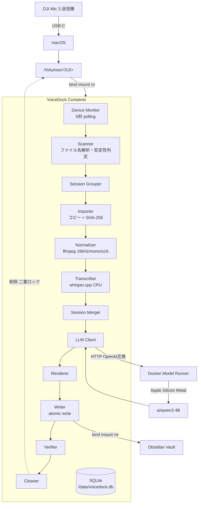
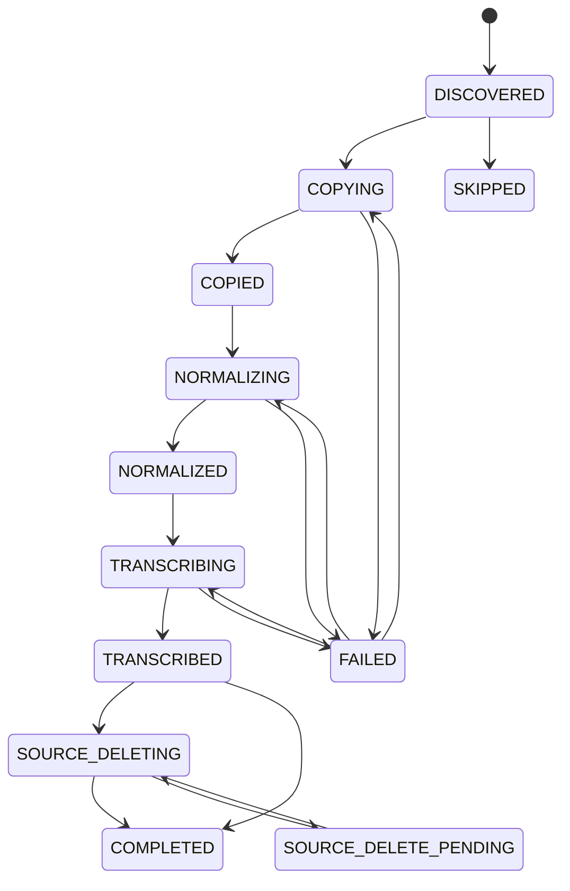
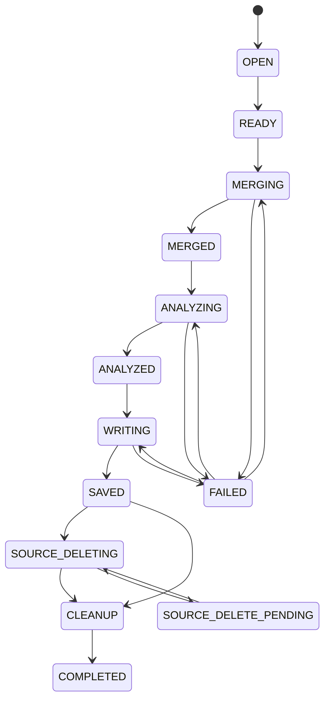

# VoiceDock 詳細仕様書 v3.0

**DJI Mic 3 × ローカル文字起こし × ローカルLLM × Obsidian**

| 項目 | 内容 |
|---|---|
| 文書版 | v3.0（実装着手可能版） |
| 前身文書 | `docs/archive/VoiceDock_Docker_Implementation_Spec_v2.0.md`（方針書） |
| 作成日 | 2026-09-11 |
| 対象環境 | macOS / Apple Silicon |
| 位置づけ | 本書が実装時の唯一の規範。v2.0 と矛盾する場合は本書を優先する |

---

## 目次

| 章 | 表題 |
|---|---|
| 1 | 目的・スコープ・非目標 |
| 2 | 用語定義 |
| 3 | 前提環境とホスト設定 |
| 4 | アーキテクチャ |
| 5 | DJI Mic 3 仕様 |
| 6 | リポジトリ構成 |
| 7 | 設定仕様 |
| 8 | データモデル |
| 9 | 状態機械 |
| 10 | 処理パイプライン詳細 |
| 11 | モジュール・インタフェース仕様 |
| 12 | LLM 仕様 |
| 13 | Obsidian 出力仕様 |
| 14 | 安全設計 |
| 15 | エラーコードとリトライ方針 |
| 16 | ログ仕様 |
| 17 | CLI 仕様 |
| 18 | Docker 構成 |
| 19 | Health Check と doctor |
| 20 | テスト仕様 |
| 21 | 開発フェーズと受け入れ条件 |
| 22 | 既知のリスクと未確定事項 |
| 23 | 将来拡張 |

---

## 1. 目的・スコープ・非目標

### 1.1 目的

DJI Mic 3 で録音した音声を Mac へ USB 接続するだけで、以下をバックグラウンドで全自動実行する。

```text
DJI Mic 3 で録音 → 帰宅 → Mac へ USB 接続 → （以降すべて自動）
```

自動実行される処理:

1. DJI Mic 3 の接続を検出する
2. 未処理の録音ファイルを検出する
3. Docker 管理領域へ安全にコピーする
4. ローカル Whisper で文字起こしする
5. ローカル LLM で要約・タスク・決定事項・アイデアを抽出する
6. Obsidian Vault へ Markdown として保存する
7. 保存内容を機械的に検証する
8. 検証に成功した録音のみ DJI Mic 3 から削除する
9. Docker 内の作業用音声を削除する
10. 同一録音の二重処理を防止する

ユーザーの操作は「録音する」「USB を挿す」「Obsidian を開く」の3つだけとする。

### 1.2 最優先方針

本システムは **AI 精度よりも録音データを失わないこと** を優先する。

優先順位:

| 順位 | 項目 |
|---|---|
| 1 | 音声保護（検証できない限り削除しない） |
| 2 | 処理の再実行性（途中から再開できる） |
| 3 | 二重処理防止 |
| 4 | 自動化 |
| 5 | 文字起こし精度 |
| 6 | 要約精度 |

この優先順位は実装上の判断が割れたときの決定規則として用いる。

### 1.3 受容したリスク: 原本音声の完全削除

本仕様では、Obsidian への保存検証に成功した後、**DJI 側の WAV と staging の作業ファイルの双方を削除する**。処理後に残るのは文字起こしテキストと要約のみであり、**元の音声は復元できない**。

これは「録音データを失わない」という最優先方針と緊張関係にあるが、設計判断として受容する。

代償として、以下の緩和策を必須とする。

- 削除は **第14章の論理式が真になった場合のみ** 実行する。例外経路を設けない
- 削除は **設定とファイルシステム権限の二重ロック** で守る（§14.2）。既定値は双方とも「削除不可」
- 削除機能の有効化は Phase 7 まで行わない（§21）
- 「削除されないこと」を検証するテストを最重要テストとして独立させる（§20.4）

> 将来、Mac 側へのアーカイブ保管を追加する場合は §23 の拡張として Core Pipeline と分離して実装する。MVP には含めない。

### 1.4 スコープ

本 MVP に含むもの。

- DJI Mic 3 の送信機内蔵ストレージからの取り込み
- 日本語音声の文字起こし
- 要約・タスク・決定事項・アイデア・タグの抽出
- Obsidian Vault への Markdown 出力
- SQLite による状態管理・再開・二重処理防止
- 安全な自動削除
- CLI による運用

### 1.5 非目標（MVP では実装しない）

| 非目標 | 理由 |
|---|---|
| GUI / Menu Bar UI / Web UI | CLI と Obsidian で足りる |
| 話者識別 | Core Pipeline 安定後に分離実装（§23） |
| クラウド AI API | ローカル完結が要件 |
| リアルタイム文字起こし | 接続時バッチで足りる |
| 複数 Worker 並列処理 | 削除事故と CPU 競合の回避（§10.0） |
| 音声アーカイブ保管 | §1.3 の決定により対象外 |
| DJI Mic 3 以外の機器対応 | インタフェースは用意するが実装しない（§11.1） |
| 受信機（RX）側ストレージの取り込み | 未検証（§22） |

---

## 2. 用語定義

本書では以下の用語を厳密に使い分ける。

| 用語 | 定義 |
|---|---|
| **Device（デバイス）** | macOS にマウントされた DJI Mic 3 のストレージ 1 個。`/host-volumes/<volume名>` に対応 |
| **Part（パート）** | DJI Mic 3 が 30 分ごとに分割生成した録音 1 本の論理単位。`recordings` テーブルの 1 行に対応する |
| **Variant（バリアント）** | 同一パートのファイル実体。`orig`（原音）と `denoised`（ノイズ除去済み）の最大 2 個。1 パートは 1 個以上のバリアントを持つ |
| **Session（セッション）** | 時間的に連続する Part の集合。Obsidian ノート 1 つに 1 対 1 対応する。`sessions` テーブルの 1 行 |
| **Transmitter（送信機）** | DJI Mic 3 の送信機。ファイル名の `TX01` などに対応。**ペアリングし直すと番号が変わるため恒久 ID として使用しない** |
| **Source（ソース）** | DJI デバイス上の元ファイル。読み取り専用が既定 |
| **Staging（ステージング）** | Docker named volume `/data/staging` 配下の作業領域 |
| **Transcript（トランスクリプト）** | 文字起こし結果。Part 単位と Session 単位の 2 階層がある |
| **Analysis（アナリシス）** | LLM が生成した構造化 JSON。Session 単位でのみ生成する |
| **Note（ノート）** | Obsidian Vault に書き出す Markdown ファイル。Session 単位 |

> v2.0 では「recording」が録音ファイルと論理録音の双方を指して曖昧だった。本書では **Part / Variant / Session** の 3 語に分解する。DB のテーブル名 `recordings` は Part を表す。

---

## 3. 前提環境とホスト設定

### 3.1 検証済み実機環境

以下は本仕様策定時に実測した値である。要件はこの環境を基準とする。

| 項目 | 実測値 | 要件 | 判定 |
|---|---|---|---|
| 機種 | Mac16,11 / Apple M4 Pro 14 core | Apple Silicon | ✅ |
| メモリ | 64 GB | 16 GB 以上 | ✅ |
| macOS | 26.6.2 (25G83) | — | ✅ |
| Docker Engine | 29.7.2 | — | ✅ |
| Docker Compose | v5.5.1 | **2.38 以上**（`models` 対応） | ✅ |
| Docker VM 割当 | 7 CPU / 24 GB / aarch64 | 4 CPU / 8 GB 以上 | ✅ |
| 仮想化バックエンド | **Apple Virtualization Framework** | **AVF 必須**（§3.2） | ✅ |
| Docker Model Runner | 無効 | 有効必須 | ⚠️ 要設定 |
| Docker Desktop AutoStart | `false` | 有効必須 | ⚠️ 要設定 |
| Obsidian Vault | `/Users/terada/Documents/Obsidian Vault` | 任意 | ⚠️ パスに空白を含む |
| 起動ディスク空き | 63 GB | 30 GB 以上推奨 | ⚠️ §7.3 の上限設計を必須とする |

### 3.2 仮想化バックエンドの制約（必須）

**Docker Desktop の仮想化バックエンドは Apple Virtualization Framework でなければならない。Docker VMM へ切り替えてはならない。**

Docker VMM は `/Volumes` 配下の外付け USB ボリュームへの bind mount が次のエラーで失敗する既知の不具合を持つ（docker/for-mac#7480、本書作成時点で未解決）。

```text
bind source path does not exist: /host_mnt/<volume名>/<path>
```

ローカルディスク（`/Users/...`）の bind mount は Docker VMM でも動作するため、**Obsidian Vault は読み書きできるのに DJI Mic だけ見えない** という切り分けの難しい症状になる。

確認方法:

```bash
python3 -c "import json;print(json.load(open('$HOME/Library/Group Containers/group.com.docker/settings-store.json')).get('UseVirtualizationFramework'))"
# => True であること
```

GUI では **Settings → General → Virtual Machine Options → Apple Virtualization framework**。

`doctor` はこの値を検査し、`False` の場合は致命的エラーとして報告する（§19.2）。

### 3.3 ホストへインストールするもの

| インストールする | インストールしない |
|---|---|
| Docker Desktop | Python / pip / venv |
| Obsidian | FFmpeg |
| Git（任意） | whisper.cpp / llama.cpp |
| | SQLite ツール類 |
| | AI 用 Python パッケージ |

後者はすべて Docker コンテナ内に閉じ込める。

### 3.4 ホスト設定手順

初回のみ、以下をユーザーが実施する。`setup.sh` は実施状況を検査するが、ホスト設定の変更自体は行わない。

**(1) Docker Model Runner を有効化する**

```bash
docker desktop enable model-runner
docker model status   # => "Docker Model Runner is running" になること
```

GUI では **Settings → AI → Enable Docker Model Runner**。

**(2) Docker Desktop のログイン時自動起動を有効化する**

VoiceDock は `launchd` を使わず、Docker Desktop の起動に相乗りして常駐する（§18.4）。したがって Docker Desktop 自体が自動起動しなければ全体が起動しない。

GUI で **Settings → General → Start Docker Desktop when you sign in to your computer** を有効化する。

現在値の確認:

```bash
python3 -c "import json;print(json.load(open('$HOME/Library/Group Containers/group.com.docker/settings-store.json')).get('AutoStart'))"
# => True であること
```

**(3) ファイル共有設定を確認する**

Docker Desktop for Mac は既定で `/Users` `/Volumes` `/private` `/tmp` `/var/folders` を共有する。既定のままでよい。`Mounts denied` が出た場合のみ **Settings → Resources → File sharing** を確認する。

**(4) Obsidian Vault のパスを確認する**

```bash
cat "$HOME/Library/Application Support/obsidian/obsidian.json"
```

得られたパスを `.env` の `OBSIDIAN_VAULT` に設定する。**パスに空白が含まれる場合でも `.env` では引用符を付けない**（Compose が値をそのまま解釈するため、引用符は文字列の一部になる）。

```dotenv
# 正しい
OBSIDIAN_VAULT=/Users/terada/Documents/Obsidian Vault

# 誤り（引用符がパスの一部になる）
OBSIDIAN_VAULT="/Users/terada/Documents/Obsidian Vault"
```

---

## 4. アーキテクチャ

### 4.1 全体構成



### 4.2 コンポーネント責務

| コンポーネント | 配置 | 責務 |
|---|---|---|
| macOS | ホスト | DJI ストレージのマウント、`/Volumes` と Vault の提供、Docker Desktop 起動 |
| VoiceDock Container | Docker | 検出・コピー・正規化・文字起こし・解析要求・Markdown 生成・検証・削除・状態管理 |
| Docker Model Runner | Docker Desktop | 要約 LLM のダウンロード・起動・推論。Apple Silicon では llama.cpp バックエンドで Metal を使用 |
| SQLite | named volume | 全状態の単一の真実。`/data/voicedock.db` |
| Obsidian | ホスト | Vault の閲覧のみ。VoiceDock は Obsidian の API / Plugin に一切依存しない |

### 4.3 計算資源の配分

macOS の Docker Desktop は Linux VM 上でコンテナを動かすため、**通常の Linux コンテナから Apple Metal GPU を直接利用しない**。したがって処理を次のように分担する。

| 処理 | 実行場所 | アクセラレーション |
|---|---|---|
| 文字起こし（whisper.cpp） | VoiceDock コンテナ内 | **CPU のみ**（ARM NEON / dotprod） |
| 要約（LLM） | Docker Model Runner | **Apple Silicon Metal** |

文字起こし速度が実用に満たない場合に限り、将来 Whisper 部分を Mac ネイティブ実行へ差し替える（§11.1 の `TranscriptionService` インタフェースで吸収する）。

### 4.4 データフロー（Session 1 件あたり）

```text
[Device]  TX_MIC001_.../TX01_MIC002_20250527_202904.wav      ← Part 1 (denoised)
          TX_MIC001_.../TX01_MIC002_20250527_202904_orig.wav ← Part 1 (orig)
          TX_MIC001_.../TX01_MIC003_20250527_205904.wav      ← Part 2 (denoised)
          ...
             │ scan（ffprobe で duration 取得・安定性判定）
             ▼
[DB]      recordings 行 × N（Part 単位） + sessions 行 × 1
             │ copy + SHA-256
             ▼
[Staging] /data/staging/<recording_id>/source_denoised.wav
          /data/staging/<recording_id>/source_orig.wav
             │ ffmpeg
             ▼
          /data/staging/<recording_id>/audio16k.wav
             │ whisper-cli
             ▼
[Data]    /data/transcripts/parts/<recording_id>.json
             │ session merge（時刻オフセット補正）
             ▼
          /data/transcripts/sessions/<session_id>.json
          /data/transcripts/sessions/<session_id>.txt
             │ LLM（Map-Reduce）
             ▼
[Data]    /data/analysis/<session_id>.json
             │ render → atomic write → verify
             ▼
[Vault]   Inbox/Voice/2025-05-27 2029 - <title>.md
             │ 検証成功 かつ 二重ロック解除時のみ
             ▼
[Device]  Part 全 Variant を削除 → [Staging] 削除 → COMPLETED
```

---

## 5. DJI Mic 3 仕様

### 5.1 ストレージ構造

DJI Mic 3 の送信機は 32 GB の内蔵ストレージを持ち、外部ストレージには非対応。USB-C（送信機用マグネット充電ケーブル、または充電ケースのデータケーブル）で Mac へ接続する。

```text
/Volumes/<VOLUME_NAME>/
└── TX_MIC001_20250530_115001/                       ← 録音フォルダ
    ├── TX01_MIC002_20250527_202904.wav              ← ノイズ除去済み
    ├── TX01_MIC002_20250527_202904_orig.wav         ← 原音
    ├── TX01_MIC003_20250527_205904.wav
    └── ...
```

| 要素 | 規則 |
|---|---|
| フォルダ名 | `TX_MIC<NNN>_<YYYYMMDD>_<HHMMSS>`。`TX` は送信機内蔵録音であることを示す。**50 ファイルごとに新しいフォルダが作られる**。日時はフォルダ作成時刻 |
| ファイル名 | `TX<NN>_MIC<NNN>_<YYYYMMDD>_<HHMMSS>[_orig].wav` |
| `TX<NN>` | 送信機番号。受信機がペアリング順に付与する。**再ペアリングで変わる** |
| `MIC<NNN>` | 録音インデックス |
| `<YYYYMMDD>_<HHMMSS>` | **録音開始**日時（ローカル時刻） |
| `_orig` | 付いていれば原音。付いていなければノイズ除去済み |
| 分割 | **30 分ごとに自動で新しいファイルへ分割される** |
| 形式 | WAV（24 bit または 32 bit float） |

### 5.2 ファイル名パーサ

```python
RECORDING_FILENAME_RE = re.compile(
    r"^(?P<tx>TX\d{2})"
    r"_(?P<mic>MIC\d{3})"
    r"_(?P<date>\d{8})"
    r"_(?P<time>\d{6})"
    r"(?P<orig>_orig)?"
    r"\.(?P<ext>wav|WAV)$"
)

RECORDING_FOLDER_RE = re.compile(
    r"^TX_(?P<mic>MIC\d{3})_(?P<date>\d{8})_(?P<time>\d{6})$"
)
```

パース結果:

| フィールド | 型 | 説明 |
|---|---|---|
| `transmitter_id` | `str` | `TX01` など。**弱い識別子**。セッション分組にのみ使い、重複検出には使わない |
| `mic_index` | `int` | `MIC002` → `2` |
| `started_at` | `datetime` | 録音開始時刻。タイムゾーンは `config.timezone`（既定 `Asia/Tokyo`）を付与 |
| `variant` | `Literal["orig", "denoised"]` | `_orig` の有無 |

パースに失敗したファイルは **無視する**（`WARN unparsable_filename` をログ出力し、DB へ登録しない）。DJI 以外のファイルを誤って処理しないための防御である。

### 5.3 Part キーと Variant のペアリング

同一 Part の 2 バリアントは、`_orig` を除いたファイル名が一致することで対応づける。

```python
part_key = (transmitter_id, mic_index, started_at)
```

| 状態 | 扱い |
|---|---|
| `denoised` と `orig` の両方が存在 | 1 Part・2 Variant。**文字起こしには `denoised` を使う**（§7.2 `audio.transcribe_variant`） |
| `denoised` のみ | 1 Part・1 Variant。`denoised` を使う |
| `orig` のみ | 1 Part・1 Variant。`orig` を使う |

**削除は Part 単位で全 Variant をまとめて行う。**片方だけを削除してはならない（§10.12）。

### 5.4 デバイス判定

Volume 名を固定しない。`/host-volumes` 直下の各エントリについて以下を評価し、**すべて**を満たす場合に DJI デバイスと判定する。

1. ディレクトリであり、読み取り可能である
2. `RECORDING_FOLDER_RE` に一致するサブディレクトリが 1 個以上存在する、**または** `RECORDING_FILENAME_RE` に一致する `.wav` が 1 個以上存在する
3. 除外パターン（`config.device.exclude_volumes`、既定 `["Macintosh HD", "com.apple.TimeMachine.*"]`）に一致しない

判定は再帰探索の深さを `config.device.max_scan_depth`（既定 `3`）に制限する。Time Machine ボリューム等を深掘りして固まることを防ぐ。

デバイス識別子 `device_id` は Volume 名とする。Volume 名は変わりうるため、二重処理防止には使わない（§10.5）。

### 5.5 Phase 0 PoC チェックリスト（ハードゲート）

**以下がすべて確認されるまで、削除機能を有効化してはならない。**

| # | 確認項目 | 判定 | 失敗時の影響 |
|---|---|---|---|
| P0-1 | 送信機を USB 接続すると `/Volumes/<名前>` に現れる | 必須 | §5.6 の代替アーキテクチャへ切替 |
| P0-2 | Volume 名を記録する（複数送信機なら全部） | 必須 | — |
| P0-3 | フォルダ・ファイル名が §5.1 の規則と一致する | 必須 | パーサ修正 |
| P0-4 | `_orig` と非 `_orig` の両方が実際に生成されるか | 必須 | §5.3 の分岐調整 |
| P0-5 | ホストから WAV を読み取れる | 必須 | — |
| P0-6 | **コンテナ起動後にデバイスを接続して `/host-volumes` に現れる**（ホットプラグ伝播） | **最重要** | §5.6 の代替へ切替 |
| P0-7 | コンテナから WAV を読み取れる | 必須 | File sharing 設定 |
| P0-8 | コンテナから WAV を削除できる（`rw` マウント時、使い捨てファイルで検証） | Phase 7 前に必須 | 自動削除を諦める |
| P0-9 | コンテナ内でのファイル所有者・パーミッション（non-root で読めるか） | 必須 | §18.3 の uid 調整 |
| P0-10 | 送信機 2 台の場合の見え方（Volume 2 個か、1 個に統合か） | 必須 | Scanner の走査範囲調整 |
| P0-11 | 録音中／書き込み中ファイルの見え方（§10.3 の安定性判定が機能するか） | 必須 | 待機時間調整 |
| P0-12 | 受信機（RX）側にもストレージが見えるか | 任意 | §22 へ記録 |

P0-6 の検証手順:

```bash
# 1. デバイス未接続の状態でコンテナを起動
docker compose up -d
docker compose exec voicedock ls -la /host-volumes

# 2. この状態で DJI Mic 3 を USB 接続する

# 3. コンテナを再起動せずに再確認
docker compose exec voicedock ls -la /host-volumes
# => 新しい Volume が現れれば PASS
```

### 5.6 代替アーキテクチャ（P0-1 または P0-6 が失敗した場合のみ）

| 失敗ケース | 代替 |
|---|---|
| P0-1 失敗（通常の Volume として公開されない。専用アプリ / MTP 経由でしか取得できない） | `/Volumes` 監視方式は成立しない。Mac 側に最小限の「取り込み Helper」を置き、Helper がホスト共有ディレクトリへコピーし、コンテナはそのディレクトリだけを監視する構成へ切り替える |
| P0-6 失敗（ホットプラグが伝播しない） | 案 A: ホスト側 `launchd` の `StartOnMount` で接続を検知し `docker compose restart voicedock` を実行する。案 B: Volume パスを `.env` で固定し、個別パスを bind mount する（接続前にコンテナを起動できないため運用が劣化する）。**案 A を第一候補とする** |

いずれの代替も MVP の範囲外であり、発生した時点で別途設計する。

---

## 6. リポジトリ構成

```text
voicedock/
├── compose.yaml
├── pyproject.toml
├── uv.lock                        # 依存の lock（§18.5）
├── .env.example
├── .gitignore
├── README.md
│
├── docs/
│   ├── SPEC.md                    # 本書
│   └── archive/
│       └── VoiceDock_Docker_Implementation_Spec_v2.0.md
│
├── docker/
│   └── voicedock/
│       └── Dockerfile
│
├── src/
│   └── voicedock/
│       ├── __init__.py
│       ├── main.py                # エントリポイント / CLI ディスパッチ
│       ├── config.py              # 設定読み込み・検証（§7）
│       ├── logging_config.py      # 構造化ログ（§16）
│       ├── errors.py              # エラーコード定義（§15）
│       │
│       ├── device/
│       │   ├── base.py            # AudioSource インタフェース（§11.1）
│       │   ├── monitor.py         # 5秒 polling
│       │   ├── scanner.py         # 走査・安定性判定
│       │   └── dji_mic3.py        # DJI Mic 3 実装（§5）
│       │
│       ├── importers/
│       │   ├── importer.py        # コピー
│       │   └── integrity.py       # SHA-256 / サイズ検証 / 空き容量
│       │
│       ├── audio/                 # ★ v2.0 に無かった層
│       │   ├── probe.py           # ffprobe による duration / 形式取得
│       │   └── normalizer.py      # ffmpeg 16kHz/mono/s16 変換
│       │
│       ├── sessions/
│       │   ├── grouper.py         # セッション分組（§10.4）
│       │   └── merger.py          # Part transcript の統合（§10.8）
│       │
│       ├── transcription/
│       │   ├── base.py            # TranscriptionService インタフェース
│       │   ├── models.py          # Transcript / TranscriptSegment
│       │   └── whisper_cpp.py     # whisper-cli 実行
│       │
│       ├── llm/
│       │   ├── client.py          # Docker Model Runner クライアント
│       │   ├── schemas.py         # Pydantic スキーマ（§12.2）
│       │   ├── chunking.py        # Map-Reduce 分割（§12.4）
│       │   └── prompts.py         # プロンプト読み込み
│       │
│       ├── obsidian/
│       │   ├── renderer.py        # Markdown 生成（§13.3）
│       │   ├── writer.py          # atomic write（§13.4）
│       │   ├── verifier.py        # 保存検証（§13.5）
│       │   └── naming.py          # ファイル名 sanitize（§13.2）
│       │
│       ├── database/
│       │   ├── db.py              # 接続・トランザクション
│       │   ├── models.py          # 行のデータクラス
│       │   ├── repository.py      # クエリ
│       │   └── migrations.py      # スキーマ移行（§8.5）
│       │
│       ├── processing/
│       │   ├── pipeline.py        # ensure_* の直列実行（§10）
│       │   ├── worker.py          # 単一 Worker ループ（§10.0）
│       │   ├── states.py          # 状態定義・遷移表（§9）
│       │   └── retry.py           # backoff（§15.2）
│       │
│       ├── cleanup/
│       │   └── cleaner.py         # 削除（§10.12）
│       │
│       └── cli/
│           ├── status.py
│           ├── history.py
│           ├── retry_cmd.py
│           ├── doctor.py
│           └── health.py
│
├── config/
│   └── config.example.yaml
│
├── prompts/
│   ├── analyze_ja.txt             # 最終解析プロンプト
│   ├── map_ja.txt                 # Map 段階プロンプト
│   └── repair_json.txt            # JSON 修復プロンプト
│
├── scripts/
│   ├── setup.sh
│   ├── start.sh
│   ├── stop.sh
│   ├── status.sh
│   ├── logs.sh
│   ├── doctor.sh
│   ├── fetch-whisper-model.sh
│   └── test.sh
│
└── tests/
    ├── unit/
    ├── integration/
    └── fixtures/
        ├── fake_volumes/
        │   └── DJI_MIC/
        │       └── TX_MIC001_20250530_115001/
        │           ├── TX01_MIC002_20250527_202904.wav
        │           └── TX01_MIC002_20250527_202904_orig.wav
        ├── transcripts/
        └── llm_responses/
```

---

## 7. 設定仕様

設定は 2 系統に分ける。

| 系統 | ファイル | 内容 | Git 管理 |
|---|---|---|---|
| ホスト固有・秘匿 | `.env` | Vault の絶対パス、マウントモード | **しない** |
| アプリ挙動 | `config/config.yaml` | しきい値、モデル、出力先 | **しない**（`config.example.yaml` のみ管理） |

### 7.1 `.env`

`.env.example`:

```dotenv
# Obsidian Vault の絶対パス。引用符を付けないこと（§3.4)
OBSIDIAN_VAULT=/Users/USERNAME/Documents/Obsidian Vault

# DJI ストレージのマウントモード。ro | rw
# 既定は必ず ro。実機試験完了後にのみ rw へ変更する（§14.2）
DJI_MOUNT_MODE=ro

# タイムゾーン
TZ=Asia/Tokyo
```

`DJI_MOUNT_MODE` を `rw` に変更した場合、`docker compose up -d` でコンテナの再生成が必要（bind mount のモードは再生成しないと変わらない）。

### 7.2 `config/config.yaml` 全キー

```yaml
# ============================================================
# VoiceDock 設定
# ============================================================

timezone: Asia/Tokyo

# --- デバイス検出 -------------------------------------------
device:
  root: /host-volumes            # コンテナ内の監視ルート
  poll_interval_seconds: 5       # 走査間隔
  max_scan_depth: 3              # 再帰探索の深さ上限
  exclude_volumes:               # 除外する Volume 名（glob）
    - "Macintosh HD"
    - "com.apple.TimeMachine.*"
    - ".*"
  # ファイル安定性判定（§10.3）
  stability_checks: 2            # size+mtime の一致を要求する連続回数
  stability_interval_seconds: 3  # 判定間の待機秒数

# --- 音声 ---------------------------------------------------
audio:
  # 文字起こしに使用するバリアント。denoised | orig
  # 両方存在する場合にどちらを使うか。片方しか無ければ存在する方を使う
  transcribe_variant: denoised
  ffmpeg: /usr/bin/ffmpeg
  ffprobe: /usr/bin/ffprobe
  # whisper.cpp の入力要件。変更不可（§10.6）
  target_sample_rate: 16000
  target_channels: 1
  target_codec: pcm_s16le
  ffprobe_timeout_seconds: 30
  ffmpeg_timeout_factor: 0.5     # duration × この値（下限 60 秒）

# --- 取り込み -----------------------------------------------
import:
  staging_root: /data/staging
  # 空き容量の必要量: source合計 × multiplier + margin（§10.5）
  free_space_multiplier: 2.0
  free_space_margin_bytes: 2147483648      # 2 GiB
  # staging 全体の上限。超過すると新規取り込みを停止する
  staging_max_bytes: 21474836480           # 20 GiB
  hash_chunk_bytes: 1048576                # 1 MiB

# --- セッション分組（§10.4） ---------------------------------
session:
  enabled: true
  group_by_transmitter: true     # 送信機が異なれば必ず別セッション
  group_by_folder: true          # 録音フォルダが異なれば必ず別セッション
  # 前パート終了から次パート開始までの許容ギャップ
  max_gap_seconds: 60
  # 1 セッションの最大パート数。超えたら分割する（暴走防止）
  max_parts: 48
  # 1 セッションの最大合計秒数
  max_duration_seconds: 86400

# --- 文字起こし ---------------------------------------------
transcription:
  engine: whisper_cpp
  executable: /usr/local/bin/whisper-cli
  model: /models/whisper/ggml-large-v3-turbo-q5_0.bin
  language: ja
  threads: 7                     # 0 で自動（nproc と 8 の小さい方）
  # タイムアウト = max(min_timeout, duration × factor)
  timeout_factor: 3.0
  min_timeout_seconds: 600
  max_timeout_seconds: 21600
  # 文字起こし結果がこの文字数未満なら TRANSCRIPT_EMPTY とする
  min_chars: 1

# --- LLM ----------------------------------------------------
llm:
  # URL とモデル名は Compose の models 機能が環境変数で注入する（§18.2）
  endpoint_env: VOICEDOCK_LLM_URL
  model_env: VOICEDOCK_LLM_MODEL
  temperature: 0.1
  top_p: 0.9
  max_output_tokens: 2048
  request_timeout_seconds: 600
  # Map-Reduce しきい値（§12.4）
  max_chars_per_request: 6000
  chunk_overlap_chars: 200
  # JSON 検証失敗時の修復試行回数
  repair_attempts: 1
  prompts:
    analyze: /app/prompts/analyze_ja.txt
    map: /app/prompts/map_ja.txt
    repair: /app/prompts/repair_json.txt

# --- Obsidian -----------------------------------------------
obsidian:
  root: /obsidian
  folder: Inbox/Voice
  filename_template: "{date} {time} - {title}"   # 拡張子は .md 固定
  max_title_chars: 80
  include_transcript: true
  transcript_heading: "## Transcript"
  # Transcript 本文にタイムスタンプ見出しを入れる間隔（秒）。0 で無効
  transcript_timestamp_interval_seconds: 300
  default_tags:
    - voice
    - voicedock

# --- 削除（§14） --------------------------------------------
cleanup:
  # 【安全ロック 1】DJI 側の元音声を削除するか。既定 false
  delete_source_audio: false
  # 【安全ロック 2 は .env の DJI_MOUNT_MODE=ro】
  # staging の作業ファイルを削除するか
  delete_staging_audio: true
  # 正規化済み音声を文字起こし後すぐ消すか（容量節約）
  delete_normalized_after_transcribe: true
  # transcript / analysis JSON の保持日数。0 で無期限
  retain_transcript_days: 0

# --- リトライ（§15.2） ---------------------------------------
retry:
  max_attempts: 3
  backoff_seconds: [3, 10, 30]

# --- ログ（§16） --------------------------------------------
logging:
  level: INFO                    # DEBUG | INFO | WARNING | ERROR
  format: text                   # text | json
  # true にすると transcript 本文を DEBUG ログへ出す。本番では必ず false
  unsafe_log_content: false

# --- データベース -------------------------------------------
database:
  path: /data/voicedock.db
  busy_timeout_ms: 10000
```

### 7.3 設定バリデーション規則

`config.py` は起動時に以下を検証し、1 つでも違反があれば **起動を中止**して終了コード `2` を返す。

| # | 規則 | 違反時のエラー |
|---|---|---|
| V-1 | 未知のキーが存在しない（タイポ検出のため strict に扱う） | `CONFIG_UNKNOWN_KEY` |
| V-2 | `audio.transcribe_variant` が `denoised` / `orig` のいずれか | `CONFIG_INVALID_VALUE` |
| V-3 | `audio.target_sample_rate == 16000` かつ `target_channels == 1` かつ `target_codec == pcm_s16le` | `CONFIG_INVALID_VALUE`（whisper.cpp の入力要件、変更不可） |
| V-4 | `device.poll_interval_seconds >= 1` | `CONFIG_INVALID_VALUE` |
| V-5 | `device.stability_checks >= 1` | `CONFIG_INVALID_VALUE` |
| V-6 | `session.max_gap_seconds >= 0` | `CONFIG_INVALID_VALUE` |
| V-7 | `retry.backoff_seconds` の要素数 >= `retry.max_attempts` | `CONFIG_INVALID_VALUE` |
| V-8 | `llm.max_chars_per_request > llm.chunk_overlap_chars * 2` | `CONFIG_INVALID_VALUE` |
| V-9 | `obsidian.folder` が相対パスであり `..` を含まない | `CONFIG_INVALID_VALUE` |
| V-10 | `transcription.model` のファイルが存在する | `WHISPER_MODEL_MISSING` |
| V-11 | `transcription.executable` が存在し実行可能 | `WHISPER_EXEC_MISSING` |
| V-12 | `cleanup.delete_source_audio == true` の場合、起動ログに警告を出す | 警告のみ（§14.3） |
| V-13 | `import.staging_max_bytes > import.free_space_margin_bytes` | `CONFIG_INVALID_VALUE` |

---

## 8. データモデル

### 8.1 方針

- SQLite（Python 標準ライブラリ `sqlite3`）を使用する
- 保存先は Docker named volume 上の `/data/voicedock.db`
- **SQLite が全状態の単一の真実**。ファイルの有無は補助的な確認材料に過ぎない
- 接続時に必ず以下を設定する

```sql
PRAGMA journal_mode = WAL;
PRAGMA foreign_keys = ON;
PRAGMA busy_timeout = 10000;
PRAGMA synchronous = FULL;   -- 削除判断の根拠になるため耐久性を優先する
```

`synchronous = FULL` は性能を犠牲にするが、電源断で状態を失って「保存済みなのに未保存と誤認」あるいは逆の事故を起こさないために必須とする。

### 8.2 `recordings`（Part）

```sql
CREATE TABLE recordings (
    id                    INTEGER PRIMARY KEY AUTOINCREMENT,

    -- 由来
    device_id             TEXT    NOT NULL,   -- Volume 名（不安定。参考情報）
    source_folder         TEXT    NOT NULL,   -- TX_MIC001_20250530_115001
    transmitter_id        TEXT    NOT NULL,   -- TX01（不安定。分組にのみ使用）
    mic_index             INTEGER NOT NULL,   -- MIC002 -> 2
    started_at            TEXT    NOT NULL,   -- ISO8601 +09:00。ファイル名由来
    duration_seconds      REAL,               -- ffprobe 由来
    ended_at              TEXT,               -- started_at + duration_seconds

    -- Variant（最大 2）
    source_path_denoised  TEXT,
    source_path_orig      TEXT,
    source_size_denoised  INTEGER,
    source_size_orig      INTEGER,
    source_mtime_denoised REAL,
    source_mtime_orig     REAL,
    sha256_denoised       TEXT,
    sha256_orig           TEXT,

    -- 文字起こしに使ったバリアント
    primary_variant       TEXT,               -- 'denoised' | 'orig'

    -- 作業成果物
    staging_dir           TEXT,
    normalized_path       TEXT,
    transcript_path       TEXT,

    -- 所属
    session_id            INTEGER REFERENCES sessions(id) ON DELETE SET NULL,

    -- 状態（§9.1）
    status                TEXT    NOT NULL,
    retry_count           INTEGER NOT NULL DEFAULT 0,
    error_code            TEXT,
    error_message         TEXT,

    -- 監査タイムスタンプ
    discovered_at         TEXT    NOT NULL,
    copied_at             TEXT,
    normalized_at         TEXT,
    transcribed_at        TEXT,
    source_deleted_at     TEXT,
    completed_at          TEXT,
    updated_at            TEXT    NOT NULL
);

-- 論理的な同一 Part の二重登録を防ぐ（ファイル名由来の自然キー）
CREATE UNIQUE INDEX idx_recordings_partkey
    ON recordings (transmitter_id, mic_index, started_at, source_folder);

-- 内容同一性による二重処理防止。NULL は重複可なので未ハッシュ行は衝突しない
CREATE UNIQUE INDEX idx_recordings_sha_denoised
    ON recordings (sha256_denoised) WHERE sha256_denoised IS NOT NULL;
CREATE UNIQUE INDEX idx_recordings_sha_orig
    ON recordings (sha256_orig)     WHERE sha256_orig     IS NOT NULL;

CREATE INDEX idx_recordings_status   ON recordings (status);
CREATE INDEX idx_recordings_session  ON recordings (session_id);
CREATE INDEX idx_recordings_started  ON recordings (started_at);
```

**設計意図:**

- `sha256_*` の部分 UNIQUE インデックスが二重処理防止の最終防壁。ファイル名や Volume 名が変わっても内容が同じなら弾ける
- `idx_recordings_partkey` は高速な事前判定用。SHA-256 は USB 越しの全読み込みが必要で高コストなため、まずこちらで既知判定する（§10.5）
- `transmitter_id` を自然キーに含めるのは、再ペアリング前後で別 Part として扱うほうが安全なため（誤って同一視して取りこぼすより、二重に検出して SHA-256 で弾くほうが良い）

### 8.3 `sessions`

```sql
CREATE TABLE sessions (
    id                  INTEGER PRIMARY KEY AUTOINCREMENT,
    session_key         TEXT    NOT NULL UNIQUE,

    device_id           TEXT,
    transmitter_id      TEXT,
    source_folder       TEXT,

    started_at          TEXT    NOT NULL,
    ended_at            TEXT,
    duration_seconds    REAL,
    part_count          INTEGER NOT NULL DEFAULT 0,

    title               TEXT,
    transcript_path     TEXT,           -- /data/transcripts/sessions/<id>.json
    transcript_txt_path TEXT,
    analysis_path       TEXT,           -- /data/analysis/<id>.json
    output_path         TEXT,           -- Vault 内の相対パス
    output_sha256       TEXT,           -- 書き込んだ Markdown の SHA-256（§13.5）

    status              TEXT    NOT NULL,
    retry_count         INTEGER NOT NULL DEFAULT 0,
    error_code          TEXT,
    error_message       TEXT,

    created_at          TEXT    NOT NULL,
    merged_at           TEXT,
    analyzed_at         TEXT,
    saved_at            TEXT,
    source_deleted_at   TEXT,
    completed_at        TEXT,
    updated_at          TEXT    NOT NULL
);

CREATE INDEX idx_sessions_status ON sessions (status);
CREATE INDEX idx_sessions_started ON sessions (started_at);
```

`session_key` の生成規則:

```python
session_key = f"{device_id}:{transmitter_id}:{source_folder}:{first_part.started_at:%Y%m%dT%H%M%S}"
```

### 8.4 `events`（監査ログ）

削除という不可逆操作を行うため、状態遷移の履歴を DB にも残す。

```sql
CREATE TABLE events (
    id            INTEGER PRIMARY KEY AUTOINCREMENT,
    entity_type   TEXT NOT NULL,      -- 'recording' | 'session'
    entity_id     INTEGER NOT NULL,
    from_status   TEXT,
    to_status     TEXT NOT NULL,
    error_code    TEXT,
    detail        TEXT,               -- 音声内容・本文は決して入れない（§16.3）
    created_at    TEXT NOT NULL
);

CREATE INDEX idx_events_entity ON events (entity_type, entity_id, id);
```

すべての状態遷移は `events` への INSERT と **同一トランザクション** で行う。

### 8.5 マイグレーション

```sql
CREATE TABLE schema_version (
    version    INTEGER NOT NULL,
    applied_at TEXT    NOT NULL
);
```

- `migrations.py` は `version` 昇順の SQL を順次適用する
- 起動時に自動適用する
- **破壊的変更（列削除・テーブル削除）は禁止**。追加のみとする。状態を失うと削除の安全判断ができなくなるため
- 適用前に `/data/voicedock.db` を `/data/backups/voicedock.db.<version>.bak` へコピーする

---

## 9. 状態機械

v2.0 の単一状態機械では「1 セッション = 1 ノート」と「30 分分割」を同時に満たせないため、**Part と Session の 2 階層**に分離する。

- **Part**: 検出 → コピー → 正規化 → 文字起こし まで
- **Session**: 統合 → LLM → ノート生成 → 検証 → 削除 まで

### 9.1 Part 状態



| 状態 | 意味 | 元音声削除可否 |
|---|---|---|
| `DISCOVERED` | 検出・DB 登録済み。安定性判定通過済み | 不可 |
| `COPYING` | staging へコピー中 | 不可 |
| `COPIED` | 全 Variant のコピーと SHA-256 検証が完了 | 不可 |
| `NORMALIZING` | ffmpeg 変換中 | 不可 |
| `NORMALIZED` | 16kHz/mono/s16 の音声を生成済み | 不可 |
| `TRANSCRIBING` | whisper.cpp 実行中 | 不可 |
| `TRANSCRIBED` | Part transcript が確定。**ここで元音声への依存が切れる** | Session が SAVED なら可 |
| `SOURCE_DELETING` | DJI 側ファイル削除中 | — |
| `SOURCE_DELETE_PENDING` | 削除すべきだがデバイス未接続 / 削除失敗。次回接続時に再試行 | — |
| `COMPLETED` | 当該 Part の処理をすべて終えた | — |
| `FAILED` | 恒久的失敗。手動 `retry` で再開可能 | 不可 |
| `SKIPPED` | 既知の重複、またはパース不能で処理対象外 | 不可 |

### 9.2 Session 状態



| 状態 | 意味 |
|---|---|
| `OPEN` | 分組中。**新しい Part を受け入れられる唯一の状態** |
| `READY` | 走査パス完了により確定。全 Part が `TRANSCRIBED` になるのを待つ |
| `MERGING` | Part transcript を統合中 |
| `MERGED` | セッション transcript が確定 |
| `ANALYZING` | LLM 解析中 |
| `ANALYZED` | LLM 解析が完了し `analysis_path` が有効 |
| `WRITING` | Markdown を書き込み中 |
| `SAVED` | **保存検証（§13.5）に成功した。削除の必要条件が揃った** |
| `SOURCE_DELETING` | 配下 Part の元音声を削除中 |
| `SOURCE_DELETE_PENDING` | 削除保留（デバイス未接続など） |
| `CLEANUP` | staging 削除中 |
| `COMPLETED` | 完了 |
| `FAILED` | 恒久的失敗 |

### 9.3 遷移表（ガード条件と副作用）

**Part:**

| 現状態 | イベント | ガード条件 | 次状態 | 副作用 |
|---|---|---|---|---|
| — | 走査で新規検出 | ファイル名パース成功 ∧ 安定性 OK ∧ partkey 未登録 | `DISCOVERED` | 行 INSERT、ffprobe で duration 取得 |
| — | 走査で検出 | partkey 登録済み | （遷移なし） | `DEBUG already_known` のみ |
| `DISCOVERED` | 取り込み | 空き容量 OK ∧ staging 上限内 | `COPYING` | staging ディレクトリ作成 |
| `COPYING` | コピー完了 | 全 Variant で size 一致 ∧ SHA-256 一致 | `COPIED` | `sha256_*`・`copied_at` 更新 |
| `COPYING` | SHA-256 衝突 | 同一 sha256 の別行が存在 | `SKIPPED` | staging 削除、`DUPLICATE_CONTENT` 記録 |
| `COPYING` | 失敗 | — | `FAILED` | **部分コピーを削除**。元ファイルは触らない |
| `COPIED` | 正規化 | primary variant が staging に存在 | `NORMALIZING` | — |
| `NORMALIZING` | ffmpeg 成功 | 出力が 16kHz/mono/s16 ∧ size > 0 | `NORMALIZED` | `normalized_path` 更新 |
| `NORMALIZING` | 失敗 | — | `FAILED` | 部分出力を削除 |
| `NORMALIZED` | 文字起こし | — | `TRANSCRIBING` | — |
| `TRANSCRIBING` | whisper 成功 | JSON パース成功 ∧ 文字数 >= `min_chars` | `TRANSCRIBED` | `transcript_path` 更新、`cleanup.delete_normalized_after_transcribe` なら正規化音声削除 |
| `TRANSCRIBING` | 空 transcript | 文字数 < `min_chars` | `FAILED` | `TRANSCRIPT_EMPTY` |
| `TRANSCRIBING` | タイムアウト | — | `FAILED` | `WHISPER_TIMEOUT`、プロセス kill |
| `TRANSCRIBED` | 削除要求 | §14.1 の論理式が真 | `SOURCE_DELETING` | — |
| `TRANSCRIBED` | 削除要求 | `delete_source_audio == false` | `COMPLETED` | 元音声を残したまま完了 |
| `SOURCE_DELETING` | 削除成功 | 全 Variant が存在しないことを再確認 | `COMPLETED` | `source_deleted_at` 更新 |
| `SOURCE_DELETING` | デバイス未接続 / 失敗 | — | `SOURCE_DELETE_PENDING` | Note・staging は残す |
| `SOURCE_DELETE_PENDING` | デバイス再接続 | §14.1 が真 | `SOURCE_DELETING` | — |
| `FAILED` | `retry` コマンド | `retry_count < max_attempts` または `--force` | 直前の進行中状態 | `retry_count += 1` |

**Session:**

| 現状態 | イベント | ガード条件 | 次状態 | 副作用 |
|---|---|---|---|---|
| — | 分組で新規作成 | — | `OPEN` | 行 INSERT |
| `OPEN` | Part 追加 | §10.4 の連続性条件を満たす | `OPEN` | `part_count` 更新 |
| `OPEN` | 走査パス完了 | — | `READY` | 以降 Part を受け入れない |
| `READY` | 定期評価 | 全 Part が `TRANSCRIBED` 以上 | `MERGING` | — |
| `READY` | 定期評価 | いずれかの Part が `FAILED` | `READY` のまま | 待機。`retry` を促す警告 |
| `MERGING` | 統合成功 | セッション transcript の文字数 > 0 | `MERGED` | `transcript_path` 更新 |
| `MERGED` | LLM 要求 | LLM エンドポイント到達可 | `ANALYZING` | — |
| `ANALYZING` | JSON 検証成功 | Pydantic 検証通過 | `ANALYZED` | `analysis_path` 更新 |
| `ANALYZING` | JSON 不正 | repair も失敗 | `FAILED` | `LLM_INVALID_JSON`。**元音声は削除しない** |
| `ANALYZED` | 書き込み | Vault 到達可 ∧ 書き込み可 | `WRITING` | — |
| `WRITING` | 保存検証成功 | §13.5 の全条件 | `SAVED` | `output_path`・`output_sha256`・`saved_at` 更新 |
| `WRITING` | 検証失敗 | — | `FAILED` | 一時ファイル削除。**最終ファイルは作らない** |
| `SAVED` | 削除要求 | §14.1 が真 | `SOURCE_DELETING` | — |
| `SAVED` | 削除要求 | `delete_source_audio == false` | `CLEANUP` | — |
| `SOURCE_DELETING` | 全 Part 削除完了 | — | `CLEANUP` | — |
| `SOURCE_DELETING` | 一部失敗 | — | `SOURCE_DELETE_PENDING` | Note は残す。staging も残す |
| `CLEANUP` | staging 削除完了 | — | `COMPLETED` | `completed_at` 更新 |

### 9.4 再開規則

**`FAILED` は「最初からやり直す」ことを意味しない。**

再開時は DB の状態と生成物の実在を突き合わせ、完了済みステップを飛ばす。

| 確認 | 真なら飛ばす工程 |
|---|---|
| staging に全 Variant が存在し `sha256_*` が DB と一致 | コピー |
| `normalized_path` が存在し `size > 0` | 正規化 |
| `transcript_path` が存在し JSON パース可 ∧ 文字数 OK | 文字起こし |
| セッション `transcript_path` が存在し妥当 | 統合 |
| `analysis_path` が存在しスキーマ検証通過 | LLM 解析 |
| `output_path` が存在し `output_sha256` と一致 | Markdown 生成・書き込み |
| DJI 側の全 Variant が存在しない | 元音声削除（成功扱い） |

起動時に、進行中状態（`*ING`）で残っている行を検出したら、**その工程の直前の完了状態へ巻き戻す**（クラッシュリカバリ）。

```text
COPYING     -> DISCOVERED   （部分コピーを削除してから）
NORMALIZING -> COPIED       （部分出力を削除してから）
TRANSCRIBING-> NORMALIZED   （部分 transcript を削除してから）
MERGING     -> READY
ANALYZING   -> MERGED
WRITING     -> ANALYZED     （*.tmp を削除してから）
SOURCE_DELETING -> SOURCE_DELETE_PENDING
CLEANUP     -> SAVED
```

---

## 10. 処理パイプライン詳細

### 10.0 Worker モデル

初期版は **単一 Worker・並列処理なし**。

```python
def worker_loop() -> None:
    recover_interrupted()                  # §9.4 クラッシュリカバリ
    while not stop_requested:
        devices = monitor.scan()           # §10.1
        for device in devices:
            discover_parts(device)         # §10.2 - 10.4
        process_pending_parts()            # §10.5 - 10.7（1 件ずつ直列）
        process_ready_sessions()           # §10.8 - 10.12（1 件ずつ直列）
        retry_pending_deletions()          # §10.12
        sleep(config.device.poll_interval_seconds)
```

並列化しない理由: CPU 負荷管理、whisper 同時実行の回避、状態管理の単純化、**削除事故の回避**、LLM 競合の回避。

処理順は `recordings.started_at` 昇順（古い録音から）。

### 10.1 Device Monitor

| 項目 | 内容 |
|---|---|
| 入力 | `config.device.root`（`/host-volumes`） |
| 出力 | `list[MountedDevice]` |
| 方式 | **5 秒間隔 polling**。inotify 等のイベント監視は使わない |
| 理由 | USB 抜き差しへの耐性、bind mount 越しでの単純さ、実装量の小ささ。5 秒の遅延は用途上問題にならない |

`/host-volumes` 直下を 1 階層列挙し、§5.4 の判定を適用する。`PermissionError` / `OSError` は `WARN device_unreadable` を出して当該 Volume をスキップし、ループは継続する（1 個の不良ボリュームで全体を止めない）。

### 10.2 走査と Part 列挙

```text
device
  └─ RECORDING_FOLDER_RE に一致するサブディレクトリ（および device 直下）
       └─ *.wav / *.WAV
            └─ RECORDING_FILENAME_RE でパース
                 └─ part_key = (transmitter_id, mic_index, started_at)
                      └─ variant を orig / denoised に振り分け
```

| 判定 | 処理 |
|---|---|
| パース失敗 | `WARN unparsable_filename`。DB 登録しない |
| `part_key` が DB に既存 | `DEBUG already_known`。**SHA-256 を計算しない**（USB 越しの全読み込みを避ける） |
| `part_key` が新規 | 安定性判定（§10.3）→ ffprobe（§10.6）→ `DISCOVERED` で INSERT |

### 10.3 ファイル安定性判定

録音中・書き込み中の WAV を処理しないための判定。

```text
(size, mtime) を取得
    ↓ stability_interval_seconds 待機（既定 3 秒）
(size, mtime) を再取得 → 一致すれば 1 回成立
    ↓ stability_checks（既定 2）回成立するまで繰り返す
安定と判定
```

- 不一致が出たら成立回数を 0 に戻す
- `stability_checks` 回成立しなければ当該走査パスでは登録せず、次回 polling で再評価する（`FILE_NOT_STABLE` は失敗ではなく「保留」）
- 全 Variant について個別に判定し、**すべてが安定した場合のみ** Part を登録する

### 10.4 セッション分組

**前提**: 分組は `duration_seconds` を必要とするため、ffprobe（§10.6）を走査時に実行して取得済みであること。

同一デバイスの `DISCOVERED` 以上の Part を `started_at` 昇順に並べ、隣接する 2 件が同一セッションに属する条件:

```python
def same_session(prev: Part, next: Part, cfg) -> bool:
    if cfg.session.group_by_transmitter and prev.transmitter_id != next.transmitter_id:
        return False
    if cfg.session.group_by_folder and prev.source_folder != next.source_folder:
        return False
    if prev.duration_seconds is None or next.started_at is None:
        return False                      # 確信できない → 別セッション
    gap = (next.started_at - prev.ended_at).total_seconds()
    return 0 <= gap <= cfg.session.max_gap_seconds
```

DJI は 30 分ちょうどで分割するため、正常時の `gap` はほぼ 0 になる。`max_gap_seconds`（既定 60）は時刻誤差の吸収が目的。

追加の打ち切り条件（暴走防止）:

- `part_count >= session.max_parts`（既定 48 = 24 時間相当）に達したら次から新セッション
- 合計 `duration_seconds >= session.max_duration_seconds` に達したら次から新セッション
- `gap < 0`（時刻が逆行）なら新セッション

**誤結合を避けるため、判定に必要な情報が欠けている場合は必ず別セッションとする。**

既存セッションへの追加は `status == OPEN` の場合のみ許す。`READY` 以降のセッションに後から Part が現れた場合は、**新しいセッションを作る**（既に解析・保存済みのノートを書き換えないため）。

走査パスの最後に、当該デバイスの全 `OPEN` セッションを `READY` へ遷移させる。

### 10.5 Import（コピーと整合性検証）

```text
空き容量確認
    ↓
staging ディレクトリ作成 /data/staging/<recording_id>/
    ↓
全 Variant を順にコピー（source → staging）
    ↓
size 比較
    ↓
SHA-256 算出（source 側・staging 側の両方）
    ↓
一致 → COPIED
```

**空き容量の必要量:**

```python
required = total_source_size * import.free_space_multiplier + import.free_space_margin_bytes
available = shutil.disk_usage(import.staging_root).free
staging_used = du(import.staging_root)

if available < required:               -> DISK_SPACE_LOW（処理停止・元音声は削除しない）
if staging_used + total_source_size > import.staging_max_bytes: -> DISK_SPACE_LOW
```

**SHA-256 の算出:**

- `import.hash_chunk_bytes`（既定 1 MiB）単位のチャンク読み込み。ファイル全体をメモリに載せない
- source 側と staging 側の双方で算出して比較する。`HASH_MISMATCH` なら **staging を削除し、元ファイルは一切触らない**
- 算出した値を `sha256_denoised` / `sha256_orig` に保存する。部分 UNIQUE インデックス違反が起きた場合、それは**内容が同一の既処理ファイル**を意味するため `SKIPPED`（`DUPLICATE_CONTENT`）とする

**コピー中に USB が切断された場合:**

- `OSError` / `FileNotFoundError` を捕捉して `COPY_FAILED`
- **部分コピーを必ず削除する**（次回の再開時に「コピー済み」と誤認しないため）
- 元データには触らない
- `FAILED` へ遷移し、次回デバイス接続時に自動リトライ対象となる

### 10.6 音声正規化（v2.0 に無かった必須工程）

**whisper.cpp の WAV リーダは 16 kHz / モノラル / 16 bit PCM しか受け付けない。**DJI Mic 3 は 48 kHz / 24 bit または 32 bit float で記録するため、**直接渡すと必ず失敗する**。

**(1) ffprobe による形式取得**（走査時に実行。分組に duration が必要なため）

```bash
ffprobe -v error -select_streams a:0 \
        -show_entries format=duration:stream=sample_rate,channels,sample_fmt,codec_name \
        -of json <file>
```

取得した `duration` を `recordings.duration_seconds` に保存し、`ended_at = started_at + duration` を計算する。ffprobe はヘッダのみ読むため USB 越しでも安価。

失敗時は `AUDIO_PROBE_FAILED`。duration が得られない Part は**単独セッション**として扱う（§10.4）。

**(2) ffmpeg による変換**

```bash
ffmpeg -nostdin -hide_banner -loglevel error -y \
       -i /data/staging/<id>/source_<variant>.wav \
       -map 0:a:0 -ac 1 -ar 16000 -c:a pcm_s16le -f wav \
       /data/staging/<id>/audio16k.wav
```

| 項目 | 規定 |
|---|---|
| 入力 | `primary_variant` に対応する staging 上のファイル（**元デバイスからは読まない**） |
| 出力 | `/data/staging/<recording_id>/audio16k.wav` |
| タイムアウト | `max(60, duration_seconds * audio.ffmpeg_timeout_factor)` |
| 検証 | 出力が存在し `size > 0`、ffprobe で 16000 Hz / 1 ch / `s16` であること |
| 失敗時 | 部分出力を削除し `FFMPEG_FAILED` → `FAILED` |
| 冪等性 | 出力が存在し検証を通れば再実行しない |

`-nostdin` は必須（サブプロセスが標準入力を奪ってサービスが停止するのを防ぐ）。

### 10.7 文字起こし

```bash
/usr/local/bin/whisper-cli \
    -m /models/whisper/ggml-large-v3-turbo-q5_0.bin \
    -f /data/staging/<id>/audio16k.wav \
    -l ja \
    -t 7 \
    -oj \
    -of /data/transcripts/parts/<recording_id> \
    -np
```

| 項目 | 規定 |
|---|---|
| 出力 | `/data/transcripts/parts/<recording_id>.json` |
| 実行方式 | `subprocess.run(argv_list, ...)`。**`shell=True` および文字列連結は禁止**（§14.4） |
| スレッド数 | `transcription.threads`。`0` なら `min(os.cpu_count(), 8)` |
| タイムアウト | `clamp(duration_seconds * timeout_factor, min_timeout_seconds, max_timeout_seconds)` |
| タイムアウト時 | プロセスグループごと kill → 部分出力削除 → `WHISPER_TIMEOUT` |
| 終了コード != 0 | stderr の末尾 1000 文字を `error_message` に記録（本文は含まれないため安全）→ `WHISPER_FAILED` |
| 空結果 | 全 segment の text 合計が `min_chars` 未満なら `TRANSCRIPT_EMPTY` → `FAILED` |
| 冪等性 | 出力 JSON が存在しパース可なら再実行しない |

**成功後**、`cleanup.delete_normalized_after_transcribe` が `true` なら `audio16k.wav` を削除する（staging 容量の節約）。`source_*.wav` は Session が `SAVED` になるまで残す。

Part transcript の正規化形式:

```json
{
  "recording_id": 42,
  "language": "ja",
  "duration_seconds": 1800.0,
  "text": "...",
  "segments": [
    {"start": 0.0, "end": 3.2, "text": "..."}
  ]
}
```

### 10.8 セッション統合

全 Part が `TRANSCRIBED` 以上になったら、`started_at` 昇順に Part transcript を連結する。

**音声自体は結合しない。**transcript のみを論理的に統合する。

```python
offset = 0.0
merged_segments = []
for part in sorted(parts, key=lambda p: p.started_at):
    t = load_part_transcript(part)
    for seg in t.segments:
        merged_segments.append(Segment(
            start=seg.start + offset,
            end=seg.end + offset,
            text=seg.text,
        ))
    offset += part.duration_seconds      # ffprobe 由来の実測値を使う
```

- オフセットには **ffprobe の `duration_seconds`** を使う（whisper が返す推定長ではなく実測値を使うことで誤差の累積を防ぐ）
- Part 間の境界に `session.max_gap_seconds` 以内のギャップがあっても詰めない（実時間を保つ）
- 出力: `/data/transcripts/sessions/<session_id>.json` と `.txt`

### 10.9 LLM 解析

§12 を参照。要点のみ:

- `analysis_path` が存在しスキーマ検証を通れば再実行しない
- LLM エンドポイントへ到達できなければ `LLM_UNAVAILABLE`。これは**一時的失敗**としてリトライ対象
- JSON 検証に 2 回（初回 + repair 1 回）失敗したら `LLM_INVALID_JSON` で `FAILED`。**元音声は削除しない**

### 10.10 Obsidian 出力

§13 を参照。要点のみ:

- 一時ファイル `.<name>.md.tmp` へ書く → flush → fsync → close → 読み直して検証 → `os.replace()` で最終名へ
- `os.replace()` は同一ファイルシステム内で atomic。一時ファイルは**必ず出力先と同じディレクトリ**に作る

### 10.11 保存検証

§13.5 の全条件を満たした場合のみ `SAVED` へ遷移する。1 つでも欠ければ `FAILED`。

### 10.12 削除

```text
§14.1 の論理式を評価
    ↓ 真
デバイスが接続されているか確認
    ↓ はい
Part ごとに全 Variant を削除
    ↓
削除検証（os.path.exists() が False であること）
    ↓
Part を COMPLETED、Session を CLEANUP へ
    ↓
staging ディレクトリを削除
    ↓
Session を COMPLETED へ
```

| 失敗 | 扱い |
|---|---|
| デバイス未接続 | `SOURCE_DELETE_PENDING`。Obsidian ノートは残す。**staging も残す**。次回同デバイス接続時に再試行 |
| 削除は成功したが検証でファイルが残っている | `SOURCE_DELETE_FAILED` → `SOURCE_DELETE_PENDING` |
| 一部 Variant のみ削除成功 | `SOURCE_DELETE_PENDING`。残りを次回処理する（部分削除は許容するが、Part の完了扱いにはしない） |
| staging 削除失敗 | `LOCAL_DELETE_FAILED`。Session は `CLEANUP` に留める。次回リトライ |

**再試行時に Markdown を二重生成してはならない。**`SOURCE_DELETE_PENDING` からの再開は削除処理のみを実行し、§10.8〜10.11 は `output_sha256` の一致確認によって飛ばされる（§9.4）。

---

## 11. モジュール・インタフェース仕様

### 11.1 差し替え可能な境界

将来の交換に備えて抽象化するのは **音声ソース** と **文字起こしエンジン** の 2 つのみ。過剰な抽象化はしない。

```python
# device/base.py
class AudioSource(Protocol):
    name: str

    def detect(self, root: Path) -> list[MountedDevice]:
        """root 配下から対応デバイスを検出する。"""

    def list_parts(self, device: MountedDevice) -> list[PartCandidate]:
        """デバイス上の Part 候補を列挙する。ファイルの読み込みは行わない。"""

    def delete_part(self, device: MountedDevice, part: PartCandidate) -> None:
        """Part の全 Variant を削除する。呼び出し側が安全性を保証済みであること。"""
```

実装: `DJIMic3Source`。将来 `GenericUsbRecorderSource` / `DJIMic4Source` / `ZoomRecorderSource` を追加できる。

```python
# transcription/base.py
class TranscriptionService(Protocol):
    def transcribe(self, audio_path: Path, *, language: str, timeout_s: float) -> Transcript:
        """16kHz/mono/s16 の WAV を文字起こしする。"""

    def is_available(self) -> tuple[bool, str]:
        """実行可能性を返す。doctor / health が使用する。"""
```

実装: `WhisperCppService`。将来 Mac ネイティブ whisper.cpp、MLX Whisper、faster-whisper へ交換可能。**交換時に VoiceDock 本体は変更しない。**

```python
# llm/client.py
class LLMService(Protocol):
    def analyze(self, transcript_text: str, *, meta: SessionMeta) -> AnalysisResult:
        """セッション transcript を構造化 JSON へ変換する。"""

    def is_available(self) -> tuple[bool, str]:
        ...
```

### 11.2 主要データ構造

```python
# device
@dataclass(frozen=True)
class MountedDevice:
    device_id: str          # Volume 名
    path: Path              # /host-volumes/<name>
    writable: bool          # rw マウントか（削除可否判定に使う）

@dataclass(frozen=True)
class VariantFile:
    variant: Literal["orig", "denoised"]
    path: Path
    size: int
    mtime: float

@dataclass(frozen=True)
class PartCandidate:
    transmitter_id: str
    mic_index: int
    started_at: datetime
    source_folder: str
    variants: dict[str, VariantFile]    # "orig" / "denoised"

# transcription
@dataclass(frozen=True)
class TranscriptSegment:
    start: float
    end: float
    text: str

@dataclass(frozen=True)
class Transcript:
    text: str
    language: str
    duration_seconds: float
    segments: list[TranscriptSegment]
```

### 11.3 パイプライン

```python
# processing/pipeline.py
def process_part(recording_id: int) -> None:
    rec = repo.get_recording(recording_id)
    ensure_local_copy(rec)          # §10.5
    ensure_normalized_audio(rec)    # §10.6
    ensure_part_transcript(rec)     # §10.7

def process_session(session_id: int) -> None:
    ses = repo.get_session(session_id)
    ensure_session_transcript(ses)  # §10.8
    ensure_analysis(ses)            # §10.9
    ensure_obsidian_note(ses)       # §10.10 + §10.11
    delete_sources_if_safe(ses)     # §10.12 / §14.1
    cleanup_staging(ses)            # §10.12
    mark_completed(ses)
```

**すべての `ensure_*` は冪等でなければならない。**各関数は先頭で §9.4 の表に従って「既に完了しているか」を確認し、完了していれば即座に返る。

### 11.4 Python 依存関係

```toml
dependencies = [
    "PyYAML>=6,<7",
    "httpx>=0.28,<0.29",
    "pydantic>=2.9,<3",
]
```

| 判断 | 理由 |
|---|---|
| SQLite は標準ライブラリ `sqlite3` | 追加依存を避ける |
| ファイル監視ライブラリを使わない | §10.1 の通り polling で十分 |
| CLI フレームワークを使わない | `argparse` で足りる |
| 依存は lock file で固定する | §18.5 |

---

## 12. LLM 仕様

### 12.1 接続

Compose の `models` 機能が VoiceDock コンテナへ以下の環境変数を注入する（§18.2）。

| 環境変数 | 内容 |
|---|---|
| `VOICEDOCK_LLM_URL` | OpenAI 互換エンドポイントのベース URL |
| `VOICEDOCK_LLM_MODEL` | モデル名 |

- HTTP クライアントは `httpx`
- **API キーは不要**
- 通信先は**ローカルの Docker Model Runner のみ**
- **外部 LLM API へのフォールバックを実装してはならない**（§14.4）

リクエスト:

```python
POST {VOICEDOCK_LLM_URL}/chat/completions
{
  "model": os.environ["VOICEDOCK_LLM_MODEL"],
  "messages": [
    {"role": "system", "content": <prompt>},
    {"role": "user",   "content": <transcript or chunk>}
  ],
  "temperature": 0.1,
  "top_p": 0.9,
  "max_tokens": 2048,
  "response_format": {"type": "json_object"}
}
```

`response_format` に非対応のバックエンドでも動くよう、**JSON 抽出は応答本文から独自に行う**（§12.3）。`response_format` はあくまで補助。

### 12.2 出力スキーマ

```python
class Task(BaseModel):
    text: str = Field(min_length=1, max_length=500)
    due: str | None = None          # ISO8601 日付または null

class AnalysisResult(BaseModel):
    model_config = ConfigDict(extra="forbid")
    title: str       = Field(min_length=1, max_length=120)
    summary: str     = Field(min_length=1, max_length=4000)
    key_points: list[str] = Field(default_factory=list, max_length=20)
    tasks: list[Task]     = Field(default_factory=list, max_length=50)
    decisions: list[str]  = Field(default_factory=list, max_length=30)
    ideas: list[str]      = Field(default_factory=list, max_length=30)
    tags: list[str]       = Field(default_factory=list, max_length=15)

class PartialAnalysis(BaseModel):
    """Map 段階の中間結果。title / tags は持たない。"""
    model_config = ConfigDict(extra="forbid")
    summary: str
    key_points: list[str] = Field(default_factory=list)
    tasks: list[Task]     = Field(default_factory=list)
    decisions: list[str]  = Field(default_factory=list)
    ideas: list[str]      = Field(default_factory=list)
```

期待する出力例:

```json
{
  "title": "VoiceDockの開発について",
  "summary": "DJI Micの録音をローカル環境で自動処理する構成について検討した。",
  "key_points": ["Dockerを利用する", "文字起こしはローカルで行う"],
  "tasks": [{"text": "DJI Micのマウント形式を確認する", "due": null}],
  "decisions": ["初期版はGUIを作らない"],
  "ideas": ["将来的に話者識別を追加する"],
  "tags": ["VoiceDock", "DJI"]
}
```

### 12.3 検証と修復

```text
1. 応答本文から JSON を抽出
     - まず全体を json.loads
     - 失敗したら ```json ... ``` フェンス内を抽出して再試行
     - 失敗したら最初の { から対応する } までを括弧の釣り合いで抽出して再試行
2. Pydantic で検証
3. 不正なら repair プロンプトで 1 回だけ再試行（llm.repair_attempts）
     - repair には「不正だった出力」と「検証エラーの内容」を渡す
     - transcript 本文は再送しない（トークン節約と情報漏洩面の縮小）
4. 2 回目も失敗 → LLM_INVALID_JSON → Session FAILED
```

**`LLM_INVALID_JSON` の場合、元音声は決して削除しない。**（§14.1 の論理式が `analysis_path` の妥当性を要求するため自動的に保証される）

### 12.4 長文対策（Map-Reduce）

セッション transcript が `llm.max_chars_per_request`（既定 6000 文字）を超える場合。

```text
Session Transcript
   ├─ Chunk 1 ──> PartialAnalysis 1
   ├─ Chunk 2 ──> PartialAnalysis 2
   └─ Chunk 3 ──> PartialAnalysis 3
                        │
                        ▼  Reduce
                  AnalysisResult（title / tags を含む最終形）
```

**分割規則:**

- 分割は **segment 境界でのみ** 行う。文の途中で切らない
- 1 チャンクの目標長は `max_chars_per_request`。直近 `chunk_overlap_chars`（既定 200 文字）を次チャンクの先頭に重ねて文脈を維持する
- チャンク数の上限は `ceil(total_chars / (max_chars_per_request - chunk_overlap_chars))`

**Reduce 段階:**

- 入力は各 `PartialAnalysis` を JSON 配列にしたもの（原文 transcript は再送しない）
- `tasks` / `decisions` / `ideas` / `key_points` は **中間段階で保持し、最後に重複除去する**
- 重複除去は正規化文字列（前後空白除去・全角半角統一・小文字化）の完全一致で行う。曖昧一致はしない（取りこぼしより重複のほうが安全）
- Reduce の結果が `max_chars_per_request` を超える場合は、`PartialAnalysis` をさらに束ねて 2 段階 Reduce する

### 12.5 プロンプト

`prompts/analyze_ja.txt`:

```text
あなたは音声記録整理アシスタントです。

入力は自動文字起こしされた文章です。誤認識が含まれる可能性があります。

制約:
- 発言に存在しない事実を追加しないでください。
- 明確ではない内容を勝手にタスク化しないでください。
- 期限が明示されていない場合、due は null にしてください。
- 推測や補完を行わないでください。判断できない項目は空配列にしてください。
- title は内容を表す簡潔な日本語（40文字以内）にしてください。
- tags は内容に登場した固有名詞・主題を 5 個以内で挙げてください。

以下の JSON のみを返してください。前後に説明文やコードフェンスを付けないでください。

{
  "title": "string",
  "summary": "string",
  "key_points": ["string"],
  "tasks": [{"text": "string", "due": "YYYY-MM-DD または null"}],
  "decisions": ["string"],
  "ideas": ["string"],
  "tags": ["string"]
}
```

`prompts/map_ja.txt`: 上記から `title` / `tags` を除き、「これは長い記録の一部である」旨を加えたもの。

`prompts/repair_json.txt`:

```text
前回の出力は JSON として不正でした。

エラー内容:
{errors}

前回の出力:
{previous_output}

同じ内容を、指定されたスキーマに厳密に従う有効な JSON のみで出力し直してください。
説明文やコードフェンスを付けないでください。
```

温度は `0.0〜0.2` を推奨（既定 `0.1`）。目的は創作ではなく整理である。

---

## 13. Obsidian 出力仕様

### 13.1 方針

Obsidian の API / Plugin API へ一切依存しない。**Vault に Markdown ファイルを書くだけ**とする。

| 項目 | 値 |
|---|---|
| コンテナ内のマウント先 | `/obsidian` |
| 出力フォルダ | `obsidian.folder`（既定 `Inbox/Voice`） |
| 出力単位 | **1 Session = 1 ファイル** |

出力先ディレクトリが存在しない場合は作成する（`mkdir -p` 相当）。作成できなければ `OBSIDIAN_NOT_FOUND`。

### 13.2 ファイル名

```text
{YYYY-MM-DD} {HHmm} - {title}.md
```

例: `2025-05-27 2029 - VoiceDock開発会議.md`

日時は Session の `started_at`（最初の Part の録音開始時刻）を `config.timezone` で表現したもの。

**sanitize 規則**（順に適用）:

| # | 処理 |
|---|---|
| S-1 | Unicode 正規化 NFC |
| S-2 | 制御文字（U+0000–U+001F, U+007F）を除去 |
| S-3 | `/ \ : * ? " < > \|` を `-` へ置換 |
| S-4 | `#` `^` `[` `]` を除去（Obsidian のリンク・ブロック参照記法と衝突するため） |
| S-5 | 連続する空白を 1 個へ、前後の空白を除去 |
| S-6 | 前後の `.` を除去（macOS の隠しファイル化と拡張子誤認を防ぐ） |
| S-7 | `obsidian.max_title_chars`（既定 80）文字で切り詰め（書記素クラスタ単位） |
| S-8 | 結果が空文字なら `Untitled` とする |
| S-9 | Windows 予約名（`CON` `PRN` `AUX` `NUL` `COM1`–`COM9` `LPT1`–`LPT9`）に一致したら末尾に `_` を付ける |

**重複時**: `... - title.md` が既に存在する場合、` (2)` `(3)` … を拡張子の前に付ける。

```text
2025-05-27 2029 - VoiceDock開発会議.md
2025-05-27 2029 - VoiceDock開発会議 (2).md
```

ただし、**その既存ファイルが同一 Session のものであれば（frontmatter の `voicedock_session_key` が一致）、suffix を付けずに上書き対象とする**（再実行時の二重生成防止）。

### 13.3 Markdown テンプレート

```markdown
---
type: voice-note
voicedock_session_key: "DJI_MIC:TX01:TX_MIC001_20250530_115001:20250527T202904"
voicedock_session_id: 12
created: 2025-05-27T20:29:04+09:00
source: DJI Mic 3
transmitter: TX01
duration: 01:12:32
parts: 3
status: processed
tags:
  - voice
  - voicedock
---

# VoiceDock開発会議

## Summary

DJI Mic 3 の録音を Docker 内で文字起こしし、ローカル LLM で整理して Obsidian へ保存する構成を検討した。

## Key Points

- Python 環境を Mac へ直接入れない
- VoiceDock 本体は Docker で動かす
- 要約 LLM は Docker Model Runner を使用する

## Tasks

- [ ] DJI Mic 3 のマウント構造を確認する
- [ ] Whisper の速度を実測する

## Decisions

- MVP では GUI を作らない
- 外部 AI API は使用しない

## Ideas

- 将来的に話者識別を追加する

## Transcript

### 00:00:00

...

### 00:05:00

...
```

**レンダリング規則:**

| 項目 | 規則 |
|---|---|
| frontmatter | YAML。`voicedock_session_key` は**必須**（保存検証と再実行判定に使う） |
| `duration` | `HH:MM:SS` |
| `tags` | `obsidian.default_tags` + LLM の `tags` を結合し重複除去。Obsidian のタグ制約に合わせて空白を `-` へ置換 |
| 空セクション | `key_points` / `tasks` / `decisions` / `ideas` が空配列なら**見出しごと省略する** |
| `tasks` | `- [ ] {text}`。`due` があれば ` 📅 {due}` を付加 |
| Transcript | `obsidian.include_transcript` が `true` のときのみ。`transcript_timestamp_interval_seconds`（既定 300 秒）ごとに `### HH:MM:SS` 見出しを挿入 |
| YAML エスケープ | frontmatter の文字列値は必ず二重引用符で囲み、`"` と `\` をエスケープする |
| 本文エスケープ | Markdown 本文はエスケープしない（transcript は平文が自然）。ただし行頭の `---` は `\---` へ退避し、frontmatter 境界との誤認を防ぐ |

### 13.4 Atomic Write

```text
1. 出力内容を UTF-8 bytes にレンダリングし、SHA-256 を計算（expected_sha）
2. 同一ディレクトリに一時ファイル .{basename}.tmp を作成
3. write → flush → os.fsync(fd) → close
4. 一時ファイルを読み直し、SHA-256 が expected_sha と一致することを確認
5. os.replace(tmp, final)     ← 同一 FS 内で atomic
6. 親ディレクトリを fsync（可能な場合。失敗しても致命的としない）
7. 最終ファイルを読み直して §13.5 の検証を実行
```

- 一時ファイルは**必ず最終ファイルと同じディレクトリ**に作る（`os.replace` の atomic 性は同一ファイルシステム内でのみ保証されるため）
- 一時ファイル名を `.` で始めるのは、検証途中のファイルを Obsidian が拾わないようにするため
- 途中で失敗した場合は一時ファイルを削除し、**最終ファイルは作らない**

### 13.5 保存成功条件

以下を**すべて**満たした場合のみ `SAVED` へ遷移する。1 つでも欠ければ `OBSIDIAN_VERIFY_FAILED` → `FAILED`。

| # | 条件 |
|---|---|
| W-1 | 最終 Markdown ファイルが存在し、通常ファイルである |
| W-2 | ファイルサイズ > 0 |
| W-3 | 読み直せる（UTF-8 としてデコードできる） |
| W-4 | 読み直した内容の SHA-256 が、書き込み前に計算した値と一致する |
| W-5 | 先頭が `---\n` で始まり、対応する終端 `---` が存在する |
| W-6 | frontmatter が YAML としてパースでき、`voicedock_session_key` が当該 Session の値と一致する |
| W-7 | `obsidian.transcript_heading`（既定 `## Transcript`）が本文に存在する（`include_transcript` が `true` の場合） |
| W-8 | `## Summary` が存在し、その直下の本文が 1 文字以上ある |

検証成功後、`output_path` と `output_sha256` を DB へ記録してから `SAVED` へ遷移する。**この DB 更新が成功するまで `SAVED` とみなさない。**

---

## 14. 安全設計

### 14.1 削除の必要十分条件

**絶対ルール: Obsidian への保存検証が成功する前に元音声を削除してはならない。**

Part の元音声を削除してよいのは、以下の論理式が真のときだけである。

```python
def can_delete_source(part: Recording, session: Session, cfg, device: MountedDevice) -> bool:
    return (
        # --- 安全ロック（§14.2） ---
        cfg.cleanup.delete_source_audio is True
        and device.writable is True

        # --- Session が保存検証済み ---
        and session.status in ("SAVED", "SOURCE_DELETING", "SOURCE_DELETE_PENDING")
        and session.output_path is not None
        and verify_note(session) is True            # §13.5 を再実行して確認

        # --- 解析結果が有効 ---
        and session.analysis_path is not None
        and analysis_is_schema_valid(session)

        # --- セッション transcript が有効 ---
        and session.transcript_path is not None
        and transcript_is_valid(session)

        # --- Part 自身の処理が完了 ---
        and part.session_id == session.id
        and part.status in ("TRANSCRIBED", "SOURCE_DELETING", "SOURCE_DELETE_PENDING")
        and part.transcript_path is not None
        and part_transcript_is_valid(part)

        # --- コピーがハッシュ検証済み ---
        and all(
            db_hash is not None and db_hash == recompute_staging_hash(part, variant)
            for variant, db_hash in part.variant_hashes.items()
        )

        # --- 同一 Session の全 Part が文字起こし済み ---
        and all(p.status in ("TRANSCRIBED", "SOURCE_DELETING", "SOURCE_DELETE_PENDING", "COMPLETED")
                for p in session.parts)
    )
```

重要な点:

- `verify_note()` は **DB の `status` を信用せず、実ファイルを読み直して §13.5 を再実行する**。DB だけを根拠に削除しない
- ハッシュは DB の値をそのまま信じず、staging 上のファイルから**再計算して比較する**
- Session 内の 1 つでも Part が未完了なら、そのセッションの**どの Part も削除しない**
- `cleanup.delete_staging_audio` による staging の削除は、上記が真で、かつ元音声の削除が完了（または `delete_source_audio == false`）した後にのみ行う

### 14.2 二重ロック

削除は **設定とファイルシステム権限の 2 段**で守る。

| ロック | 場所 | 既定値 | 解除するタイミング |
|---|---|---|---|
| ロック 1: 設定 | `config.yaml` の `cleanup.delete_source_audio` | `false` | Phase 7（実機 E2E 完了後） |
| ロック 2: マウント権限 | `.env` の `DJI_MOUNT_MODE` | `ro` | Phase 7（同上） |

この状態では、**プログラムにバグがあってもコンテナから DJI 側を削除できない**（ファイルシステムが読み取り専用のため）。

両方を解除して初めて削除が可能になる。片方だけの解除では削除されない。

```dotenv
# Phase 7 以降のみ
DJI_MOUNT_MODE=rw
```

```yaml
cleanup:
  delete_source_audio: true
```

`DJI_MOUNT_MODE` を変更したら `docker compose up -d` でコンテナを再生成する必要がある（bind mount のモードは再生成しないと反映されない）。

### 14.3 削除順序

```text
Obsidian 保存検証 成功
    ↓
§14.1 の論理式を評価 → 真
    ↓
DJI 側 Part の全 Variant を削除
    ↓
削除検証（ファイルが存在しないことを確認）
    ↓
staging の作業音声を削除
    ↓
COMPLETED
```

Source 削除に失敗した場合:

- **Obsidian ノートは残す**
- **staging はすぐには削除しない**
- DB を `SOURCE_DELETE_PENDING` にする
- 次回同デバイス接続時に再試行する
- **Markdown を二重生成しない**

削除モードが有効な場合、サービス起動時と `doctor` 実行時に必ず警告を出す。

```text
WARNING: Source deletion is ENABLED (cleanup.delete_source_audio=true, DJI_MOUNT_MODE=rw)
```

### 14.4 実装上の禁止事項

| # | 禁止 | 理由 |
|---|---|---|
| N-1 | `--privileged` の使用 | 不要な権限昇格 |
| N-2 | `/var/run/docker.sock` のマウント | コンテナからホストを制御できてしまう |
| N-3 | `/Volumes` と Vault 以外のホスト領域のマウント | 被害範囲の限定 |
| N-4 | `/Users` 全体のマウント | 同上。Vault のみをマウントする |
| N-5 | `subprocess` での `shell=True` | コマンドインジェクション。ファイル名は外部入力である |
| N-6 | コマンド文字列の連結（`os.system("whisper " + filename)` など） | 同上 |
| N-7 | 外部 LLM API へのフォールバック実装 | 音声内容の外部送信 |
| N-8 | transcript / summary 本文のログ出力（`unsafe_log_content` が `false` のとき） | 情報漏洩 |
| N-9 | 削除処理を `ensure_*` 以外の場所から呼ぶこと | 安全条件の迂回 |
| N-10 | `os.remove` の直接呼び出し（`cleaner.py` 以外） | 削除経路の一本化 |
| N-11 | 元デバイス上のファイルへの書き込み・改名・移動 | 読み取りと削除のみを許す |
| N-12 | DB の状態だけを根拠にした削除判断 | §14.1 の通り実ファイルを再検証する |

### 14.5 ネットワーク

通常処理の通信は次の 1 経路のみ。

```text
VoiceDock Container ──HTTP──> Docker Model Runner（ローカル）
```

- 音声・transcript・summary を外部 API へ送信しない
- インターネット通信が発生するのは **モデル初回取得・Docker image 取得・ソフトウェア更新時のみ**
- モデル取得後の通常処理はローカル完結を目標とする

---

## 15. エラーコードとリトライ方針

### 15.1 エラーコード一覧

| コード | 分類 | 発生箇所 | リトライ | 遷移先 |
|---|---|---|---|---|
| `CONFIG_UNKNOWN_KEY` | 設定 | 起動 | 不可 | 起動中止（終了コード 2） |
| `CONFIG_INVALID_VALUE` | 設定 | 起動 | 不可 | 起動中止（終了コード 2） |
| `DEVICE_NOT_READABLE` | デバイス | 走査 | 可（次回 polling） | スキップ |
| `DEVICE_UNSUPPORTED` | デバイス | 走査 | 不可 | スキップ |
| `FILE_NOT_STABLE` | デバイス | 安定性判定 | 可（次回 polling） | 登録保留（失敗ではない） |
| `DUPLICATE_CONTENT` | 取り込み | SHA-256 検証 | 不可 | Part `SKIPPED` |
| `DISK_SPACE_LOW` | 取り込み | 空き容量確認 | 可（次回 polling） | 処理停止。**元音声は削除しない** |
| `COPY_FAILED` | 取り込み | コピー | 可（3 回） | Part `FAILED`。部分コピー削除 |
| `HASH_MISMATCH` | 取り込み | SHA-256 比較 | 可（3 回） | Part `FAILED`。staging 削除 |
| `AUDIO_PROBE_FAILED` | 音声 | ffprobe | 可（3 回） | Part `FAILED` |
| `FFMPEG_FAILED` | 音声 | ffmpeg | 可（3 回） | Part `FAILED`。部分出力削除 |
| `WHISPER_EXEC_MISSING` | 文字起こし | 起動 / doctor | 不可 | 起動中止（終了コード 2） |
| `WHISPER_MODEL_MISSING` | 文字起こし | 起動 / doctor | 不可 | 起動中止（終了コード 2） |
| `WHISPER_FAILED` | 文字起こし | whisper-cli | 可（3 回） | Part `FAILED` |
| `WHISPER_TIMEOUT` | 文字起こし | whisper-cli | 可（3 回） | Part `FAILED`。プロセス kill |
| `TRANSCRIPT_EMPTY` | 文字起こし | 結果検証 | 不可 | Part `FAILED`。**元音声は削除しない** |
| `SESSION_MERGE_FAILED` | セッション | 統合 | 可（3 回） | Session `FAILED` |
| `LLM_UNAVAILABLE` | LLM | 接続 | 可（3 回） | Session `FAILED` |
| `LLM_FAILED` | LLM | 推論 | 可（3 回） | Session `FAILED` |
| `LLM_INVALID_JSON` | LLM | JSON 検証 | 不可（repair 1 回後） | Session `FAILED`。**元音声は削除しない** |
| `OBSIDIAN_NOT_FOUND` | 出力 | 書き込み前 | 可（3 回） | Session `FAILED` |
| `OBSIDIAN_WRITE_FAILED` | 出力 | 書き込み | 可（3 回） | Session `FAILED`。一時ファイル削除 |
| `OBSIDIAN_VERIFY_FAILED` | 出力 | 保存検証 | 可（3 回） | Session `FAILED`。**元音声は削除しない** |
| `SOURCE_DELETE_FAILED` | 削除 | 元音声削除 | 可（次回接続時） | `SOURCE_DELETE_PENDING` |
| `LOCAL_DELETE_FAILED` | 削除 | staging 削除 | 可（3 回） | Session は `CLEANUP` に留まる |
| `DB_ERROR` | DB | 全般 | 可（3 回） | 現状態を維持 |

### 15.2 リトライ方針

```yaml
retry:
  max_attempts: 3
  backoff_seconds: [3, 10, 30]
```

- 自動リトライの対象は上表で「可」のもののみ
- `retry_count` が `max_attempts` に達したら `FAILED` として残し、自動では再試行しない
- `FAILED` からの復帰は CLI の `voicedock retry <id>` による手動操作、または `--force` 付き
- **リトライは最初からやり直さない。**§9.4 の再開規則に従って完了済みステップを飛ばす
- `SOURCE_DELETE_PENDING` は `max_attempts` の対象外。デバイスが接続されるたびに無期限に再試行する

---

## 16. ログ仕様

### 16.1 出力先

Docker 標準ログ（stdout / stderr）へ出す。ファイルへは書かない。

```bash
docker compose logs -f voicedock
./scripts/logs.sh
```

### 16.2 形式

`logging.format` で切り替える。

**text（既定）:**

```text
2026-09-11T14:30:12+09:00 INFO  service_started version=3.0.0
2026-09-11T14:30:17+09:00 INFO  device_detected device_id=DJI_MIC path=/host-volumes/DJI_MIC writable=false
2026-09-11T14:30:18+09:00 INFO  part_discovered recording_id=42 tx=TX01 mic=2 started_at=2025-05-27T20:29:04+09:00 duration=1800.0 variants=2
2026-09-11T14:30:18+09:00 INFO  session_opened session_id=12 session_key=DJI_MIC:TX01:TX_MIC001_20250530_115001:20250527T202904
2026-09-11T14:30:25+09:00 INFO  copy_completed recording_id=42 bytes=345600044 elapsed_s=6.8
2026-09-11T14:30:31+09:00 INFO  normalize_completed recording_id=42 elapsed_s=5.2
2026-09-11T14:36:02+09:00 INFO  transcription_completed recording_id=42 elapsed_s=331.4 chars=8421 rtf=0.18
2026-09-11T14:36:05+09:00 INFO  session_merged session_id=12 parts=3 chars=24983
2026-09-11T14:37:41+09:00 INFO  llm_completed session_id=12 chunks=5 elapsed_s=96.2
2026-09-11T14:37:41+09:00 INFO  obsidian_saved session_id=12 path="Inbox/Voice/2025-05-27 2029 - VoiceDock開発会議.md" bytes=12844
2026-09-11T14:37:41+09:00 INFO  source_delete_skipped session_id=12 reason=delete_source_audio_disabled
2026-09-11T14:37:42+09:00 INFO  session_completed session_id=12 total_elapsed_s=445.1
```

**json:**

```json
{"ts":"2026-09-11T14:36:02+09:00","level":"INFO","event":"transcription_completed","recording_id":42,"elapsed_s":331.4,"chars":8421,"rtf":0.18}
```

### 16.3 ログへ出してはならない情報

| 禁止 | 代替 |
|---|---|
| 音声の内容 | — |
| transcript 全文 | 文字数のみ（`chars=8421`） |
| summary / key_points / tasks の本文 | 件数のみ（`tasks=3`） |
| 会話に含まれる個人名 | — |
| LLM への送信プロンプト本文 | チャンク数・文字数のみ |
| Obsidian ノートの本文 | ファイル名とバイト数のみ |

`logging.unsafe_log_content: true` のときのみ、`DEBUG` レベルで本文の出力を許す。**本番設定では必ず `false`。**`doctor` は `true` を検出したら警告する。

### 16.4 イベント名一覧

```text
service_started / service_stopping / recovery_completed
device_detected / device_lost / device_unreadable
part_discovered / part_skipped / unparsable_filename / file_not_stable
copy_started / copy_completed / copy_failed / hash_mismatch / duplicate_content
normalize_started / normalize_completed / normalize_failed
transcription_started / transcription_completed / transcription_failed / transcription_timeout
session_opened / session_ready / session_merged / session_merge_failed
llm_started / llm_completed / llm_invalid_json / llm_repair_attempted / llm_unavailable
obsidian_saved / obsidian_write_failed / obsidian_verify_failed
source_delete_started / source_deleted / source_delete_failed / source_delete_pending / source_delete_skipped
staging_deleted / staging_delete_failed
session_completed / part_completed
disk_space_low / retry_scheduled / retry_exhausted
```

---

## 17. CLI 仕様

GUI は作らず、Docker Compose 経由の管理 CLI を用意する。

```bash
docker compose exec voicedock voicedock <subcommand> [options]
```

### 17.1 サブコマンド

| コマンド | 引数 | 説明 |
|---|---|---|
| `service` | — | 常駐サービスを起動する（コンテナの既定 CMD） |
| `scan` | `[--once]` | 走査を 1 回だけ実行して結果を表示する。`--once` なしでも 1 回のみ |
| `status` | — | 現在の処理状況サマリを表示する |
| `history` | `[--limit N] [--status S]` | 処理履歴を新しい順に表示する（既定 20 件） |
| `show` | `<session_id>` | セッション 1 件の詳細（Part 一覧・各状態・出力先）を表示する |
| `retry` | `<id> [--session] [--force]` | `FAILED` からの再開。既定は Part ID。`--session` で Session ID |
| `pending` | — | `SOURCE_DELETE_PENDING` の一覧を表示する |
| `doctor` | — | 環境診断（§19.2） |
| `health` | — | health check（§19.1）。コンテナの healthcheck が使用する |
| `version` | — | バージョンを表示する |

### 17.2 出力例

```text
$ voicedock status

VoiceDock v3.0.0
────────────────────────────────────────────────────────
Devices connected     : 1  (DJI_MIC, ro)
Source deletion       : DISABLED  (config=false, mount=ro)

Parts
  DISCOVERED          : 2
  COPIED              : 0
  TRANSCRIBED         : 3
  COMPLETED           : 41
  FAILED              : 1
  SOURCE_DELETE_PENDING: 0

Sessions
  OPEN                : 1
  READY               : 1
  SAVED               : 0
  COMPLETED           : 14
  FAILED              : 0

Staging usage         : 2.3 GiB / 20.0 GiB
Free disk (/data)     : 58.1 GiB
Last scan             : 2026-09-11T14:37:42+09:00
```

```text
$ voicedock history --limit 3

ID   STARTED              PARTS  DUR       STATUS      TITLE
12   2025-05-27 20:29     3      01:12:32  COMPLETED   VoiceDock開発会議
11   2025-05-26 10:03     1      00:18:44  COMPLETED   週次レビュー
10   2025-05-25 19:12     2      00:47:01  FAILED      —
     └ error: LLM_INVALID_JSON (retry 3/3)
```

### 17.3 終了コード

| コード | 意味 |
|---|---|
| `0` | 正常 |
| `1` | 一般的なエラー |
| `2` | 設定エラー（起動不可） |
| `3` | health check 失敗（unhealthy） |
| `4` | 診断で致命的な問題を検出（`doctor` のみ） |

### 17.4 ラッパースクリプト

`docker compose exec` を毎回打たなくてよいようにする。

| スクリプト | 内容 |
|---|---|
| `scripts/setup.sh` | 初回セットアップ検査（§21.1） |
| `scripts/start.sh` | `docker compose up -d --build` |
| `scripts/stop.sh` | `docker compose down` |
| `scripts/status.sh` | `docker compose exec voicedock voicedock status` |
| `scripts/logs.sh` | `docker compose logs -f voicedock` |
| `scripts/doctor.sh` | `docker compose exec voicedock voicedock doctor` |
| `scripts/fetch-whisper-model.sh` | Whisper モデルを named volume へ取得（§18.6） |
| `scripts/test.sh` | テスト実行 |

すべて `set -euo pipefail` で始め、パスは `"$VAR"` で引用する（Vault パスに空白を含むため）。

---

## 18. Docker 構成

### 18.1 方針

| 項目 | 方針 |
|---|---|
| ベースイメージ | digest または明示バージョンで固定。`latest` 禁止 |
| whisper.cpp | release tag を `ARG` で固定。`master` 禁止 |
| LLM | 具体的なタグで固定。`latest` 禁止 |
| Python 依存 | lock file で固定 |
| ビルド | multi-stage。whisper.cpp は build stage でコンパイルし、バイナリのみ runtime へコピー |
| 実行ユーザ | non-root |
| 更新 | 手動 PR としてのみ行う |

### 18.2 `compose.yaml`

```yaml
name: voicedock

services:
  voicedock:
    build:
      context: .
      dockerfile: docker/voicedock/Dockerfile
      args:
        WHISPER_CPP_REF: v1.9.4

    restart: unless-stopped

    environment:
      TZ: ${TZ:-Asia/Tokyo}
      VOICEDOCK_CONFIG: /app/config/config.yaml

    volumes:
      # DJI Mic を含む macOS Volume 群
      # 既定は ro。削除試験完了後のみ rw（§14.2）
      - /Volumes:/host-volumes:${DJI_MOUNT_MODE:-ro}

      # Obsidian Vault
      - ${OBSIDIAN_VAULT:?OBSIDIAN_VAULT is required}:/obsidian:rw

      # SQLite / staging / transcript / analysis
      - voicedock-data:/data

      # Whisper モデル
      - voicedock-whisper-models:/models/whisper

      # 設定とプロンプト
      - ./config:/app/config:ro
      - ./prompts:/app/prompts:ro

    models:
      summarizer:
        endpoint_var: VOICEDOCK_LLM_URL
        model_var: VOICEDOCK_LLM_MODEL

    healthcheck:
      test: ["CMD", "python", "-m", "voicedock.main", "health"]
      interval: 30s
      timeout: 10s
      retries: 3
      start_period: 30s

    security_opt:
      - no-new-privileges:true

    cap_drop:
      - ALL

models:
  summarizer:
    model: ai/qwen3:4b-instruct-2507-q4_K_M
    context_size: 16384

volumes:
  voicedock-data:
  voicedock-whisper-models:
```

| 記述 | 意図 |
|---|---|
| `${DJI_MOUNT_MODE:-ro}` | `.env` 未設定時も必ず読み取り専用にする（安全側の既定） |
| `${OBSIDIAN_VAULT:?...}` | 未設定なら起動を失敗させる。誤ったパスへ書かない |
| `models` 長構文 | 環境変数名を明示し、モデル名変更の影響をアプリへ波及させない |
| `security_opt` / `cap_drop` | §14.4 の N-1 に沿った最小権限 |
| `restart: unless-stopped` | §18.4 の常駐方式 |

**LLM モデル**: `ai/qwen3:4b-instruct-2507-q4_K_M`（Docker Model Catalog に実在を確認済み）。

- 要約・タスク抽出用途には十分軽量
- Q4_K_M でメモリ使用量を抑えられる
- Compose から差し替え可能。**モデルは固定仕様にしない**

### 18.3 `Dockerfile`

```dockerfile
# ============================================================
# Stage 1: whisper.cpp のビルド
# ============================================================
FROM debian:bookworm-slim AS whisper-builder

ARG WHISPER_CPP_REF=v1.9.4

RUN apt-get update && apt-get install -y --no-install-recommends \
        git cmake build-essential ca-certificates \
    && rm -rf /var/lib/apt/lists/*

RUN git clone --depth 1 --branch "${WHISPER_CPP_REF}" \
        https://github.com/ggml-org/whisper.cpp.git /src/whisper.cpp

WORKDIR /src/whisper.cpp
RUN cmake -B build \
        -DCMAKE_BUILD_TYPE=Release \
        -DBUILD_SHARED_LIBS=OFF \
        -DWHISPER_BUILD_TESTS=OFF \
        -DWHISPER_BUILD_SERVER=OFF \
        -DGGML_NATIVE=OFF \
        -DGGML_CPU_ARM_ARCH=armv8.2-a+dotprod+fp16 \
    && cmake --build build --config Release -j "$(nproc)"

# ============================================================
# Stage 2: runtime
# ============================================================
FROM python:3.12-slim-bookworm

RUN apt-get update && apt-get install -y --no-install-recommends \
        ffmpeg ca-certificates tini \
    && rm -rf /var/lib/apt/lists/*

COPY --from=whisper-builder /src/whisper.cpp/build/bin/whisper-cli \
     /usr/local/bin/whisper-cli

# 静的リンクのため追加の共有ライブラリは不要。念のため検証する
RUN ldd /usr/local/bin/whisper-cli || true \
    && /usr/local/bin/whisper-cli --help > /dev/null

RUN useradd --create-home --uid 1000 --shell /usr/sbin/nologin voicedock \
    && mkdir -p /data /models/whisper /obsidian /host-volumes \
    && chown -R voicedock:voicedock /data /models

WORKDIR /app

COPY pyproject.toml uv.lock ./
COPY src/ ./src/

RUN pip install --no-cache-dir . \
    && rm -rf /root/.cache

USER voicedock

ENV PYTHONUNBUFFERED=1 \
    PYTHONDONTWRITEBYTECODE=1 \
    VOICEDOCK_CONFIG=/app/config/config.yaml

ENTRYPOINT ["/usr/bin/tini", "--"]
CMD ["python", "-m", "voicedock.main", "service"]
```

**ビルド上の注意:**

| 項目 | 内容 |
|---|---|
| `BUILD_SHARED_LIBS=OFF` | `libwhisper.so` / `libggml*.so` を runtime へコピーする手間をなくし、単一バイナリで完結させる |
| `GGML_NATIVE=OFF` + `GGML_CPU_ARM_ARCH` | ビルドホストの CPU に固有の最適化を避けつつ、Apple Silicon（M1 以降）で必ず使える `dotprod` / `fp16` を有効にする。これらは量子化モデルの推論速度に大きく効くため、単に `GGML_NATIVE=OFF` にするだけでは性能が出ない |
| `tini` | `whisper-cli` のゾンビプロセス回収と、シグナルの正しい伝播のため |
| `ldd` チェック | 静的リンクが崩れた場合にビルド時点で気づけるようにする |
| non-root | uid 1000。bind mount のパーミッションは P0-9 で検証する（§5.5） |

### 18.4 常駐方式

VoiceDock 用に `launchd` は使用しない。

```text
macOS ログイン
    ↓
Docker Desktop 起動（AutoStart 有効が前提 §3.4）
    ↓
Docker Engine Ready
    ↓
restart: unless-stopped により VoiceDock コンテナ起動
    ↓
走査開始
```

### 18.5 バージョン固定

| 対象 | 固定方法 |
|---|---|
| `debian:bookworm-slim` / `python:3.12-slim-bookworm` | 本番運用時は digest（`@sha256:...`）へ置換する |
| whisper.cpp | `ARG WHISPER_CPP_REF=v1.9.4`（tag 固定） |
| LLM | `ai/qwen3:4b-instruct-2507-q4_K_M`（tag 固定） |
| Python 依存 | `uv.lock` をリポジトリへコミットする |

**`latest` / `master` / `main` への無条件依存を禁止する。**更新は手動 PR としてのみ行う。

### 18.6 Whisper モデルの取得

モデルは **Docker image へ埋め込まない**。named volume `/models/whisper` へ置く。

`scripts/fetch-whisper-model.sh` が一度だけ実行する。

```bash
MODEL="${1:-large-v3-turbo-q5_0}"
URL="https://huggingface.co/ggerganov/whisper.cpp/resolve/main/ggml-${MODEL}.bin"

docker run --rm \
  -v voicedock-whisper-models:/models/whisper \
  curlimages/curl:8.11.1 \
  -fL --retry 3 -o "/models/whisper/ggml-${MODEL}.bin" "$URL"
```

取得後に SHA-256 を表示し、再取得時の同一性確認に使えるようにする。

| モデル | 概算サイズ | 用途 |
|---|---|---|
| `large-v3-turbo-q5_0` | 約 574 MB | **既定**。精度と速度のバランス |
| `large-v3-turbo` | 約 1.6 GB | 精度優先 |
| `medium-q5_0` | 約 539 MB | 速度が足りない場合のフォールバック |
| `small-q5_1` | 約 190 MB | 開発・テスト用 |

速度が足りなければ `config.transcription.model` を書き換えるだけで切り替えられる（再ビルド不要）。

**性能の目安（要実測、Phase 2 の受け入れ条件）**: RTF（実時間比）が `0.5` 以下であること。30 分の Part が 15 分以内に処理できれば実用上問題ない。`doctor` と `transcription_completed` ログで RTF を出力する。

---

## 19. Health Check と doctor

### 19.1 `health`（コンテナ healthcheck 用）

軽量・高速であること。30 秒間隔で実行されるため、外部 I/O を最小にする。

| # | 検査 | 失敗時 |
|---|---|---|
| H-1 | Python プロセスが生存している | — |
| H-2 | SQLite へ接続でき、`schema_version` を読める | unhealthy |
| H-3 | `/data` が書き込み可能 | unhealthy |
| H-4 | `/obsidian` が読み書き可能 | unhealthy |
| H-5 | `transcription.executable` が存在し実行可能 | unhealthy |
| H-6 | `transcription.model` が存在する | unhealthy |
| H-7 | `VOICEDOCK_LLM_URL` / `VOICEDOCK_LLM_MODEL` が設定されている | unhealthy |

**`DJI Mic が未接続であることを unhealthy の条件にしてはならない。**通常はデバイスが接続されていない状態が正常である。

LLM への実リクエストは `health` では行わない（`doctor` で行う）。

```bash
docker compose ps        # STATUS 列に healthy / unhealthy が出る
```

### 19.2 `doctor`（診断）

時間をかけてよい。実際に疎通を試す。

```text
$ voicedock doctor

VoiceDock doctor
────────────────────────────────────────────────────────
[✓] Config file          /app/config/config.yaml
[✓] Config validation    43 keys, 0 errors
[✓] Database             /data/voicedock.db (schema v1, 47 recordings, 15 sessions)
[✓] Data volume          /data writable, 58.1 GiB free
[✓] Staging usage        2.3 GiB / 20.0 GiB
[✓] Host volumes root    /host-volumes (1 entry)
[✓] DJI device           DJI_MIC  mode=ro  parts=3
[✓] Whisper executable   /usr/local/bin/whisper-cli (v1.9.4)
[✓] Whisper model        ggml-large-v3-turbo-q5_0.bin (574.0 MiB)
[✓] ffmpeg / ffprobe     7.1
[✓] LLM endpoint         http://model-runner.docker.internal/engines/v1
[✓] LLM response         ai/qwen3:4b-instruct-2507-q4_K_M  (1.8s, 12 tokens)
[✓] Obsidian vault       /obsidian (readable, writable)
[✓] Obsidian folder      Inbox/Voice (exists)
[!] Source deletion      DISABLED (config=false, mount=ro)
────────────────────────────────────────────────────────
15 checks passed, 0 failed, 1 notice
```

検査項目:

| # | 検査 | 失敗時の扱い |
|---|---|---|
| D-1 | 設定ファイルが存在し、全バリデーション規則（§7.3）を通る | 致命的 |
| D-2 | DB へ接続でき、スキーマバージョンが最新 | 致命的 |
| D-3 | `/data` が書き込み可能、空き容量が `free_space_margin_bytes` 以上 | 致命的 |
| D-4 | staging 使用量が上限内 | 警告 |
| D-5 | `/host-volumes` が存在し読み取り可能 | 致命的 |
| D-6 | DJI デバイスの検出状況（未接続は正常） | 情報 |
| D-7 | `whisper-cli` が存在し `--help` が成功する | 致命的 |
| D-8 | Whisper モデルが存在し、サイズが 0 でない | 致命的 |
| D-9 | `ffmpeg` / `ffprobe` が存在しバージョンを取得できる | 致命的 |
| D-10 | `VOICEDOCK_LLM_URL` / `VOICEDOCK_LLM_MODEL` が設定済み | 致命的 |
| D-11 | **LLM へ実際に短いリクエストを投げて応答を得る** | 致命的 |
| D-12 | `/obsidian` が読み書き可能（一時ファイルの作成・削除で検証） | 致命的 |
| D-13 | `obsidian.folder` が存在するか作成できる | 致命的 |
| D-14 | `FAILED` / `SOURCE_DELETE_PENDING` の件数 | 警告 |
| D-15 | **削除モードの状態を必ず表示する** | 有効なら警告表示 |

削除モードが有効な場合の表示:

```text
[!] Source deletion      ENABLED  (config=true, mount=rw)
    WARNING: Source deletion is ENABLED. Verified recordings will be
             permanently removed from the DJI Mic 3 after saving.
```

ホスト側の検査（`scripts/doctor.sh` が追加で実施。コンテナ内からは確認できないため）:

| # | 検査 |
|---|---|
| DH-1 | `UseVirtualizationFramework == true`（§3.2。**false なら致命的**） |
| DH-2 | `docker model status` が running |
| DH-3 | `docker compose version` が 2.38 以上 |
| DH-4 | Docker Desktop `AutoStart == true`（false なら警告） |
| DH-5 | `.env` の `OBSIDIAN_VAULT` が実在するディレクトリ |

---

## 20. テスト仕様

### 20.1 Unit Test

| 対象 | 検証内容 |
|---|---|
| ファイル名パーサ | 正常形・`_orig` 付き・大文字拡張子・不正形・境界値（`MIC000` / `MIC999` / `TX00`） |
| フォルダ名パーサ | 同上 |
| Variant ペアリング | 両方あり / denoised のみ / orig のみ / 同名衝突 |
| デバイス判定 | DJI 形式あり / なし / 除外パターン一致 / 深さ制限 |
| 安定性判定 | 安定 / size 変化 / mtime 変化 / 途中で変化して再カウント |
| セッション分組 | 連続 3 件 / ギャップ超過 / 送信機違い / フォルダ違い / 時刻逆行 / duration 欠損 / `max_parts` 超過 |
| SHA-256 | チャンク境界・空ファイル・大容量（sparse file） |
| 空き容量計算 | 境界値 |
| 状態遷移 | 全遷移の可否、不正遷移の拒否、ガード条件 |
| クラッシュリカバリ | 各 `*ING` 状態からの巻き戻し |
| JSON 抽出 | 素の JSON / コードフェンス付き / 前後に説明文 / 壊れた JSON |
| Pydantic 検証 | 必須欠落 / 型不一致 / `extra` 混入 / 長さ超過 |
| Map-Reduce 分割 | 境界長・segment 境界の遵守・overlap・重複除去 |
| Markdown レンダリング | 全項目あり / 空配列でのセクション省略 / tasks の `due` / YAML エスケープ / 行頭 `---` の退避 |
| ファイル名 sanitize | S-1〜S-9 の各規則、日本語、絵文字、予約名、長大タイトル |
| 重複ノート判定 | `session_key` 一致で上書き / 不一致で suffix |
| 保存検証 | W-1〜W-8 の各条件を個別に落とす |
| リトライ backoff | 回数と待機秒 |

### 20.2 Integration Test

`tests/fixtures/fake_volumes/DJI_MIC/` をコンテナへマウントして実行する。

```yaml
# compose.test.yaml（抜粋）
volumes:
  - ./tests/fixtures/fake_volumes:/host-volumes:rw
```

検証フロー:

```text
Detection → Copy → ffprobe → ffmpeg → Whisper mock → Session merge
    → LLM mock → Render → Atomic write → Save verification → (削除は別テスト)
```

| Mock | 方法 |
|---|---|
| Whisper | `transcription.executable` をテスト用スクリプトへ差し替え、固定の JSON を出力する |
| LLM | `VOICEDOCK_LLM_URL` をテスト用 HTTP サーバへ向け、固定レスポンスを返す |
| Obsidian | 一時ディレクトリを `/obsidian` としてマウントする |

fixture の WAV は **実際に 48 kHz / 32 bit float** で生成し、ffmpeg 正規化が本当に必要な条件を再現すること（16 kHz の WAV を置くと §10.6 のバグを見逃す）。

### 20.3 E2E テスト（実機）

| # | シナリオ | 期待 |
|---|---|---|
| E2E-01 | 1 分程度の録音を 1 本。削除 OFF | 検出 → コピー → transcript → LLM → Obsidian 保存。元音声が残る |
| E2E-02 | コピー中に USB を抜く | クラッシュしない。部分コピーが削除される。DJI 側の音声が残る。次回接続で再試行される |
| E2E-03 | Whisper 実行中に USB を抜く | Whisper 以降が継続する。Obsidian へ保存される。`SOURCE_DELETE_PENDING` になる |
| E2E-04 | Obsidian Vault を一時的に利用不可にする | source 削除されない。retry で復帰できる |
| E2E-05 | 同じ Mic を再接続 | 既処理ファイルを再度ノート化しない。delete pending のみ処理される |
| E2E-06 | 60 分以上の録音（複数 Part に分割される） | 1 セッションに統合され、1 ノートになる。transcript の時刻が連続している |
| E2E-07 | 十分な試験後に削除を ON | Obsidian 保存確認後にのみ DJI 側 WAV が削除される。`_orig` と denoised の両方が消える。staging も最後に削除される |
| E2E-08 | Docker Desktop を再起動 | 途中状態から再開する。二重処理しない |

### 20.4 最重要テスト: 削除禁止

**以下の各状態で、DJI 側の元音声が必ず残ることを検証する。**すべて `cleanup.delete_source_audio: true` かつ `DJI_MOUNT_MODE=rw`（削除が可能な状態）で実行し、それでも削除されないことを確認する。

| # | 故障注入 | §14.1 で偽になる条件 | 期待 |
|---|---|---|---|
| ND-01 | コピー失敗（途中で I/O エラー） | `part.status != TRANSCRIBED` | 元音声が残る。部分コピーが消える |
| ND-02 | SHA-256 不一致 | ハッシュ再計算の一致が偽 | 元音声が残る。staging が消える |
| ND-03 | ffmpeg 失敗 | `part.status != TRANSCRIBED` | 元音声が残る |
| ND-04 | Whisper 失敗（終了コード != 0） | `part.status != TRANSCRIBED` | 元音声が残る |
| ND-05 | Whisper タイムアウト | 同上 | 元音声が残る。プロセスが残らない |
| ND-06 | transcript が空 | `TRANSCRIPT_EMPTY` で `FAILED` | 元音声が残る |
| ND-07 | LLM 到達不可 | `session.analysis_path is None` | 元音声が残る |
| ND-08 | LLM が不正 JSON を返す（repair も失敗） | `analysis_is_schema_valid` が偽 | 元音声が残る |
| ND-09 | Obsidian Vault が存在しない | `session.output_path is None` | 元音声が残る |
| ND-10 | Obsidian 書き込み失敗（権限なし） | 同上 | 元音声が残る。一時ファイルも残らない |
| ND-11 | 保存検証失敗（frontmatter 欠落を注入） | `verify_note` が偽 | 元音声が残る。最終ファイルが作られない |
| ND-12 | 保存後にノートを外部から削除 | `verify_note` が偽（実ファイル再検証） | 元音声が残る |
| ND-13 | 保存後にノートを改竄 | `output_sha256` 不一致 | 元音声が残る |
| ND-14 | セッション内の 1 Part だけ `FAILED` | 全 Part 完了条件が偽 | **セッション内のどの Part も削除されない** |
| ND-15 | `delete_source_audio: false` | ロック 1 が偽 | 元音声が残る |
| ND-16 | `DJI_MOUNT_MODE=ro` | ロック 2 が偽 | 元音声が残る（OS レベルで不可） |

このテスト群は CI で必ず実行し、**1 件でも失敗したらリリースしない。**

---

## 21. 開発フェーズと受け入れ条件

### 21.1 初回セットアップ

```bash
git clone <repository>
cd voicedock

cp .env.example .env
cp config/config.example.yaml config/config.yaml

# .env の OBSIDIAN_VAULT だけを自分の環境に合わせる

./scripts/setup.sh
./scripts/fetch-whisper-model.sh
docker compose up -d --build
```

`setup.sh` の役割（**検査のみを行い、ホスト設定の変更はしない**）:

| # | 検査 |
|---|---|
| 1 | `docker` コマンドが利用可能で、エンジンが起動している |
| 2 | `docker compose version` が 2.38 以上 |
| 3 | `UseVirtualizationFramework == true`（§3.2。**false なら中止**） |
| 4 | `docker model status` が running（false なら有効化手順を表示して中止） |
| 5 | Docker Desktop `AutoStart == true`（false なら警告） |
| 6 | `.env` が存在し `OBSIDIAN_VAULT` が実在するディレクトリ |
| 7 | `DJI_MOUNT_MODE` が `ro`（`rw` なら警告を表示して確認を求める） |
| 8 | `config/config.yaml` が存在し、バリデーションを通る |
| 9 | Whisper モデルが named volume に存在する（なければ取得手順を表示） |
| 10 | `docker compose config` が成功する（変数解決・構文の検証） |

### 21.2 フェーズ

| Phase | 内容 | 受け入れ条件 |
|---|---|---|
| **Phase 0** | DJI Mic 3 PoC | §5.5 の P0-1〜P0-7, P0-9〜P0-11 がすべて PASS。**削除は一切行わない**。P0-1 / P0-6 が失敗したら §5.6 の代替設計へ |
| **Phase 1** | Import | デバイス検出 → WAV 検出 → コピー → SHA-256 検証まで動作。二重検出しない。USB 切断で部分コピーが残らない |
| **Phase 2** | 音声正規化 + 文字起こし | ffprobe で duration 取得。ffmpeg で 16kHz/mono/s16 変換。whisper.cpp で日本語 transcript 生成。**RTF <= 0.5 を実測で確認**（未達なら `medium-q5_0` へ変更して再測定） |
| **Phase 3** | LLM | Docker Model Runner へ疎通。JSON スキーマ検証が通る。repair が機能する。Map-Reduce が長文で動作する |
| **Phase 4** | Obsidian | Markdown 生成 → atomic write → §13.5 の保存検証。Obsidian で正しく表示される。ファイル名 sanitize が機能する |
| **Phase 5** | 状態管理 | SQLite による再開・リトライ・二重処理防止。§9.4 のクラッシュリカバリ。Docker 再起動で途中から再開する |
| **Phase 6** | セッション統合 | 30 分分割された複数 Part が 1 セッション = 1 ノートに統合される。transcript の時刻が連続する。E2E-06 が PASS |
| **Phase 7** | 自動削除 | **§20.4 の ND-01〜ND-16 が全件 PASS** かつ **E2E-01〜E2E-08 が全件 PASS** した後にのみ、`DJI_MOUNT_MODE=rw` と `delete_source_audio: true` を有効化する |
| **Phase 8** | 運用 | health / doctor / logs / recovery / 更新手順が揃う |

**Phase 7 へ進む前に、Phase 0〜6 の受け入れ条件が全件 PASS していること。**

### 21.3 MVP 完成条件と対応箇所

v2.0 §60 の完成条件が本書のどこで担保されるかの対応表。

| # | MVP 完成条件 | 担保する章 |
|---|---|---|
| 1 | Mac へ Python をインストールしなくてよい | §3.3, §18.3 |
| 2 | Mac へ FFmpeg をインストールしなくてよい | §3.3, §18.3 |
| 3 | VoiceDock は Docker コンテナとして動く | §18.2, §18.3 |
| 4 | Docker Desktop 起動後に自動起動する | §3.4(2), §18.2 `restart: unless-stopped`, §18.4 |
| 5 | DJI Mic 3 を自動検出できる | §5.4, §10.1, §10.2 |
| 6 | 新規 WAV のみ処理できる | §8.2 の UNIQUE インデックス, §10.2, §10.5 |
| 7 | ファイルコピー後に hash 検証する | §10.5, §14.1 |
| 8 | ローカル Whisper で日本語文字起こしできる | §10.6, §10.7, §18.6 |
| 9 | 外部 AI API を使わない | §12.1, §14.4 N-7, §14.5 |
| 10 | Docker Model Runner でローカル要約できる | §12.1, §18.2 |
| 11 | Task / Decision / Idea を JSON で取得できる | §12.2, §12.3 |
| 12 | Obsidian へ Markdown 保存できる | §13.3, §13.4 |
| 13 | 長時間録音を扱える | §10.4, §10.8, §12.4 |
| 14 | 二重処理しない | §8.2, §9.4, §10.2, §13.2 |
| 15 | Docker 再起動後に途中から再開できる | §9.4, §11.3 |
| 16 | USB 切断で録音を失わない | §10.5, §10.12, §14.1, E2E-02/03 |
| 17 | Obsidian 保存失敗時に元音声を削除しない | §13.5, §14.1, ND-09〜ND-13 |
| 18 | 保存検証成功後のみ元音声を削除する | §14.1, §14.3, §20.4 |
| 19 | 通常利用時にクラウドへ音声を送信しない | §14.5, §12.1 |

---

## 22. 既知のリスクと未確定事項

| # | 項目 | 影響 | 対応 |
|---|---|---|---|
| R-1 | **`/Volumes` のホットプラグ伝播**（コンテナ起動後にマウントされたデバイスが `/host-volumes` に現れるか） | 現れない場合、本アーキテクチャの前提が崩れる | Phase 0 の P0-6 で最優先検証。失敗時は §5.6 案 A（`launchd` の `StartOnMount` でコンテナ再起動） |
| R-2 | **仮想化バックエンドの取り違え** | Docker VMM では外付けボリュームの bind mount が失敗する（docker/for-mac#7480） | §3.2 を必須前提として明記。`setup.sh` と `doctor.sh` で検査（DH-1） |
| R-3 | **bind mount のパーミッション**（non-root uid 1000 で exFAT/FAT32 のファイルを読めるか、削除できるか） | 読めない / 消せない | P0-9 / P0-8 で検証。必要なら uid を調整するか、該当マウントのみ root で扱う |
| R-4 | **whisper.cpp の CPU 実行速度** | 30 分の Part の処理に 30 分以上かかると実用にならない | Phase 2 の受け入れ条件で RTF <= 0.5 を実測。未達なら `medium-q5_0` → `small-q5_1` と下げる。恒久対策は §23 の Mac ネイティブ化 |
| R-5 | **送信機 2 台使用時の見え方** | Volume が 2 個か 1 個かで走査範囲が変わる | P0-10 で検証。仕様は「Volume ごとに独立して走査する」ため、どちらでも動くはずだが要確認 |
| R-6 | **受信機（RX）側ストレージ** | 取り込み対象に含めるべきか未確定 | P0-12 で調査のみ。MVP のスコープ外（§1.5） |
| R-7 | **`_orig` / denoised の実際の生成有無** | 設定によっては片方しか生成されない | §5.3 でどちらのケースも扱えるよう設計済み。P0-4 で確認 |
| R-8 | **録音中ファイルの見え方** | 安定性判定が機能しない可能性 | P0-11 で確認。必要なら `stability_checks` / `stability_interval_seconds` を増やす |
| R-9 | **起動ディスクの空き容量（実測 63 GB）** | staging が溢れると処理が止まる | `import.staging_max_bytes` を 20 GiB に設定。`DISK_SPACE_LOW` で安全に停止し、元音声は削除しない |
| R-10 | **原本音声の完全削除**（§1.3 で受容） | 文字起こしに誤りがあっても聞き直せない | §14.1 の厳格な条件と §14.2 の二重ロック、§20.4 の削除禁止テスト群で補う |
| R-11 | **whisper.cpp v1.9.4 は本書作成日にリリースされた版** | 未知の回帰の可能性 | `ARG WHISPER_CPP_REF` で固定。問題があれば 1 つ前の tag へ戻す |
| R-12 | **Docker Model Runner の API 仕様変更** | LLM 呼び出しが壊れる | OpenAI 互換部分のみに依存する。`doctor` の D-11 で疎通を常時検証 |
| R-13 | **Obsidian の同期中（iCloud / Obsidian Sync）にファイルを書く競合** | 部分的なファイルが同期される | atomic write（§13.4）と `.` 始まりの一時ファイル名で緩和。完全な回避は不可 |

---

## 23. 将来拡張

MVP 完成後に検討する。**すべて Core Pipeline とは分離して実装する。**

| 分類 | 項目 |
|---|---|
| 音声 | 話者識別、Mac ネイティブ Whisper（Metal / MLX）への差し替え、音声アーカイブ保管（§1.3 の再検討） |
| 入力 | Generic USB recorder 対応、iPhone 音声メモ対応、DJI Mic 4 対応、受信機側ストレージ |
| Obsidian | WikiLink 自動生成、Daily Note 統合、プロジェクト自動分類、内容による自動フォルダ振り分け |
| 連携 | Calendar との時刻照合による会議名の推定 |
| UI | Mac 通知、Menu Bar UI、Web UI |
| 処理 | 複数 Worker 並列化、増分要約 |

---

## 付録 A. v2.0 からの主な変更点

| # | 変更 | 理由 |
|---|---|---|
| A-1 | **ffmpeg による音声正規化工程を追加**（§10.6） | whisper.cpp は 16kHz/mono/s16 しか受け付けない。DJI は 48kHz/24-32bit float で記録するため、この工程なしでは必ず失敗する。v2.0 は ffmpeg を導入していたが使用箇所を規定していなかった |
| A-2 | **状態機械を Part / Session の 2 階層に分離**（§9） | 「1 セッション = 1 ノート」と「30 分自動分割」を同時に満たすため。v2.0 の単一状態機械では表現できない |
| A-3 | **Part / Variant / Session の用語分離**（§2） | v2.0 の「recording」が複数の概念を指して曖昧だった |
| A-4 | **DJI ファイル名規則を確定**（§5.1, §5.2） | v2.0 では「PoC で確認」扱いだったが、フォルダ・ファイル名規則、30 分分割、`_orig` の意味が判明したため正規表現まで確定できた |
| A-5 | **`transmitter_id` を恒久 ID から除外**（§5.1, §8.2） | 再ペアリングで番号が変わるため。二重検出は SHA-256 の部分 UNIQUE インデックスで担保する |
| A-6 | **重複検出を 2 段構成に**（§10.2, §10.5） | SHA-256 は USB 越しの全読み込みが必要で高コスト。ファイル名由来の自然キーで事前判定する |
| A-7 | **仮想化バックエンドの制約を必須前提化**（§3.2） | Docker VMM では外付けボリュームの bind mount が失敗する（docker/for-mac#7480） |
| A-8 | **`/Volumes` ホットプラグ伝播を最優先の PoC 項目に**（P0-6） | 本アーキテクチャの単一障害点であり、v2.0 では明示されていなかった |
| A-9 | **セッション分組の判定式を確定**（§10.4） | v2.0 の `max_gap_seconds: 15` は「前ファイル終了と次ファイル開始の差」という定義が曖昧だった。ffprobe の実測 duration を使う式に確定 |
| A-10 | **削除条件を実行可能な論理式として明文化**（§14.1） | v2.0 は箇条書きだった。DB を信用せず実ファイルを再検証する点を追加 |
| A-11 | **保存検証に SHA-256 一致を追加**（§13.5 W-4） | v2.0 の条件では改竄・部分書き込みを検出できない |
| A-12 | **`events` テーブルを追加**（§8.4） | 不可逆操作を行うため、状態遷移の監査証跡を残す |
| A-13 | **削除禁止テストを 16 ケースに具体化**（§20.4） | v2.0 は 9 項目の箇条書きだった。§14.1 のどの条件で偽になるかまで対応づけた |
| A-14 | **Obsidian ファイル名 sanitize を 9 規則に具体化**（§13.2） | v2.0 は「sanitize する」のみだった |
| A-15 | **whisper.cpp のビルドフラグを確定**（§18.3） | 静的リンクと ARM 最適化（dotprod/fp16）は推論速度に大きく影響するため |
| A-16 | **`transcription.model` の既定を `large-v3-turbo-q5_0` に確定**（§18.6） | v2.0 は候補列挙のみ。RTF 目標値（<= 0.5）と切替手順も規定 |

---

## 付録 B. 参考資料

Docker 公式ドキュメントを実装時の一次資料とする。

- Docker Model Runner — https://docs.docker.com/ai/model-runner/
- Docker Model Runner REST API — https://docs.docker.com/ai/model-runner/api-reference/
- Docker Model Runner Inference Engines — https://docs.docker.com/ai/model-runner/inference-engines/
- Docker Compose Models — https://docs.docker.com/reference/compose-file/models/
- AI Models in Docker Compose — https://docs.docker.com/ai/compose/models-and-compose/
- Docker Desktop Settings / File Sharing — https://docs.docker.com/desktop/settings-and-maintenance/settings/
- Docker Bind Mounts — https://docs.docker.com/engine/storage/bind-mounts/
- Qwen3 Docker Model Catalog — https://hub.docker.com/r/ai/qwen3/tags
- whisper.cpp — https://github.com/ggml-org/whisper.cpp
- DJI Mic 3 FAQ — https://www.dji.com/mic-3/faq
- docker/for-mac#7480（Docker VMM と外付けボリューム） — https://github.com/docker/for-mac/issues/7480
