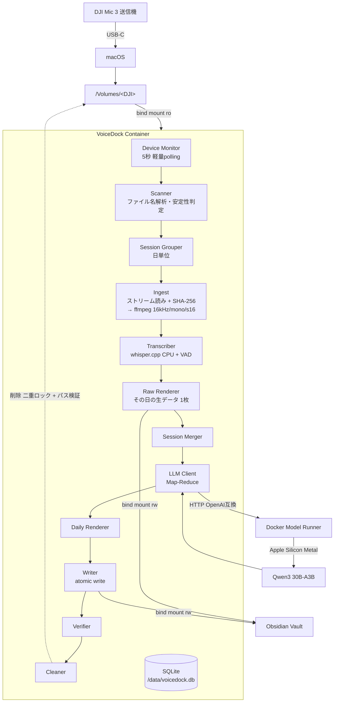
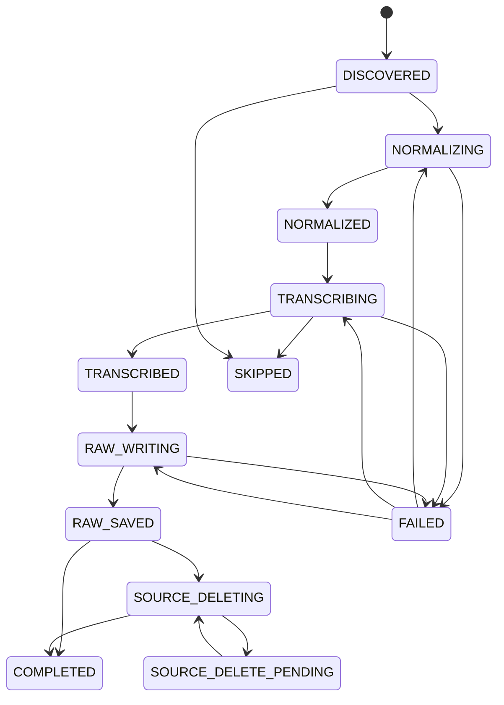
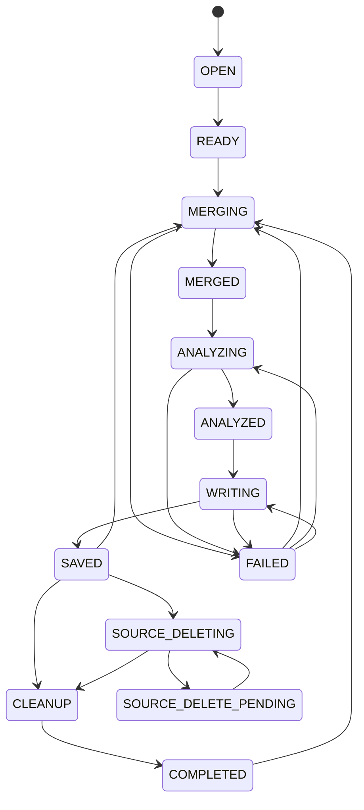

# VoiceDock 詳細仕様書 v3.2

**DJI Mic 3 × ローカル文字起こし × ローカルLLM × Obsidian**

| 項目 | 内容 |
|---|---|
| 文書版 | v3.2（実装着手可能版） |
| 前身文書 | v3.1 / v3.0（git 履歴）、`docs/archive/VoiceDock_Docker_Implementation_Spec_v2.0.md`（方針書） |
| 作成日 | 2026-09-11 |
| 対象環境 | macOS / Apple Silicon |
| 位置づけ | 本書が実装時の唯一の規範。v3.1 / v3.0 / v2.0 と矛盾する場合は本書を優先する |

---

## 目次

| 章 | 表題 |
|---|---|
| 1 | 目的・スコープ・非目標 |
| 2 | 用語定義 |
| 3 | 前提環境とホスト設定 |
| 4 | アーキテクチャ |
| 5 | DJI Mic 3 仕様 |
| 6 | リポジトリ構成 |
| 7 | 設定仕様 |
| 8 | データモデル |
| 9 | 状態機械 |
| 10 | 処理パイプライン詳細 |
| 11 | モジュール・インタフェース仕様 |
| 12 | LLM 仕様 |
| 13 | Obsidian 出力仕様 |
| 14 | 安全設計 |
| 15 | エラーコードとリトライ方針 |
| 16 | ログ仕様 |
| 17 | CLI 仕様 |
| 18 | Docker 構成 |
| 19 | Health Check と doctor |
| 20 | テスト仕様 |
| 21 | 開発フェーズと受け入れ条件 |
| 22 | 既知のリスクと未確定事項 |
| 23 | 将来拡張 |

---

## 1. 目的・スコープ・非目標

### 1.1 目的

DJI Mic 3 で録音した音声を Mac へ USB 接続するだけで、以下をバックグラウンドで全自動実行する。

```text
DJI Mic 3 で録音 → 帰宅 → Mac へ USB 接続 → （以降すべて自動）
```

ユーザーの操作は「録音する」「USB を挿す」「Obsidian を開く」の3つだけとする。

### 1.2 利用者から見た流れ

| # | 起きること | 目安 |
|---|---|---|
| 1 | USB 接続を検出する（5 秒間隔の監視） | 〜5 秒 |
| 2 | 未処理の録音を特定する（既処理はファイル名で即スキップ） | 即時 |
| 3 | 書き込み中でないことを確認する（安定性判定） | 通常 0 秒 |
| 4 | 同じ日の録音を 1 セッションにまとめる | 即時 |
| 5 | デバイスから直接 16 kHz へ変換する（原本はコピーしない） | 1 日分で 5〜10 分 |
| 6 | ローカル Whisper で日本語に文字起こしする（無音は VAD で飛ばす） | 発話量に比例 |
| 7 | **その日の Raw ノート（文字起こし生データ）を Vault へ書く** | 即時 |
| 8 | ローカル LLM が 1 日分を要約・分類する | 20〜30 分 |
| 9 | その日の Daily ノート（整理済み 1 枚）を Vault へ書く | 即時 |
| 10 | 保存内容を機械的に検証する | 即時 |
| 11 | 検証に成功した録音のみ DJI 本体から削除する（既定は無効） | — |

出力は 1 日あたり 2 枚のノートに集約される。

```text
Vault/Daily/Voice/Raw/20260829/2026-08-29 raw.md      ← 文字起こし生データ
Vault/Daily/Voice/Wiki/20260829/2026-08-29 Voice.md   ← 要約・タスク・Timeline
```

### 1.3 最優先方針

本システムは **AI 精度よりも記録を失わないこと** を優先する。

| 順位 | 項目 |
|---|---|
| 1 | 記録の保護（文字起こしが Vault に残らない限り音声を削除しない） |
| 2 | 毎日の継続性（1 件の失敗で全体を止めない） |
| 3 | 処理の再実行性（途中から再開できる） |
| 4 | 二重処理防止 |
| 5 | 自動化 |
| 6 | 文字起こし精度 |
| 7 | 要約精度 |

この優先順位は実装上の判断が割れたときの決定規則として用いる。

**「AI 精度より継続性」は本システムの運用規模に由来する。**利用者は毎日、起きている時間のほぼ全てを録音する（1 日 16 時間規模）。雑でもよいので毎日の記録が途切れずに残り、後から振り返れることを目的とする。

### 1.4 受容したリスク: 原本音声の完全削除

本仕様では、Obsidian への保存検証に成功した後、**DJI 側の WAV を削除する**。Mac 側にも音声のアーカイブを保持しない。処理後に残るのは文字起こしテキストと要約のみであり、**元の音声は復元できない**。

これは設計判断として受容する。代償として、以下の緩和策を必須とする。

- **文字起こし本文は、削除より前に必ず Vault へ保存され検証される**（§13.3 / §13.7 / §14.1）。LLM が恒久的に失敗しても、テキストは Docker の外に残る
- 削除は **第14章の論理式が真になった場合のみ** 実行する。例外経路を設けない
- 削除は **設定とファイルシステム権限の二重ロック** で守る（§14.2）。既定値は双方とも「削除不可」
- 削除対象のファイルは、削除直前にパス・サイズ・更新時刻で同定する（§14.1）
- 削除機能の有効化は Phase 7 まで行わない（§21）
- 「削除されないこと」を検証するテストを最重要テストとして独立させる（§20.4）

> 将来、Mac 側へのアーカイブ保管を追加する場合は §23 の拡張として Core Pipeline と分離して実装する。MVP には含めない。

### 1.5 スコープ

- DJI Mic 3 の送信機内蔵ストレージからの取り込み
- 日本語音声の文字起こし
- 要約・タスク・決定事項・アイデア・タグの抽出（項目は設定で変更可能）
- Obsidian Vault への Markdown 出力（Raw / Daily の 2 層）
- SQLite による状態管理・再開・二重処理防止
- 安全な自動削除
- CLI による運用

### 1.6 非目標（MVP では実装しない）

| 非目標 | 理由 |
|---|---|
| GUI / Menu Bar UI / Web UI | CLI と Obsidian で足りる |
| 話者識別 | Core Pipeline 安定後に分離実装（§23） |
| クラウド AI API | ローカル完結が要件 |
| リアルタイム文字起こし | 接続時バッチで足りる |
| 複数 Worker 並列処理 | 削除事故と CPU 競合の回避（§10.0） |
| 音声アーカイブ保管 | §1.4 の決定により対象外 |
| DJI Mic 3 以外の機器対応 | インタフェースは用意するが実装しない（§11.1） |
| 受信機（RX）側ストレージの取り込み | 未検証（§22） |

---

## 2. 用語定義

本書では以下の用語を厳密に使い分ける。

| 用語 | 定義 |
|---|---|
| **Device（デバイス）** | macOS にマウントされた DJI Mic 3 のストレージ 1 個。`/host-volumes/<volume名>` に対応 |
| **Part（パート）** | DJI Mic 3 が 30 分ごとに分割生成した録音 1 本の論理単位。`recordings` テーブルの 1 行に対応する |
| **Variant（バリアント）** | 同一パートのファイル実体。`orig`（原音）と `denoised`（ノイズ除去済み）の最大 2 個。1 パートは 1 個以上のバリアントを持つ |
| **Session（セッション）** | **同一デバイス・同一日付（`config.timezone`）の Part の集合。**Obsidian の Daily ノート 1 枚に 1 対 1 対応する。`sessions` テーブルの 1 行 |
| **Block（ブロック）** | セッション内で、`session.block_gap_seconds` を超える無録音区間で区切られた連続録音の塊。Timeline の見出し単位。DB には持たず、レンダリング時に算出する |
| **Transmitter（送信機）** | DJI Mic 3 の送信機。ファイル名の `TX01` などに対応。**ペアリングし直すと番号が変わるため恒久 ID として使用しない** |
| **Source（ソース）** | DJI デバイス上の元ファイル。読み取り専用が既定 |
| **Staging（ステージング）** | Docker named volume `/data/staging` 配下の作業領域。**16 kHz へ変換した音声のみを置く**（原本は置かない） |
| **Transcript（トランスクリプト）** | 文字起こし結果。永続化するのは Part 単位のみ（§10.8） |
| **Analysis（アナリシス）** | LLM が生成した構造化 JSON。Session 単位でのみ生成する |
| **Raw ノート** | その日の文字起こし生データ。LLM を通さない。Vault の `Daily/Voice/Raw/<YYYYMMDD>/` |
| **Daily ノート** | その日の整理済みノート。Vault の `Daily/Voice/Wiki/<YYYYMMDD>/` |

> **v3.0 からの重要な変更**: v3.0 の Session は「時間的に連続する Part の集合」だった。終日録音では 30 分分割が途切れず続くため 24 時間が 1 ノートに収まってしまい、振り返りに使えない。v3.1 では Session を「1 日分」と定義し直し、時間的な区切りは Block として表示にのみ使う。

---

## 3. 前提環境とホスト設定

### 3.1 検証済み実機環境

| 項目 | 実測値 | 要件 | 判定 |
|---|---|---|---|
| 機種 | Mac16,11 / Apple M4 Pro 14 core | Apple Silicon | ✅ |
| メモリ | 64 GB | 16 GB 以上（LLM 30B 級を使う場合 32 GB 以上） | ✅ |
| macOS | 26.6.2 (25G83) | — | ✅ |
| Docker Engine | 要再取得（§3.5） | — | ⚠️ |
| Docker Compose | 要再取得（§3.5） | **2.38 以上**（`models` 対応） | ⚠️ |
| Docker VM 割当 | 7 CPU / 24 GB / aarch64 | 4 CPU / 8 GB 以上 | ✅ |
| 仮想化バックエンド | **Apple Virtualization Framework** | **AVF 必須**（§3.2） | ✅ |
| Docker Model Runner | 無効 | 有効必須 | ⚠️ 要設定 |
| Docker Desktop AutoStart | `false` | 有効必須 | ⚠️ 要設定 |
| Obsidian Vault | `/Users/terada/Documents/Obsidian Vault` | 任意 | ⚠️ パスに空白を含む |
| 起動ディスク空き | 63 GB | 10 GB 以上（§7.3 の上限設計により常駐使用量は 200 MB 未満） | ✅ |

### 3.2 仮想化バックエンドの制約（必須）

**Docker Desktop の仮想化バックエンドは Apple Virtualization Framework でなければならない。Docker VMM へ切り替えてはならない。**

Docker VMM は `/Volumes` 配下の外付け USB ボリュームへの bind mount が次のエラーで失敗する既知の不具合を持つ（docker/for-mac#7480、本書作成時点で未解決）。

```text
bind source path does not exist: /host_mnt/<volume名>/<path>
```

ローカルディスク（`/Users/...`）の bind mount は Docker VMM でも動作するため、**Obsidian Vault は読み書きできるのに DJI Mic だけ見えない** という切り分けの難しい症状になる。

確認方法:

```bash
python3 -c "import json;print(json.load(open('$HOME/Library/Group Containers/group.com.docker/settings-store.json')).get('UseVirtualizationFramework'))"
# => True であること
```

GUI では **Settings → General → Virtual Machine Options → Apple Virtualization framework**。

`doctor` はこの値を検査し、`False` の場合は致命的エラーとして報告する（§19.2）。

### 3.3 ホストへインストールするもの

| インストールする | インストールしない |
|---|---|
| Docker Desktop | Python / pip / venv |
| Obsidian | FFmpeg |
| Git（任意） | whisper.cpp / llama.cpp |
| | SQLite ツール類 |
| | AI 用 Python パッケージ |

後者はすべて Docker コンテナ内に閉じ込める。

### 3.4 ホスト設定手順

初回のみ、以下をユーザーが実施する。`scripts/doctor.sh` は実施状況を検査するが、ホスト設定の変更自体は行わない。

**(1) Docker Model Runner を有効化する**

```bash
docker desktop enable model-runner
docker model status   # => "Docker Model Runner is running" になること
```

GUI では **Settings → AI → Enable Docker Model Runner**。

**(2) Docker Desktop のログイン時自動起動を有効化する**

VoiceDock は `launchd` を使わず、Docker Desktop の起動に相乗りして常駐する（§18.4）。

GUI で **Settings → General → Start Docker Desktop when you sign in to your computer** を有効化する。

```bash
python3 -c "import json;print(json.load(open('$HOME/Library/Group Containers/group.com.docker/settings-store.json')).get('AutoStart'))"
# => True であること
```

**(3) ファイル共有設定を確認する**

Docker Desktop for Mac は既定で `/Users` `/Volumes` `/private` `/tmp` `/var/folders` を共有する。既定のままでよい。`Mounts denied` が出た場合のみ **Settings → Resources → File sharing** を確認する。

**(4) Obsidian Vault のパスを確認する**

```bash
cat "$HOME/Library/Application Support/obsidian/obsidian.json"
```

得られたパスを `.env` の `OBSIDIAN_VAULT` に設定する。**パスに空白が含まれる場合でも `.env` では引用符を付けない**（Compose が値をそのまま解釈するため、引用符は文字列の一部になる）。

```dotenv
# 正しい
OBSIDIAN_VAULT=/Users/terada/Documents/Obsidian Vault

# 誤り（引用符がパスの一部になる）
OBSIDIAN_VAULT="/Users/terada/Documents/Obsidian Vault"
```

### 3.5 バージョン値の再取得（Phase 0 の作業項目）

§3.1 の Docker Engine / Compose のバージョンは、要件「Compose 2.38 以上」との比較を誤らせない形で実測し直して記載する。

```bash
docker version --format '{{.Server.Version}}'
docker compose version --short
```

---

## 4. アーキテクチャ

### 4.1 全体構成



### 4.2 コンポーネント責務

| コンポーネント | 配置 | 責務 |
|---|---|---|
| macOS | ホスト | DJI ストレージのマウント、`/Volumes` と Vault の提供、Docker Desktop 起動 |
| VoiceDock Container | Docker | 検出・変換・文字起こし・解析要求・Markdown 生成・検証・削除・状態管理 |
| Docker Model Runner | Docker Desktop | 要約 LLM のダウンロード・起動・推論。Apple Silicon では llama.cpp バックエンドで Metal を使用 |
| SQLite | named volume | 全状態の単一の真実。`/data/voicedock.db` |
| Obsidian | ホスト | Vault の閲覧のみ。VoiceDock は Obsidian の API / Plugin に一切依存しない |

### 4.3 計算資源の配分

macOS の Docker Desktop は Linux VM 上でコンテナを動かすため、**通常の Linux コンテナから Apple Metal GPU を直接利用しない**。したがって処理を次のように分担する。

| 処理 | 実行場所 | アクセラレーション |
|---|---|---|
| 文字起こし（whisper.cpp） | VoiceDock コンテナ内 | **CPU のみ**（ARM NEON / dotprod） |
| 要約（LLM） | Docker Model Runner | **Apple Silicon Metal**（ホスト側で動作） |

メモリ試算: LLM 約 18 GB（ホスト側）+ Docker VM 24 GB = 42 GB < 64 GB。

文字起こし速度が実用に満たない場合に限り、将来 Whisper 部分を Mac ネイティブ実行へ差し替える（§11.1 の `TranscriptionService` インタフェースで吸収する）。

### 4.4 データフロー（1 日分）

```text
[Device]  TX_MIC001_.../TX01_MIC002_20260829_071204.wav      ← Part 1 (denoised)
          TX_MIC001_.../TX01_MIC002_20260829_071204_orig.wav ← Part 1 (orig)
          TX_MIC001_.../TX01_MIC003_20260829_074210.wav      ← Part 2 (denoised)
          …（1 日 32 Part）
             │ scan（ffprobe で duration 取得・安定性判定）
             ▼
[DB]      recordings 行 × N（Part 単位） + sessions 行 × 1（その日）
             │ ストリーム読み（SHA-256 を算出）→ ffmpeg（原本はコピーしない）
             ▼
[Staging] /data/staging/<recording_id>/audio16k.wav        ← 30 分で約 58 MB
             │ whisper-cli（VAD 有効）
             ▼
[Data]    /data/transcripts/parts/<recording_id>.json
             │ その日の Raw ノートを再生成 → atomic write → verify
             ▼
[Vault]   Daily/Voice/Raw/20260829/2026-08-29 raw.md       ← ここでテキストが保全される
             │ 全 Part 終端到達 → 統合（メモリ上）→ LLM（Map-Reduce）
             ▼
[Data]    /data/analysis/<session_id>.json
             │ render → atomic write → verify
             ▼
[Vault]   Daily/Voice/Wiki/20260829/2026-08-29 Voice.md
             │ 検証成功 かつ 二重ロック解除 かつ パス同定成功のときのみ
             ▼
[Device]  Part 全 Variant を削除 → COMPLETED
```

---

## 5. DJI Mic 3 仕様

### 5.1 ストレージ構造

DJI Mic 3 の送信機は 32 GB の内蔵ストレージを持ち、外部ストレージには非対応。USB-C（送信機用マグネット充電ケーブル、または充電ケースのデータケーブル）で Mac へ接続する。

```text
/Volumes/<VOLUME_NAME>/
└── TX_MIC001_20260829_071201/                       ← 録音フォルダ
    ├── TX01_MIC002_20260829_071204.wav              ← ノイズ除去済み
    ├── TX01_MIC002_20260829_071204_orig.wav         ← 原音
    ├── TX01_MIC003_20260829_074210.wav
    └── ...
```

| 要素 | 規則 |
|---|---|
| フォルダ名 | `TX_MIC<NNN>_<YYYYMMDD>_<HHMMSS>`。`TX` は送信機内蔵録音であることを示す。**50 ファイルごとに新しいフォルダが作られる**。日時はフォルダ作成時刻 |
| ファイル名 | `TX<NN>_MIC<NNN>_<YYYYMMDD>_<HHMMSS>[_orig].wav` |
| `TX<NN>` | 送信機番号。受信機がペアリング順に付与する。**再ペアリングで変わる** |
| `MIC<NNN>` | 録音インデックス |
| `<YYYYMMDD>_<HHMMSS>` | **録音開始**日時（ローカル時刻） |
| `_orig` | 付いていれば原音。付いていなければノイズ除去済み |
| 分割 | **30 分ごとに自動で新しいファイルへ分割される** |
| 形式 | WAV（48 kHz / 24 bit または 32 bit float）。実測値は 192,000 B/秒（48 kHz / 32 bit float / モノラル） |

**容量の見積り（終日録音の前提）**

| 項目 | 値 |
|---|---|
| 1 時間あたり（1 Variant） | 約 691 MB |
| 1 時間あたり（両 Variant） | 約 1.38 GB |
| 本体 32 GB での録音可能時間 | 両 Variant で約 23 時間 |

**1 日 16 時間録音すると本体はほぼ 1 日で満杯になる。毎日接続する運用が前提となる**（§22 R-14）。

### 5.2 ファイル名パーサ

```python
RECORDING_FILENAME_RE = re.compile(
    r"^(?P<tx>TX\d{2})"
    r"_(?P<mic>MIC\d{3})"
    r"_(?P<date>\d{8})"
    r"_(?P<time>\d{6})"
    r"(?P<orig>_orig)?"
    r"\.(?P<ext>wav|WAV)$"
)

RECORDING_FOLDER_RE = re.compile(
    r"^TX_(?P<mic>MIC\d{3})_(?P<date>\d{8})_(?P<time>\d{6})$"
)
```

| フィールド | 型 | 説明 |
|---|---|---|
| `transmitter_id` | `str` | `TX01` など。**弱い識別子**。恒久 ID として使わない |
| `mic_index` | `int` | `MIC002` → `2` |
| `started_at` | `datetime` | 録音開始時刻。タイムゾーンは `config.timezone`（既定 `Asia/Tokyo`）を付与 |
| `variant` | `Literal["orig", "denoised"]` | `_orig` の有無 |

パースに失敗したファイルは **無視する**（`WARN unparsable_filename` をログ出力し、DB へ登録しない）。DJI 以外のファイルを誤って処理しないための防御である。**このパターンは削除時の同定にも使う**（§14.1）。

### 5.3 Part キーと Variant のペアリング

同一 Part の 2 バリアントは、`_orig` を除いたファイル名が一致することで対応づける。

```python
part_key = (transmitter_id, mic_index, started_at)
```

| 状態 | 扱い |
|---|---|
| `denoised` と `orig` の両方が存在 | 1 Part・2 Variant。**文字起こしには `denoised` を使う**（§7.2 `audio.transcribe_variant`） |
| `denoised` のみ | 1 Part・1 Variant。`denoised` を使う |
| `orig` のみ | 1 Part・1 Variant。`orig` を使う |

**読み込むのは `primary_variant` だけである。**もう一方の Variant は一度も読まない（§10.5）。ただし **削除は Part 単位で全 Variant をまとめて行う**（§10.12）。

### 5.4 デバイス判定

Volume 名を固定しない。`/host-volumes` 直下の各エントリについて以下を評価し、**すべて**を満たす場合に DJI デバイスと判定する。

1. ディレクトリであり、読み取り可能である
2. `RECORDING_FOLDER_RE` に一致するサブディレクトリが 1 個以上存在する、**または** `RECORDING_FILENAME_RE` に一致する `.wav` が 1 個以上存在する
3. `config.device.exclude_volumes` のいずれのパターンにも一致しない

**除外パターンは `fnmatch` による glob として評価する（正規表現ではない）。**既定値は §7.2 と同一でなければならない。

```python
excluded = any(fnmatch.fnmatch(name, pat) for pat in cfg.device.exclude_volumes)
```

> `.*` を正規表現として解釈すると全 Volume 名に一致し、DJI が 1 台も検出されないまま無言で停止する。この症状は P0-6（ホットプラグ伝播の失敗）と区別がつかないため、`doctor` は除外された Volume 名を必ず列挙する（§19.2 D-5）。

判定は再帰探索の深さを `config.device.max_scan_depth`（既定 `3`）に制限する。

デバイス識別子 `device_id` は Volume 名とする。Volume 名は変わりうるため、**二重処理防止にも削除対象の同定にも単独では使わない**（§14.1）。

### 5.5 Phase 0 PoC チェックリスト（ハードゲート）

**以下がすべて確認されるまで、削除機能を有効化してはならない。**

| # | 確認項目 | 判定 | 失敗時の影響 |
|---|---|---|---|
| P0-1 | 送信機を USB 接続すると `/Volumes/<名前>` に現れる | 必須 | §5.6 の代替アーキテクチャへ切替 |
| P0-2 | Volume 名を記録する（複数送信機なら全部） | 必須 | — |
| P0-3 | フォルダ・ファイル名が §5.1 の規則と一致する | 必須 | パーサ修正 |
| P0-4 | `_orig` と非 `_orig` の両方が実際に生成されるか | 必須 | §5.3 の分岐調整 |
| P0-5 | ホストから WAV を読み取れる | 必須 | — |
| P0-6 | **コンテナ起動後にデバイスを接続して `/host-volumes` に現れる**（ホットプラグ伝播） | **最重要** | §5.6 の代替へ切替 |
| P0-7 | コンテナから WAV を読み取れる | 必須 | File sharing 設定 |
| P0-8 | コンテナから WAV を削除できる（`rw` マウント時、使い捨てファイルで検証） | Phase 7 前に必須 | 自動削除を諦める |
| P0-9 | コンテナ内でのファイル所有者・パーミッション（non-root で読めるか） | 必須 | §18.3 の uid 調整 |
| P0-10 | 送信機 2 台の場合の見え方（Volume 2 個か、1 個に統合か） | 必須 | Scanner の走査範囲調整 |
| P0-11 | 録音中／書き込み中ファイルの見え方（§10.3 の安定性判定が機能するか） | 必須 | 待機時間調整 |
| P0-12 | 受信機（RX）側にもストレージが見えるか | 任意 | §22 へ記録 |
| P0-13 | **DJI 側で原音（`_orig`）保存をオフにできるか** | 必須 | オフにできれば録音可能時間が倍になり、1 日 1 回の接続で回せる（§22 R-14） |
| P0-14 | **バッテリー交換・充電で録音が中断したときのファイルの分かれ方** | 必須 | Block 判定（§13.4）の実挙動確認 |
| P0-15 | **1 日分（64 ファイル）を置いた状態での走査時間の実測** | 必須 | §10.2 / §10.3 のパラメータ調整 |

P0-6 の検証手順:

```bash
# 1. デバイス未接続の状態でコンテナを起動
docker compose up -d
docker compose exec voicedock ls -la /host-volumes

# 2. この状態で DJI Mic 3 を USB 接続する

# 3. コンテナを再起動せずに再確認
docker compose exec voicedock ls -la /host-volumes
# => 新しい Volume が現れれば PASS
```

### 5.6 代替アーキテクチャ（P0-1 または P0-6 が失敗した場合のみ）

| 失敗ケース | 代替 |
|---|---|
| P0-1 失敗（通常の Volume として公開されない） | `/Volumes` 監視方式は成立しない。Mac 側に最小限の「取り込み Helper」を置き、Helper がホスト共有ディレクトリへコピーし、コンテナはそのディレクトリだけを監視する構成へ切り替える |
| P0-6 失敗（ホットプラグが伝播しない） | 案 A: ホスト側 `launchd` の `StartOnMount` で接続を検知し `docker compose restart voicedock` を実行する。案 B: Volume パスを `.env` で固定し、個別パスを bind mount する。**案 A を第一候補とする** |

いずれの代替も MVP の範囲外であり、発生した時点で別途設計する。

---

## 6. リポジトリ構成

**サブパッケージを作らない。**モジュールは `src/voicedock/` 直下にフラットに置き、**章（§）とモジュールがほぼ 1 対 1 に対応する**粒度を保つ。

```text
voicedock/
├── compose.yaml
├── Dockerfile                      # multi-stage（§18.3）
├── Makefile                        # up / down / logs / status / test / doctor（§17.4）
├── pyproject.toml
├── uv.lock                         # 依存の lock（§18.5）
├── requirements.lock               # uv export で生成。Docker build が使う（§18.3）
├── .env.example
├── .gitignore
├── README.md
│
├── docs/
│   ├── SPEC.md                     # 本書
│   └── archive/
│       └── VoiceDock_Docker_Implementation_Spec_v2.0.md
│
├── src/
│   └── voicedock/
│       ├── __init__.py
│       ├── main.py                 # エントリポイント / CLI ディスパッチ / worker ループ（§10.0）
│       ├── config.py               # 設定読み込み・検証（§7）
│       ├── log.py                  # 構造化ログ（§16）
│       ├── errors.py               # エラーコード定義（§15）
│       ├── db.py                   # 接続・行データクラス・クエリ・マイグレーション（§8）
│       ├── paths.py                # DevicePath / StagingPath / VaultPath
│       │                           #   + safe_unlink_staging / safe_unlink_tmp（§11.2, §14.4 N-10）
│       ├── device.py               # 検出・ファイル名パース・安定性判定・Part 列挙
│       │                           #   + 削除対象の解決（§5, §10.1-10.3）。削除は行わない
│       ├── audio.py                # ffprobe + ffmpeg 変換 + SHA-256（§10.5）
│       ├── transcribe.py           # whisper-cli 実行（VAD 含む）（§10.6）
│       ├── llm.py                  # クライアント・動的スキーマ生成・Map-Reduce 分割
│       │                           #   ・プロンプト生成（§12）
│       ├── notes.py                # Raw / Daily レンダリング・WikiLink・sanitize
│       │                           #   ・atomic write・保存検証（§13）
│       ├── session.py              # セッション分組（日単位）・統合・Block 算出（§10.4, §10.8）
│       ├── states.py               # 状態定義・遷移表（§9）
│       ├── pipeline.py             # ensure_* の直列実行・backoff / 自動再試行（§10, §15.2）
│       ├── cleaner.py              # デバイス上のファイル削除のみ（§10.12, §14）
│       ├── cli.py                  # status / history / show / retry / pending
│       │                           #   / cleanup / scan / health / version（§17.1）
│       └── doctor.py               # 環境診断（§19.2）
│
├── config/
│   └── config.example.yaml
│
├── prompts/
│   ├── analyze_ja.txt              # 単一パス解析プロンプト（テンプレート）
│   ├── map_ja.txt                  # Map 段階プロンプト（テンプレート）
│   ├── reduce_ja.txt               # Reduce 段階プロンプト（テンプレート）
│   └── repair_json.txt             # JSON 修復プロンプト
│
├── scripts/
│   ├── doctor.sh                   # 初回セットアップ検査と環境診断を兼ねる（§17.4, §19.2, §21.1）
│   └── fetch-models.sh             # Whisper モデル + Silero VAD モデル（§18.6）
│
└── tests/
    ├── unit/
    ├── integration/
    └── fixtures/
        ├── fake_volumes/           # ← tmp_path へコピーして使う（§20.2）
        │   └── DJI_MIC/
        │       └── TX_MIC001_20260829_071201/
        │           ├── TX01_MIC002_20260829_071204.wav
        │           └── TX01_MIC002_20260829_071204_orig.wav
        ├── transcripts/
        └── llm_responses/
```

| 判断 | 理由 |
|---|---|
| サブパッケージを作らない | 各モジュールが 30〜80 行では、ディレクトリ階層が読解コストにしかならない |
| `config/` はディレクトリのまま | compose が `./config:/app/config:ro` で**ディレクトリを** bind mount する。単一ファイルの bind mount はエディタの保存（inode 差し替え）でコンテナ側が追随しなくなる |
| `cleaner.py` を独立させる | §14.4 N-10 が「デバイス上の削除はこのモジュールのみ」と規定している。ファイルとして分かれていること自体が規約の実体 |
| `states.py` を独立させる | §9 の状態定義と遷移表はデータであり、`pipeline.py` の制御フローとは変更理由が異なる |
| `notes.py` / `llm.py` が大きくなる | 400〜600 行を見込む。**実装中に 500 行を超えたら、そのとき初めて分割する**（先に分けない） |

---

## 7. 設定仕様

設定は 2 系統に分ける。**この境界を越えない。**

| 系統 | ファイル | 内容 | Git 管理 |
|---|---|---|---|
| ホスト固有・環境依存 | `.env` | Vault の絶対パス、マウントモード、タイムゾーン | **しない** |
| アプリ挙動のすべて | `config/config.yaml` | 保存先、ファイル名、要約項目、しきい値、モデル | **しない**（`config.example.yaml` のみ管理） |

- `config/config.yaml` は `./config:/app/config:ro` で bind mount されるため、**ホスト側でテキスト編集してコンテナを再起動するだけで反映される**
- **環境変数による個別キーの上書き機構は提供しない。**設定の出所が二重になり、どちらが効いているか追えなくなるため

### 7.1 `.env`

`.env.example`:

```dotenv
# Obsidian Vault の絶対パス。引用符を付けないこと（§3.4）
OBSIDIAN_VAULT=/Users/USERNAME/Documents/Obsidian Vault

# DJI ストレージのマウントモード。ro | rw
# 既定は必ず ro。実機試験完了後にのみ rw へ変更する（§14.2）
DJI_MOUNT_MODE=ro

# タイムゾーン
TZ=Asia/Tokyo
```

`DJI_MOUNT_MODE` を `rw` に変更した場合、`docker compose up -d` でコンテナの再生成が必要（bind mount のモードは再生成しないと変わらない）。

### 7.2 `config/config.yaml` 全キー

```yaml
# ============================================================
# VoiceDock 設定
# ============================================================

timezone: Asia/Tokyo

# --- デバイス検出 -------------------------------------------
device:
  root: /host-volumes            # コンテナ内の監視ルート
  poll_interval_seconds: 5       # 軽量チェック（Volume の増減のみ）の間隔
  deep_scan_interval_seconds: 600  # 既知デバイスを深く走査する最小間隔
  rescan_on_mount_change: true   # 新しい Volume を見つけたら即座に深い走査
  skip_unchanged_dirs: true      # ディレクトリ mtime が前回と同じなら中へ入らない
  max_scan_depth: 3              # 再帰探索の深さ上限
  exclude_volumes:               # 除外する Volume 名（fnmatch の glob。正規表現ではない）
    - "Macintosh HD"
    - "com.apple.TimeMachine.*"
    - ".*"
  # ファイル安定性判定（§10.3）
  stability_checks: 2            # size+mtime の一致を要求する連続回数
  stability_interval_seconds: 3  # 判定間の待機秒数
  stability_fast_path_seconds: 60  # mtime がこの秒数以上前なら待たずに安定と判定

# --- 音声 ---------------------------------------------------
audio:
  # 読み込む Variant。denoised | orig（もう一方は一度も読まない）
  transcribe_variant: denoised
  ffmpeg: /usr/bin/ffmpeg
  ffprobe: /usr/bin/ffprobe
  # whisper.cpp の入力要件。変更不可（§10.5）
  target_sample_rate: 16000
  target_channels: 1
  target_codec: pcm_s16le
  ffprobe_timeout_seconds: 30
  ffmpeg_timeout_factor: 0.5     # duration × この値
  ffmpeg_min_timeout_seconds: 180
  duration_tolerance_seconds: 1.0  # 変換結果の長さの許容誤差（§10.5）

# --- 取り込み -----------------------------------------------
import:
  staging_root: /data/staging
  # 空き容量の必要量: 変換後の見込みサイズ × multiplier + margin（§10.5）
  free_space_multiplier: 2.0
  free_space_margin_bytes: 2147483648      # 2 GiB
  # staging 全体の上限。原本を置かないため異常時の歯止めとしてのみ機能する
  staging_max_bytes: 5368709120            # 5 GiB
  hash_chunk_bytes: 1048576                # 1 MiB

# --- セッション分組（§10.4） ---------------------------------
session:
  group_by: day                  # MVP は day のみ（同一デバイス・同一日付）
  # Timeline の見出しを区切る無録音区間（分組には使わない）
  block_gap_seconds: 3600
  # 当日の OPEN セッションを READY にするまでの無追加時間
  idle_close_seconds: 1800
  # SAVED 後に同じ日の Part が現れたら再生成する
  allow_reopen: true
  # 暴走防止の上限（日境界で切れるため通常は到達しない）
  max_parts: 64
  max_duration_seconds: 86400

# --- 文字起こし ---------------------------------------------
transcription:
  engine: whisper_cpp
  executable: /usr/local/bin/whisper-cli
  model: /models/whisper/ggml-large-v3-turbo-q5_0.bin
  language: ja
  threads: 6                     # 0 で自動（nproc と 8 の小さい方）
  # タイムアウト = clamp(duration × factor, min, max)
  timeout_factor: 3.0
  min_timeout_seconds: 600
  max_timeout_seconds: 21600
  # 文字起こし結果がこの文字数未満なら NO_SPEECH_DETECTED とする
  min_chars: 1
  # 無音区間の自動スキップ（§10.6）
  vad:
    enabled: true
    model: /models/whisper/ggml-silero-v5.1.2.bin
    threshold: 0.5
    min_speech_duration_ms: 250
    min_silence_duration_ms: 1000
    speech_pad_ms: 200

# --- LLM ----------------------------------------------------
llm:
  # URL とモデル名は Compose の models 機能が環境変数で注入する（§18.2）
  endpoint_env: VOICEDOCK_LLM_URL
  model_env: VOICEDOCK_LLM_MODEL
  temperature: 0.1
  top_p: 0.9
  max_output_tokens: 4096
  request_timeout_seconds: 1800
  # Map-Reduce しきい値（§12.4）
  max_chars_per_request: 20000
  max_seconds_per_request: 3600  # 1 チャンクが覆う実時間の上限
  chunk_overlap_chars: 500
  # JSON 検証失敗時の修復試行回数
  repair_attempts: 1
  prompts:
    analyze: /app/prompts/analyze_ja.txt
    map: /app/prompts/map_ja.txt
    reduce: /app/prompts/reduce_ja.txt
    repair: /app/prompts/repair_json.txt
  # 抽出する項目。プロンプトと出力スキーマはここから自動生成する（§12.2）
  analysis:
    sections:
      summary:    {enabled: true, heading: "## Summary"}
      timeline:   {enabled: true, heading: "## Timeline"}
      key_points: {enabled: true, heading: "## Key Points", max_items: 20}
      tasks:      {enabled: true, heading: "## Tasks",      max_items: 50}
      decisions:  {enabled: true, heading: "## Decisions",  max_items: 30}
      ideas:      {enabled: true, heading: "## Ideas",      max_items: 30}
      tags:       {enabled: true, max_items: 15}
    order: [summary, timeline, key_points, tasks, decisions, ideas]
    # プロンプト末尾へ追記する自由記述（例: 特定の話題を要約しない指示）
    custom_instructions: ""

# --- Obsidian -----------------------------------------------
obsidian:
  root: /obsidian
  max_title_bytes: 180           # UTF-8 バイト数（§13.5）
  default_tags:
    - voice
    - voicedock
  # 文字起こし生データ
  raw:
    folder_template: "Daily/Voice/Raw/{yyyymmdd}"
    granularity: day             # day | part
    filename_template: "{date} raw"
    timestamp_interval_seconds: 300   # 0 で見出しを入れない
    part_boundary_heading: true
  # 整理済みノート
  wiki:
    folder_template: "Daily/Voice/Wiki/{yyyymmdd}"
    filename_template: "{date} Voice"   # {title} を入れてはならない（§13.5）
    include_transcript: false    # true にすると全文も埋め込む
    timeline: true
    link_raw: true
    link_daily_note: true
    link_adjacent_days: true
    link_tags: true              # false なら Vault インデックスを作らない
    link_only_existing: true     # Vault に実在するノートだけ [[]] 化
    vault_index_cache_seconds: 300
    max_links: 20

# --- 削除（§14） --------------------------------------------
cleanup:
  # 【安全ロック 1】DJI 側の元音声を削除するか。既定 false
  delete_source_audio: false
  # 【安全ロック 2 は .env の DJI_MOUNT_MODE=ro】
  # 文字起こし後に 16 kHz 音声を削除するか（容量節約）
  delete_normalized_after_transcribe: true
  # Part transcript JSON の保持日数。再生成に必要なため 0（無期限）固定
  retain_transcript_days: 0
  # 削除条件が偽だったときの再評価間隔（§9.3）
  delete_evaluation_backoff_seconds: [60, 300, 900, 3600]

# --- リトライ（§15.2） ---------------------------------------
retry:
  max_attempts: 3
  backoff_seconds: [3, 10, 30]
  # FAILED を自動で再投入するまでの時間。0 で無効（手動 retry のみ）
  auto_retry_failed_after_hours: 24
  auto_retry_max_rounds: 3

# --- ログ（§16） --------------------------------------------
logging:
  level: INFO                    # DEBUG | INFO | WARNING | ERROR
  format: text                   # text | json
  # true にすると transcript 本文を DEBUG ログへ出す。本番では必ず false
  unsafe_log_content: false

# --- データベース -------------------------------------------
database:
  path: /data/voicedock.db
  busy_timeout_ms: 10000
```

### 7.3 設定バリデーション規則

`config.py` は起動時に以下を検証し、1 つでも違反があれば **起動を中止**して終了コード `2` を返す。

| # | 規則 | 違反時のエラー |
|---|---|---|
| V-1 | 未知のキーが存在しない（タイポ検出のため strict に扱う） | `CONFIG_UNKNOWN_KEY` |
| V-2 | `audio.transcribe_variant` が `denoised` / `orig` のいずれか | `CONFIG_INVALID_VALUE` |
| V-3 | `audio.target_sample_rate == 16000` かつ `target_channels == 1` かつ `target_codec == pcm_s16le` | `CONFIG_INVALID_VALUE`（whisper.cpp の入力要件、変更不可） |
| V-4 | `device.poll_interval_seconds >= 1` | `CONFIG_INVALID_VALUE` |
| V-5 | `device.stability_checks >= 1` | `CONFIG_INVALID_VALUE` |
| V-6 | `device.deep_scan_interval_seconds >= device.poll_interval_seconds` | `CONFIG_INVALID_VALUE` |
| V-7 | `session.group_by == "day"` | `CONFIG_INVALID_VALUE`（MVP は day のみ） |
| V-8 | `session.block_gap_seconds >= 0` | `CONFIG_INVALID_VALUE` |
| V-9 | `retry.backoff_seconds` の要素数 >= `retry.max_attempts` | `CONFIG_INVALID_VALUE` |
| V-10 | `llm.max_chars_per_request > llm.chunk_overlap_chars * 2` | `CONFIG_INVALID_VALUE` |
| V-11 | `obsidian.raw.folder_template` と `obsidian.wiki.folder_template` が相対パスで `..` を含まない | `CONFIG_INVALID_VALUE` |
| V-12 | 上記 2 つの `folder_template` が同一でない | `CONFIG_INVALID_VALUE` |
| V-13 | テンプレートの未知プレースホルダが無い（許可: `{yyyymmdd}` `{date}` `{time}` `{part}`） | `CONFIG_INVALID_VALUE` |
| V-14 | `obsidian.wiki.filename_template` に `{title}` を含まない（再生成のたびに増殖するため） | `CONFIG_INVALID_VALUE` |
| V-15 | `obsidian.raw.granularity` が `day` / `part` のいずれか | `CONFIG_INVALID_VALUE` |
| V-16 | `obsidian.max_title_bytes` が 1〜255 | `CONFIG_INVALID_VALUE` |
| V-17 | `llm.analysis.order` の要素が `sections` のキー集合の部分集合であり、重複が無い | `CONFIG_INVALID_VALUE` |
| V-18 | `llm.analysis.sections.summary.enabled == true` | `CONFIG_INVALID_VALUE`（要約の中核。無効化不可） |
| V-19 | 各 `heading` が `#` で始まる 1 行 | `CONFIG_INVALID_VALUE` |
| V-20 | `llm.prompts.*` の 4 ファイルがすべて存在する | `CONFIG_INVALID_VALUE` |
| V-21 | `cleanup.retain_transcript_days == 0` | `CONFIG_INVALID_VALUE`（Raw / Daily の再生成に Part transcript が必要） |
| V-22 | `import.staging_max_bytes > import.free_space_margin_bytes` | `CONFIG_INVALID_VALUE` |
| V-23 | `transcription.model` のファイルが存在する | `WHISPER_MODEL_MISSING` |
| V-24 | `transcription.executable` が存在し実行可能 | `WHISPER_EXEC_MISSING` |
| V-25 | `transcription.vad.enabled == true` なら `vad.model` が存在する | `WHISPER_MODEL_MISSING` |
| V-26 | `cleanup.delete_source_audio == true` の場合、起動ログに警告を出す | 警告のみ（§14.3） |

---

## 8. データモデル

### 8.1 方針

- SQLite（Python 標準ライブラリ `sqlite3`）を使用する
- 保存先は Docker named volume 上の `/data/voicedock.db`
- **SQLite が全状態の単一の真実**。ファイルの有無は補助的な確認材料に過ぎない
- 接続時に必ず以下を設定する

```sql
PRAGMA journal_mode = WAL;
PRAGMA foreign_keys = ON;
PRAGMA busy_timeout = 10000;
PRAGMA synchronous = FULL;   -- 削除判断の根拠になるため耐久性を優先する
```

`synchronous = FULL` は性能を犠牲にするが、1 日数百トランザクションの規模では体感差が無く、電源断で状態を失って「保存済みなのに未保存と誤認」あるいは逆の事故を起こすほうが高くつく。

### 8.2 `recordings`（Part）

```sql
CREATE TABLE recordings (
    id                    INTEGER PRIMARY KEY AUTOINCREMENT,

    -- 由来
    device_id             TEXT    NOT NULL,   -- Volume 名（不安定。参考情報）
    source_folder         TEXT    NOT NULL,   -- TX_MIC001_20260829_071201
    transmitter_id        TEXT    NOT NULL,   -- TX01（不安定。恒久 ID にしない）
    mic_index             INTEGER NOT NULL,   -- MIC002 -> 2
    started_at            TEXT    NOT NULL,   -- ISO8601 +09:00。ファイル名由来
    duration_seconds      REAL,               -- ffprobe 由来。失敗時は NULL のまま続行
    ended_at              TEXT,               -- started_at + duration_seconds

    -- Variant（最大 2）。削除時の同定に使う（§14.1）
    source_path_denoised  TEXT,
    source_path_orig      TEXT,
    source_size_denoised  INTEGER,
    source_size_orig      INTEGER,
    source_mtime_denoised REAL,
    source_mtime_orig     REAL,
    -- 読み込むのは primary_variant のみ。もう一方の sha256 は NULL のまま
    sha256_denoised       TEXT,
    sha256_orig           TEXT,

    primary_variant       TEXT,               -- 'denoised' | 'orig'

    -- 作業成果物
    staging_dir           TEXT,
    normalized_path       TEXT,               -- /data/staging/<id>/audio16k.wav
    transcript_path       TEXT,               -- /data/transcripts/parts/<id>.json

    -- 所属
    session_id            INTEGER REFERENCES sessions(id) ON DELETE SET NULL,

    -- 状態（§9.1）
    status                TEXT    NOT NULL,
    retry_count           INTEGER NOT NULL DEFAULT 0,   -- 現在の工程での連続失敗回数
    auto_retry_rounds     INTEGER NOT NULL DEFAULT 0,   -- 自動再試行の実施回数
    error_code            TEXT,
    error_message         TEXT,

    -- タイムスタンプ
    source_deleted_at     TEXT,               -- 不可逆操作の記録（§14）
    updated_at            TEXT    NOT NULL    -- 状態が変わるたびに更新する
);

-- 論理的な同一 Part の二重登録を防ぐ（ファイル名由来の自然キー）
CREATE UNIQUE INDEX idx_recordings_partkey
    ON recordings (transmitter_id, mic_index, started_at, source_folder);

-- 内容同一性による二重処理防止。NULL は重複可なので未ハッシュ行は衝突しない
CREATE UNIQUE INDEX idx_recordings_sha_denoised
    ON recordings (sha256_denoised) WHERE sha256_denoised IS NOT NULL;
CREATE UNIQUE INDEX idx_recordings_sha_orig
    ON recordings (sha256_orig)     WHERE sha256_orig     IS NOT NULL;

CREATE INDEX idx_recordings_status   ON recordings (status);
CREATE INDEX idx_recordings_session  ON recordings (session_id);
CREATE INDEX idx_recordings_started  ON recordings (started_at);
```

**設計意図:**

- `idx_recordings_partkey` が高速な事前判定。走査のたびに SHA-256 を計算しない（USB 越しの全読み込みを避ける）
- `sha256_*` の部分 UNIQUE インデックスが二重処理の最終防壁。ハッシュは §10.5 の変換時にストリームで算出するため、追加の読み込みコストはゼロ
- `source_size_*` と `source_mtime_*` は削除直前の同定に使う（§14.1）。**記録した値と一致しないファイルは削除しない**
- **工程ごとの監査タイムスタンプ列は持たない。**§14.1 の削除条件（ノートの実体と ID で判定）も §9.4 の再開規則（パスと sha256 で判定）もこれらを 1 つも参照しない。工程別の所要時間は §16.2 のログ（`elapsed_s` / `rtf` / `speech_ratio`）で追える。**`FAILED` からの経過時間（§15.2 の自動再試行）は `updated_at` を基準にする**

### 8.3 `sessions`（1 デバイス・1 日）

```sql
CREATE TABLE sessions (
    id                  INTEGER PRIMARY KEY AUTOINCREMENT,
    session_key         TEXT    NOT NULL UNIQUE,   -- "<device_id>:<YYYYMMDD>"
    day_date            TEXT    NOT NULL,          -- 'YYYY-MM-DD'（config.timezone）
    device_id           TEXT    NOT NULL,

    started_at          TEXT,           -- その日の最初の Part の開始時刻
    ended_at            TEXT,
    recorded_seconds    REAL,           -- 実録音時間の合計
    part_count          INTEGER NOT NULL DEFAULT 0,
    failed_part_count   INTEGER NOT NULL DEFAULT 0,

    title               TEXT,           -- LLM 生成。ファイル名には使わない
    analysis_path       TEXT,           -- /data/analysis/<session_id>.json

    -- Raw ノート（文字起こし生データ）
    raw_output_path     TEXT,           -- Vault 内の相対パス
    raw_output_sha256   TEXT,

    -- Daily ノート（整理済み）
    output_path         TEXT,           -- Vault 内の相対パス
    output_sha256       TEXT,

    status              TEXT    NOT NULL,
    retry_count         INTEGER NOT NULL DEFAULT 0,
    auto_retry_rounds   INTEGER NOT NULL DEFAULT 0,
    regenerated_count   INTEGER NOT NULL DEFAULT 0,
    delete_attempts     INTEGER NOT NULL DEFAULT 0,   -- 削除評価のバックオフ段数
    error_code          TEXT,
    error_message       TEXT,

    source_deleted_at   TEXT,                 -- 不可逆操作の記録（§14）
    updated_at          TEXT    NOT NULL      -- 状態が変わるたびに更新する
);

CREATE INDEX idx_sessions_status ON sessions (status);
CREATE INDEX idx_sessions_day    ON sessions (day_date);
```

`session_key` の生成規則:

```python
session_key = f"{device_id}:{started_at.astimezone(cfg.tz):%Y%m%d}"
```

UNIQUE 制約が「1 デバイス・1 日 = 1 行」を保証し、再接続時に同じ日のノートが二重生成されることを構造的に防ぐ。

> セッション統合済み transcript は永続化しない（§10.8）。必要なときに Part transcript から組み立て直す。

### 8.4 `events`（監査ログ）

削除という不可逆操作を行うため、状態遷移の履歴を DB にも残す。

```sql
CREATE TABLE events (
    id            INTEGER PRIMARY KEY AUTOINCREMENT,
    entity_type   TEXT NOT NULL,      -- 'recording' | 'session'
    entity_id     INTEGER NOT NULL,
    from_status   TEXT,
    to_status     TEXT NOT NULL,
    error_code    TEXT,
    detail        TEXT,               -- 音声内容・本文は決して入れない（§16.3）
    created_at    TEXT NOT NULL
);

CREATE INDEX idx_events_entity ON events (entity_type, entity_id, id);
```

- すべての状態遷移は `events` への INSERT と **同一トランザクション** で行う
- **`events` は削除も圧縮もしない。**1 日約 260 行、年間約 9.5 万行で SQLite には十分小さい
- 工程ごとの累積失敗回数は `events` から復元できるため、`recordings` 側に列を増やさない

### 8.5 マイグレーション

```sql
CREATE TABLE schema_version (
    version    INTEGER NOT NULL,
    applied_at TEXT    NOT NULL
);
```

- `db.py` のマイグレーション関数が `version` 昇順の SQL を順次適用する
- 起動時に自動適用する
- **破壊的変更（列削除・テーブル削除）は禁止**。追加のみとし、**スキーマ変更は `ALTER TABLE ADD COLUMN` に限る**

> §14.1 の削除条件は `part.id in frontmatter_ids(session.raw_output_path)` で **`recordings.id` の同一性に削除可否を賭けている**。SQLite 定番の「新テーブル作成 → INSERT SELECT → RENAME」形式でスキーマを変えると AUTOINCREMENT が振り直され、**ノートに載っている ID 42 と DB の ID 42 が別の Part を指しうる**。これは §20.4 の ND-01〜ND-23 がどれも検出できない削除事故経路であるため、テーブルの作り直しを伴う変更を禁止する。
- 適用前に DB をバックアップする。**WAL モードのため単純なファイルコピーは禁止する**（`-wal` の未チェックポイント分が失われ、「保存済みなのに未保存」と誤認する事故をバックアップ手順自体が作る）

```python
with sqlite3.connect(backup_path) as dst:
    src.backup(dst)          # または VACUUM INTO
```

---

## 9. 状態機械

**Part と Session の 2 階層**に分離する。

- **Part**: 検出 → 変換 → 文字起こし → Raw ノート保存 まで
- **Session（= その日）**: 統合 → LLM → Daily ノート生成 → 検証 → 削除 まで

### 9.1 Part 状態



| 状態 | 意味 | 元音声削除可否 | 終端 |
|---|---|---|---|
| `DISCOVERED` | 検出・DB 登録済み。安定性判定通過済み | 不可 | — |
| `NORMALIZING` | デバイスから読みながら 16 kHz へ変換中 | 不可 | — |
| `NORMALIZED` | 16kHz/mono/s16 の音声を生成し検証済み | 不可 | — |
| `TRANSCRIBING` | whisper.cpp 実行中 | 不可 | — |
| `TRANSCRIBED` | Part transcript が確定 | 不可 | — |
| `RAW_WRITING` | その日の Raw ノートを生成・検証中 | 不可 | — |
| `RAW_SAVED` | **文字起こし本文が Vault に保存され検証された。ここで元音声への依存が切れる** | Session が SAVED なら可 | ✅ |
| `SOURCE_DELETING` | DJI 側ファイル削除中 | — | ✅ |
| `SOURCE_DELETE_PENDING` | 削除すべきだがデバイス未接続 / 同定失敗 / 削除失敗。次回接続時に再試行 | — | ✅ |
| `COMPLETED` | 当該 Part の処理をすべて終えた | 可（§14.1 が真なら） | ✅ |
| `FAILED` | 失敗。自動再試行（§15.2）または手動 `retry` で復帰可能 | 不可 | ✅ |
| `SKIPPED` | 既知の重複、または発話が検出されなかった | 不可 | ✅ |

**終端状態**（Session の進行判定に使う）: `RAW_SAVED` / `SOURCE_DELETING` / `SOURCE_DELETE_PENDING` / `COMPLETED` / `FAILED` / `SKIPPED`

> `FAILED` を終端に含めるのは、1 本の失敗でその日の記録全体を止めないため（§1.3 の優先順位 2）。失敗した Part は統合から除外され、Daily ノートにその旨が明記される（§13.4）。後で復帰したらセッションを再オープンして作り直す。

### 9.2 Session 状態



| 状態 | 意味 |
|---|---|
| `OPEN` | その日の Part を受け入れ中 |
| `READY` | 当日分の受け入れを終えた。全 Part が終端状態になるのを待つ |
| `MERGING` | Part transcript を統合中（メモリ上） |
| `MERGED` | セッション transcript が確定 |
| `ANALYZING` | LLM 解析中 |
| `ANALYZED` | LLM 解析が完了し `analysis_path` が有効 |
| `WRITING` | Daily ノートを書き込み中 |
| `SAVED` | **Daily ノートの保存検証（§13.7）に成功した。削除の必要条件が揃った** |
| `SOURCE_DELETING` | 配下 Part の元音声を削除中 |
| `SOURCE_DELETE_PENDING` | 削除保留（デバイス未接続、同定失敗など） |
| `CLEANUP` | staging の残骸を削除中 |
| `COMPLETED` | 完了 |
| `FAILED` | 失敗。自動再試行または手動 `retry` で復帰可能 |

**再オープン**: `SAVED` / `COMPLETED` に達したセッションへ、同じ日の新しい Part が `RAW_SAVED` に到達したら `MERGING` へ戻して作り直す（`session.allow_reopen`、既定 true）。Daily ノートは同一ファイル名へ atomic write で上書きされるため増殖しない。

### 9.3 遷移表（ガード条件と副作用）

**Part:**

| 現状態 | イベント | ガード条件 | 次状態 | 副作用 |
|---|---|---|---|---|
| — | 走査で新規検出 | ファイル名パース成功 ∧ 安定性 OK ∧ partkey 未登録 | `DISCOVERED` | 行 INSERT、ffprobe で duration 取得 |
| — | 走査で検出 | partkey 登録済み | （遷移なし） | `DEBUG already_known` のみ |
| `DISCOVERED` | 取り込み | 空き容量 OK ∧ staging 上限内 | `NORMALIZING` | staging ディレクトリ作成 |
| `NORMALIZING` | 変換成功 | 出力が 16kHz/1ch/s16 ∧ `size > 0` ∧ 長さが入力と ±`duration_tolerance_seconds` | `NORMALIZED` | `sha256_<primary>`・`normalized_path` 更新 |
| `NORMALIZING` | SHA-256 衝突 | 同一 sha256 の別行が存在 | `SKIPPED` | 出力削除、`DUPLICATE_CONTENT` 記録 |
| `NORMALIZING` | 失敗 / USB 切断 | — | `FAILED` | **部分出力を削除**。元ファイルは触らない |
| `NORMALIZED` | 文字起こし | — | `TRANSCRIBING` | — |
| `TRANSCRIBING` | whisper 成功 | JSON パース成功 ∧ 文字数 >= `min_chars` | `TRANSCRIBED` | `transcript_path` 更新、`delete_normalized_after_transcribe` なら 16 kHz 音声を削除 |
| `TRANSCRIBING` | 発話なし | 文字数 < `min_chars` | `SKIPPED` | `NO_SPEECH_DETECTED`。**失敗ではない**（§10.6） |
| `TRANSCRIBING` | タイムアウト | — | `FAILED` | `WHISPER_TIMEOUT`、プロセスグループごと kill |
| `TRANSCRIBED` | Raw ノート生成 | Vault 到達可 | `RAW_WRITING` | — |
| `RAW_WRITING` | 保存検証成功 | §13.7 の R-1〜R-6 | `RAW_SAVED` | `raw_output_path`・`raw_output_sha256`（Session 側）を更新 |
| `RAW_WRITING` | 検証失敗 | — | `FAILED` | 一時ファイル削除。**最終ファイルは差し替えない** |
| `RAW_SAVED` | 削除要求 | §14.1 が真 | `SOURCE_DELETING` | — |
| `RAW_SAVED` | 削除要求 | `delete_source_audio == false` | `COMPLETED` | 元音声を残したまま完了 |
| `SOURCE_DELETING` | 削除成功 | 全 Variant が存在しないことを再確認 | `COMPLETED` | `source_deleted_at` 更新 |
| `SOURCE_DELETING` | デバイス未接続 / 同定失敗 / 失敗 | — | `SOURCE_DELETE_PENDING` | ノートは残す |
| `SOURCE_DELETE_PENDING` | デバイス再接続 | §14.1 が真 | `SOURCE_DELETING` | — |
| `COMPLETED` | 削除の後追い | §14.1 が真（Phase 7 移行・§17.1 `cleanup --backlog`） | `SOURCE_DELETING` | — |
| `FAILED` | `retry` / 自動再試行 | `retry_count < max_attempts` または `--force` | 直前の進行中状態 | `retry_count += 1` |
| 各工程通過 | — | — | — | **`retry_count = 0` にリセットする**（§15.2） |

**Session:**

| 現状態 | イベント | ガード条件 | 次状態 | 副作用 |
|---|---|---|---|---|
| — | その日の最初の Part | — | `OPEN` | 行 INSERT（`session_key` = device:YYYYMMDD） |
| `OPEN` | Part 追加 | 同一デバイス ∧ 同一日付 | `OPEN` | `part_count` 更新 |
| `OPEN` | 日付が変わった | — | `READY` | デバイスの接続有無に関わらず確定させる |
| `OPEN` | 無追加時間が `idle_close_seconds` 超過 | 当日 | `READY` | — |
| `READY` | 定期評価 | **全 Part が終端状態**（§9.1） | `MERGING` | `FAILED` / `SKIPPED` の Part は統合から除外 |
| `READY` | 定期評価 | 進行中の Part が残っている | `READY` のまま | 待機 |
| `MERGING` | 統合成功 | 統合結果の文字数 > 0 | `MERGED` | — |
| `MERGING` | 有効な Part が 0 件 | 全 Part が `SKIPPED` / `FAILED` | `COMPLETED` | ノートを作らず完了（`session_empty`） |
| `MERGED` | LLM 要求 | LLM エンドポイント到達可 | `ANALYZING` | — |
| `ANALYZING` | JSON 検証成功 | Pydantic 検証通過 | `ANALYZED` | `analysis_path` 更新 |
| `ANALYZING` | JSON 不正 | repair も失敗 | `FAILED` | `LLM_INVALID_JSON`。**元音声は削除しない** |
| `ANALYZED` | 書き込み | Vault 到達可 ∧ 書き込み可 | `WRITING` | — |
| `WRITING` | 保存検証成功 | §13.7 の W-1〜W-9 | `SAVED` | `output_path`・`output_sha256` 更新 |
| `WRITING` | 検証失敗 | — | `FAILED` | 一時ファイル削除。**最終ファイルは差し替えない** |
| `SAVED` | 削除要求 | §14.1 が真 | `SOURCE_DELETING` | — |
| `SAVED` | 削除要求 | `delete_source_audio == false` | `CLEANUP` | — |
| `SAVED` | 削除要求 | `delete_source_audio == true` ∧ §14.1 が偽 | `SAVED` のまま | **`delete_attempts += 1`。`cleanup.delete_evaluation_backoff_seconds` に従って次回評価まで待つ**（ビジーループ防止） |
| `SAVED` / `COMPLETED` | 同日の新 Part が `RAW_SAVED` | `allow_reopen == true` | `MERGING` | `regenerated_count += 1` |
| `SOURCE_DELETING` | 全 Part 削除完了 | — | `CLEANUP` | — |
| `SOURCE_DELETING` | 一部失敗 | — | `SOURCE_DELETE_PENDING` | ノートは残す |
| `CLEANUP` | staging 削除完了 | — | `COMPLETED` | — |

### 9.4 再開規則

**`FAILED` は「最初からやり直す」ことを意味しない。**

再開時は DB の状態と生成物の実在を突き合わせ、完了済みステップを飛ばす。

| 確認 | 真なら飛ばす工程 |
|---|---|
| `normalized_path` が存在し `size > 0` ∧ 形式が正しい | 取り込み・変換 |
| `transcript_path` が存在し JSON パース可 ∧ 文字数 OK | 文字起こし |
| Session の `raw_output_path` が存在し `raw_output_sha256` と一致 | Raw ノート生成 |
| `analysis_path` が存在しスキーマ検証通過 | LLM 解析 |
| `output_path` が存在し `output_sha256` と一致 | Daily ノート生成・書き込み |
| DJI 側の全 Variant が存在しない | 元音声削除（成功扱い） |

セッション統合（§10.8）は永続化しないため、毎回安価に再実行する。

起動時に、進行中状態（`*ING`）で残っている行を検出したら、**その工程の直前の完了状態へ巻き戻す**（クラッシュリカバリ）。

```text
NORMALIZING     -> DISCOVERED   （部分出力を削除してから）
TRANSCRIBING    -> NORMALIZED   （部分 transcript を削除してから）
RAW_WRITING     -> TRANSCRIBED  （*.tmp を削除してから）
MERGING         -> READY
ANALYZING       -> MERGED
WRITING         -> ANALYZED     （*.tmp を削除してから）
SOURCE_DELETING -> SOURCE_DELETE_PENDING
CLEANUP         -> SAVED
```

加えて起動時に、**日付が過去の `OPEN` セッションをすべて `READY` へ遷移させる**（走査中に USB が外れて取り残された行の救済）。

---

## 10. 処理パイプライン詳細

### 10.0 Worker モデル

初期版は **単一 Worker・並列処理なし**。

```python
def worker_loop() -> None:
    recover_interrupted()                   # §9.4 クラッシュリカバリ
    close_stale_open_sessions()             # §9.4 過去日の OPEN を READY へ
    while not stop_requested:
        mounts = monitor.list_mounts()      # §10.1 軽量チェック（1 階層 scandir）
        for device in monitor.resolve_devices(mounts):
            if monitor.needs_deep_scan(device):
                discover_parts(device)      # §10.2 - 10.4
        close_idle_sessions()               # §10.4
        process_pending_parts()             # §10.5 - 10.7（1 件ずつ直列・古い順）
        process_ready_sessions()            # §10.8 - 10.11
        retry_pending_deletions()           # §10.12
        requeue_auto_retry()                # §15.2
        sleep(cfg.device.poll_interval_seconds)
```

並列化しない理由: CPU 負荷管理、whisper 同時実行の回避、状態管理の単純化、**削除事故の回避**、LLM 競合の回避。

処理順は `recordings.started_at` 昇順（古い録音から）。

### 10.1 Device Monitor（2 段構成）

毎周期で深い走査をすると、1 日 64 ファイルに対して `stat` を繰り返し CPU を無駄に使う。頻度を 2 段に分ける。

| 頻度 | 内容 |
|---|---|
| `poll_interval_seconds`（5 秒） | `/host-volumes` 直下を **1 階層 `scandir` するだけ**。再帰なし・`stat` なし。Volume の増減のみ検出 |
| Volume 増加を検出した直後 | 当該デバイスへ深い走査を即座に 1 回（`rescan_on_mount_change`） |
| `deep_scan_interval_seconds`（600 秒） | 既知デバイスの深い走査の最小間隔 |
| `skip_unchanged_dirs` | ディレクトリの mtime が前回走査時と同じなら中へ入らない |

`PermissionError` / `OSError` は `WARN device_unreadable` を出して当該 Volume をスキップし、ループは継続する（1 個の不良ボリュームで全体を止めない）。

**要件**: デバイス未接続時のアイドル CPU 使用率は 1% 未満、接続時の定常状態でも 2% 未満であること（§21.2 Phase 1）。

### 10.2 走査と Part 列挙

```text
device
  └─ RECORDING_FOLDER_RE に一致するサブディレクトリ（および device 直下）
       └─ *.wav / *.WAV
            └─ RECORDING_FILENAME_RE でパース
                 └─ part_key = (transmitter_id, mic_index, started_at)
                      └─ variant を orig / denoised に振り分け
```

| 判定 | 処理 |
|---|---|
| パース失敗 | `WARN unparsable_filename`。DB 登録しない |
| `part_key` が DB に既存 | `DEBUG already_known`。**ハッシュを計算しない**（USB 越しの全読み込みを避ける） |
| `part_key` が新規 | 安定性判定（§10.3）→ ffprobe（§10.5）→ `DISCOVERED` で INSERT |

### 10.3 ファイル安定性判定

録音中・書き込み中の WAV を処理しないための判定。**ファイル単位で直列に待つと 1 走査パスで数分止まるため、バッチで行う。**

```text
1. 候補ファイル全件の (size, mtime) を一括取得
2. mtime が現在時刻から stability_fast_path_seconds（既定 60 秒）以上前のものは
   → その場で「安定」と確定する（録音中のファイルだけが新しい mtime を持つ）
3. 残りについてのみ stability_interval_seconds（既定 3 秒）待機し、一括で再取得
4. 一致すれば 1 回成立。stability_checks（既定 2）回成立するまで 3 を繰り返す
```

- 待機時間は合計 `stability_interval_seconds × stability_checks` であり、ファイル数に比例しない
- 不一致が出たファイルは成立回数を 0 に戻す
- 成立しなかったファイルは当該走査パスでは登録せず、次回に再評価する（`FILE_NOT_STABLE` は失敗ではなく「保留」）
- 全 Variant について判定し、**すべてが安定した場合のみ** Part を登録する

### 10.4 セッション分組（1 日 = 1 セッション）

```python
def session_key_for(part: Part, cfg) -> str:
    day = part.started_at.astimezone(cfg.tz).strftime("%Y%m%d")
    return f"{part.device_id}:{day}"
```

- 対象は **`session_id IS NULL` の Part のみ**（再接続時に処理済み Part を再分組しない）
- 送信機が変わっても、DJI が 50 ファイルごとにフォルダを変えても、**同じ日なら同じセッション**にする
- 日付が変われば必ず別セッション（`started_at` の日付が基準。日をまたぐ 30 分 Part は開始日に属する）
- `session_key` は UNIQUE。存在すればその行へ追加し、無ければ `OPEN` で作成する
- `status == OPEN` でないセッションへ Part を追加する場合は、`allow_reopen` に従ってセッションを `MERGING` へ戻す（§9.2）

**`OPEN` を閉じる条件**（いずれか）:

1. 走査パス完了時点で、当該セッションの日付が「今日」でない
2. 当日であっても、最後の Part 追加から `session.idle_close_seconds`（既定 1800 秒）が経過した
3. 起動時のリカバリで、日付が過去の `OPEN` を検出した

**Block（Timeline の見出し単位）** は分組には使わず、レンダリング時に算出する。

```python
# 前 Part の ended_at から次 Part の started_at までが block_gap_seconds を超えたら別 Block
```

`duration_seconds` が NULL の Part は、Block 境界の判定で「境界あり」として扱う（確信が持てない場合は分ける）。

### 10.5 取り込みと正規化（デバイスから直接変換）

**原本を staging へコピーしない。**デバイス上のファイルを読みながらハッシュを計算し、そのまま ffmpeg へ流して 16 kHz WAV を生成する。

> whisper.cpp の WAV リーダは 16 kHz / モノラル / 16 bit PCM しか受け付けない。DJI Mic 3 は 48 kHz / 24 bit または 32 bit float で記録するため、この変換なしでは必ず失敗する。

**(1) ffprobe による形式取得**（走査時に実行）

```bash
ffprobe -v error -select_streams a:0 \
        -show_entries format=duration:stream=sample_rate,channels,sample_fmt,codec_name \
        -of json <device上のファイル>
```

ヘッダのみ読むため USB 越しでも安価。取得した `duration` を `recordings.duration_seconds` に保存し、`ended_at = started_at + duration` を計算する。

**失敗時の扱い（§15.1 と統一）**: `max_attempts` 回リトライし、それでも失敗したら **`duration_seconds = NULL` のまま処理を続行する**（`WARN audio_probe_failed`）。記録を残すことを優先する。duration が NULL の Part は、Timeline の時刻範囲を whisper のセグメント終端で代用し、Block 境界では「境界あり」として扱う。

**(2) ストリーム読み込み + 変換**

```python
proc = subprocess.Popen(
    [cfg.audio.ffmpeg, "-hide_banner", "-loglevel", "error", "-y",
     "-f", "wav", "-i", "pipe:0",
     "-map", "0:a:0", "-ac", "1", "-ar", "16000", "-c:a", "pcm_s16le",
     "-f", "wav", str(out_path)],
    stdin=subprocess.PIPE,
)
h = hashlib.sha256()
with open(src_path, "rb") as f:
    while chunk := f.read(cfg.import_.hash_chunk_bytes):
        h.update(chunk)
        proc.stdin.write(chunk)
proc.stdin.close()
```

| 項目 | 規定 |
|---|---|
| 入力 | `primary_variant` に対応する**デバイス上の**ファイル。もう一方の Variant は読まない |
| 出力 | `/data/staging/<recording_id>/audio16k.wav`（30 分で約 58 MB） |
| ハッシュ | 読みながら SHA-256 を算出し `sha256_<primary_variant>` に保存する。**USB の読み込みは 1 回だけ** |
| タイムアウト | `max(ffmpeg_min_timeout_seconds, duration_seconds × ffmpeg_timeout_factor)` |
| 検証 | 出力が存在し `size > 0`、ffprobe で 16000 Hz / 1 ch / `s16`、かつ **出力の duration が入力の duration と ±`duration_tolerance_seconds` 以内** |
| 失敗時 | 部分出力を削除し `IMPORT_FAILED` → `FAILED`。**元ファイルには一切触らない** |
| 冪等性 | 出力が存在し検証を通れば再実行しない |

> **`-nostdin` を付けてはならない。**標準入力から WAV を受け取るため、`-nostdin`（stdin を `/dev/null` にする）と両立しない。サブプロセスが端末の標準入力を奪う問題は、こちらからパイプを与えることで回避されている。

**空き容量の必要量:**

```python
expected = (duration_seconds or 1800) * 32000        # 16 kHz / 1 ch / s16 = 32,000 B/秒
required = expected * import.free_space_multiplier + import.free_space_margin_bytes
if shutil.disk_usage(import.staging_root).free < required:  -> DISK_SPACE_LOW
if du(staging_root) + expected > import.staging_max_bytes:  -> DISK_SPACE_LOW
```

`DISK_SPACE_LOW` のときは処理を止めて待つ。**元音声は削除しない。**

**USB が途中で切断された場合:**

- `OSError` / `FileNotFoundError` を捕捉して `IMPORT_FAILED`
- **部分出力を必ず削除する**（次回の再開時に「変換済み」と誤認しないため）
- 元データには触らない。次回デバイス接続時に自動リトライ対象となる

**二重処理防止**: 算出した SHA-256 が既存行と衝突した場合、それは内容が同一の既処理ファイルを意味するため `SKIPPED`（`DUPLICATE_CONTENT`）とし、生成した 16 kHz 音声を削除する。

### 10.6 文字起こし

```bash
/usr/local/bin/whisper-cli \
    -m /models/whisper/ggml-large-v3-turbo-q5_0.bin \
    -f /data/staging/<id>/audio16k.wav \
    -l ja \
    -t 6 \
    --vad \
    --vad-model /models/whisper/ggml-silero-v5.1.2.bin \
    --vad-threshold 0.5 \
    --vad-min-speech-duration-ms 250 \
    --vad-min-silence-duration-ms 1000 \
    --vad-speech-pad-ms 200 \
    -oj \
    -of /data/transcripts/parts/<recording_id> \
    -np
```

**VAD（無音区間の自動スキップ）を標準とする。**終日録音では次の 2 つの理由で必須になる。

1. **処理時間**: 16 時間の録音でも実際の発話は数時間。無音を飛ばすことで所要時間が発話量に比例する
2. **品質**: 無音区間で whisper が定型文（「ご視聴ありがとうございました」など）を繰り返し生成する既知の幻覚を抑制する

VAD はタイムスタンプを元の時刻のまま維持するため、Raw ノートの時刻表示に影響しない。

> **実装時に `whisper-cli --help` で VAD 関連オプションの有無と正確な名称を確認すること**（§18.2 で固定するバージョンに依存する）。存在しない場合は `transcription.vad.enabled: false` で動作し、§21.2 Phase 2 の所要時間要件を満たせるか再評価する。

| 項目 | 規定 |
|---|---|
| 出力 | `/data/transcripts/parts/<recording_id>.json` |
| 実行方式 | `subprocess.run(argv_list, ...)`。**`shell=True` および文字列連結は禁止**（§14.4） |
| スレッド数 | `transcription.threads`。`0` なら `min(os.cpu_count(), 8)` |
| タイムアウト | `clamp(duration_seconds × timeout_factor, min_timeout_seconds, max_timeout_seconds)` |
| タイムアウト時 | プロセスグループごと kill → 部分出力削除 → `WHISPER_TIMEOUT` → `FAILED` |
| 終了コード != 0 | stderr の末尾 1000 文字を `error_message` に記録 → `WHISPER_FAILED` → `FAILED` |
| 発話なし | 全 segment の text 合計が `min_chars` 未満なら `NO_SPEECH_DETECTED` → **`SKIPPED`**（失敗ではない） |
| 冪等性 | 出力 JSON が存在しパース可なら再実行しない |

**成功後**、`cleanup.delete_normalized_after_transcribe` が `true` なら `audio16k.wav` を削除する。

Part transcript の正規化形式:

```json
{
  "recording_id": 42,
  "language": "ja",
  "duration_seconds": 1800.0,
  "started_at": "2026-08-29T07:12:04+09:00",
  "text": "...",
  "segments": [
    {"start": 0.0, "end": 3.2, "text": "..."}
  ]
}
```

`segments[].start` / `end` は **Part の先頭からの相対秒**。絶対時刻は `started_at + start` で求める。

### 10.7 Raw ノート出力

Part の文字起こしが 1 本終わるたびに、**その日の Raw ノート全体を再生成する**。

```text
その日の全 Part の transcript JSON を読む（TRANSCRIBED 以降のもの）
    ↓
started_at 昇順に並べ、絶対時刻でレンダリング（§13.3）
    ↓
atomic write（§13.6）→ 保存検証 R-1〜R-6（§13.7）
    ↓
含まれる全 Part を RAW_SAVED へ、Session の raw_output_* を更新
```

- 1 日 32 回の書き直しになるが、1 回あたり数百 KB であり負荷にならない
- **この工程が完了して初めて、その Part の音声を削除してよい状態になる**（§14.1）
- `obsidian.raw.granularity: part` を選んだ場合は Part ごとに 1 ファイルを生成する（挙動は同じ）

### 10.8 セッション統合

全 Part が終端状態（§9.1）になったら、`started_at` 昇順に Part transcript を連結する。

**音声自体は結合しない。統合結果は永続化せず、メモリ上で組み立てて LLM へ渡す。**

```python
segments = []
for part in sorted(valid_parts, key=lambda p: p.started_at):
    t = load_part_transcript(part)
    for seg in t.segments:
        segments.append(Segment(
            at=part.started_at + timedelta(seconds=seg.start),   # 絶対時刻
            end_at=part.started_at + timedelta(seconds=seg.end),
            text=seg.text,
        ))
```

- **時刻は相対オフセットの加算ではなく、各 Part の `started_at` を起点とした絶対時刻で持つ。**Part 間に無録音区間があっても実時間が保たれ、誤差も累積しない
- `valid_parts` は `FAILED` / `SKIPPED` を除いた Part。除外した件数は `sessions.failed_part_count` に記録し、Daily ノートに明記する（§13.4）
- 有効な Part が 0 件なら、ノートを作らずセッションを `COMPLETED` にする（`session_empty`）

### 10.9 LLM 解析

§12 を参照。要点のみ:

- `analysis_path` が存在しスキーマ検証を通れば再実行しない
- LLM エンドポイントへ到達できなければ `LLM_UNAVAILABLE`。これは**一時的失敗**としてリトライ対象
- JSON 検証に 2 回（初回 + repair 1 回）失敗したら `LLM_INVALID_JSON` で `FAILED`。**元音声は削除しない**（Raw ノートは既に保存済みなのでテキストは失われない）

### 10.10 Daily ノート出力

§13.4 を参照。要点のみ:

- 一時ファイル `.<name>.md.tmp` へ書く → flush → fsync → close → 読み直して検証 → `os.replace()` で最終名へ
- `os.replace()` は同一ファイルシステム内で atomic。一時ファイルは**必ず出力先と同じディレクトリ**に作る
- ファイル名は日付で固定されるため、再生成しても増殖しない

### 10.11 保存検証

§13.7 の全条件を満たした場合のみ `SAVED` へ遷移する。1 つでも欠ければ `FAILED`。

### 10.12 削除

```text
§14.1 の論理式を評価
    ↓ 真
デバイスが接続されているか確認
    ↓ はい
削除対象ファイルの同定（パス・サイズ・更新時刻・ファイル名規則）
    ↓ 一致
Part ごとに全 Variant を削除
    ↓
削除検証（os.path.exists() が False であること）
    ↓
Part を COMPLETED、Session を CLEANUP へ
    ↓
staging の残骸を削除
    ↓
Session を COMPLETED へ
```

| 失敗 | 扱い |
|---|---|
| デバイス未接続 | `SOURCE_DELETE_PENDING`。ノートは残す。次回同デバイス接続時に再試行 |
| **同定に失敗**（サイズ・更新時刻・パスが DB の記録と一致しない） | `SOURCE_DELETE_PENDING`。**削除しない**。`WARN source_identity_mismatch` |
| 削除は成功したが検証でファイルが残っている | `SOURCE_DELETE_FAILED` → `SOURCE_DELETE_PENDING` |
| 一部 Variant のみ削除成功 | `SOURCE_DELETE_PENDING`。残りを次回処理する |
| staging 削除失敗 | `LOCAL_DELETE_FAILED`。Session は `CLEANUP` に留める。次回リトライ |

**再試行時にノートを二重生成してはならない。**`SOURCE_DELETE_PENDING` からの再開は削除処理のみを実行し、§10.8〜10.11 は `output_sha256` の一致確認によって飛ばされる（§9.4）。

---

## 11. モジュール・インタフェース仕様

### 11.1 モジュール境界の規約

将来の交換に備えた Protocol / 抽象基底クラスは設けない。対応機器は DJI Mic 3 のみであり（§1.6 で「インタフェースは用意するが実装しない」としていた）、実装が 1 つしかない抽象化は回収されないコストになる。差し替えが必要になった時点で該当モジュールの中身を書き換える。**過剰な抽象化はしない。**

そのうえで、**安全性と差し替え性に直結する 2 つの境界だけは関数の形で守る。**

**(1) 削除経路の一本化（§14.4 N-10）**

```python
# device.py — デバイス上のファイルを列挙・同定するが、決して削除しない
def detect_devices(root: Path) -> list[MountedDevice]:
    """root 配下から DJI デバイスを検出する（§5.4）。"""

def list_parts(device: MountedDevice) -> list[PartCandidate]:
    """デバイス上の Part 候補を列挙する。ファイルの内容は読まない（§10.2）。"""

def resolve_delete_targets(device: MountedDevice, part: PartCandidate) -> list[DevicePath]:
    """削除対象の実パスを返す。削除そのものは行わない。"""

# cleaner.py — DevicePath を受け取って削除する唯一のモジュール
def delete_part_sources(part, session, cfg, device) -> DeleteResult:
    """§14.1 が真のときだけ、Part の全 Variant を削除する（§10.12, §14.3）。"""
```

- **`device.py` は `os.remove` / `Path.unlink` / `shutil.rmtree` を一切持たない。**
- `DevicePath` を受け取って削除する関数は **`cleaner.py` の 1 本だけ**とする
- staging と一時ファイルの削除は `paths.py` の `safe_unlink_staging()` / `safe_unlink_tmp()` に限定する。§11.2 の型分離により、誤った引数は型検査と実行時の双方で弾かれる
- この規約は §20.1 の「パス型」テストで検証する

**(2) 文字起こしエンジンの差し替え**

```python
# transcribe.py
def transcribe(audio_path: StagingPath, *, language: str, timeout_s: float) -> Transcript:
    """16kHz/mono/s16 の WAV を文字起こしする。"""

def is_available() -> tuple[bool, str]:
    """実行可能性を返す。doctor / health が使用する。"""
```

- whisper.cpp の呼び出しは **この 2 関数の内側だけ**に閉じる。`pipeline.py` は `whisper-cli` の引数もモデルのパスも知らない
- §4.3 と §22 R-4 の通り、CPU 実行の速度が実用に満たない場合は Whisper を Mac ネイティブ実行（Metal / MLX）へ差し替える。そのとき変更するのは **`transcribe.py` の中身のみ**とする

LLM も同様に `llm.py` の `analyze()` / `is_available()` に閉じる。ただし §14.4 N-7 の通り、**外部 LLM API へのフォールバックを実装してはならない。**

### 11.2 主要データ構造

```python
# paths.py — 削除経路を型で守る（§14.4 N-10）
DevicePath  = NewType("DevicePath", Path)    # DJI デバイス上。cleaner.py のみが扱う
StagingPath = NewType("StagingPath", Path)   # /data 配下
VaultPath   = NewType("VaultPath", Path)     # /obsidian 配下

# device.py
@dataclass(frozen=True)
class MountedDevice:
    device_id: str          # Volume 名
    path: DevicePath        # /host-volumes/<name>
    writable: bool          # rw マウントか（削除可否判定に使う）

@dataclass(frozen=True)
class VariantFile:
    variant: Literal["orig", "denoised"]
    path: DevicePath
    size: int
    mtime: float

@dataclass(frozen=True)
class PartCandidate:
    transmitter_id: str
    mic_index: int
    started_at: datetime
    source_folder: str
    variants: dict[str, VariantFile]    # "orig" / "denoised"

# transcribe.py
@dataclass(frozen=True)
class TranscriptSegment:
    start: float            # Part 先頭からの相対秒
    end: float
    text: str

@dataclass(frozen=True)
class Transcript:
    text: str
    language: str
    duration_seconds: float | None
    segments: list[TranscriptSegment]

# session.py
@dataclass(frozen=True)
class AbsoluteSegment:
    at: datetime            # 絶対時刻（§10.8）
    end_at: datetime
    text: str

@dataclass(frozen=True)
class SessionTranscript:
    day_date: date
    segments: list[AbsoluteSegment]
    blocks: list[tuple[datetime, datetime]]
    excluded_part_ids: list[int]
```

### 11.3 パイプライン

```python
# pipeline.py
def process_part(recording_id: int) -> PartOutcome:
    rec = repo.get_recording(recording_id)
    if not ensure_normalized_audio(rec):    # §10.5
        return PartOutcome.STOPPED
    if not ensure_part_transcript(rec):     # §10.6
        return PartOutcome.STOPPED
    if not ensure_raw_note(rec.session_id): # §10.7
        return PartOutcome.STOPPED
    return PartOutcome.READY_FOR_SESSION

def process_session(session_id: int) -> SessionOutcome:
    ses = repo.get_session(session_id)
    transcript = build_session_transcript(ses)   # §10.8（永続化しない）
    if transcript is None:
        return mark_completed_empty(ses)
    if not ensure_analysis(ses, transcript):     # §10.9
        return SessionOutcome.STOPPED
    if not ensure_daily_note(ses, transcript):   # §10.10 + §10.11
        return SessionOutcome.STOPPED

    deleted = delete_sources_if_safe(ses)        # §10.12 / §14.1
    if deleted is DeleteResult.PENDING:
        return SessionOutcome.DELETE_PENDING     # staging も Session 状態も進めない
    cleanup_staging(ses)                         # §10.12
    return mark_completed(ses)
```

**すべての `ensure_*` は冪等でなければならない。**各関数は先頭で §9.4 の表に従って「既に完了しているか」を確認し、完了していれば即座に真を返す。

**各工程が偽を返したら、以降の工程を実行してはならない。**特に `delete_sources_if_safe()` が保留を返した場合、`cleanup_staging()` と `mark_completed()` を呼んではならない（§14.3）。

### 11.4 Python 依存関係

```toml
dependencies = [
    "PyYAML>=6,<7",
    "httpx>=0.28,<0.29",
    "pydantic>=2.9,<3",
]
```

| 判断 | 理由 |
|---|---|
| SQLite は標準ライブラリ `sqlite3` | 追加依存を避ける |
| ファイル監視ライブラリを使わない | §10.1 の通り polling で十分 |
| CLI フレームワークを使わない | `argparse` で足りる |
| 書記素クラスタ分割ライブラリを使わない | §13.5 の切り詰めは UTF-8 バイト数基準とし、標準ライブラリで完結させる |
| 依存は lock file で固定する | §18.5 |

---

## 12. LLM 仕様

### 12.1 接続

Compose の `models` 機能が VoiceDock コンテナへ以下の環境変数を注入する（§18.2）。

| 環境変数 | 内容 |
|---|---|
| `VOICEDOCK_LLM_URL` | OpenAI 互換エンドポイントのベース URL |
| `VOICEDOCK_LLM_MODEL` | モデル名 |

- HTTP クライアントは `httpx`
- **API キーは不要**
- 通信先は**ローカルの Docker Model Runner のみ**
- **外部 LLM API へのフォールバックを実装してはならない**（§14.4 N-7）

リクエスト:

```python
POST {VOICEDOCK_LLM_URL}/chat/completions
{
  "model": os.environ["VOICEDOCK_LLM_MODEL"],
  "messages": [
    {"role": "system", "content": <prompt>},
    {"role": "user",   "content": <transcript or partials>}
  ],
  "temperature": 0.1,
  "top_p": 0.9,
  "max_tokens": 4096,
  "response_format": {"type": "json_object"}
}
```

`response_format` に非対応のバックエンドでも動くよう、**JSON 抽出は応答本文から独自に行う**（§12.3）。`response_format` はあくまで補助。

### 12.2 出力スキーマ（設定から生成する）

**スキーマとプロンプトは `llm.analysis.sections`（§7.2）から自動生成する。**設定とプロンプトが食い違う事故を構造的に防ぐため、真実の出所を config に一本化する。

```python
# 既定の sections がすべて有効な場合に生成される形
class Task(BaseModel):
    text: str = Field(min_length=1, max_length=500)
    due: str | None = None          # ISO8601 日付または null

class AnalysisResult(BaseModel):
    model_config = ConfigDict(extra="forbid")
    title: str            = Field(min_length=1, max_length=120)
    summary: str          = Field(min_length=1, max_length=4000)
    key_points: list[str] = Field(default_factory=list, max_length=20)
    tasks: list[Task]     = Field(default_factory=list, max_length=50)
    decisions: list[str]  = Field(default_factory=list, max_length=30)
    ideas: list[str]      = Field(default_factory=list, max_length=30)
    tags: list[str]       = Field(default_factory=list, max_length=15)

class PartialAnalysis(BaseModel):
    """Map 段階の中間結果。title / tags は持たない。"""
    model_config = ConfigDict(extra="forbid")
    summary: str
    key_points: list[str] = Field(default_factory=list)
    tasks: list[Task]     = Field(default_factory=list)
    decisions: list[str]  = Field(default_factory=list)
    ideas: list[str]      = Field(default_factory=list)
```

生成規則:

| 設定 | 生成物への反映 |
|---|---|
| `sections.<key>.enabled: false` | **プロンプトにも載せず、スキーマにも入れず、ノートにも出さない** |
| `sections.<key>.max_items` | 対応フィールドの `max_length` |
| `sections.timeline` | LLM の出力項目ではない（Map 中間結果からレンダラが組み立てる）。スキーマ生成の対象外 |
| `title` | `summary` が有効なら常に生成する（Daily ノートの H1 に使う。ファイル名には使わない） |

期待する出力例:

```json
{
  "title": "開発と打ち合わせの一日",
  "summary": "VoiceDock の削除条件を整理し、午後の打ち合わせで MVP の範囲を確定した。",
  "key_points": ["削除条件を論理式に落とした", "GUI は作らないと決めた"],
  "tasks": [{"text": "DJI Mic のマウント形式を確認する", "due": null}],
  "decisions": ["初期版は GUI を作らない"],
  "ideas": ["将来的に話者識別を追加する"],
  "tags": ["VoiceDock", "DJI"]
}
```

### 12.3 検証と修復

```text
1. 応答本文から JSON を抽出
     - <think>...</think> を含む場合は除去する（thinking 系モデル対策）
     - まず全体を json.loads
     - 失敗したら ```json ... ``` フェンス内を抽出して再試行
     - 失敗したら最初の { から対応する } までを括弧の釣り合いで抽出して再試行
2. Pydantic で検証
3. 不正なら repair プロンプトで 1 回だけ再試行（llm.repair_attempts）
     - repair には「不正だった出力」と「検証エラーの内容」を渡す
     - transcript 本文は再送しない（トークン節約と情報漏洩面の縮小）
4. 2 回目も失敗 → LLM_INVALID_JSON → Session FAILED
```

**`LLM_INVALID_JSON` でも文字起こしは失われない。**Raw ノートは既に Vault へ保存済みであり、元音声も削除されない（§14.1 が `analysis_path` の妥当性を要求するため自動的に保証される）。

### 12.4 長文対策（Map-Reduce）

1 日 16 時間の録音は約 350,000 文字になるため、**通常は必ず Map-Reduce が走る**。

```text
Session Transcript（1 日分）
   ├─ Chunk 1 ──> PartialAnalysis 1 ──┐
   ├─ Chunk 2 ──> PartialAnalysis 2 ──┤
   └─ Chunk N ──> PartialAnalysis N ──┘
                                       │  Reduce（reduce_ja.txt）
                                       ▼
                          AnalysisResult（title / tags を含む最終形）
                                       │
                                       └─> Timeline（Map 中間結果を時刻順に並べる）
```

**分割規則:**

- 分割は **segment 境界でのみ** 行う。文の途中で切らない
- 1 チャンクの上限は **`max_chars_per_request`（20,000 文字）かつ `max_seconds_per_request`（実時間 3,600 秒）**。後者は Timeline の粒度を時間的に揃えるために必要
- 直近 `chunk_overlap_chars`（500 文字）を次チャンクの先頭に重ねて文脈を維持する
- 各チャンクの時刻範囲（先頭 segment の `at` と末尾 segment の `end_at`）を保持する。**Timeline はこの情報から生成し、LLM には時刻を出力させない**

**Reduce 段階:**

- 入力は各 `PartialAnalysis` を JSON 配列にしたもの（原文 transcript は再送しない）
- プロンプトは `prompts/reduce_ja.txt`
- `tasks` / `decisions` / `ideas` / `key_points` は **中間段階で保持し、最後に重複除去する**
- 重複除去は正規化文字列（前後空白除去・全角半角統一・小文字化）の完全一致で行う。曖昧一致はしない（取りこぼしより重複のほうが安全）
- Reduce の入力が `max_chars_per_request` を超える場合は、`PartialAnalysis` をさらに束ねて 2 段階 Reduce する

チャンクが 1 個しかない場合は Map-Reduce を使わず `analyze_ja.txt` で単一パス処理する。

### 12.5 プロンプト

プロンプトは**テンプレート**であり、`{schema_block}` と `{custom_instructions}` を設定から差し込む（§12.2）。

`prompts/analyze_ja.txt`:

```text
あなたは音声記録整理アシスタントです。

入力は自動文字起こしされた文章です。誤認識が含まれる可能性があります。
終日録音のため、雑談・独り言・環境音の誤認識が混ざります。

制約:
- 発言に存在しない事実を追加しないでください。
- 明確ではない内容を勝手にタスク化しないでください。
- 期限が明示されていない場合、due は null にしてください。
- 推測や補完を行わないでください。判断できない項目は空配列にしてください。
- title は内容を表す簡潔な日本語（40文字以内）にしてください。
- 本文に [[ ]] 形式のリンクを書かないでください。
{custom_instructions}

以下の JSON のみを返してください。前後に説明文やコードフェンスを付けないでください。

{schema_block}
```

`prompts/map_ja.txt`: 上記から `title` / `tags` を除き、「これは 1 日の記録の一部である」旨を加えたもの。

`prompts/reduce_ja.txt`:

```text
あなたは音声記録整理アシスタントです。

入力は、1 日分の記録を時間順に分割して要約した中間結果の JSON 配列です。
原文ではありません。

制約:
- 中間結果に書かれていない事実を追加しないでください。
- 重複する項目はまとめてください。
- 時系列の流れが分かるように summary を書いてください。
- title はその日を表す簡潔な日本語（40文字以内）にしてください。
- 本文に [[ ]] 形式のリンクを書かないでください。
{custom_instructions}

以下の JSON のみを返してください。

{schema_block}
```

`prompts/repair_json.txt`:

```text
前回の出力は JSON として不正でした。

エラー内容:
{errors}

前回の出力:
{previous_output}

同じ内容を、指定されたスキーマに厳密に従う有効な JSON のみで出力し直してください。
説明文やコードフェンスを付けないでください。
```

温度は `0.0〜0.2` を推奨（既定 `0.1`）。目的は創作ではなく整理である。

---

## 13. Obsidian 出力仕様

### 13.1 方針

Obsidian の API / Plugin API へ一切依存しない。**Vault に Markdown ファイルを書くだけ**とする。

出力先ディレクトリが存在しない場合は作成する（`mkdir -p` 相当）。作成できなければ `OBSIDIAN_NOT_FOUND`。

### 13.2 出力レイアウト

```text
Vault/
├── Daily/Voice/Raw/20260829/
│   └── 2026-08-29 raw.md           ← 文字起こし生データ（LLM 未加工）
└── Daily/Voice/Wiki/20260829/
    └── 2026-08-29 Voice.md         ← 整理済み 1 枚
```

| 項目 | 値 |
|---|---|
| コンテナ内のマウント先 | `/obsidian` |
| Raw の出力先 | `obsidian.raw.folder_template`（既定 `Daily/Voice/Raw/{yyyymmdd}`） |
| Daily の出力先 | `obsidian.wiki.folder_template`（既定 `Daily/Voice/Wiki/{yyyymmdd}`） |
| 出力単位 | **1 日 = Raw 1 枚 + Daily 1 枚** |

- 日付は Session の `day_date`（`config.timezone`）
- **Daily ノートのファイル名は `{YYYY-MM-DD} Voice.md` で固定する**
  - LLM のタイトルをファイル名に入れない。1 日の途中で再生成するたびにタイトルが変わり、ファイルが増殖するため（V-14 で禁止）
  - `2026-08-29.md` にしない。Obsidian の Daily Note と basename が衝突し `[[2026-08-29]]` のリンク先が曖昧になるため
  - ファイル名に会話内容を含めないことは、ログ方針（§16.3）とも整合する
- 1 年で増えるファイルは 730 枚。Part ごとに分けると 11,680 枚となり、Obsidian の検索・起動・同期と §13.8 の Vault インデックス構築が重くなる

### 13.3 Raw ノート

```markdown
---
type: voice-raw
voicedock_session_key: "DJI_MIC:20260829"
voicedock_session_id: 12
voicedock_recording_ids: [41, 42, 43]
date: 2026-08-29
parts: 3
source: DJI Mic 3
---

# 2026-08-29 の文字起こし（生データ）

> 自動文字起こしの生データ。未編集。

## 07:12–07:42

### 07:12:04

おはようございます。今日はまず VoiceDock の削除条件を整理します。

### 07:17:04

...

## 07:42–08:12

...
```

| 項目 | 規則 |
|---|---|
| 内容 | whisper の出力そのまま。**LLM を一切通さない** |
| `##` 見出し | Part の境界（時刻範囲）。`raw.part_boundary_heading` が true のとき |
| `###` 見出し | `raw.timestamp_interval_seconds`（既定 300 秒）ごとの**絶対時刻**。`0` で無効 |
| frontmatter | 検証・冪等性に必要な最小限のみ |
| `voicedock_recording_ids` | この Raw ノートに本文が含まれている Part の ID。**削除判定に使う**（§14.1） |
| 更新 | Part の文字起こしが 1 本終わるたびに全体を再生成（§10.7） |

終日録音では「録音開始からの経過秒」より実時刻のほうが振り返りに使えるため、タイムスタンプは絶対時刻とする。

### 13.4 Daily ノート

```markdown
---
type: voice-daily
voicedock_session_key: "DJI_MIC:20260829"
voicedock_session_id: 12
voicedock_recording_ids: [41, 42, 43]
voicedock_failed_parts: []
date: 2026-08-29
recorded: 09:41:20
parts: 3
blocks: 2
status: processed
tags:
  - voice
  - voicedock
---

# 開発と打ち合わせの一日

## Summary

VoiceDock の削除条件を整理し、午後の打ち合わせで MVP の範囲を確定した。

## Timeline

### 07:12–11:30

- 朝の移動中に削除条件を論理式へ落とした
- Whisper の速度が課題という結論

### 13:04–19:20

- MVP の範囲を確定した

## Key Points

- 削除の根拠をテキストの保全に置く

## Tasks

- [ ] DJI Mic 3 のマウント構造を確認する
- [ ] Whisper の速度を実測する 📅 2026-09-05

## Decisions

- MVP では GUI を作らない

## Ideas

- 将来的に話者識別を追加する

## Sources

- [[2026-08-29 raw|文字起こし全文]]

## Links

- [[2026-08-29]]
- [[VoiceDock]]
```

**レンダリング規則:**

| 項目 | 規則 |
|---|---|
| セクションの有無と順序 | `llm.analysis.order` と `sections.<key>.enabled` に従う（§7.2） |
| 見出し文字列 | `sections.<key>.heading` |
| `## Summary` | Reduce 段階の出力 |
| `## Timeline` | **Map 段階の中間結果を時刻順に並べたもの。追加の LLM 呼び出しは不要。**見出しは Block 境界（`session.block_gap_seconds` 超の無録音区間）で区切る |
| `## Tasks` | `- [ ] {text}`。`due` があれば ` 📅 {due}` を付加 |
| 空セクション | 対応する配列が空なら**見出しごと省略する** |
| 全文 | **載せない**（`wiki.include_transcript` 既定 false）。`## Sources` から Raw ノートへ辿る |
| `recorded` | 実録音時間の合計（`HH:MM:SS`） |
| `tags` | `obsidian.default_tags` + LLM の `tags` を結合し重複除去。空白を `-` へ置換 |
| frontmatter | YAML。`voicedock_session_key` と `voicedock_recording_ids` は**必須**（保存検証と削除判定に使う） |
| YAML エスケープ | frontmatter の文字列値は必ず二重引用符で囲み、`"` と `\` をエスケープする |
| 本文エスケープ | Markdown 本文はエスケープしない。ただし行頭の `---` は `\---` へ退避し、frontmatter 境界との誤認を防ぐ |

**処理できなかった Part がある場合**（`FAILED` / `SKIPPED` により統合から除外された Part）:

- frontmatter の `voicedock_failed_parts` に ID を列挙する
- 本文の `# タイトル` 直後に次の 1 行を挿入する

```markdown
> ⚠ この日の録音のうち 2 本が処理できませんでした（合計 60 分）。`voicedock retry` で再試行できます。
```

**欠落を隠さないこと。**除外された Part の音声は削除されない（§14.1 が `voicedock_recording_ids` への収録を要求するため自動的に保証される）。

### 13.5 ファイル名と sanitize

ファイル名は日付から生成されるため、通常は sanitize の対象になる文字が現れない。以下の規則は、タグ名・`[[]]` のリンク先・`raw.granularity: part` のカスタムテンプレートに適用する。

| # | 処理 |
|---|---|
| S-1 | Unicode 正規化 NFC |
| S-2 | 制御文字（U+0000–U+001F, U+007F）を除去 |
| S-3 | `/ \ : * ? " < > \|` を `-` へ置換 |
| S-4 | `#` `^` `[` `]` を除去（Obsidian のリンク・ブロック参照記法と衝突するため） |
| S-5 | 連続する空白を 1 個へ、前後の空白を除去 |
| S-6 | 前後の `.` を除去（macOS の隠しファイル化と拡張子誤認を防ぐ） |
| S-7 | **UTF-8 バイト数が `obsidian.max_title_bytes`（既定 180）以下になるまで末尾のコードポイントを削る。**結合文字が先頭に残る場合はさらに 1 つ削る |
| S-8 | 結果が空文字なら `Untitled` とする |
| S-9 | Windows 予約名（`CON` `PRN` `AUX` `NUL` `COM1`–`COM9` `LPT1`–`LPT9`）に一致したら末尾に `_` を付ける |

> S-7 を文字数ではなくバイト数で規定するのは、日本語 80 文字が 240 バイトとなりファイル名長の上限を超えるため。書記素クラスタ単位の分割は標準ライブラリでは実装できないため採用しない（§11.4）。

**重複時**: 同名ファイルが既に存在し、その frontmatter の `voicedock_session_key` が当該 Session と一致する場合は**上書き対象**とする（再生成の正常動作）。一致しない場合のみ ` (2)` `(3)` … を拡張子の前に付ける。

### 13.6 Atomic Write（Raw / Daily 共通）

```text
1. 出力内容を UTF-8 bytes にレンダリングし、SHA-256 を計算（expected_sha）
2. 同一ディレクトリに一時ファイル .{basename}.tmp を作成
3. write → flush → os.fsync(fd) → close
4. 一時ファイルを読み直し、SHA-256 が expected_sha と一致することを確認
5. os.replace(tmp, final)     ← 同一 FS 内で atomic
6. 親ディレクトリを fsync（可能な場合。失敗しても致命的としない）
7. 最終ファイルを読み直して §13.7 の検証を実行
```

- 一時ファイルは**必ず最終ファイルと同じディレクトリ**に作る
- 一時ファイル名を `.` で始めるのは、検証途中のファイルを Obsidian が拾わないようにするため
- 途中で失敗した場合は一時ファイルを削除し、**最終ファイルは差し替えない**（再生成の失敗で既存ノートを壊さない）

### 13.7 保存検証

**Raw ノート（R-1〜R-6）**: すべて満たした場合のみ、含まれる Part を `RAW_SAVED` にする。

| # | 条件 |
|---|---|
| R-1 | 最終ファイルが存在し、通常ファイルである |
| R-2 | ファイルサイズ > 0 |
| R-3 | UTF-8 としてデコードできる |
| R-4 | 読み直した内容の SHA-256 が、書き込み前に計算した値と一致する |
| R-5 | frontmatter が YAML としてパースでき、`voicedock_session_key` が当該 Session の値と一致する |
| R-6 | `voicedock_recording_ids` が、本文を含めた Part の ID をすべて含む |

**Daily ノート（W-1〜W-9）**: すべて満たした場合のみ `SAVED` へ遷移する。1 つでも欠ければ `OBSIDIAN_VERIFY_FAILED` → `FAILED`。

| # | 条件 |
|---|---|
| W-1 | 最終ファイルが存在し、通常ファイルである |
| W-2 | ファイルサイズ > 0 |
| W-3 | UTF-8 としてデコードできる |
| W-4 | 読み直した内容の SHA-256 が、書き込み前に計算した値と一致する |
| W-5 | 先頭が `---\n` で始まり、対応する終端 `---` が存在する |
| W-6 | frontmatter が YAML としてパースでき、`voicedock_session_key` が当該 Session の値と一致する |
| W-7 | `voicedock_recording_ids` が、統合対象とした Part の集合と完全一致する |
| W-8 | `sections.summary.heading`（既定 `## Summary`）が存在し、その直下の本文が 1 文字以上ある |
| W-9 | `wiki.include_transcript` が false のとき、Raw ノートへのリンクが 1 個以上存在する |

検証成功後、`output_path` と `output_sha256`（Raw なら `raw_output_*`）を DB へ記録してから状態を進める。**この DB 更新が成功するまで `SAVED` / `RAW_SAVED` とみなさない。**

### 13.8 WikiLink 生成規則

**LLM に `[[]]` を生成させてはならない**（存在しないノートへのリンクを幻覚するため。§12.5 のプロンプトで明示的に禁止している）。リンクはレンダラが機械的に付与する。

| 種別 | 規則 | 設定キー |
|---|---|---|
| Raw ノート | 必ず付ける（`## Sources`、および Timeline の各 Block） | `wiki.link_raw`（既定 true） |
| 日付ノート | `[[YYYY-MM-DD]]` を 1 個 | `wiki.link_daily_note`（既定 true） |
| 前後の日 | 前日・翌日の Daily ノートへリンク | `wiki.link_adjacent_days`（既定 true） |
| タグ・固有名詞 | LLM の `tags` のうち **Vault 内に同名 `.md` が既に存在するものだけ** `[[]]` 化。存在しないものは `#タグ` のまま | `wiki.link_tags` / `wiki.link_only_existing`（既定 true） |

- **Vault インデックス**: Vault 全体を `os.scandir` し `.md` の basename 集合を作る。`vault_index_cache_seconds`（既定 300）でキャッシュする。除外は `.obsidian/` `.trash/` と Raw フォルダ
- `wiki.link_tags: false` の場合は**インデックスを構築しない**（日付リンクと Raw リンクだけならファイル一覧は不要）
- 突き合わせは NFC 正規化 + 大小無視の**完全一致のみ**。部分一致・曖昧一致はしない
- 自己参照リンクは除外。`[` `]` `|` `#` `^` を含む候補は除外。総数上限は `wiki.max_links`（既定 20。Raw リンクは対象外）
- **リンクの生成失敗は保存検証の合否に影響させない**（`WARN wikilink_skipped` のみ。削除判断に持ち込まない）

「既存ノートだけリンクする」のは、未解決リンクを毎日大量に作るとグラフが空ノードで埋まり実用性が落ちるため。

---

## 14. 安全設計

### 14.1 削除の必要十分条件

**絶対ルール: 文字起こし本文が Obsidian に保存・検証される前に元音声を削除してはならない。**

Part の元音声を削除してよいのは、以下の論理式が真のときだけである。

```python
TERMINAL = ("RAW_SAVED", "SOURCE_DELETING", "SOURCE_DELETE_PENDING", "COMPLETED")

def can_delete_source(part, session, cfg, device) -> bool:
    return (
        # --- 安全ロック（§14.2） ---
        cfg.cleanup.delete_source_audio is True
        and device.writable is True

        # --- Raw ノート（文字起こし本文）が保存検証済みで、この Part を含む ---
        and session.raw_output_path is not None
        and verify_raw_note(session) is True          # §13.7 R-1〜R-6 を実ファイルで再実行
        and part.id in frontmatter_ids(session.raw_output_path)

        # --- Daily ノートが保存検証済みで、この Part を含む ---
        and session.status in ("SAVED", "SOURCE_DELETING", "SOURCE_DELETE_PENDING",
                               "CLEANUP", "COMPLETED")
        and session.output_path is not None
        and verify_daily_note(session) is True        # §13.7 W-1〜W-9 を実ファイルで再実行
        and part.id in frontmatter_ids(session.output_path)

        # --- 解析結果が有効 ---
        and session.analysis_path is not None
        and analysis_is_schema_valid(session)

        # --- Part 自身の処理が完了 ---
        and part.session_id == session.id
        and part.status in TERMINAL
        and part.transcript_path is not None
        and part_transcript_is_valid(part)

        # --- 同一 Session の全 Part が終端状態（空集合を真にしない） ---
        and len(session.parts) >= 1
        and all(p.status in TERMINAL or p.status in ("FAILED", "SKIPPED")
                for p in session.parts)

        # --- 削除対象ファイルの同定（§14.1.1）。空集合を真にしない ---
        and len(part.variant_paths) >= 1
        and all(target_is_identical(part, variant, device)
                for variant in part.variant_paths)
    )
```

重要な点:

- `verify_raw_note()` / `verify_daily_note()` は **DB の `status` を信用せず、実ファイルを読み直して §13.7 を再実行する**
- **削除の根拠は「音声のコピーが正しかったこと」ではなく「テキストが Vault に確実に残っていること」である。**原音のコピーを保持しない設計（§10.5）に合わせて、v3.0 の「staging 上のファイルからハッシュを再計算する」条件は廃止した
- 処理できなかった Part（`FAILED` / `SKIPPED`）はノートの `voicedock_recording_ids` に載らないため、**自動的に削除対象から外れる**
- `all()` / `any()` を安全条件に使う場合は、**対象集合が空でないことを別条件として必ず明示する**（空集合の `all()` は真になるため）

#### 14.1.1 削除対象ファイルの同定

パスだけを信じて削除してはならない。削除の直前に以下をすべて検証する（1 つでも偽なら `SOURCE_IDENTITY_MISMATCH` → `SOURCE_DELETE_PENDING`）。

```python
def target_is_identical(part, variant, device) -> bool:
    target = Path(part.source_path(variant))
    st = target.lstat()
    return (
        target.is_absolute()
        and not target.is_symlink()
        and device.path in target.parents         # 検出済みデバイスのルート配下
        and RECORDING_FILENAME_RE.match(target.name) is not None
        and stat.S_ISREG(st.st_mode)
        and st.st_size == part.source_size(variant)
        and abs(st.st_mtime - part.source_mtime(variant)) < 2.0
    )
```

- SHA-256 の再計算はしない（USB 越しに 1 日 11 GB を読み直すことになるため）。パス・サイズ・更新時刻・ファイル名規則の一致で同定する
- `device.path` 配下であることの検証は必須。§18.2 の bind mount は `/Volumes` ツリー全体であり、**`rw` にすると他のボリューム（Time Machine、外付け SSD）にも書き込めてしまう**ため、パス封じ込めがアプリ側の唯一の防壁になる

### 14.2 二重ロック

削除は **設定とファイルシステム権限の 2 段**で守る。

| ロック | 場所 | 既定値 | 解除するタイミング |
|---|---|---|---|
| ロック 1: 設定 | `config.yaml` の `cleanup.delete_source_audio` | `false` | Phase 7（実機 E2E 完了後） |
| ロック 2: マウント権限 | `.env` の `DJI_MOUNT_MODE` | `ro` | Phase 7（同上） |

この状態では、**プログラムにバグがあってもコンテナから DJI 側を削除できない**（ファイルシステムが読み取り専用のため）。両方を解除して初めて削除が可能になる。

> **ロック 2 の適用範囲に注意する。**`DJI_MOUNT_MODE` は `/Volumes` ツリー全体の bind mount モードであり、`rw` にした瞬間 DJI Mic 以外のマウント中ボリュームもコンテナから書き込み可能になる。Phase 7 以降は §14.1.1 のパス検証と N-14 が唯一の防壁になる。

```dotenv
# Phase 7 以降のみ
DJI_MOUNT_MODE=rw
```

```yaml
cleanup:
  delete_source_audio: true
```

`DJI_MOUNT_MODE` を変更したら `docker compose up -d` でコンテナを再生成する必要がある。

### 14.3 削除順序

```text
Raw ノート保存検証 成功
    ↓
Daily ノート保存検証 成功
    ↓
§14.1 の論理式を評価 → 真
    ↓
削除対象の同定（§14.1.1）→ 一致
    ↓
DJI 側 Part の全 Variant を削除
    ↓
削除検証（ファイルが存在しないことを確認）
    ↓
staging の残骸を削除
    ↓
COMPLETED
```

Source 削除に失敗した場合:

- **Obsidian のノートは残す**
- **staging もすぐには削除しない**（`process_session` は `cleanup_staging()` を呼ばずに戻る。§11.3）
- DB を `SOURCE_DELETE_PENDING` にする
- 次回同デバイス接続時に再試行する
- **ノートを二重生成しない**

削除モードが有効な場合、サービス起動時と `doctor` 実行時に必ず警告を出す。

```text
WARNING: Source deletion is ENABLED (cleanup.delete_source_audio=true, DJI_MOUNT_MODE=rw)
```

### 14.4 実装上の禁止事項

| # | 禁止 | 理由 |
|---|---|---|
| N-1 | `--privileged` の使用 | 不要な権限昇格 |
| N-2 | `/var/run/docker.sock` のマウント | コンテナからホストを制御できてしまう |
| N-3 | `/Volumes` と Vault 以外のホスト領域のマウント | 被害範囲の限定 |
| N-4 | `/Users` 全体のマウント | 同上。Vault のみをマウントする |
| N-5 | `subprocess` での `shell=True` | コマンドインジェクション。ファイル名は外部入力である |
| N-6 | コマンド文字列の連結（`os.system("whisper " + filename)` など） | 同上 |
| N-7 | 外部 LLM API へのフォールバック実装 | 音声内容の外部送信 |
| N-8 | transcript / summary 本文のログ出力（`unsafe_log_content` が `false` のとき） | 情報漏洩 |
| N-9 | 削除処理を `ensure_*` 以外の場所から呼ぶこと | 安全条件の迂回 |
| N-10 | **デバイス上のファイル削除を `cleaner.py` 以外で行うこと。** staging・一時ファイルの削除は `paths.py` の `safe_unlink_staging()` / `safe_unlink_tmp()` に限定する。`device.py` は `os.remove` / `Path.unlink` / `shutil.rmtree` を持たない | 削除経路の一本化。`DevicePath` / `StagingPath` の型分離で機械的に守る（§11.2） |
| N-11 | 元デバイス上のファイルへの書き込み・改名・移動 | 読み取りと削除のみを許す |
| N-12 | DB の状態だけを根拠にした削除判断 | §14.1 の通り実ファイルを再検証する |
| N-13 | `compose.yaml` の `ports:` によるホストポート公開 | 他プロジェクトとのポート衝突回避、攻撃面の最小化。CLI は `docker compose exec`、health は CLI 実行で足りる |
| N-14 | 削除対象パスが `MountedDevice.path` 配下であることを検証せずに削除すること | `/host-volumes` 直下の他ボリュームへ到達する経路を作らない（§14.1.1） |
| N-15 | LLM に `[[ ]]` リンクを生成させること | 存在しないノートへのリンクを幻覚する（§13.8） |

> v3.0 の N-10 は「`os.remove` の直接呼び出し禁止（`cleaner.py` 以外）」だったが、部分出力の削除・一時ファイルの削除など仕様内の他の削除と矛盾し、ルールとして守れなかった。削除対象で分離することで実行可能な規則にした。

### 14.5 ネットワーク

通常処理の通信は次の 1 経路のみ。

```text
VoiceDock Container ──HTTP──> Docker Model Runner（ローカル）
```

- 音声・transcript・summary を外部 API へ送信しない
- ホストへ公開するポートは 0（N-13）
- インターネット通信が発生するのは **モデル初回取得・Docker image 取得・ソフトウェア更新時のみ**

---

## 15. エラーコードとリトライ方針

### 15.1 エラーコード一覧

| コード | 分類 | 発生箇所 | リトライ | 遷移先 |
|---|---|---|---|---|
| `CONFIG_UNKNOWN_KEY` | 設定 | 起動 | 不可 | 起動中止（終了コード 2） |
| `CONFIG_INVALID_VALUE` | 設定 | 起動 | 不可 | 起動中止（終了コード 2） |
| `DEVICE_NOT_READABLE` | デバイス | 走査 | 可（次回 polling） | スキップ |
| `DEVICE_UNSUPPORTED` | デバイス | 走査 | 不可 | スキップ |
| `FILE_NOT_STABLE` | デバイス | 安定性判定 | 可（次回 polling） | 登録保留（失敗ではない） |
| `DUPLICATE_CONTENT` | 取り込み | SHA-256 衝突 | 不可 | Part `SKIPPED` |
| `DISK_SPACE_LOW` | 取り込み | 空き容量確認 | 可（次回 polling） | 処理停止。**元音声は削除しない** |
| `AUDIO_PROBE_FAILED` | 音声 | ffprobe | 可（3 回） | **続行**（`duration_seconds = NULL`、警告のみ） |
| `IMPORT_FAILED` | 音声 | 読み込み / 変換 / USB 切断 | 可（3 回） | Part `FAILED`。部分出力削除 |
| `NORMALIZE_VERIFY_FAILED` | 音声 | 変換結果の検証 | 可（3 回） | Part `FAILED`。出力削除 |
| `WHISPER_EXEC_MISSING` | 文字起こし | 起動 / doctor | 不可 | 起動中止（終了コード 2） |
| `WHISPER_MODEL_MISSING` | 文字起こし | 起動 / doctor | 不可 | 起動中止（終了コード 2） |
| `WHISPER_FAILED` | 文字起こし | whisper-cli | 可（3 回） | Part `FAILED` |
| `WHISPER_TIMEOUT` | 文字起こし | whisper-cli | 可（3 回） | Part `FAILED`。プロセス kill |
| `NO_SPEECH_DETECTED` | 文字起こし | 結果検証 | 不可 | **Part `SKIPPED`**（失敗ではない） |
| `OBSIDIAN_RAW_WRITE_FAILED` | 出力 | Raw 書き込み | 可（3 回） | Part `FAILED`。一時ファイル削除 |
| `OBSIDIAN_RAW_VERIFY_FAILED` | 出力 | Raw 保存検証 | 可（3 回） | Part `FAILED`。**元音声は削除しない** |
| `SESSION_MERGE_FAILED` | セッション | 統合 | 可（3 回） | Session `FAILED` |
| `LLM_UNAVAILABLE` | LLM | 接続 | 可（3 回） | Session `FAILED` |
| `LLM_FAILED` | LLM | 推論 | 可（3 回） | Session `FAILED` |
| `LLM_INVALID_JSON` | LLM | JSON 検証 | 不可（repair 1 回後） | Session `FAILED`。**元音声は削除しない** |
| `OBSIDIAN_NOT_FOUND` | 出力 | 書き込み前 | 可（3 回） | Session `FAILED` |
| `OBSIDIAN_WRITE_FAILED` | 出力 | Daily 書き込み | 可（3 回） | Session `FAILED`。一時ファイル削除 |
| `OBSIDIAN_VERIFY_FAILED` | 出力 | Daily 保存検証 | 可（3 回） | Session `FAILED`。**元音声は削除しない** |
| `SOURCE_IDENTITY_MISMATCH` | 削除 | 削除前の同定 | 可（次回接続時） | `SOURCE_DELETE_PENDING`。**削除しない** |
| `SOURCE_DELETE_FAILED` | 削除 | 元音声削除 | 可（次回接続時） | `SOURCE_DELETE_PENDING` |
| `LOCAL_DELETE_FAILED` | 削除 | staging 削除 | 可（3 回） | Session は `CLEANUP` に留まる |
| `DB_ERROR` | DB | 全般 | 可（3 回） | 現状態を維持 |

### 15.2 リトライ方針

```yaml
retry:
  max_attempts: 3
  backoff_seconds: [3, 10, 30]
  auto_retry_failed_after_hours: 24
  auto_retry_max_rounds: 3
```

- 自動リトライの対象は上表で「可」のもののみ
- **`retry_count` は「現在の工程での連続失敗回数」を意味する。工程を通過したら 0 にリセットする**（`NORMALIZED` / `TRANSCRIBED` / `RAW_SAVED` / `MERGED` / `ANALYZED` / `SAVED` への遷移時）。工程をまたいで累積させると、前段で 2 回失敗した行が後段の 1 回の失敗で打ち切られてしまうため
- 累積の失敗回数は `events` テーブルから復元する
- `retry_count` が `max_attempts` に達したら `FAILED` として残す
- **`FAILED` は `auto_retry_failed_after_hours`（既定 24 時間）経過後に自動で再投入する。**1 日 32 Part の運用で、失敗のたびに人が `retry` を打つのは現実的でないため。`auto_retry_max_rounds`（既定 3）を超えたら以降は自動で触らず、`status` / `doctor` の警告に出し続ける（`retry_exhausted`）
- **自動再試行の対象外**: 設定エラー系、`DUPLICATE_CONTENT`、`NO_SPEECH_DETECTED`
- `FAILED` からの即時復帰は CLI の `voicedock retry <id>`（`--force` 付きで上限無視）
- **リトライは最初からやり直さない。**§9.4 の再開規則に従って完了済みステップを飛ばす
- `SOURCE_DELETE_PENDING` は `max_attempts` の対象外。デバイスが接続されるたびに無期限に再試行する
- **`SAVED` で削除条件が偽の場合**は `cleanup.delete_evaluation_backoff_seconds`（`[60, 300, 900, 3600]`）に従って再評価する。5 秒ごとに実ファイル検証を繰り返すビジーループを避けるため

---

## 16. ログ仕様

### 16.1 出力先

Docker 標準ログ（stdout / stderr）へ出す。ファイルへは書かない。ローテーションは Compose 側で設定する（§18.2）。

```bash
docker compose logs -f voicedock
make logs
```

### 16.2 形式

`logging.format` で切り替える。

**text（既定）:**

```text
2026-08-30T07:00:12+09:00 INFO  service_started version=3.2.0
2026-08-30T07:00:17+09:00 INFO  device_detected device_id=DJI_MIC path=/host-volumes/DJI_MIC writable=false
2026-08-30T07:00:18+09:00 INFO  deep_scan_completed device_id=DJI_MIC files=64 new_parts=32 elapsed_s=1.4
2026-08-30T07:00:18+09:00 INFO  part_discovered recording_id=42 tx=TX01 mic=2 started_at=2026-08-29T07:12:04+09:00 duration=1800.0 variants=2
2026-08-30T07:00:18+09:00 INFO  session_opened session_id=12 session_key=DJI_MIC:20260829
2026-08-30T07:01:02+09:00 INFO  normalize_completed recording_id=42 in_bytes=345600044 out_bytes=57600044 elapsed_s=43.1
2026-08-30T07:06:33+09:00 INFO  transcription_completed recording_id=42 elapsed_s=331.4 chars=8421 rtf=0.18 speech_ratio=0.31
2026-08-30T07:06:34+09:00 INFO  raw_note_saved session_id=12 parts=1 bytes=18402
2026-08-30T09:41:05+09:00 INFO  session_merged session_id=12 parts=32 excluded=1 chars=348210
2026-08-30T10:03:22+09:00 INFO  llm_completed session_id=12 chunks=18 elapsed_s=1337.0
2026-08-30T10:03:23+09:00 INFO  obsidian_saved session_id=12 path="Daily/Voice/Wiki/20260829/2026-08-29 Voice.md" bytes=12844
2026-08-30T10:03:23+09:00 INFO  source_delete_skipped session_id=12 reason=delete_source_audio_disabled
2026-08-30T10:03:24+09:00 INFO  session_completed session_id=12 total_elapsed_s=11592.0
```

**json:**

```json
{"ts":"2026-08-30T07:06:33+09:00","level":"INFO","event":"transcription_completed","recording_id":42,"elapsed_s":331.4,"chars":8421,"rtf":0.18}
```

### 16.3 ログへ出してはならない情報

| 禁止 | 代替 |
|---|---|
| 音声の内容 | — |
| transcript 全文 | 文字数のみ（`chars=8421`） |
| summary / key_points / tasks の本文 | 件数のみ（`tasks=3`） |
| 会話に含まれる個人名 | — |
| LLM への送信プロンプト本文 | チャンク数・文字数のみ |
| Obsidian ノートの本文 | ファイル名とバイト数のみ |

**ファイル名も内容を含み得る。**v3.0 はノートのファイル名に LLM 生成タイトル（＝会話内容）を含めており、それをログへ出していた。v3.1 では Daily ノートのファイル名を日付で固定し（§13.2）、タイトルはファイル名に入れない。**ログに出すパスは日付ベースの固定名のみとする。**

`logging.unsafe_log_content: true` のときのみ、`DEBUG` レベルで本文の出力を許す。**本番設定では必ず `false`。**`doctor` は `true` を検出したら警告する。

### 16.4 イベント名一覧

```text
service_started / service_stopping / recovery_completed
device_detected / device_lost / device_unreadable / device_excluded
deep_scan_started / deep_scan_completed / deep_scan_skipped
part_discovered / part_skipped / unparsable_filename / file_not_stable
normalize_started / normalize_completed / normalize_failed / duplicate_content
transcription_started / transcription_completed / transcription_failed
transcription_timeout / no_speech_detected
raw_note_saved / raw_note_write_failed / raw_note_verify_failed
session_opened / session_ready / session_reopened / session_merged
session_merge_failed / session_empty
llm_started / llm_completed / llm_invalid_json / llm_repair_attempted / llm_unavailable
wikilink_index_built / wikilink_skipped
obsidian_saved / obsidian_write_failed / obsidian_verify_failed
source_delete_started / source_deleted / source_delete_failed
source_identity_mismatch / source_delete_pending / source_delete_skipped
staging_deleted / staging_delete_failed
session_completed / part_completed
disk_space_low / retry_scheduled / auto_retry_queued / retry_exhausted
```

---

## 17. CLI 仕様

GUI は作らず、Docker Compose 経由の管理 CLI を用意する。

```bash
docker compose exec voicedock voicedock <subcommand> [options]
```

### 17.1 サブコマンド

| コマンド | 引数 | 説明 |
|---|---|---|
| `service` | — | 常駐サービスを起動する（コンテナの既定 CMD） |
| `scan` | — | 走査を 1 回だけ実行して結果を表示する |
| `status` | — | 現在の処理状況サマリを表示する |
| `history` | `[--limit N] [--status S]` | 処理履歴を新しい順に表示する（既定 20 件） |
| `show` | `<session_id>` | セッション 1 件の詳細（Part 一覧・各状態・出力先）を表示する |
| `retry` | `<id> [--session] [--force]` | `FAILED` からの即時再開。既定は Part ID。`--session` で Session ID |
| `pending` | — | `SOURCE_DELETE_PENDING` と自動再試行待ちの一覧を表示する |
| `cleanup` | `[--backlog] [--dry-run]` | `--backlog` で、既に `COMPLETED` になった Part のうち §14.1 が真のものを一括削除する（Phase 7 への移行手順。§21.2） |
| `doctor` | — | 環境診断（§19.2） |
| `health` | — | health check（§19.1）。コンテナの healthcheck が使用する |
| `version` | — | バージョンを表示する |

> `cleanup --backlog` が必要な理由: 削除 OFF の期間（Phase 1〜6）に処理した Part は `COMPLETED` で終わるため、Phase 7 で削除を有効化しても通常フローでは削除対象にならない。1 日で本体が満杯になる運用では、この後追い経路が無いと溜まった録音を消せない。`--dry-run` で対象を確認してから実行する。

### 17.2 出力例

```text
$ voicedock status

VoiceDock v3.2.0
────────────────────────────────────────────────────────
Devices connected     : 1  (DJI_MIC, ro)
Device free space     : 4.2 GiB  (残り約 3.0 時間)
Source deletion       : DISABLED  (config=false, mount=ro)

Parts
  DISCOVERED          : 6
  NORMALIZED          : 0
  TRANSCRIBED         : 1
  RAW_SAVED           : 3
  COMPLETED           : 214
  SKIPPED             : 18   (無音)
  FAILED              : 2    (自動再試行待ち: 2)
  SOURCE_DELETE_PENDING: 0

Sessions
  OPEN                : 1
  READY               : 1
  SAVED               : 0
  COMPLETED           : 7
  FAILED              : 0

Backlog               : 未処理 3.2 時間ぶん
Staging usage         : 0.1 GiB / 5.0 GiB
Free disk (/data)     : 58.1 GiB
Last deep scan        : 2026-08-30T10:03:24+09:00
```

```text
$ voicedock history --limit 3

ID   DATE         PARTS  RECORDED  STATUS      TITLE
12   2026-08-29   32(-1) 09:41:20  COMPLETED   開発と打ち合わせの一日
11   2026-08-28   28     08:12:04  COMPLETED   移動と読書の日
10   2026-08-27   30     09:02:11  FAILED      —
     └ error: LLM_INVALID_JSON (retry 3/3, 自動再試行 2026-08-31 10:00)
```

### 17.3 終了コード

| コード | 意味 |
|---|---|
| `0` | 正常 |
| `1` | 一般的なエラー |
| `2` | 設定エラー（起動不可） |
| `3` | health check 失敗（unhealthy） |
| `4` | 診断で致命的な問題を検出（`doctor` のみ） |

### 17.4 ラッパースクリプトと Makefile

シェルスクリプトは **2 本だけ**とする。`docker compose` の 1 行ラッパにすぎないものは `Makefile` に置く。

| スクリプト | 内容 |
|---|---|
| `scripts/doctor.sh` | **初回セットアップ検査（§21.1）と環境診断を兼ねる。**ホスト側検査 DH-1〜DH-11（§19.2）を実行し、コンテナが起動していれば続けて `docker compose exec voicedock voicedock doctor` を実行する |
| `scripts/fetch-models.sh` | Whisper モデルと Silero VAD モデルを named volume へ取得（§18.6） |

```makefile
up:      ; docker compose up -d --build
down:    ; docker compose down
logs:    ; docker compose logs -f voicedock
status:  ; docker compose exec voicedock voicedock status
test:    ; pytest
doctor:  ; ./scripts/doctor.sh
models:  ; ./scripts/fetch-models.sh
```

スクリプトはすべて `set -euo pipefail` で始め、パスは `"$VAR"` で引用する（Vault パスに空白を含むため）。

---

## 18. Docker 構成

### 18.1 方針

| 項目 | 方針 |
|---|---|
| ベースイメージ | digest または明示バージョンで固定。`latest` 禁止 |
| whisper.cpp | release tag を `ARG` で固定。`master` 禁止 |
| LLM | 具体的なタグで固定。`latest` 禁止 |
| Python 依存 | lock file で固定し、**ビルドで実際にその lock を使う**（§18.3） |
| ビルド | multi-stage。whisper.cpp は build stage でコンパイルし、バイナリのみ runtime へコピー |
| 実行ユーザ | non-root |
| ホストポート | **公開しない**（§14.4 N-13） |
| 更新 | 手動 PR としてのみ行う |

### 18.2 `compose.yaml`

```yaml
name: voicedock

services:
  voicedock:
    build:
      context: .
      args:
        WHISPER_CPP_REF: v1.9.4

    restart: unless-stopped

    environment:
      TZ: ${TZ:-Asia/Tokyo}
      VOICEDOCK_CONFIG: /app/config/config.yaml

    volumes:
      # DJI Mic を含む macOS Volume 群
      # 既定は ro。削除試験完了後のみ rw（§14.2）
      - /Volumes:/host-volumes:${DJI_MOUNT_MODE:-ro}

      # Obsidian Vault
      - ${OBSIDIAN_VAULT:?OBSIDIAN_VAULT is required}:/obsidian:rw

      # SQLite / staging / transcript / analysis
      - voicedock-data:/data

      # Whisper モデル・VAD モデル
      - voicedock-models:/models/whisper

      # 設定とプロンプト
      - ./config:/app/config:ro
      - ./prompts:/app/prompts:ro

    models:
      summarizer:
        endpoint_var: VOICEDOCK_LLM_URL
        model_var: VOICEDOCK_LLM_MODEL

    healthcheck:
      test: ["CMD", "python", "-m", "voicedock.main", "health"]
      interval: 120s
      timeout: 10s
      retries: 3
      start_period: 60s

    logging:
      driver: json-file
      options:
        max-size: "10m"
        max-file: "3"

    security_opt:
      - no-new-privileges:true

    cap_drop:
      - ALL

models:
  summarizer:
    # 要約用。実在確認の上で固定すること（§18.5）
    model: ai/qwen3:30b-a3b-instruct-q4_K_M
    context_size: 32768

volumes:
  voicedock-data:
  voicedock-models:
```

| 記述 | 意図 |
|---|---|
| `${DJI_MOUNT_MODE:-ro}` | `.env` 未設定時も必ず読み取り専用にする（安全側の既定） |
| `${OBSIDIAN_VAULT:?...}` | 未設定なら起動を失敗させる。誤ったパスへ書かない |
| `models` 長構文 | 環境変数名を明示し、モデル名変更の影響をアプリへ波及させない |
| `security_opt` / `cap_drop` | §14.4 N-1 に沿った最小権限 |
| `logging` | 既定のログドライバは無制限に増えるため上限を設ける |
| `healthcheck` の 120s | 30s だと 1 日 2,880 回 Python を起動することになる。検知の遅れは実用上問題にならない |
| **`ports:` が無い** | §14.4 N-13。公開ポート 0。他プロジェクトとポートが衝突しない |

**LLM への接続**はコンテナ内部 DNS（`model-runner.docker.internal`）経由で行う。Docker Desktop がホスト側に開ける TCP ポート（12434）は使用しない。

**LLM モデル**: 1 日 35 万文字を 18 チャンク程度で処理する。MoE（Mixture-of-Experts）の 30B クラスは、30B 相当の品質を保ちながら推論時の実効パラメータが小さく、Apple Silicon の Metal で実用的な速度が出る。

- メモリ試算: LLM 約 18 GB（ホスト側）+ Docker VM 24 GB = 42 GB < 64 GB
- フォールバック段: MoE 30B → 密 14B → 4B（速度不足時）／品質不足なら密 32B
- **thinking 系のタグを選ばない。**選ぶ場合は §12.3 の JSON 抽出に `<think>…</think>` 除去が必要になる
- **タグは実装時に `docker model pull` で実在を確認してから固定する**（カタログのタグは変動する）

### 18.3 `Dockerfile`

```dockerfile
# ============================================================
# Stage 1: whisper.cpp のビルド
# ============================================================
FROM debian:bookworm-slim AS whisper-builder

ARG WHISPER_CPP_REF=v1.9.4

RUN apt-get update && apt-get install -y --no-install-recommends \
        git cmake build-essential ca-certificates \
    && rm -rf /var/lib/apt/lists/*

RUN git clone --depth 1 --branch "${WHISPER_CPP_REF}" \
        https://github.com/ggml-org/whisper.cpp.git /src/whisper.cpp

WORKDIR /src/whisper.cpp
RUN cmake -B build \
        -DCMAKE_BUILD_TYPE=Release \
        -DBUILD_SHARED_LIBS=OFF \
        -DWHISPER_BUILD_TESTS=OFF \
        -DWHISPER_BUILD_SERVER=OFF \
        -DGGML_NATIVE=OFF \
        -DGGML_CPU_ARM_ARCH=armv8.2-a+dotprod+fp16 \
    && cmake --build build --config Release -j "$(nproc)"

# ============================================================
# Stage 2: runtime
# ============================================================
FROM python:3.12-slim-bookworm

RUN apt-get update && apt-get install -y --no-install-recommends \
        ffmpeg ca-certificates tini \
    && rm -rf /var/lib/apt/lists/*

COPY --from=whisper-builder /src/whisper.cpp/build/bin/whisper-cli \
     /usr/local/bin/whisper-cli

# 静的リンクのため追加の共有ライブラリは不要。念のため検証する
RUN ldd /usr/local/bin/whisper-cli || true \
    && /usr/local/bin/whisper-cli --help > /dev/null

RUN useradd --create-home --uid 1000 --shell /usr/sbin/nologin voicedock \
    && mkdir -p /data /models/whisper /obsidian /host-volumes \
    && chown -R voicedock:voicedock /data /models

WORKDIR /app

# 依存は lock から入れる。pyproject の範囲指定で解決させない（§18.5）
COPY requirements.lock ./
RUN pip install --no-cache-dir -r requirements.lock

COPY pyproject.toml ./
COPY src/ ./src/
RUN pip install --no-cache-dir --no-deps . \
    && rm -rf /root/.cache

USER voicedock

ENV PYTHONUNBUFFERED=1 \
    PYTHONDONTWRITEBYTECODE=1 \
    VOICEDOCK_CONFIG=/app/config/config.yaml

ENTRYPOINT ["/usr/bin/tini", "--"]
CMD ["python", "-m", "voicedock.main", "service"]
```

**ビルド上の注意:**

| 項目 | 内容 |
|---|---|
| `requirements.lock` | `uv export --frozen --no-dev --no-emit-project -o requirements.lock` で生成し、リポジトリへコミットする。`pip install .` だけでは `uv.lock` が参照されず、lock による固定が実際には効かない |
| `BUILD_SHARED_LIBS=OFF` | `libwhisper.so` / `libggml*.so` を runtime へコピーする手間をなくし、単一バイナリで完結させる |
| `GGML_NATIVE=OFF` + `GGML_CPU_ARM_ARCH` | ビルドホストの CPU に固有の最適化を避けつつ、Apple Silicon（M1 以降）で必ず使える `dotprod` / `fp16` を有効にする。量子化モデルの推論速度に大きく効く |
| `tini` | `whisper-cli` のゾンビプロセス回収と、シグナルの正しい伝播のため |
| `ldd` チェック | 静的リンクが崩れた場合にビルド時点で気づけるようにする |
| non-root | uid 1000。bind mount のパーミッションは P0-9 で検証する（§5.5） |

### 18.4 常駐方式

VoiceDock 用に `launchd` は使用しない。

```text
macOS ログイン
    ↓
Docker Desktop 起動（AutoStart 有効が前提 §3.4）
    ↓
Docker Engine Ready
    ↓
restart: unless-stopped により VoiceDock コンテナ起動
    ↓
走査開始
```

### 18.5 バージョン固定

| 対象 | 固定方法 |
|---|---|
| `debian:bookworm-slim` / `python:3.12-slim-bookworm` | 本番運用時は digest（`@sha256:...`）へ置換する |
| whisper.cpp | `ARG WHISPER_CPP_REF=v1.9.4`（tag 固定） |
| LLM | Compose の `models.summarizer.model`（tag 固定。実在確認必須） |
| Python 依存 | `uv.lock` と、そこから生成した `requirements.lock` をコミットする |

**`latest` / `master` / `main` への無条件依存を禁止する。**更新は手動 PR としてのみ行う。

### 18.6 モデルの取得

モデルは **Docker image へ埋め込まない**。named volume `/models/whisper` へ置く。

`scripts/fetch-models.sh` が一度だけ実行する。**新規 named volume は root 所有で作成されるため、ダウンロードは root で行い、取得後に uid 1000 へ所有権を移す。**

```bash
#!/usr/bin/env bash
set -euo pipefail

MODEL="${1:-large-v3-turbo-q5_0}"
VAD_MODEL="silero-v5.1.2"

# TODO(Phase 0): whisper.cpp の models/download-vad-model.sh が参照する URL を
#                実機で確認し、ここへ固定する（§22 R-5）
VAD_URL="${VAD_URL:?VAD モデルの取得元 URL を設定してください}"

docker run --rm --user 0:0 \
  -v voicedock-models:/models/whisper \
  -e MODEL="$MODEL" -e VAD_MODEL="$VAD_MODEL" -e VAD_URL="$VAD_URL" \
  debian:bookworm-slim bash -c '
    set -euo pipefail
    apt-get update && apt-get install -y --no-install-recommends curl ca-certificates
    curl -fL --retry 3 -o "/models/whisper/ggml-${MODEL}.bin" \
      "https://huggingface.co/ggerganov/whisper.cpp/resolve/main/ggml-${MODEL}.bin"
    curl -fL --retry 3 -o "/models/whisper/ggml-${VAD_MODEL}.bin" \
      "${VAD_URL}"
    chown -R 1000:1000 /models/whisper
    sha256sum /models/whisper/*.bin
  '
```

> **VAD モデルの取得元 URL は実装時に確定する。**whisper.cpp リポジトリの `models/download-vad-model.sh` が参照している先を確認して固定すること。取得できない場合は `transcription.vad.enabled: false` で動作するが、§21.2 Phase 2 の所要時間要件を満たせるか再評価が必要になる。

| Whisper モデル | 概算サイズ | 用途 |
|---|---|---|
| `large-v3-turbo-q5_0` | 約 574 MB | **既定**。精度と速度のバランス |
| `medium-q5_0` | 約 539 MB | 速度が足りない場合の第 1 フォールバック |
| `small-q5_1` | 約 190 MB | 第 2 フォールバック。開発・テスト用 |

速度が足りなければ `config.transcription.model` を書き換えるだけで切り替えられる（再ビルド不要）。

**性能要件（Phase 2 の受け入れ条件）**: VAD 有効時に、**1 日分（16 時間）の録音を 8 時間以内に処理しきること。**`transcription_completed` ログの `rtf` と `speech_ratio` で実測する。

---

## 19. Health Check と doctor

### 19.1 `health`（コンテナ healthcheck 用）

軽量・高速であること。

| # | 検査 | 失敗時 |
|---|---|---|
| H-1 | Python プロセスが生存している | — |
| H-2 | SQLite へ接続でき、`schema_version` を読める | unhealthy |
| H-3 | `/data` が書き込み可能 | unhealthy |
| H-4 | `/obsidian` が読み書き可能 | unhealthy |
| H-5 | `transcription.executable` が存在し実行可能 | unhealthy |
| H-6 | `transcription.model` が存在する | unhealthy |
| H-7 | `VOICEDOCK_LLM_URL` / `VOICEDOCK_LLM_MODEL` が設定されている | unhealthy |

**DJI Mic が未接続であることを unhealthy の条件にしてはならない。**通常はデバイスが接続されていない状態が正常である。

LLM への実リクエストは `health` では行わない（`doctor` で行う）。

### 19.2 `doctor`（診断）

時間をかけてよい。実際に疎通を試す。

```text
$ voicedock doctor

VoiceDock doctor
────────────────────────────────────────────────────────
[✓] Config file          /app/config/config.yaml
[✓] Config validation    68 keys, 0 errors
[✓] Database             /data/voicedock.db (schema v1, 261 recordings, 8 sessions, 2104 events, 4.1 MiB)
[✓] Data volume          /data writable, 58.1 GiB free
[✓] Staging usage        0.1 GiB / 5.0 GiB
[✓] Host volumes root    /host-volumes (2 entries, 1 excluded: "Macintosh HD")
[✓] DJI device           DJI_MIC  mode=ro  parts=3  free=4.2 GiB (≈3.0h)
[✓] Whisper executable   /usr/local/bin/whisper-cli (v1.9.4, VAD: supported)
[✓] Whisper model        ggml-large-v3-turbo-q5_0.bin (574.0 MiB)
[✓] VAD model            ggml-silero-v5.1.2.bin (2.2 MiB)
[✓] ffmpeg / ffprobe     7.1
[✓] Published ports      none
[✓] LLM endpoint         http://model-runner.docker.internal/engines/v1
[✓] LLM response         qwen3-30b-a3b  (4.1s, 12 tokens)
[✓] Obsidian vault       /obsidian (readable, writable)
[✓] Obsidian folders     Daily/Voice/Raw, Daily/Voice/Wiki (exist)
[!] Failed / pending     2 failed (auto-retry queued), 0 delete-pending
[!] Source deletion      DISABLED (config=false, mount=ro)
────────────────────────────────────────────────────────
16 checks passed, 0 failed, 2 notices
```

| # | 検査 | 失敗時の扱い |
|---|---|---|
| D-1 | 設定ファイルが存在し、全バリデーション規則（§7.3）を通る | 致命的 |
| D-2 | DB へ接続でき、スキーマバージョンが最新。`events` 行数と DB サイズを表示 | 致命的 |
| D-3 | `/data` が書き込み可能、空き容量が `free_space_margin_bytes` 以上 | 致命的 |
| D-4 | staging 使用量が上限内 | 警告 |
| D-5 | `/host-volumes` が存在し読み取り可能。**除外パターンで除外した Volume 名を必ず列挙する** | 致命的 |
| D-6 | DJI デバイスの検出状況と**本体の残容量・推定残り録音時間**（未接続は正常） | 情報 |
| D-7 | `whisper-cli` が存在し `--help` が成功する。**VAD オプションの有無を表示** | 致命的 |
| D-8 | Whisper モデルが存在し、サイズが 0 でない | 致命的 |
| D-9 | VAD モデルが存在する（`vad.enabled` が true のとき） | 致命的 |
| D-10 | `ffmpeg` / `ffprobe` が存在しバージョンを取得できる | 致命的 |
| D-11 | `VOICEDOCK_LLM_URL` / `VOICEDOCK_LLM_MODEL` が設定済み | 致命的 |
| D-12 | **LLM へ実際に短いリクエストを投げて応答を得る**（所要時間を表示） | 致命的 |
| D-13 | `/obsidian` が読み書き可能（一時ファイルの作成・削除で検証） | 致命的 |
| D-14 | Raw / Daily の出力フォルダが存在するか作成できる | 致命的 |
| D-15 | `FAILED` / `SOURCE_DELETE_PENDING` / 自動再試行待ちの件数 | 警告 |
| D-16 | **自コンテナに公開ポートが無いこと、LLM エンドポイントが `*.docker.internal` であること** | 致命的 |
| D-17 | **削除モードの状態を必ず表示する** | 有効なら警告表示 |

削除モードが有効な場合の表示:

```text
[!] Source deletion      ENABLED  (config=true, mount=rw)
    WARNING: Source deletion is ENABLED. Verified recordings will be
             permanently removed from the DJI Mic 3 after saving.
    NOTE: DJI_MOUNT_MODE=rw makes ALL mounted volumes writable from the
          container. Path containment (§14.1.1) is the only remaining guard.
```

ホスト側の検査（`scripts/doctor.sh` が追加で実施。コンテナ内からは確認できないため）。**§21.1 の初回セットアップ検査もこの表に一本化する**（v3.1 では `setup.sh` と `doctor.sh` に同じ検査が二重に書かれていた）。

| # | 検査 | 失敗時の扱い |
|---|---|---|
| DH-1 | `UseVirtualizationFramework == true`（§3.2） | **致命的**（中止） |
| DH-2 | `docker model status` が running | 致命的（有効化手順を表示して中止） |
| DH-3 | `docker compose version` が 2.38 以上 | 致命的 |
| DH-4 | Docker Desktop `AutoStart == true` | 警告 |
| DH-5 | `.env` が存在し `OBSIDIAN_VAULT` が実在するディレクトリ | 致命的 |
| DH-6 | `docker` コマンドが利用可能で、エンジンが起動している | 致命的 |
| DH-7 | `.env` の `DJI_MOUNT_MODE` が `ro` | `rw` なら警告して確認を求める（§14.2） |
| DH-8 | `config/config.yaml` が存在する（内容の検証はコンテナ内の D-1 が行う） | 致命的 |
| DH-9 | Whisper モデルと VAD モデルが named volume に存在する | 無ければ `fetch-models.sh` の実行を案内 |
| DH-10 | `docker compose config` が成功する（変数解決・構文の検証） | 致命的 |
| DH-11 | `docker compose config` の出力に `ports:` が含まれない（§14.4 N-13） | 致命的 |

実行順は `doctor.sh` に委ねる（DH-6 → DH-3 → DH-1 の順に前提が積み上がる）。**`doctor.sh` は検査のみを行い、ホスト設定の変更はしない。**

---

## 20. テスト仕様

### 20.1 Unit Test

| 対象 | 検証内容 |
|---|---|
| ファイル名パーサ | 正常形・`_orig` 付き・大文字拡張子・不正形・境界値（`MIC000` / `MIC999` / `TX00`） |
| フォルダ名パーサ | 同上 |
| Variant ペアリング | 両方あり / denoised のみ / orig のみ / 同名衝突 |
| デバイス判定 | DJI 形式あり / なし / **除外パターンが glob として評価されること**（`.*` が全件に一致しない） / 深さ制限 |
| 安定性判定 | バッチ判定 / `stability_fast_path_seconds` による即断 / size 変化 / mtime 変化 / 途中で変化して再カウント |
| セッション分組 | 同一日で結合 / 日境界で分割（23:50 開始 30 分の Part） / デバイス違い / `session_id IS NULL` のみ対象 / 再オープン |
| Block 算出 | ギャップ超過で分割 / duration NULL のとき境界扱い |
| SHA-256 ストリーム | チャンク境界・空ファイル・大容量 |
| 空き容量計算 | 境界値 |
| 状態遷移 | 全遷移の可否、不正遷移の拒否、ガード条件、終端状態の判定 |
| クラッシュリカバリ | 各 `*ING` 状態からの巻き戻し / 過去日の `OPEN` の確定 |
| リトライ | backoff の回数と待機秒 / **工程通過で `retry_count` がリセットされること** / 自動再試行の対象外コード |
| JSON 抽出 | 素の JSON / コードフェンス付き / 前後に説明文 / `<think>` 付き / 壊れた JSON |
| スキーマ生成 | `sections` の on/off がプロンプト・Pydantic スキーマ・レンダリングに一貫して反映される |
| Pydantic 検証 | 必須欠落 / 型不一致 / `extra` 混入 / 長さ超過 |
| Map-Reduce 分割 | 文字数上限・**実時間上限**・segment 境界の遵守・overlap・重複除去 |
| Raw レンダリング | 絶対時刻 / 間隔 0 と 300 / Part 境界見出し / 再生成の冪等性 |
| Daily レンダリング | 全項目あり / 空配列でのセクション省略 / `order` の反映 / tasks の `due` / **失敗 Part の警告行** / YAML エスケープ / 行頭 `---` の退避 |
| Timeline 生成 | Block 境界での見出し分割 / チャンク時刻範囲の対応 |
| WikiLink | 既存ノートのみリンク / 除外文字 / 上限 / 自己参照除外 / インデックスのキャッシュ失効 / `link_tags: false` でインデックスを作らない |
| ファイル名 sanitize | S-1〜S-9、**UTF-8 バイト数での切り詰め**、日本語、絵文字、予約名 |
| 保存検証 | R-1〜R-6 / W-1〜W-9 を個別に落とす |
| 削除条件 | §14.1 の各条件を個別に偽にする / **空集合で真にならないこと** |
| 削除対象の同定 | サイズ不一致 / mtime 不一致 / パスがデバイス外 / シンボリックリンク / ファイル名規則不一致 |
| パス型 | `safe_unlink_staging()` に `DevicePath` を渡すと型・実行時ともに拒否される |

### 20.2 Integration Test

**pytest で完結させる。専用の Compose スタックは用意しない。**

| 対象 | 方法 |
|---|---|
| デバイス | `tests/fixtures/fake_volumes` を pytest の `tmp_path` へコピーし、そのパスを `device.root` に与える。**git 管理下の fixture を直接使ってはならない**（削除テストが実ファイルを消してしまうため） |
| Whisper | `transcription.executable` をテスト用スクリプトへ差し替え、固定の JSON を出力する |
| LLM | `llm.py` の HTTP 呼び出しを monkeypatch し、`tests/fixtures/llm_responses/` の JSON を返す。**ネットワークを一切使わない** |
| Obsidian | `tmp_path` 配下のディレクトリを Vault として与える |
| SQLite | `tmp_path` 配下に DB を作る |

検証フロー:

```text
Detection → 直接変換 → Whisper mock → Raw ノート → Session merge
    → LLM mock → Daily ノート → Atomic write → 保存検証 → （削除は §20.4）
```

fixture の WAV は **実際に 48 kHz / 32 bit float** で生成し、変換が本当に必要な条件を再現すること（16 kHz の WAV を置くと §10.5 のバグを見逃す）。

> §20.4 の削除禁止テストはすべてファイルシステムレベルの検証であり、`tmp_path` 上で完全に再現できる。**コンテナを立てないことによって失われるテストは無い。**コンテナ内で実際に動くことの確認は §20.3 の E2E-01 が担う。

### 20.3 E2E テスト（実機）

| # | シナリオ | 期待 |
|---|---|---|
| E2E-01 | 1 分程度の録音を 1 本。削除 OFF | 検出 → 変換 → transcript → Raw → LLM → Daily 保存。元音声が残る |
| E2E-02 | 変換中に USB を抜く | クラッシュしない。部分出力が削除される。DJI 側の音声が残る。次回接続で再試行される |
| E2E-03 | Whisper 実行中に USB を抜く | Whisper 以降が継続する。Raw / Daily が保存される。`SOURCE_DELETE_PENDING` になる |
| E2E-04 | Obsidian Vault を一時的に利用不可にする | source 削除されない。retry で復帰できる |
| E2E-05 | 同じ Mic を再接続 | 既処理ファイルを再度ノート化しない。delete pending のみ処理される |
| E2E-06 | **1 日分（16 時間・32 Part 相当）を投入** | Daily 1 枚 + Raw 1 枚に集約される。Timeline から時間帯を辿れる。8 時間以内に処理が終わる |
| E2E-07 | **無音だけの Part を混ぜる** | `SKIPPED` になり、セッション全体は停止しない。Daily ノートが生成される |
| E2E-08 | **1 本だけ Whisper を失敗させる** | 他の Part で Daily ノートが生成され、警告行と `voicedock_failed_parts` に記録される。**失敗 Part の音声は削除されない** |
| E2E-09 | Daily ノート保存後に同じ日の Part を追加投入 | セッションが再オープンされ、同じファイルが更新される（増殖しない） |
| E2E-10 | 十分な試験後に削除を ON | 保存確認後にのみ DJI 側 WAV が削除される。`_orig` と denoised の両方が消える |
| E2E-11 | Phase 7 移行時に `cleanup --backlog --dry-run` → 実行 | 既に `COMPLETED` の Part も §14.1 が真なら削除される |
| E2E-12 | Docker Desktop を再起動 | 途中状態から再開する。二重処理しない |

### 20.4 最重要テスト: 削除禁止

**以下の各状態で、DJI 側の元音声が必ず残ることを検証する。**すべて `cleanup.delete_source_audio: true` かつ `DJI_MOUNT_MODE=rw`（削除が可能な状態）で実行し、それでも削除されないことを確認する。

| # | 故障注入 | §14.1 で偽になる条件 | 期待 |
|---|---|---|---|
| ND-01 | 変換中に I/O エラー | `part.status != RAW_SAVED` | 元音声が残る。部分出力が消える |
| ND-02 | 変換結果の長さが入力と 1 秒以上ずれる | `NORMALIZE_VERIFY_FAILED` | 元音声が残る |
| ND-03 | 内容が同一の重複ファイル | `SKIPPED`。ノートの ID 集合に載らない | 元音声が残る |
| ND-04 | Whisper 失敗（終了コード != 0） | `part.status != RAW_SAVED` | 元音声が残る |
| ND-05 | Whisper タイムアウト | 同上 | 元音声が残る。プロセスが残らない |
| ND-06 | 発話が検出されない | `SKIPPED`。Raw ノートに含まれない | 元音声が残る |
| ND-07 | Raw ノート書き込み失敗 | `session.raw_output_path is None` | 元音声が残る |
| ND-08 | Raw ノートを保存後に外部から削除 | `verify_raw_note` が偽 | 元音声が残る |
| ND-09 | Raw ノートの `voicedock_recording_ids` に当該 Part が無い | ID 包含が偽 | 元音声が残る |
| ND-10 | LLM 到達不可 | `session.analysis_path is None` | 元音声が残る |
| ND-11 | LLM が不正 JSON を返す（repair も失敗） | `analysis_is_schema_valid` が偽 | 元音声が残る |
| ND-12 | Obsidian Vault が存在しない | `session.output_path is None` | 元音声が残る |
| ND-13 | Daily ノート書き込み失敗（権限なし） | 同上 | 元音声が残る。一時ファイルも残らない |
| ND-14 | 保存検証失敗（frontmatter 欠落を注入） | `verify_daily_note` が偽 | 元音声が残る。最終ファイルが差し替わらない |
| ND-15 | 保存後に Daily ノートを外部から削除 | `verify_daily_note` が偽 | 元音声が残る |
| ND-16 | 保存後に Daily ノートを改竄 | `output_sha256` 不一致 | 元音声が残る |
| ND-17 | セッション内に進行中の Part が残っている | 全 Part 終端条件が偽 | **セッション内のどの Part も削除されない** |
| ND-18 | 削除直前にファイルサイズが変わる | `target_is_identical` が偽 | 元音声が残る。`SOURCE_IDENTITY_MISMATCH` |
| ND-19 | 削除直前に mtime が変わる | 同上 | 元音声が残る |
| ND-20 | 対象パスがデバイスのルート外（シンボリックリンク等） | パス封じ込めが偽 | 元音声が残る。**他ボリュームのファイルに触れない** |
| ND-21 | Part を 0 件持つ Session / Variant パスが空 | 空集合を真にしない条件が偽 | 削除が起きない |
| ND-22 | `delete_source_audio: false` | ロック 1 が偽 | 元音声が残る |
| ND-23 | `DJI_MOUNT_MODE=ro` | ロック 2 が偽 | 元音声が残る（OS レベルで不可） |

このテスト群は CI で必ず実行し、**1 件でも失敗したらリリースしない。**

---

## 21. 開発フェーズと受け入れ条件

### 21.1 初回セットアップ

```bash
git clone <repository>
cd voicedock

cp .env.example .env
cp config/config.example.yaml config/config.yaml

# .env の OBSIDIAN_VAULT だけを自分の環境に合わせる

./scripts/doctor.sh          # ホスト設定の検査（§19.2 DH-1〜DH-11）
./scripts/fetch-models.sh
make up                      # = docker compose up -d --build
```

`doctor.sh` は **初回セットアップ検査と環境診断を兼ねる。検査のみを行い、ホスト設定の変更はしない。**検査項目は §19.2 の DH-1〜DH-11 に一本化した。

起動後に再度 `./scripts/doctor.sh` を実行すると、DH-1〜DH-11 に続けてコンテナ内の D-1〜D-17 が実行される。

### 21.2 フェーズ

| Phase | 内容 | 受け入れ条件 |
|---|---|---|
| **Phase 0** | DJI Mic 3 PoC | §5.5 の P0-1〜P0-7, P0-9〜P0-15 がすべて PASS。**削除は一切行わない**。P0-1 / P0-6 が失敗したら §5.6 の代替設計へ |
| **Phase 1** | 取り込みと変換 | デバイス検出 → WAV 検出 → **デバイスから直接 16 kHz 変換** → SHA-256 記録まで動作。二重検出しない。USB 切断で部分出力が残らない。**デバイス未接続時のアイドル CPU < 1%、接続時の定常 < 2%** |
| **Phase 2** | 文字起こし | whisper.cpp で日本語 transcript 生成。VAD が機能する。**1 日分（16 時間）を 8 時間以内に処理しきることを実測で確認**（未達なら `medium-q5_0` → `small-q5_1` と落とす） |
| **Phase 3** | LLM | Docker Model Runner へ疎通。JSON スキーマ検証が通る。repair が機能する。**1 日分（約 350,000 文字 / 約 18 チャンク）を 30 分以内に Map-Reduce 処理できる** |
| **Phase 4** | Obsidian 出力 | Raw / Daily の 2 層が生成される。atomic write と §13.7 の保存検証。Obsidian で正しく表示され、`[[]]` が既存ノートにのみ張られる。**再生成でファイルが増殖しない** |
| **Phase 5** | 状態管理 | SQLite による再開・リトライ・二重処理防止。§9.4 のクラッシュリカバリ。Docker 再起動で途中から再開する。**工程通過で `retry_count` がリセットされる。`FAILED` が 24 時間後に自動再試行される** |
| **Phase 6** | 終日運用 | 16 時間連続録音が日境界で 1 セッションにまとまり、Daily 1 枚 + Raw 1 枚になる。Timeline から時間帯を辿れる。**無音 Part と失敗 Part があってもセッションが止まらない**（E2E-06〜E2E-09 が PASS） |
| **Phase 7** | 自動削除 | **§20.4 の ND-01〜ND-23 が全件 PASS** かつ **E2E-01〜E2E-12 が全件 PASS** した後にのみ、`DJI_MOUNT_MODE=rw` と `delete_source_audio: true` を有効化する |
| **Phase 8** | 運用 | health / doctor / logs / recovery / 更新手順が揃う |

**Phase 7 へ進む前に、Phase 0〜6 の受け入れ条件が全件 PASS していること。**

**Phase 7 の移行手順**:

```bash
# 1. 削除禁止テストと E2E がすべて通っていることを確認
make test

# 2. 二重ロックを解除する
#    .env       : DJI_MOUNT_MODE=rw
#    config.yaml: cleanup.delete_source_audio: true
docker compose up -d        # bind mount モード変更のため再生成が必要

# 3. 状態を確認（削除モードが ENABLED と表示されること）
./scripts/doctor.sh

# 4. Phase 1〜6 で処理済みの録音を後追いで削除する
docker compose exec voicedock voicedock cleanup --backlog --dry-run
docker compose exec voicedock voicedock cleanup --backlog
```

手順 4 が必要な理由: 削除 OFF の期間に処理した Part は `COMPLETED` で終わっており、通常フローでは削除対象にならない。1 日で本体が満杯になる運用では、この後追い経路が無いと溜まった録音を消せない（§17.1）。

### 21.3 MVP 完成条件と対応箇所

| # | MVP 完成条件 | 担保する章 |
|---|---|---|
| 1 | Mac へ Python をインストールしなくてよい | §3.3, §18.3 |
| 2 | Mac へ FFmpeg をインストールしなくてよい | §3.3, §18.3 |
| 3 | VoiceDock は Docker コンテナとして動く | §18.2, §18.3 |
| 4 | Docker Desktop 起動後に自動起動する | §3.4(2), §18.2 `restart: unless-stopped`, §18.4 |
| 5 | 他プロジェクトとポートが衝突しない | §14.4 N-13, §18.2, §19.2 D-16 |
| 6 | DJI Mic 3 を自動検出できる | §5.4, §10.1, §10.2 |
| 7 | 新規 WAV のみ処理できる | §8.2 の UNIQUE インデックス, §10.2, §10.5 |
| 8 | 取り込みの整合性を検証する | §10.5（変換結果の形式・長さ検証）, §14.1 |
| 9 | ローカル Whisper で日本語文字起こしできる | §10.5, §10.6, §18.6 |
| 10 | 無音区間で破綻しない | §10.6（VAD）, §15.1 `NO_SPEECH_DETECTED` |
| 11 | 外部 AI API を使わない | §12.1, §14.4 N-7, §14.5 |
| 12 | Docker Model Runner でローカル要約できる | §12.1, §18.2 |
| 13 | Task / Decision / Idea を JSON で取得できる | §12.2, §12.3 |
| 14 | 要約項目と保存先を設定で変更できる | §7, §12.2, §13.2 |
| 15 | 文字起こし生データが Obsidian に残る | §10.7, §13.3 |
| 16 | 1 日 1 枚の整理済みノートで振り返れる | §10.4, §13.4（Timeline） |
| 17 | 終日録音（1 日 16 時間）を扱える | §5.1, §10.1, §10.5, §12.4, §21.2 Phase 2/3 |
| 18 | 二重処理しない | §8.2, §8.3 `session_key` UNIQUE, §9.4, §10.2, §13.5 |
| 19 | 1 本の失敗で 1 日分が止まらない | §9.1 終端状態, §9.3, §13.4 の警告行 |
| 20 | Docker 再起動後に途中から再開できる | §9.4, §11.3 |
| 21 | USB 切断で録音を失わない | §10.5, §10.12, §14.1, E2E-02/03 |
| 22 | 保存失敗時に元音声を削除しない | §13.7, §14.1, ND-07〜ND-16 |
| 23 | 保存検証成功後のみ元音声を削除する | §14.1, §14.3, §20.4 |
| 24 | 誤ったファイルを削除しない | §14.1.1, §14.4 N-14, ND-18〜ND-20 |
| 25 | 通常利用時にクラウドへ音声を送信しない | §14.5, §12.1 |

---

## 22. 既知のリスクと未確定事項

| # | 項目 | 影響 | 対応 |
|---|---|---|---|
| R-1 | **`/Volumes` のホットプラグ伝播**（コンテナ起動後にマウントされたデバイスが `/host-volumes` に現れるか） | 現れない場合、本アーキテクチャの前提が崩れる | Phase 0 の P0-6 で最優先検証。失敗時は §5.6 案 A |
| R-2 | **仮想化バックエンドの取り違え** | Docker VMM では外付けボリュームの bind mount が失敗する（docker/for-mac#7480） | §3.2 を必須前提として明記。`doctor.sh` で検査（DH-1） |
| R-3 | **bind mount のパーミッション**（non-root uid 1000 で exFAT/FAT32 のファイルを読めるか、削除できるか） | 読めない / 消せない | P0-9 / P0-8 で検証。必要なら uid を調整する |
| R-4 | **whisper.cpp の CPU 実行速度** | 1 日分の処理が 8 時間を超えると翌日分に追いつけず遅延が累積する | Phase 2 で実測。VAD が最大の対策。未達なら `medium-q5_0` → `small-q5_1`。恒久対策は §23 の Mac ネイティブ化 |
| R-5 | **whisper.cpp の VAD サポート**（オプション名・VAD モデルの取得元） | VAD が使えないと処理時間が数倍になり、無音区間の幻覚も残る | 実装時に `whisper-cli --help` で確認（§10.6, §18.6）。使えない場合は Phase 2 の所要時間要件を再評価 |
| R-6 | **送信機 2 台使用時の見え方** | Volume が 2 個か 1 個かで走査範囲が変わる | P0-10 で検証。Session は device_id + 日付で分かれるため、Volume が 2 個なら Daily ノートも 2 枚になる |
| R-7 | **受信機（RX）側ストレージ** | 取り込み対象に含めるべきか未確定 | P0-12 で調査のみ。MVP のスコープ外（§1.6） |
| R-8 | **`_orig` / denoised の実際の生成有無** | 設定によっては片方しか生成されない | §5.3 でどちらのケースも扱えるよう設計済み。P0-4 / P0-13 で確認 |
| R-9 | **ディスク使用量** | staging が溢れると処理が止まる | 原本をコピーしない設計（§10.5）により 1 日 1.8 GB が流れるのみで、常駐使用量は 200 MB 未満。`staging_max_bytes: 5 GiB` は異常時の歯止め |
| R-10 | **原本音声の完全削除**（§1.4 で受容） | 文字起こしに誤りがあっても聞き直せない | §14.1 の厳格な条件、§14.2 の二重ロック、§20.4 の削除禁止テスト群で補う。**Raw ノートにより文字起こし本文は必ず残る** |
| R-11 | **whisper.cpp のバージョン固定** | 未知の回帰の可能性 | `ARG WHISPER_CPP_REF` で固定。問題があれば 1 つ前の tag へ戻す |
| R-12 | **Docker Model Runner の API 仕様変更 / モデルタグの変動** | LLM 呼び出しが壊れる | OpenAI 互換部分のみに依存する。タグは `docker model pull` で実在確認してから固定。`doctor` の D-12 で疎通を常時検証 |
| R-13 | **Obsidian の同期中（iCloud / Obsidian Sync）にファイルを書く競合** | 部分的なファイルが同期される | atomic write（§13.6）と `.` 始まりの一時ファイル名で緩和。完全な回避は不可 |
| R-14 | **DJI 本体の容量**（32 GB ＝ 両 Variant で約 23 時間） | 毎日接続しないと本体が満杯になり録音が止まる | `status` / `doctor` に残容量と推定残り録音時間を表示（§17.2, D-6）。P0-13 で `_orig` 保存をオフにできれば録音可能時間が倍になる |
| R-15 | **無音区間の幻覚**（whisper が定型文を生成する既知の挙動） | 要約に実在しない内容が混ざる | VAD で緩和するが完全には消えない。Raw ノートに原文が残るため検証は可能。プロンプトでも「存在しない事実を追加しない」を指示（§12.5） |
| R-16 | **処理の遅延蓄積** | 1 日 32 Part の直列処理が追いつかないと未処理が溜まる | `status` に「未処理 Part の合計時間」を表示して可視化（§17.2）。閾値超過時は Whisper モデルを下げる |
| R-17 | **失敗 Part を除外して進む設計** | 1 日のノートが一部欠けたまま確定する | 欠落を隠さず frontmatter（`voicedock_failed_parts`）と本文の警告行に明記する（§13.4）。欠落分の音声は削除されない。復旧後は再オープンで作り直される |
| R-18 | **Daily ノートの手動編集との競合** | ユーザーがノートを編集すると `output_sha256` が不一致になり、削除が止まる（安全側）。再オープン時には編集内容が上書きされる | 削除は止まるだけで害はない。編集を保持したい場合は別ノートへ切り出す運用とする。§23 で追記マージを検討 |

---

## 23. 将来拡張

MVP 完成後に検討する。**すべて Core Pipeline とは分離して実装する。**

| 分類 | 項目 |
|---|---|
| 音声 | 話者識別、Mac ネイティブ Whisper（Metal / MLX）への差し替え、音声アーカイブ保管（§1.4 の再検討） |
| 入力 | Generic USB recorder 対応、iPhone 音声メモ対応、DJI Mic 4 対応、受信機側ストレージ |
| Obsidian | 手動編集を保持する追記マージ、Daily Note への自動追記、プロジェクト自動分類、内容による自動フォルダ振り分け、週次・月次のロールアップノート |
| 連携 | Calendar との時刻照合による予定名の推定 |
| UI | Mac 通知、Menu Bar UI、Web UI |
| 処理 | 複数 Worker 並列化、増分要約（その日の途中経過を随時更新する） |

---

## 付録 A. v3.1 からの主な変更点

v3.2 は、**実装に着手する前に「個人用途に対して過剰な構造」を削る**ことだけを目的とした改訂である。
**機能・安全設計・設定項目は 1 つも削っていない。**処理の内容が変わる変更は含まれない。

| # | 変更 | 理由 |
|---|---|---|
| B-1 | **リポジトリ構成を 43 ファイル / 11 サブパッケージ → 17 モジュール / パッケージ 0 へ**（§6） | 1 モジュールあたり 30〜80 行の見込みで、ロジック量に対してファイル数が過剰だった。ロジックは 1 行も動かしていない |
| B-2 | **`AudioSource` / `TranscriptionService` の Protocol を廃止し、関数境界の規約へ置き換え**（§11.1） | §1.6 が「DJI Mic 3 以外は実装しない」と明言しており、実装が 1 つしかない Protocol は回収されないコスト。一方で N-10（削除経路の一本化）と Whisper の差し替え（R-4）は**関数の形のほうが機械的に守れる**ため、規約として明文化した |
| B-3 | **`scripts/` を 8 本 → 2 本へ。`setup.sh` を `doctor.sh` に統合し、残りは Makefile へ**（§17.4, §19.2, §21.1） | `setup.sh` の 11 検査と `doctor.sh` の DH-1〜DH-5 は同じ検査の二重管理だった。§19.2 の DH-1〜DH-11 に一本化し、片方だけ更新して食い違う事故を無くした |
| B-4 | **監査タイムスタンプ列 13 本を削除し、`updated_at` と `source_deleted_at` のみに**（§8.2, §8.3, §9.3） | §14.1 の削除条件も §9.4 の再開規則もこれらを 1 つも参照していない。工程別の所要時間は §16.2 のログ（`elapsed_s` / `rtf` / `speech_ratio`）で追える。**不可逆操作の記録（`source_deleted_at`）だけは残した** |
| B-5 | **統合テストを pytest へ降格**（§20.2） | `compose.test.yaml` と Compose ネットワーク内のモック HTTP サーバは `tmp_path` + monkeypatch で置き換えられる。§20.4 の ND-01〜ND-23 はファイルシステムレベルの検証であり、**失われるテストは無い** |
| B-6 | **§8.5 に「`ALTER TABLE ADD COLUMN` 以外を禁止する理由」を追記**（削減ではなく補強） | §14.1 は `recordings.id` の同一性に削除可否を賭けている。テーブルの作り直しで AUTOINCREMENT が振り直されると、ノートに載っている ID と DB の ID が別の Part を指しうる。**ND-01〜ND-23 がどれも検出できない削除事故経路**だった |

### 検討のうえ見送った削減

いずれも「個人用途だから不要」とは言えないと判断した。理由を残す。

| 見送った案 | 残す理由 |
|---|---|
| 自動削除（§14）を MVP から外す／手動コマンド化 | §1.1 の「操作は録音・USB・Obsidian の 3 つだけ」を守る。手動削除は、**§14.1 が唯一防いでいる事故（テキストが Vault に残る前に音声を消す）を人間に肩代わりさせる**ことになる |
| 設定からのスキーマ／プロンプト動的生成の廃止（§12.2） | 要約項目の増減をプロンプト編集なしで行える価値を維持する。設定・プロンプト・スキーマの食い違いを構造的に防ぐ効果もある |
| WikiLink の Vault インデックスの廃止（§13.8） | 既存ノートへの自動リンクは Obsidian を使ううえでの主要な価値 |
| ファイル名 sanitize の縮小（§13.5） | **LLM 生成タグが frontmatter に入る経路を守るため。**制御文字が混ざると §13.7 の W-5 / W-6 が落ち、LLM は同じタグを再生成するのでリトライも効かず、その日の Daily ノートが恒久的に作れなくなる（§1.3 優先順位 2 の違反） |
| 設定キーの定数化 | `src/` は §18.3 でイメージへ COPY されるため、定数化した値の変更には `--build` が必要になる。設定のままなら「ホストで編集 → 再起動」で済む |
| `events` テーブルの縮小（§8.4） | §16.1 のログは 10 MB × 3 でローテートするため、不可逆操作の痕跡が数日で消える |
| 自動再試行機構の廃止（§15.2） | 1 日 32 Part の運用で、失敗のたびに人が `retry` を打つのは現実的でない |
| `health` と healthcheck の廃止（§19.1） | 無人稼働が前提のため、`docker ps` で異常が見えることに価値がある |
| §10.1 の 2 段スキャンの単純化 | P0-15（1 日分 64 ファイルでの走査時間の実測）の結果を見てから判断する |

---

## 付録 B. v3.0 から v3.1 への主な変更点

v3.1 は、**運用規模が「会議を時々録る」から「毎日 16 時間録り続ける」へ変わった**ことを起点に全面改訂したものである。

| # | 変更 | 理由 |
|---|---|---|
| A-1 | **Session を「連続録音の塊」から「1 デバイス・1 日分」へ再定義**（§2, §10.4） | 終日録音では 30 分分割が途切れず続き、24 時間が 1 ノートに収まって振り返りに使えない。日単位にすることで新テーブルを増やさずに「1 日 1 枚」を実現した |
| A-2 | **Obsidian 出力を Raw / Daily の 2 層へ分離**（§13） | 文字起こし生データと整理済みノートを分ける要望。副次的に、**LLM が失敗しても文字起こしが Vault に残る**という安全性向上が得られた |
| A-3 | **削除の根拠を「音声コピーの正しさ」から「テキストが Vault に残っていること」へ移動**（§14.1） | A-2 により、テキストの保全が削除の前提として機械検証できるようになった |
| A-4 | **原音コピー工程の廃止**（§10.5） | コピーした原音は変換後に二度と使わない（アーカイブしないため）。ローカル書き込みが 1 日 12.8 GB → 1.8 GB、工程と状態（`COPYING` / `COPIED`）が 1 つ減った。SHA-256 は読みながら算出するため二重処理防止は維持 |
| A-5 | **VAD（無音区間スキップ）を標準工程化**（§10.6） | 終日録音は大半が無音。処理時間の短縮と、無音区間で whisper が定型文を繰り返す幻覚の抑制を同時に解決する |
| A-6 | **無音 Part を `SKIPPED` として正常終了**（§9.1, §15.1） | v3.0 は `TRANSCRIPT_EMPTY` → `FAILED` としており、無音 Part が 1 本混じるとセッションが永久停止した |
| A-7 | **失敗 Part を除外してセッションを進める**（§9.3） | v3.0 は「全 Part が TRANSCRIBED 以上」を要求し、1 本の失敗で 1 日分が止まった。欠落は frontmatter と警告行で明示し、復旧後は再オープンで作り直す |
| A-8 | **セッションの再オープン**（§9.2, §10.4） | 「1 日 1 枚」と v3.0 の「READY 以降は新セッションを作る」規則は両立しない |
| A-9 | **統合オフセットを絶対時刻へ**（§10.8） | v3.0 の `offset += duration` は Part 間のギャップを詰め、直下の「実時間を保つ」規則と矛盾していた。`duration` が NULL のとき例外にもなった |
| A-10 | **LLM を 30B 級 + 文脈長 32768 + チャンク 20,000 文字へ**（§7.2, §12.4, §18.2） | 精度の主要ボトルネックはモデルサイズより 6,000 文字刻みの分割だった。Map 中間結果を Timeline に再利用することで、1 日 1 枚でも時間帯ごとに追える |
| A-11 | **要約項目を設定化**（§7.2 `llm.analysis`, §12.2） | 項目の増減をプロンプト編集なしで行えるようにする。プロンプトと Pydantic スキーマを config から自動生成し、両者の食い違いを構造的に防ぐ |
| A-12 | **走査を 2 段化**（§10.1）、**安定性判定をバッチ化**（§10.3） | 毎 5 秒の再帰走査と、ファイル単位の直列待機（64 ファイルで約 6 分）を解消 |
| A-13 | **削除対象の同定を必須化**（§14.1.1, N-14） | v3.0 は記録した絶対パスをそのまま削除しており、デバイス上の実ファイルが本当にその録音かを確認していなかった。`DJI_MOUNT_MODE=rw` が `/Volumes` ツリー全体に効くことも明記した |
| A-14 | **空集合で真になる安全述語の禁止**（§14.1） | v3.0 の `all(... for ... in part.variant_hashes.items())` は空 dict で真になり、未検証の Part を通しうる |
| A-15 | **N-10 を実行可能な規則へ修正**（§14.4） | v3.0 の「`os.remove` は cleaner.py のみ」は、部分出力・一時ファイルの削除と矛盾して守れなかった。`DevicePath` / `StagingPath` の型分離で機械的に守る |
| A-16 | **リトライカウンタを工程別に、`FAILED` を自動再試行**（§15.2） | v3.0 は工程をまたいでカウントし、リセット規定も無かった。1 日 32 Part の運用で手動 `retry` は現実的でない |
| A-17 | **ホストポート非公開を明文化**（N-13, D-16） | 公開ポートは 0 だが規範として書かれておらず、将来崩れる余地があった |
| A-18 | **`exclude_volumes` を glob と明記し既定値を統一**（§5.4, §7.2） | §5.4 と §7.2 で既定値が食い違い、正規表現と解釈すると `.*` が全 Volume に一致して**無言で何も検出しなくなる** |
| A-19 | **ffprobe 失敗時の扱いを統一**（§10.5, §15.1） | §10.6 と §15.1 で「続行」と「FAILED」に分かれていた。記録を優先して続行に統一 |
| A-20 | **DB バックアップを `Connection.backup()` へ**（§8.5） | WAL モードの単純ファイルコピーは `-wal` を伴わず、復元時に「保存済み／未保存」の誤認を生む |
| A-21 | **ファイル名の切り詰めを UTF-8 バイト基準へ**（§13.5） | 日本語 80 文字は 240 バイトでファイル名長の上限を超える。書記素クラスタ分割は §11.4 の依存では実装できない |
| A-22 | **Reduce プロンプトの追加**（§12.4, §12.5） | v3.0 は Map-Reduce を規定しながら Reduce 用プロンプトが存在しなかった |
| A-23 | **中間ファイルを Part transcript のみに**（§10.8） | セッション統合結果とテキスト版は Raw ノートと重複する。永続化は 1 種類に絞る |
| A-24 | **ログのローテーション設定**（§18.2）、**healthcheck を 120 秒へ**（§18.2） | 無制限に増えるログと、1 日 2,880 回の Python 起動を抑える |
| A-25 | **ファイル名も内容を含み得ることを明記**（§16.3, §13.2） | v3.0 はノートのファイル名に LLM 生成タイトル（＝会話内容）を含め、それをログに出していた |
| A-26 | **`cleanup --backlog` の追加**（§17.1, §21.2） | 削除 OFF 期間に `COMPLETED` になった Part は、Phase 7 で有効化しても通常フローでは削除できなかった |
| A-27 | **ビルドで lock を実際に使う**（§18.3） | `pip install .` は `uv.lock` を参照せず、「lock で固定」が効いていなかった |
| A-28 | **テスト fixture を rw で直接マウントしない**（§20.2） | 削除テストが git 管理下の fixture を実際に消してしまう |

---

## 付録 C. 参考資料

Docker 公式ドキュメントを実装時の一次資料とする。

- Docker Model Runner — https://docs.docker.com/ai/model-runner/
- Docker Model Runner REST API — https://docs.docker.com/ai/model-runner/api-reference/
- Docker Model Runner Inference Engines — https://docs.docker.com/ai/model-runner/inference-engines/
- Docker Compose Models — https://docs.docker.com/reference/compose-file/models/
- AI Models in Docker Compose — https://docs.docker.com/ai/compose/models-and-compose/
- Docker Desktop Settings / File Sharing — https://docs.docker.com/desktop/settings-and-maintenance/settings/
- Docker Bind Mounts — https://docs.docker.com/engine/storage/bind-mounts/
- whisper.cpp — https://github.com/ggml-org/whisper.cpp
- DJI Mic 3 FAQ — https://www.dji.com/mic-3/faq
- docker/for-mac#7480（Docker VMM と外付けボリューム） — https://github.com/docker/for-mac/issues/7480
