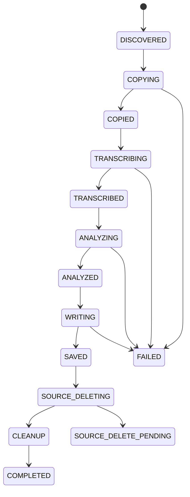

# VoiceDock Docker版 実装仕様書 v2.0

**DJI Mic 3 × ローカル文字起こし × ローカルLLM × Obsidian**  
対象: macOS / Apple Silicon 推奨  
文書版: v2.0  
更新日: 2026-09-11

---

## 1. 目的

DJI Mic 3で録音した音声をMacへ接続するだけで、バックグラウンドで以下を自動実行する。

1. DJI Mic 3の接続を検出
2. 新しい録音ファイルを検出
3. Docker管理領域へ安全にコピー
4. ローカルWhisperで文字起こし
5. ローカルLLMで要約・タスク・決定事項・アイデアを抽出
6. Obsidian VaultへMarkdownファイルとして保存
7. 保存内容を検証
8. 正常完了した録音のみDJI Mic 3から削除
9. Docker内の作業用音声を削除
10. 同じ録音の二重処理を防止

### 1.1 最優先方針

本システムではAI精度よりも**録音データを失わないこと**を優先する。

優先順位:

1. 音声保護
2. 処理の再実行性
3. 二重処理防止
4. 自動化
5. 文字起こし精度
6. 要約精度

---

## 2. ユーザー体験

通常利用時にユーザーが行う操作は、原則として以下だけとする。

```text
DJI Mic 3で録音
    ↓
帰宅
    ↓
MacへUSB接続
    ↓
以降は自動
```

処理:

```text
DJI Mic 3
    ↓
録音検出
    ↓
Mac/Dockerへコピー
    ↓
文字起こし
    ↓
要約・タスク抽出
    ↓
Obsidianへ保存
    ↓
保存検証
    ↓
元音声削除
```

ユーザーは後からObsidianを開くだけでよい。

---

## 3. ホストMacへインストールするもの

原則として以下だけとする。

- Docker Desktop
- Obsidian
- Git（ソースをGitで取得する場合。macOS標準環境または任意）

Macへ直接インストールしないもの:

- Python
- pip
- venv
- FFmpeg
- whisper.cpp
- llama.cpp
- SQLite関連ツール
- AI用Pythonパッケージ

これらはDocker側へ閉じ込める。

---

## 4. 採用アーキテクチャ

```mermaid
flowchart TD
    A[DJI Mic 3] -->|USB| B[macOS]
    B --> C[/Volumes/...]
    C -->|Bind Mount| D[VoiceDock Container]
    D --> E[Recording Scanner]
    E --> F[Staging]
    F --> G[whisper.cpp / CPU]
    G --> H[Transcript]
    H --> I[Docker Model Runner]
    I -->|Apple Silicon Metal| J[Local LLM]
    J --> K[Structured JSON]
    K --> L[Markdown Renderer]
    L -->|Bind Mount| M[Obsidian Vault]
    M --> N[Save Verification]
    N --> O[Source Audio Delete]
    O --> P[Local Staging Delete]
```

### 4.1 コンポーネント

**macOS**

- DJI Mic 3のストレージをマウント
- `/Volumes` をDocker Desktopへ提供
- Obsidian Vaultをホスト上に保持
- Docker Desktopを起動

**VoiceDock Container**

- Pythonサービス
- ファイル監視
- SQLite状態管理
- ファイルコピー
- whisper.cpp実行
- Docker Model Runner呼び出し
- Markdown生成
- Obsidian書き込み
- 安全な削除

**Docker Model Runner**

- 要約用LLMを管理
- Apple Siliconではllama.cppバックエンドのMetalアクセラレーションを利用
- VoiceDockからHTTPで呼び出す

---

## 5. Dockerを採用する理由

### メリット

- MacへPython環境を作らない
- Python依存関係をMacへ入れない
- FFmpegやWhisperも隔離できる
- Gitリポジトリを別Macへ移しやすい
- バージョン固定が容易
- 削除もコンテナ単位で行える
- 開発環境と本番環境を揃えやすい

### 注意点

macOSのDocker DesktopはLinux VM上でコンテナを動かすため、通常のLinuxコンテナからApple Metal GPUを直接利用する設計にはしない。

そのため:

- **文字起こし:** VoiceDockコンテナ内のwhisper.cppをCPU実行
- **要約LLM:** Docker Model Runnerを利用してApple Silicon Metalで実行

とする。

文字起こし速度が不足する場合のみ、将来Whisper部分をMacネイティブ実行へ差し替え可能な設計とする。

---

## 6. 重要な前提条件: DJI Mic 3のマウント確認

本実装の最初のPoCで必ず確認する。

DJI Mic 3接続時に録音領域がmacOSから通常のファイルシステムとして、例えば以下のように参照できること。

```text
/Volumes/<DJI_VOLUME_NAME>/
```

確認項目:

- Volume名
- `/Volumes` 配下へ現れるか
- 録音フォルダ構造
- WAVファイル名
- 読み取り可能か
- Python/Linuxコンテナから参照可能か
- コンテナから削除可能か
- 2台の送信機を使った場合の保存形式
- 録音中ファイルと録音完了ファイルの判定方法

### 6.1 ハードゲート

もしDJI Mic 3がmacOS上で通常のVolumeとして公開されず、専用アプリ/MTP等を経由しなければファイル取得できない場合は、`/Volumes` 監視方式では実装できない。

その場合のみ、Mac側に最小限の「取り込みHelper」を追加する別アーキテクチャへ切り替える。

**この確認前に自動削除機能を有効化しない。**

---

## 7. リポジトリ構成

```text
voicedock/
├── compose.yaml
├── .env.example
├── .gitignore
├── README.md
│
├── docker/
│   └── voicedock/
│       └── Dockerfile
│
├── src/
│   └── voicedock/
│       ├── __init__.py
│       ├── main.py
│       ├── config.py
│       ├── logging_config.py
│       │
│       ├── device/
│       │   ├── monitor.py
│       │   ├── scanner.py
│       │   └── dji_mic.py
│       │
│       ├── importers/
│       │   ├── importer.py
│       │   └── integrity.py
│       │
│       ├── sessions/
│       │   └── session_manager.py
│       │
│       ├── transcription/
│       │   ├── base.py
│       │   └── whisper_cpp.py
│       │
│       ├── llm/
│       │   ├── client.py
│       │   ├── schemas.py
│       │   └── prompts.py
│       │
│       ├── obsidian/
│       │   ├── renderer.py
│       │   └── writer.py
│       │
│       ├── database/
│       │   ├── db.py
│       │   ├── models.py
│       │   └── migrations.py
│       │
│       ├── processing/
│       │   ├── pipeline.py
│       │   ├── worker.py
│       │   └── states.py
│       │
│       └── cleanup/
│           └── cleaner.py
│
├── config/
│   └── config.example.yaml
│
├── prompts/
│   ├── summarize_ja.txt
│   └── repair_json.txt
│
├── scripts/
│   ├── setup.sh
│   ├── start.sh
│   ├── stop.sh
│   ├── status.sh
│   ├── logs.sh
│   ├── doctor.sh
│   └── test.sh
│
└── tests/
    ├── unit/
    ├── integration/
    └── fixtures/
```

---

## 8. Docker Compose設計

Docker Compose 2.38以降では、ComposeファイルからAIモデルを依存関係として宣言できるため、Docker Model Runner対応環境ではこれを利用する。

概念例:

```yaml
name: voicedock

services:
  voicedock:
    build:
      context: .
      dockerfile: docker/voicedock/Dockerfile

    restart: unless-stopped

    environment:
      TZ: Asia/Tokyo
      VOICEDOCK_CONFIG: /app/config/config.yaml

    volumes:
      # DJI Micを含むmacOS Volume群
      # 開発時は ro を推奨。削除試験完了後のみ rw。
      - /Volumes:/host-volumes:${DJI_MOUNT_MODE:-ro}

      # Obsidian Vault
      - ${OBSIDIAN_VAULT}:/obsidian:rw

      # SQLite / staging / transcript cache
      - voicedock-data:/data

      # Whisperモデル
      - voicedock-whisper-models:/models/whisper

      # 設定
      - ./config:/app/config:ro

      # Prompt
      - ./prompts:/app/prompts:ro

    models:
      summarizer:
        endpoint_var: VOICEDOCK_LLM_URL
        model_var: VOICEDOCK_LLM_MODEL

    healthcheck:
      test: ["CMD", "python", "-m", "voicedock.main", "health"]
      interval: 30s
      timeout: 10s
      retries: 3
      start_period: 30s

models:
  summarizer:
    model: ai/qwen3:4b-instruct-2507-q4_K_M
    context_size: 8192

volumes:
  voicedock-data:
  voicedock-whisper-models:
```

### 8.1 LLMモデル

初期候補:

```text
ai/qwen3:4b-instruct-2507-q4_K_M
```

理由:

- 要約・タスク抽出用途には十分軽量
- Q4_K_Mでメモリ使用量を抑えやすい
- モデルはComposeから差し替え可能

モデルは固定仕様にしない。

---

## 9. `.env`

ユーザー固有のパスはComposeへ直書きしない。

`.env.example`:

```dotenv
# Obsidian Vaultの絶対パス
OBSIDIAN_VAULT=/Users/USERNAME/Documents/Obsidian/MyVault

# 初期値は必ずro
DJI_MOUNT_MODE=ro
```

実機試験が完了し、安全な削除を有効化するときだけ:

```dotenv
DJI_MOUNT_MODE=rw
```

へ変更する。

`.env` はGit管理しない。

---

## 10. Docker Desktop設定

### 必須

- Docker Desktopをインストール
- Docker Model Runnerを有効化
- Docker Desktopをログイン時に起動する設定を有効化

### ファイル共有

Docker Desktop for Macでは通常、以下がデフォルト共有対象に含まれる。

- `/Users`
- `/Volumes`
- `/private`
- `/tmp`
- `/var/folders`

そのため、

- DJI Mic: `/Volumes`
- Obsidian: `/Users/...`

という構成は相性がよい。

もし `Mounts denied` 等が出た場合はDocker DesktopのFile sharing設定を確認する。

---

## 11. Dockerfile

方針:

- multi-stage build
- whisper.cppはbuild stageでコンパイル
- runtime imageへ必要なバイナリだけコピー
- Python環境はコンテナ内のみ
- `master` / `latest` への無条件依存を避ける
- whisper.cppのGit tag/commitはビルド引数で固定する
- 最終コンテナは原則non-root

概念例:

```dockerfile
FROM debian:bookworm-slim AS whisper-builder

ARG WHISPER_CPP_REF=<PINNED_RELEASE_OR_COMMIT>

RUN apt-get update && apt-get install -y \
    git cmake build-essential \
    && rm -rf /var/lib/apt/lists/*

RUN git clone https://github.com/ggml-org/whisper.cpp.git /src/whisper.cpp \
    && cd /src/whisper.cpp \
    && git checkout "${WHISPER_CPP_REF}" \
    && cmake -B build \
    && cmake --build build --config Release -j

FROM python:3.12-slim

RUN apt-get update && apt-get install -y \
    ffmpeg ca-certificates \
    && rm -rf /var/lib/apt/lists/*

COPY --from=whisper-builder \
    /src/whisper.cpp/build/bin/whisper-cli \
    /usr/local/bin/whisper-cli

WORKDIR /app

COPY pyproject.toml .
COPY src/ ./src/
COPY prompts/ ./prompts/

RUN pip install --no-cache-dir .

CMD ["python", "-m", "voicedock.main", "service"]
```

実装時にはwhisper.cppバイナリの依存ライブラリも確認し、必要ならbuilderからruntimeへコピーする。

---

## 12. Python依存関係

コンテナ内部なので、Macへの影響を気にせず必要最低限を利用できる。

推奨:

```toml
dependencies = [
    "PyYAML>=6",
    "httpx>=0.28",
    "pydantic>=2"
]
```

SQLiteはPython標準ライブラリを使用する。

ファイル監視は外部ライブラリを使わず、初期版では5秒間隔pollingとする。

---

## 13. 常駐方式

`launchd` はVoiceDock用には使用しない。

Docker Desktop起動後:

```text
restart: unless-stopped
```

によってVoiceDockコンテナを再起動する。

起動順:

```text
macOS Login
    ↓
Docker Desktop Startup
    ↓
Docker Engine Ready
    ↓
VoiceDock Container Startup
    ↓
Recording Monitoring
```

---

## 14. Device Monitor

コンテナ内では:

```text
/host-volumes
```

を監視する。

初期実装:

```python
while True:
    scan_volumes()
    time.sleep(5)
```

イベント監視よりpollingを優先する理由:

- USB抜き差しへの耐性が高い
- Docker Desktopのbind mount越しでも単純
- 実装が小さい
- 5秒程度の遅延は用途上問題にならない

---

## 15. DJI Mic判定

Volume名を固定しない。

判定材料:

1. Volume path
2. WAVファイルの存在
3. DJI形式と思われるファイル名
4. 録音フォルダ構造

Interface:

```python
class AudioSource:
    def detect(self) -> list["MountedDevice"]:
        ...

    def list_recordings(self, device) -> list["RecordingCandidate"]:
        ...

    def delete_recording(self, recording) -> None:
        ...
```

実装:

```text
DJIMic3Source
```

将来:

```text
GenericUsbRecorderSource
DJIMic4Source
ZoomRecorderSource
```

などへ拡張できる。

---

## 16. 録音ファイルの安定性確認

録音中/書き込み中のWAVを処理しない。

コピー前に:

```text
size + mtime
    ↓
2〜5秒待機
    ↓
size + mtime
```

が一致することを確認する。

必要なら2回以上連続で一致した場合のみ安定と判断する。

---

## 17. Staging

音声は直接Whisperへ渡さず、一度Docker named volumeへコピーする。

例:

```text
/data/staging/<recording_id>/audio.wav
```

理由:

- USB切断後も処理を継続できる
- Whisper実行中にDJI Micが抜かれても影響しない
- 再実行が容易
- 外部Volume越しの読み込み性能に依存しにくい

---

## 18. ファイルコピーと整合性検証

処理:

```text
Source
    ↓
COPYING
    ↓
Destination
    ↓
size比較
    ↓
SHA-256
    ↓
COPIED
```

SHA-256はチャンク読み込みする。

コピー元とコピー先のhashが一致するまで元音声を削除しない。

---

## 19. SQLite

保存先:

```text
/data/voicedock.db
```

Docker named volume上に置く。

### recordings

主要カラム:

```sql
CREATE TABLE recordings (
    id INTEGER PRIMARY KEY AUTOINCREMENT,
    source_device TEXT NOT NULL,
    source_path TEXT NOT NULL,
    source_filename TEXT NOT NULL,
    source_size INTEGER,
    source_mtime REAL,
    sha256 TEXT,
    transmitter TEXT,
    session_id INTEGER,
    local_audio_path TEXT,
    transcript_path TEXT,
    analysis_path TEXT,
    output_path TEXT,
    status TEXT NOT NULL,
    discovered_at TEXT,
    copied_at TEXT,
    transcribed_at TEXT,
    analyzed_at TEXT,
    saved_at TEXT,
    source_deleted_at TEXT,
    completed_at TEXT,
    retry_count INTEGER DEFAULT 0,
    error_code TEXT,
    error_message TEXT
);
```

### sessions

```sql
CREATE TABLE sessions (
    id INTEGER PRIMARY KEY AUTOINCREMENT,
    session_key TEXT UNIQUE NOT NULL,
    transmitter TEXT,
    started_at TEXT,
    ended_at TEXT,
    title TEXT,
    status TEXT,
    output_path TEXT,
    created_at TEXT,
    completed_at TEXT
);
```

---

## 20. 状態遷移



重要:

`FAILED` だからといって最初からやり直さない。

完了済みステップをSQLiteと生成ファイルから確認し、続きから再開する。

---

## 21. Idempotency

すべての工程を「何度呼んでも安全」にする。

例:

- コピー済み + hash一致 → 再コピーしない
- transcript存在 → Whisper再実行しない
- analysis JSON存在 → LLM再実行しない
- Obsidian note存在 + 内容検証済み → 再作成しない
- Source削除済み → 削除処理を成功扱いする

---

## 22. whisper.cpp

文字起こしエンジン:

```text
whisper.cpp
```

初期版ではDocker Linux ARM64コンテナ内のCPUで実行する。

Python:

```python
subprocess.run(
    [
        "/usr/local/bin/whisper-cli",
        "-m", model_path,
        "-f", audio_path,
        "-l", "ja",
    ],
    check=True,
)
```

シェル文字列連結は禁止する。

```python
# 禁止
os.system("whisper " + filename)
```

---

## 23. Whisperモデル

モデルはDocker imageへ埋め込まず、named volumeへ保存する。

```text
/models/whisper/
```

初回setup時に取得する。

設定例:

```yaml
transcription:
  engine: whisper_cpp
  executable: /usr/local/bin/whisper-cli
  model: /models/whisper/ggml-large-v3-turbo.bin
  language: ja
  timestamps: true
```

候補:

- medium
- large-v3-turbo
- large-v3-turbo量子化版

速度が足りなければモデルサイズを下げる。

---

## 24. Whisperの将来差し替え

`TranscriptionService` interfaceを用意する。

```python
class TranscriptionService:
    def transcribe(self, audio_path: Path) -> "Transcript":
        ...
```

将来以下へ交換可能:

- Macネイティブwhisper.cpp
- MLX系Whisper
- faster-whisper
- その他ローカルASR

VoiceDock本体は変更しない。

---

## 25. Transcript形式

```python
class TranscriptSegment:
    start: float
    end: float
    text: str

class Transcript:
    text: str
    language: str
    duration_seconds: float
    segments: list[TranscriptSegment]
```

保存:

```text
/data/transcripts/<recording_id>.json
/data/transcripts/<recording_id>.txt
```

元音声を削除する前にTranscriptを確定する。

---

## 26. 長時間録音 / 分割録音

DJI Mic側で長時間音声が複数WAVへ分割されることを想定する。

音声自体は結合しない。

```text
Part 1 WAV → Transcript 1
Part 2 WAV → Transcript 2
Part 3 WAV → Transcript 3
                    ↓
              Session Merge
                    ↓
          1つの論理Transcript
```

---

## 27. Session Manager

同一セッション判定条件候補:

- 同一送信機
- ファイル番号が連続
- 前ファイル終了と次ファイル開始の時間差が小さい
- DJIの命名規則と矛盾しない

境界判定は設定可能にする。

```yaml
session:
  enabled: true
  max_gap_seconds: 15
  group_by_transmitter: true
```

誤結合を避けるため、確信できない場合は別セッションとして扱う。

---

## 28. Docker Model Runner

要約LLMにはDocker Model Runnerを使用する。

Composeの`models`機能を利用すると、VoiceDockコンテナへモデルの接続URLとモデル名を環境変数として注入できる。

例:

```text
VOICEDOCK_LLM_URL
VOICEDOCK_LLM_MODEL
```

VoiceDockはこれらを読み取り、OpenAI互換APIへHTTPリクエストする。

Docker Desktop上ではModel Runnerがモデルのダウンロード・起動・推論を管理する。

Apple Silicon + llama.cpp backendではMetalアクセラレーションを利用できる。

---

## 29. LLM Client

Interface:

```python
class LLMService:
    def analyze(self, transcript: str) -> "AnalysisResult":
        ...
```

HTTPクライアント:

```text
httpx
```

APIキーは不要。

通信先はローカルDocker Model Runnerのみ。

外部LLM APIへフォールバックしない。

---

## 30. LLM出力

自由文ではなくJSONを要求する。

```json
{
  "title": "VoiceDockの開発について",
  "summary": "DJI Micの録音をローカル環境で自動処理する構成について検討した。",
  "key_points": [
    "Dockerを利用する",
    "文字起こしはローカルで行う"
  ],
  "tasks": [
    {
      "text": "DJI Micのマウント形式を確認する",
      "due": null
    }
  ],
  "decisions": [
    "初期版はGUIを作らない"
  ],
  "ideas": [
    "将来的に話者識別を追加する"
  ],
  "tags": [
    "VoiceDock",
    "DJI"
  ]
}
```

---

## 31. LLM Prompt

基本方針:

```text
あなたは音声記録整理アシスタントです。

入力は自動文字起こしされた文章です。
誤認識が含まれる可能性があります。

発言に存在しない事実を追加しないでください。
明確ではない内容を勝手にタスク化しないでください。
期限が明示されていない場合、due は null にしてください。

以下のJSON形式のみを返してください。

- title
- summary
- key_points
- tasks
- decisions
- ideas
- tags
```

Temperatureは低めを推奨:

```text
0.0〜0.2
```

目的は創作ではなく整理である。

---

## 32. JSON Validation

LLM出力は必ずPython側で検証する。

1. JSON parse
2. Pydantic schema validation
3. 不正ならrepair promptを1回
4. 2回目も失敗したら`LLM_INVALID_JSON`

この場合、元音声は削除しない。

---

## 33. 長文対策

LLMコンテキストを超える場合はMap-Reduce方式。

```text
Transcript
   ├─ Chunk 1 → Partial Summary
   ├─ Chunk 2 → Partial Summary
   └─ Chunk 3 → Partial Summary
                    ↓
             Final Analysis
```

タスク・決定事項は中間段階でも保持し、最後に重複除去する。

---

## 34. Obsidian

Obsidian APIやPlugin APIへ依存しない。

VaultへMarkdownファイルを書くだけとする。

Container内:

```text
/obsidian
```

保存先設定:

```yaml
obsidian:
  root: /obsidian
  folder: Inbox/Voice
```

---

## 35. Markdownファイル名

```text
YYYY-MM-DD HHmm - <title>.md
```

例:

```text
2026-09-11 1430 - VoiceDock開発会議.md
```

OS上問題になる文字をsanitizeする。

タイトル重複時はsuffixを付与する。

---

## 36. Obsidian Markdownテンプレート

```markdown
---
type: voice-note
created: 2026-09-11T14:30:00+09:00
source: DJI Mic 3
duration: 01:12:32
status: processed
tags:
  - voice
  - voicedock
---

# VoiceDock開発会議

## Summary

DJI Mic 3の録音をDocker内で文字起こしし、
ローカルLLMで整理してObsidianへ保存する構成を検討した。

## Key Points

- Python環境をMacへ直接入れない
- VoiceDock本体はDockerで動かす
- 要約LLMはDocker Model Runnerを使用する

## Tasks

- [ ] DJI Mic 3のマウント構造を確認する
- [ ] Whisperの速度を実測する

## Decisions

- MVPではGUIを作らない
- 外部AI APIは使用しない

## Ideas

- 将来的に話者識別を追加する

## Transcript

### 00:00:00

...
```

---

## 37. Atomic Write

Obsidianへ直接最終ファイルを書き始めない。

```text
.note.md.tmp
    ↓
write
    ↓
flush
    ↓
close
    ↓
read verification
    ↓
os.replace()
    ↓
.note.md
```

可能な範囲でatomic writeを利用する。

---

## 38. Obsidian保存成功条件

以下をすべて満たすこと。

- 最終Markdownファイルが存在
- ファイルサイズ > 0
- 読み直せる
- YAML frontmatterが存在
- `## Transcript` が存在
- 対応するrecording/session IDを内部的に追跡できる

成功後のみSQLiteを`SAVED`へ変更する。

---

## 39. 音声削除の安全仕様

### 絶対ルール

**Obsidian保存前に元音声を削除してはいけない。**

削除条件:

```text
Local copy hash verified
AND
Transcript valid
AND
Analysis valid
AND
Obsidian file valid
AND
DB status == SAVED
```

すべて満たした場合だけ削除可能。

---

## 40. 開発時の削除保護

初期値:

```dotenv
DJI_MOUNT_MODE=ro
```

かつ:

```yaml
cleanup:
  delete_source_audio: false
```

この状態では、プログラムにバグがあってもコンテナからDJI Mic側を削除できない。

実機テストが十分完了した段階で初めて:

```dotenv
DJI_MOUNT_MODE=rw
```

および:

```yaml
cleanup:
  delete_source_audio: true
```

を有効にする。

**設定とfilesystem権限の二重ロック**とする。

---

## 41. 削除順序

```text
Obsidian save verified
    ↓
DJI source file delete
    ↓
delete verification
    ↓
local staging audio delete
    ↓
COMPLETED
```

Source削除に失敗した場合:

- Obsidian noteは残す
- stagingはすぐには削除しない
- DBを`SOURCE_DELETE_PENDING`へする
- 次回同じデバイス接続時に再試行
- Markdownを二重生成しない

---

## 42. USB切断時

### コピー中に切断

```text
COPY_FAILED
```

部分コピーを破棄し、元データは削除しない。

### コピー完了後に切断

ローカルcopyがhash検証済みなら、その後の:

- Whisper
- LLM
- Obsidian保存

は継続可能。

DJI側削除だけ`SOURCE_DELETE_PENDING`として次回接続時に処理する。

---

## 43. Worker

初期版は1 Workerのみ。

並列処理しない。

理由:

- CPU負荷管理
- Whisper同時実行回避
- 状態管理簡略化
- 削除事故回避
- LLM競合回避

Queue:

```text
Recording 1
    ↓
Recording 2
    ↓
Recording 3
```

---

## 44. Pipeline

概念:

```python
def process(recording_id: int) -> None:
    recording = repository.get(recording_id)

    ensure_local_copy(recording)
    ensure_transcript(recording)
    ensure_analysis(recording)
    ensure_obsidian_note(recording)
    delete_source_if_safe(recording)
    cleanup_local_files(recording)
    mark_completed(recording)
```

各`ensure_*`はidempotentであること。

---

## 45. リトライ

自動リトライ対象:

- 一時的なコピー失敗
- LLM一時失敗
- Obsidian一時書き込み失敗
- Source削除失敗

原則:

```text
最大3回
exponential backoff
```

例:

```text
3秒 → 10秒 → 30秒
```

永続的な失敗は`FAILED`として残す。

---

## 46. エラーコード

```text
DEVICE_NOT_READABLE
DEVICE_UNSUPPORTED
FILE_NOT_STABLE
COPY_FAILED
HASH_MISMATCH
DISK_SPACE_LOW
WHISPER_FAILED
WHISPER_TIMEOUT
TRANSCRIPT_EMPTY
LLM_UNAVAILABLE
LLM_FAILED
LLM_INVALID_JSON
OBSIDIAN_NOT_FOUND
OBSIDIAN_WRITE_FAILED
OBSIDIAN_VERIFY_FAILED
SOURCE_DELETE_FAILED
LOCAL_DELETE_FAILED
```

---

## 47. ディスク容量

コピー前に空き容量を確認する。

最低条件候補:

```text
free_space >= source_file_size * 2 + safety_margin
```

Named volumeの容量不足時は処理停止。

元音声は削除しない。

---

## 48. ログ

通常はDocker標準ログへ出す。

```bash
docker compose logs -f voicedock
```

ログ例:

```text
INFO service_started
INFO device_detected volume=/host-volumes/DJI
INFO recording_found file=TX01_...
INFO copy_completed recording_id=42
INFO transcription_started recording_id=42
INFO transcription_completed recording_id=42
INFO llm_completed recording_id=42
INFO obsidian_saved recording_id=42
INFO source_deleted recording_id=42
INFO completed recording_id=42
```

ログへ以下を原則記録しない:

- 音声内容
- Transcript全文
- Summary全文
- 個人名を含む会話本文

---

## 49. Health Check

```bash
docker compose ps
```

で状態確認できること。

Container health checkは以下を検証する。

- Python process alive
- SQLite接続可能
- `/data` writable
- `/obsidian` readable/writable
- Whisper executable存在
- Whisper model存在
- LLM endpoint設定存在

DJI Micが未接続であることはunhealthy条件にしない。

---

## 50. CLI

GUIは作らず、Docker Compose経由の管理CLIを用意する。

例:

```bash
docker compose exec voicedock voicedock status
docker compose exec voicedock voicedock scan
docker compose exec voicedock voicedock history
docker compose exec voicedock voicedock retry 42
docker compose exec voicedock voicedock doctor
```

ラッパースクリプトも用意する。

```bash
./scripts/status.sh
./scripts/logs.sh
./scripts/doctor.sh
```

---

## 51. `doctor`

最低限以下を確認する。

```text
✓ Config
✓ Database
✓ Data volume
✓ /host-volumes
✓ Whisper executable
✓ Whisper model
✓ Docker Model Runner URL
✓ Docker Model Runner response
✓ Obsidian Vault
✓ Obsidian destination folder
✓ Disk free space
```

削除モード有効時は:

```text
WARNING: Source deletion is ENABLED
```

を明示する。

---

## 52. 初回セットアップ

想定操作:

```bash
git clone <repository>
cd voicedock

cp .env.example .env
cp config/config.example.yaml config/config.yaml
```

`.env`のObsidianパスだけ設定。

その後:

```bash
./scripts/setup.sh
docker compose up -d --build
```

`setup.sh`の役割:

1. Docker availability確認
2. Compose version確認
3. Docker Model Runner確認
4. 必要ディレクトリ確認
5. Whisperモデル準備
6. `.env`確認
7. Config validation
8. `docker compose config`検証

---

## 53. Docker Model Runnerの要件

Compose `models`を使用する構成では、対応する新しいDocker Desktop / Docker Composeを前提とする。

実装時のminimum:

```text
Docker Desktop for macOS: Docker Model Runner対応版
Docker Compose: 2.38+
```

Docker Model RunnerはDocker Desktop上で有効化する。

確認:

```bash
docker model status
```

Compose起動時に指定モデルを解決できることを検証する。

---

## 54. モデル更新ポリシー

再現性確保のため:

**禁止**

```text
latest
master
main
```

への無条件依存。

推奨:

- Docker base imageはdigestまたは明示version
- whisper.cppはrelease tagまたはcommit固定
- LLMは具体的tag固定
- Python dependencyはlock fileを生成
- 更新は手動PRとして行う

---

## 55. セキュリティ

原則:

- `--privileged` を使用しない
- `/var/run/docker.sock` をコンテナへmountしない
- `/Volumes` 以外の不要なホスト領域をmountしない
- 開発時の`/Volumes`はread-only
- Obsidian Vault以外の`/Users`全体をmountしない
- 外部LLMへフォールバックしない
- Transcript内容をログへ出さない
- shell=Trueを使わない

---

## 56. ネットワーク

通常処理:

```text
VoiceDock
    ↓
Docker Model Runner
```

のみ。

音声・Transcriptを外部APIへ送信しない。

モデル初回取得、Docker image取得、ソフトウェア更新時だけインターネット通信が発生する。

モデル取得後の通常処理はローカル完結を目標とする。

---

## 57. テスト

### Unit Test

- DJI filename parser
- device detection
- session grouping
- SHA-256
- state transition
- JSON validation
- Markdown rendering
- filename sanitize
- duplicate detection

### Integration Test

Fake DJI volume:

```text
/tests/fixtures/fake_volumes/DJI_MIC/
```

をcontainerへmountして、

```text
Detection
→ Copy
→ Whisper mock
→ LLM mock
→ Obsidian mock
→ Save verification
```

を検証する。

### 最重要テスト: 削除禁止

以下の各状態で元音声が残ること。

- Copy失敗
- hash mismatch
- Whisper失敗
- Transcript空
- LLM失敗
- JSON invalid
- Obsidian不存在
- Obsidian write失敗
- Markdown検証失敗

---

## 58. 実機E2E

### E2E-01

1分程度録音。

期待:

```text
接続
→ 検出
→ コピー
→ Transcript
→ LLM
→ Obsidian
```

削除OFFで実行。

### E2E-02

USBをコピー中に抜く。

期待:

- crashしない
- incomplete copy削除
- DJI側音声維持
- 次回接続で再試行

### E2E-03

USBをWhisper中に抜く。

期待:

- Whisper以降は継続
- Obsidian保存
- Source delete pending

### E2E-04

Obsidian Vaultを一時的に利用不可にする。

期待:

- source削除禁止
- retry可能

### E2E-05

同じMicを再接続。

期待:

- 既処理ファイルを再度Note化しない
- delete pendingだけ処理

### E2E-06

十分な試験後、削除ON。

期待:

- Obsidian保存確認後だけDJI側WAV削除
- stagingも最後に削除

---

## 59. 開発フェーズ

### Phase 0 — DJI Mic 3 PoC

```text
DJI Mic → macOS → /Volumes → Docker
```

だけを確認する。

削除禁止。

### Phase 1 — Import

```text
Device Detection
→ WAV Detection
→ Copy
→ SHA-256
```

### Phase 2 — Transcription

```text
WAV
→ whisper.cpp
→ Transcript
```

### Phase 3 — LLM

```text
Transcript
→ Docker Model Runner
→ JSON
```

### Phase 4 — Obsidian

```text
JSON
→ Markdown
→ Atomic Write
→ Verification
```

### Phase 5 — State Management

```text
SQLite
→ Retry
→ Resume
→ Duplicate Prevention
```

### Phase 6 — Session Grouping

長時間の分割音声を論理セッション化。

### Phase 7 — Auto Cleanup

十分な実機試験後だけ有効化。

### Phase 8 — Operation

- health check
- doctor
- logs
- recovery
- update procedure

---

## 60. MVP完成条件

以下をすべて満たすこと。

- [ ] MacへPythonをインストールしなくてよい
- [ ] MacへFFmpegをインストールしなくてよい
- [ ] VoiceDockはDockerコンテナとして動く
- [ ] Docker Desktop起動後、自動的にVoiceDockが起動する
- [ ] DJI Mic 3を自動検出できる
- [ ] 新規WAVのみ処理できる
- [ ] ファイルコピー後にhash検証する
- [ ] ローカルWhisperで日本語文字起こしできる
- [ ] 外部AI APIを使わない
- [ ] Docker Model Runnerでローカル要約できる
- [ ] Task / Decision / IdeaをJSONで取得できる
- [ ] ObsidianへMarkdown保存できる
- [ ] 長時間録音を扱える
- [ ] 二重処理しない
- [ ] Docker再起動後に途中から再開できる
- [ ] USB切断で録音を失わない
- [ ] Obsidian保存失敗時に元音声を削除しない
- [ ] 保存検証成功後のみ元音声を削除する
- [ ] 通常利用時にクラウドへ音声を送信しない

---

## 61. 推奨する最終構成

```text
macOS
│
├── Docker Desktop
│   │
│   ├── VoiceDock Container
│   │   ├── Python
│   │   ├── SQLite
│   │   ├── FFmpeg
│   │   └── whisper.cpp
│   │
│   └── Docker Model Runner
│       └── Qwen系 Small LLM
│           └── Apple Silicon Metal
│
├── /Volumes/
│   └── DJI Mic 3
│
└── Obsidian Vault
```

Macを開発環境で汚さず、Docker Desktopを基盤として完結させる。

---

## 62. 将来拡張

MVP完成後に検討する。

- 話者識別
- Obsidian WikiLink自動生成
- Daily Note統合
- Project自動分類
- Calendarとの時刻照合
- 録音タイトル推定
- 録音内容による自動フォルダ振り分け
- Mac通知
- Web UI
- Menu Bar UI
- WhisperのMacネイティブGPU/Metal化
- Generic USB recorder対応
- iPhone音声メモ対応

これらはCore Pipelineとは分離して実装する。

---

## 63. 実装上の最終判断

VoiceDock v2.0では以下を正式な基本方針とする。

```text
Host:
    Docker Desktop
    Obsidian

Application:
    Docker Compose

Orchestrator:
    Python Container

ASR:
    whisper.cpp
    Docker CPU

LLM:
    Docker Model Runner
    llama.cpp backend
    Apple Silicon Metal

Database:
    SQLite
    Docker named volume

Input:
    macOS /Volumes
    bind mount

Output:
    Obsidian Vault
    bind mount

Cloud AI:
    使用しない

Subscription:
    不要

GUI:
    MVPでは作らない
```

そして自動削除については、

> **「正しく処理できたと思う」ではなく、「コピー、文字起こし、解析、Obsidian保存の成功を機械的に確認できた場合のみ削除する」**

をVoiceDock全体の安全原則とする。

---

# 参考資料

Docker公式ドキュメントを実装時の一次資料とする。

- Docker Model Runner  
  https://docs.docker.com/ai/model-runner/

- Docker Model Runner REST API  
  https://docs.docker.com/ai/model-runner/api-reference/

- Docker Model Runner Inference Engines  
  https://docs.docker.com/ai/model-runner/inference-engines/

- Docker Compose Models  
  https://docs.docker.com/reference/compose-file/models/

- AI Models in Docker Compose  
  https://docs.docker.com/ai/compose/models-and-compose/

- Docker Desktop Settings / File Sharing  
  https://docs.docker.com/desktop/settings-and-maintenance/settings/

- Docker Bind Mounts  
  https://docs.docker.com/engine/storage/bind-mounts/

- Qwen3 Docker Model Catalog  
  https://hub.docker.com/r/ai/qwen3/tags
